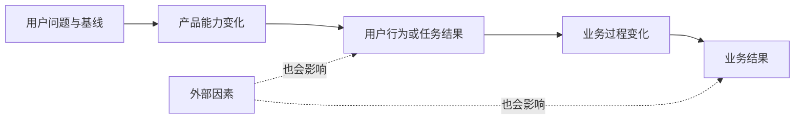

# 业务目标与产品目标

业务目标描述组织希望获得的可持续结果，产品目标描述产品要让目标用户的行为、能力或任务结果发生什么变化。两者必须通过可检验的因果链连接，不能把“上线功能”当作目标。

## 前置知识与能力边界

先掌握：

- [用户价值、商业价值、实现成本与机会成本](../00-foundations/04-value-cost-opportunity-cost.md)；
- [产品定位、价值主张与边界](../00-foundations/05-positioning-value-proposition-boundaries.md)；
- [产品生命周期](../00-foundations/07-product-lifecycle.md)；
- [从功能描述改写用户问题](02-feature-to-user-problem.md)。

本知识点负责把用户问题、产品行为和组织结果连接起来。它不替代公司战略、财务模型或指标设计；下一篇会把目标转成成功指标与守护指标。

## 1. 区分四类内容

| 类型 | 回答的问题 | 合格示例 | 不合格示例 |
|---|---|---|---|
| 业务目标 | 组织结果为什么改善 | 降低人工支持成本，同时维持解决质量 | 做智能客服 |
| 产品目标 | 用户结果或行为怎样改变 | 更多用户能在不联系客服时正确完成退款 | 上线自助退款页 |
| 输出 | 团队交付了什么 | 退款状态页、规则接口、审计日志 | 把输出写成“提升体验” |
| 活动 | 团队做了什么 | 设计、开发、灰度、培训 | 完成 3 个 sprint |

输出和活动是实现手段。只有它们引起用户结果变化，并进一步影响组织结果时，才支持目标。

### 1.1 业务目标常见类别

- 收入：新增收入、续约、付费转化或扩展收入；
- 成本：交付、支持、基础设施、模型或人工处理成本；
- 风险：欺诈、合规、错误、事故或合同违约；
- 战略能力：进入新市场、建立平台能力或降低关键依赖；
- 公共结果：完成率、可达性、办理成本或服务公平性；
- 可持续性：留存、毛利、可靠性和长期维护能力。

“增长”“降本”“提升品牌”仍然过宽，需要对象、时间窗、基线和限制条件。

### 1.2 产品目标的变化对象

产品目标通常改变以下一项或多项：

- 用户能否完成任务；
- 完成任务所需时间、步骤或认知成本；
- 结果的正确性、完整性和可恢复性；
- 用户开始、持续或重复某种有价值行为；
- 用户从人工渠道迁移到合适的自助渠道；
- 团队能够服务此前被排除的用户；
- 使用者、购买者或管理员获得可验证价值。

产品目标必须指向用户进展，不能只追求点击、页面访问或某功能使用率。

## 2. 建立因果链



每条箭头都是假设，而不是事实。例如：

```text
更清晰的退款资格与状态
→ 更多符合条件的用户自助完成
→ 人工工单减少
→ 单笔退款处理成本下降
```

同时要检查反向影响：自助入口过于宽松可能增加错误退款和欺诈；工单减少也可能来自需求下降，而非产品改善。

## 3. 目标定义的必要字段

### 3.1 业务目标字段

```text
在【时间窗】内，
使【业务结果】从【基线】达到【目标范围】，
通过【待验证的价值机制】，
同时不突破【质量、风险、成本或公平性约束】。
```

### 3.2 产品目标字段

```text
让【目标用户】在【场景】中，
能更【正确/快速/稳定/自主】地完成【任务结果】，
使【用户行为或结果指标】从【基线】达到【目标范围】，
并保持【守护条件】。
```

目标范围可以是阈值或区间，不必伪造单点精度。基线不存在时，先把建立可靠基线作为发现任务，而不是随意写“提升 30%”。

## 4. 从战略到需求的分解

### 4.1 先确认战略约束

业务目标可能来自年度战略、预算、合同、法规或服务承诺。记录目标所有者、时间窗、适用范围和不能牺牲的条件。

### 4.2 找到业务过程

收入、成本和风险不会由页面直接改变。需要找到中间过程，例如获客、激活、交付、支持、结算、续约或风控。

### 4.3 找到用户行为与结果

问：哪个角色的什么任务变化，才会改变该业务过程？如果没有可解释的用户变化，需求可能只是内部活动。

### 4.4 写出机制和替代解释

```text
假设机制：自助完成率提升使人工工单下降。
替代解释：政策简化、流量结构变化或客服入口隐藏也会使工单下降。
```

### 4.5 确定产品可影响范围

产品不能独自控制价格、市场需求、销售能力和宏观环境。只承诺可以通过产品机制显著影响的领先结果，并记录外部依赖。

## 5. 应用案例一：自助退款

### 5.1 输入与基线

- 每月 12,000 个退款相关请求；
- 其中 7,200 个满足标准规则，本可自助处理；
- 目前只有 2,100 个自助完成；
- 人工工单单笔平均成本 18 元；
- 退款错误率 0.6%，欺诈复核率 1.8%；
- 用户从申请到明确结果的中位时间为 19 小时。

### 5.2 错误写法

```text
业务目标：上线自助退款 2.0。
产品目标：退款页使用率达到 80%。
```

上线是输出；页面使用率可能因为强制跳转上升，但不代表用户正确完成。

### 5.3 因果链

```text
清晰展示资格、金额、时间和进度
→ 符合标准规则的用户能自主提交并理解结果
→ 可自助请求从人工渠道迁移
→ 人工处理量和等待时间下降
→ 在不增加错误退款的前提下降低处理成本
```

### 5.4 目标定义

业务目标：在一个季度内，将标准退款请求的人工处理量从每月 5,100 笔降低到 3,000–3,500 笔，使月度人工成本至少下降 2.8 万元，同时退款错误率不高于 0.7%、欺诈损失不增加。

产品目标：让满足标准规则的退款申请人能在一次流程中理解资格、确认金额并获得可追踪结果，使合格请求自助完成率从 29.2% 提升至 50%–58%，申请到明确状态的中位时间低于 10 分钟。

### 5.5 方案与目标的关系

候选方案包括资格说明、预估金额、状态时间线、规则接口、失败恢复和人工接管。每项只有在支持产品目标时进入范围。动画、推荐商品和营销弹窗可能提高页面互动，却会干扰高风险任务。

### 5.6 验证与失败分支

按资格类型、渠道、设备和新老用户分组。若自助完成率上升但人工工单不降，检查用户是否在完成后仍需咨询、事件是否重复计数、客服是否处理了另一类问题。若成本下降但错误退款率升至 1.2%，业务目标未达成，必须收紧规则或增加人工复核。

## 6. 应用案例二：B2B 协作产品续约

### 6.1 输入与基线

- 年度续约率 82%；
- 流失账户中 41% 表示团队采用不足；
- 购买者是部门负责人，日常使用者是项目成员，管理员负责配置；
- 已购买席位中每周活跃比例中位数 34%；
- 活跃并不等于完成协作任务，部分用户只查看通知。

### 6.2 错误因果

```text
增加通知 → DAU 提升 → 续约提升
```

通知能制造访问，却可能增加打扰。需要定义有价值行为和购买者可感知结果。

### 6.3 重新分解

业务目标：提高符合目标客户画像账户的续约与扩展，同时控制客户成功服务成本。

产品目标：让项目成员在跨团队交付中稳定完成“分派—反馈—确认”闭环，让负责人能看到阻塞和交付结果，让管理员能低成本配置权限。

因果链：

```text
更多真实项目形成可完成的协作闭环
→ 团队交付可见性和追责成本改善
→ 负责人感知持续价值
→ 目标账户续约概率提高
```

### 6.4 领先与滞后结果

| 层次 | 示例 |
|---|---|
| 输出 | 新的项目模板和阻塞视图 |
| 领先产品结果 | 7 天内完成首个真实协作闭环的账户比例 |
| 质量结果 | 逾期未响应、错误通知和权限拒绝率 |
| 业务过程 | 达到稳定采用标准的账户比例 |
| 滞后业务结果 | 续约率、扩展收入、服务成本 |

### 6.5 失败分支

如果模板使用率高但协作闭环没有增加，模板只是被试用；若闭环增加但续约无变化，可能是购买者看不到价值、价格或可靠性才是主因。此时不能继续靠增加模板数量推进业务目标。

## 7. 目标之间的冲突

### 7.1 收入与用户价值

提高付费墙曝光可能增加短期转化，也可能降低任务完成与长期留存。目标必须同时记录价值机制和守护条件。

### 7.2 成本与质量

减少人工审核能降本，但高风险场景可能增加损失。按风险分层，而不是把自动化比例设为唯一目标。

### 7.3 增长与可靠性

扩大流量可能增加容量、支持和故障成本。增长目标需包含 SLO、错误率和单位成本边界。

### 7.4 多角色冲突

使用者追求操作快速，管理员要求控制，购买者需要可衡量价值。B2B 目标必须说明主要受益者与不可牺牲角色。

## 8. 目标树和责任边界

```text
业务结果：标准退款人工成本下降
├── 产品结果：合格用户自助完成率提升
│   ├── 资格理解正确率
│   ├── 提交成功率
│   └── 状态可追踪率
├── 运营结果：人工接管流程稳定
└── 风险边界：错误退款与欺诈损失不增加
```

目标树不是把指标越拆越多。每个子节点必须解释父节点的一部分变化，并有明确负责人。产品团队对可影响结果负责，但业务结果通常由产品、运营、销售、政策和市场共同影响。

## 9. 调试目标定义

出现以下信号时重新检查：

1. 目标句中只有“上线、建设、支持、优化”；
2. 产品目标没有目标用户和任务结果；
3. 业务目标与产品目标之间没有中间过程；
4. 同一指标同时代表用户价值和商业价值，却没有解释；
5. 目标只有增长方向，没有基线、时间窗或边界；
6. 团队能通过隐藏入口、强制跳转等方式“刷高”指标；
7. 外部因素能轻易解释全部变化；
8. 多个目标互相冲突但没有优先级；
9. 目标超出产品可影响范围；
10. 失败后没有停止、调整或回滚条件。

### 目标质量检查表

```text
对象明确？
用户结果明确？
业务过程明确？
因果假设可验证？
基线与时间窗存在？
可影响而非完全可控制？
守护条件存在？
替代解释已记录？
失败条件会改变决策？
```

## 10. 与路线其他模块的集成

- 成功指标：为每个目标定义公式、分母、窗口和守护指标；
- 范围与非目标：只纳入支持当前目标的能力；
- RICE：Impact 必须相对于同一产品目标解释；
- MVP：优先验证因果链中最不确定且代价高的箭头；
- PRD：把目标、非目标和验收条件传递给设计与工程；
- 实验：区分产品领先结果和滞后业务结果；
- 技术：可靠性、权限和数据质量可能是目标成立的前提，而非附加任务。

## 11. 可复用目标记录

```markdown
## 用户问题与基线
- 目标用户与场景：
- 当前结果：
- 证据与时间窗：

## 业务目标
- 结果、基线、目标范围、时间窗：
- 所有者：
- 守护条件：

## 产品目标
- 用户行为或任务结果：
- 基线、目标范围、时间窗：
- 产品可影响机制：

## 因果链
- 产品能力 → 用户结果：
- 用户结果 → 业务过程：
- 业务过程 → 业务结果：
- 外部因素与替代解释：

## 决策条件
- 继续：
- 调整：
- 停止或回滚：
```

## 12. 综合练习

选择一个“提高留存”“降低成本”或“减少风险”的真实业务要求：

1. 找到可量化基线；
2. 写出目标用户和任务问题；
3. 画出至少四层因果链；
4. 将输出、产品结果、业务过程和业务结果分开；
5. 为每条箭头写一个替代解释；
6. 定义一个产品目标和一个业务目标；
7. 增加至少两个守护条件；
8. 设计继续、调整和停止条件。

验收标准：目标不能通过单纯增加曝光或强制操作被伪造；团队能说明产品实际影响哪一段，哪些结果依赖其他角色；出现反向指标时能停止或改变方案。

## 来源

- [Department for Education：Be accountable for your outcomes](https://apply-the-service-standard.education.gov.uk/guides/product-management-01-principles/principle-3-be-accountable-for-your-outcomes)（访问日期：2026-07-17）
- [GOV.UK Service Manual：Measuring the benefits of your service](https://www.gov.uk/service-manual/measuring-success/measuring-service-benefits)（访问日期：2026-07-17）
- [GOV.UK Service Manual：How to set performance metrics for your service](https://www.gov.uk/service-manual/measuring-success/how-to-set-performance-metrics-for-your-service)（访问日期：2026-07-17）
- [GOV.UK Service Manual：Understanding and meeting policy intent](https://www.gov.uk/service-manual/design/understanding-and-meeting-policy-intent)（访问日期：2026-07-17）
