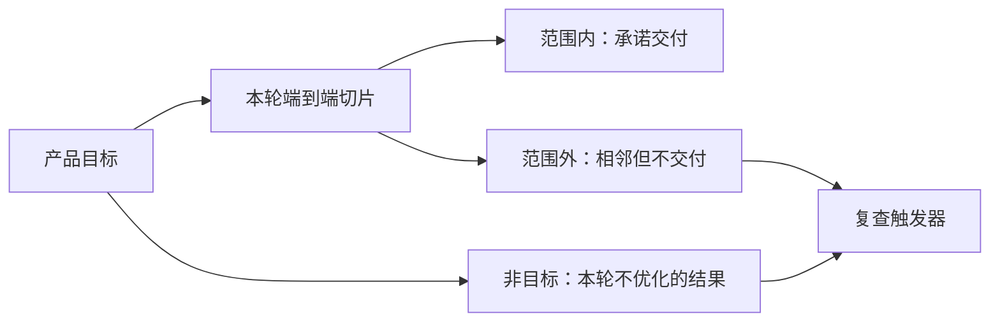
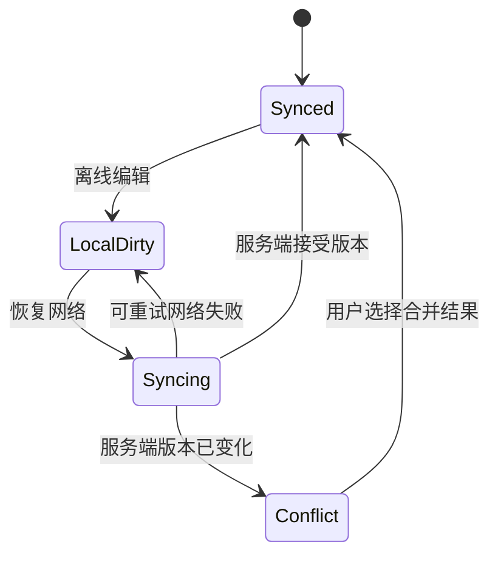

# 功能范围与非目标

功能范围定义一次交付允许改变哪些用户、场景、对象与系统行为；非目标定义本轮明确不追求哪些相邻结果。两者共同把产品目标变成可实现、可验收、可发布的边界。

## 前置知识与能力边界

开始范围设计前，应已有：

- 目标用户与具体使用场景。
- 有证据的问题陈述，而不是功能请求。
- 业务目标、产品目标、成功指标与守护指标。
- 当前工作流、主要失败点和替代方案。
- 已知的技术、数据、合规与运营约束。

范围不能证明问题值得解决，也不能代替技术方案。它回答的是：在当前证据、期限和资源下，哪一段完整价值链进入本轮交付，哪些部分明确留在边界之外。

## 一、范围不是功能清单

“支持 CSV 导入”只命名了一个能力，没有说明交付边界。团队仍然不知道谁可以导入、导入什么、导入到哪里、处理多少数据、失败后怎样恢复，也不知道 Excel、移动端和历史数据是否包含在内。

可验收的范围需要至少覆盖六个轴：

| 轴 | 要回答的问题 | 示例 |
| --- | --- | --- |
| 用户 | 哪些角色可以使用 | 工作区管理员，不含普通成员 |
| 场景 | 什么触发条件与目标任务 | 首次迁移联系人，不含日常双向同步 |
| 对象 | 处理什么业务实体 | 联系人姓名、邮箱、标签 |
| 行为 | 系统允许哪些动作 | 上传、校验、确认、导入、下载错误行 |
| 渠道 | 哪些终端和入口 | 桌面 Web 的设置页 |
| 规模 | 数量、大小、频率和时限 | 单文件不超过 10 MB、10,000 行 |

此外还要写质量底线：权限、数据一致性、无障碍、性能、审计与恢复。这些不是可在“范围削减”时随意删除的附加功能。

### 范围陈述

```text
本轮为【目标角色】，
在【触发场景】下，
通过【入口或渠道】，
对【业务对象】完成【端到端任务】，
支持【明确规模】，
并满足【质量底线】。
```

示例：

```text
本轮为工作区管理员，
在首次迁移联系人时，
通过桌面 Web 设置页，
把 UTF-8 CSV 中的姓名、邮箱和标签导入当前工作区，
单文件最多 10,000 行；
系统在写入前展示校验结果，导入具备幂等键，
失败行可下载，跨工作区数据不可访问。
```

## 二、范围内、范围外与非目标

这三个词表达不同决定。

### 范围内

范围内事项由团队承诺设计、实现、验收、发布与监控。它必须能映射到验收条件，不应包含“体验良好”“足够稳定”这类无法判断完成的形容词。

### 范围外

范围外事项与当前问题相邻，但不进入本轮交付。范围外不表示永远不做，也不表示完全不受影响。例如移动端编辑在本轮范围外，但现有移动端读取能力仍不得因服务端数据变更而损坏。

### 非目标

非目标描述本轮不会优化的结果或不会改变的产品边界。它解释为什么某些合理期待不属于这次成功标准。

合格写法：

```text
本轮非目标：降低日常联系人维护成本。
原因：本轮只验证一次性迁移能否降低首次配置阻力，
不会提供持续同步、自动去重或第三方数据源连接。
```

不合格写法：

```text
非目标：移动端、API、同步、去重。
```

后一种写法只是名词清单，没有说明不追求什么结果，也没有解释现有能力是否必须保持兼容。

### 三者的关系



范围外管理交付集合，非目标管理成功含义。把两者分开，可以防止“没有做某页面”被误解成“完全不关心某类用户结果”。

## 三、端到端切片

中级范围设计的核心是端到端切片。一个切片应让目标用户完成一次真实任务，并产生可观察结果。

以联系人导入为例，完整链路包括：

1. 管理员找到入口。
2. 系统提供格式要求。
3. 管理员选择文件。
4. 系统解析并校验。
5. 管理员看见有效行、错误行与影响。
6. 管理员确认写入。
7. 系统创建联系人。
8. 管理员确认结果可用。
9. 部分失败时下载错误行并重试。

只交付上传控件不是切片；只完成解析服务也不是切片；只在数据库写入但不提供错误恢复，仍不能让用户可靠完成任务。

### 水平切片与垂直切片

| 切法 | 内容 | 风险 |
| --- | --- | --- |
| 按技术层水平切片 | 本周数据库，下周 API，再下周页面 | 长时间没有可验证的用户结果 |
| 按页面水平切片 | 先完成所有正常页面，再处理错误 | 早期演示好看，生产失败不可恢复 |
| 端到端垂直切片 | 一类用户、一种格式、完整闭环 | 覆盖较窄，但可以验证价值 |

垂直切片不排斥分层开发。它约束的是交付和验证单位：每个进入验证的版本都应穿过必要技术层并产生真实结果。

## 四、确定范围的方法

### 1. 从目标结果反推必要行为

若目标是“管理员在创建工作区后 7 天内完成首次联系人迁移”，就从最终状态向前反推：

- 怎样确认迁移完成？
- 完成需要哪些对象已经存在？
- 写入前必须通过哪些校验？
- 用户如何提供输入？
- 谁拥有执行权限？
- 失败后怎样继续而不重复写入？

无法连接到目标结果的候选功能先进入范围外。

### 2. 标记不可删除的质量底线

以下事项即使不直接产生新界面，也可能是范围内的必要工作：

- 服务端授权。
- 文件类型和大小校验。
- 写入事务或可恢复策略。
- 幂等与重复提交处理。
- 错误原因和可操作反馈。
- 审计日志。
- 数据保留与删除规则。
- 键盘操作和可访问名称。
- 指标与错误观测。
- 发布、降级和回滚能力。

“用户看不到”不能成为删除这些工作的理由。

### 3. 选择最窄的价值闭环

联系人迁移可以沿以下方向收窄：

- 只服务管理员，不服务普通成员。
- 只支持 CSV，不同时支持 XLSX、vCard 和第三方同步。
- 只支持创建新联系人，不更新已有联系人。
- 只服务首次迁移，不提供定时同步。
- 只在桌面 Web 提供入口，不新增移动端上传。

收窄后仍能验证“首次迁移是否降低配置阻力”，因此切片成立。

若删去错误行反馈，用户无法知道哪些联系人未导入，结果质量不可确认；这种删减破坏价值闭环。

### 4. 记录边界接口

范围不是单一团队内部的文档。它应列出与现有系统的接触面：

| 接触面 | 本轮改变 | 保持不变 |
| --- | --- | --- |
| 权限 | 管理员增加 `contacts:import` 动作 | 普通成员权限不变 |
| 联系人模型 | 支持批量创建 | 单条编辑规则不变 |
| API | 新增导入任务接口 | 公共联系人 API 版本不变 |
| 通知 | 导入完成后站内通知 | 不发送营销邮件 |
| 数据分析 | 新增导入生命周期事件 | 不采集文件原文 |

### 5. 给范围外事项设置复查条件

“以后再说”不可追踪。应写可观察触发器：

- 当 XLSX 相关有效失败任务每月超过 100 个时，复查格式范围。
- 当移动端管理员占首次迁移用户的 20% 以上时，复查渠道范围。
- 当人工处理重复联系人每周超过 5 小时时，复查去重能力。
- 当第三方同步成为目标客户成交阻碍并有三份独立证据时，重新评估连接器。

触发器出现只表示重新分析，不自动承诺开发。

## 五、范围表的写法

一份范围表应同时给出包含项、排除项和边界原因。

| 维度 | 范围内 | 范围外 | 原因 |
| --- | --- | --- | --- |
| 角色 | 工作区管理员 | 普通成员、外部访客 | 首次迁移由管理员负责 |
| 格式 | UTF-8 CSV | XLSX、vCard | 先验证迁移价值，减少解析分支 |
| 数据 | 姓名、邮箱、标签 | 头像、附件、自定义对象 | 不影响核心迁移结果 |
| 行为 | 新建联系人 | 更新、合并、持续同步 | 避免冲突规则扩大 |
| 终端 | 桌面 Web | 移动端上传 | 大文件选择主要发生在桌面 |
| 规模 | 10 MB、10,000 行 | 超大文件 | 控制解析资源和等待时间 |
| 恢复 | 错误行下载、幂等重试 | 自动修复错误数据 | 用户可在源文件修正 |

范围表不能独立使用。它必须连接流程、业务规则、异常、验收和指标。

## 六、非目标的写法

非目标应包含四部分：

1. 不追求的结果。
2. 与当前目标的关系。
3. 本轮为什么不追求。
4. 什么条件下重新评估。

```markdown
### 非目标：建立实时联系人同步

- 不追求的结果：本轮不减少导入后的持续维护成本。
- 与当前目标的关系：实时同步可能改善长期维护，但不是首次迁移闭环的必要条件。
- 排除原因：需要第三方授权、冲突解决和持续运维，无法帮助验证首次迁移假设。
- 复查条件：目标客户中每月有 30 个工作区在首次导入后重复执行全量导入。
```

以下写法不适合作为非目标：

- “不做复杂功能”：复杂没有客观边界。
- “暂不考虑性能”：性能可能是质量底线。
- “只做核心功能”：没有说明核心结果。
- “第二期再做”：用排期替代产品理由。
- “用户暂时不需要”：没有证据范围和复查条件。

## 七、完整案例一：知识库批量导入

### 输入

一个团队知识库要支持从 Markdown 压缩包迁移文档。已有证据：

- 过去 60 天有 84 个工作区打开迁移帮助页。
- 其中 31 个工作区通过客服请求批量迁移。
- 人工迁移平均耗时 95 分钟。
- 失败记录中，46% 来自附件路径，29% 来自重复文档标识。
- 目标是让管理员在 30 分钟内完成 500 篇以内的首次迁移。

### 第一次范围草案

```text
支持 Markdown、HTML、Notion、Confluence 和网页抓取；
支持文档、附件、评论、权限和历史版本；
桌面与移动端都可以导入。
```

该草案覆盖面大，但混合了不同授权、解析、权限映射和冲突机制，无法在一个可控版本中验证首次迁移价值。

### 反推后的端到端范围

范围内：

- 工作区所有者在桌面 Web 发起。
- 上传一个不超过 100 MB 的 ZIP。
- ZIP 内最多 500 个 UTF-8 Markdown 文件。
- 相对路径图片作为附件处理。
- 文件路径映射为知识库目录。
- 写入前展示可导入、警告和错误数量。
- 创建导入任务，支持查看进度。
- 文件级失败不阻止其他有效文件。
- 导出失败清单，修正后仅重试失败项。
- 同一上传使用幂等键，避免重复创建。

范围外：

- 第三方平台 OAuth 直连。
- 评论、页面历史和原平台权限迁移。
- HTML 清洗和任意网页抓取。
- 移动端上传。
- 超过 500 篇的自助迁移。

非目标：

- 不降低日常内容维护成本。
- 不保证导入后排版与原平台像素一致。
- 不替代企业级迁移服务。

### 为什么这个切片完整

管理员可以从真实输入开始，经历校验、确认和异步处理，最终得到可用文档；部分失败有明确恢复方式。它能验证目标用户是否愿意自助迁移、能否在时间目标内完成，以及人工支持量是否下降。

### 失败分支

若 ZIP 包含 `../` 路径，服务端拒绝路径穿越项并记录原因。若同一文件重复提交，幂等键返回原任务。若写入期间权限被撤销，任务停止后续写入并保留已完成清单，不能继续依赖启动时缓存的权限。

### 验收与观测

- 500 篇、100 MB 边界样本能在 30 分钟内产生最终状态。
- 导入文档数加失败文档数等于已解析文档数。
- 任意失败项包含稳定原因码和原文件路径。
- 重试失败清单不会复制已成功文档。
- 跨工作区文件不可读取。
- 成功率按导入任务计算，同时展示文件级完整率。
- 人工支持时间作为守护指标，避免把复杂恢复转嫁给客服。

## 八、完整案例二：移动端离线编辑

### 输入与目标

笔记产品收到“支持离线”的请求。产品目标是让通勤用户在短时断网时继续编辑已有纯文本笔记，并在恢复连接后不丢失内容。

原始功能请求包含离线创建、附件、搜索、多人协作、跨设备冲突、分享和端到端加密。这些能力涉及不同数据模型，不能作为一个未经分层的范围。

### 状态模型



### 本轮范围

范围内：

- 已登录用户编辑已缓存的纯文本笔记。
- 每篇不超过 200 KB。
- 本地明确显示未同步状态。
- 恢复网络后自动提交带基础版本号的修改。
- 版本一致时同步成功。
- 版本冲突时保留两个版本并要求用户选择或复制内容。
- 退出账号时清理本地明文缓存。

范围外：

- 离线附件上传。
- 离线全文搜索。
- 离线创建共享空间。
- 自动逐行合并多人修改。
- Web 端离线能力。

非目标：

- 不提高在线编辑速度。
- 不解决长时间多设备离线协作。
- 不保证用户不打开应用时在后台立即同步。

### 不能删除的底线

若为了赶进度删除冲突检测，旧客户端可能覆盖新版本，直接违背“不丢失内容”的目标。冲突状态和恢复界面属于核心范围，不是第二期优化。

若本地缓存没有退出清理和设备存储保护，离线能力会扩大数据暴露风险。安全处理同样属于范围内质量工作。

### 失败注入

1. 离线修改后强制结束应用，再启动，内容仍在且标记未同步。
2. A 设备离线编辑，B 设备在线修改同一笔记；A 恢复后进入冲突，不覆盖 B。
3. 同步请求超时但服务端已写入；重试使用同一操作标识，不产生重复版本。
4. 同步期间撤销共享权限；服务端拒绝写入，本地内容仍可复制导出。
5. 用户退出账号；重新登录另一个账号不能看到前一账号缓存。

### 决策

该范围比“完整离线模式”窄，但保留了编辑、持久化、同步、冲突和恢复的闭环，足以验证短时断网场景的价值与实现风险。

## 九、范围变更控制

开发中的新信息会改变范围，禁止变化并不现实。需要控制的是变化的入口和连带影响。

### 变更记录

```yaml
change:
  requested: "增加 XLSX 导入"
  evidence: "6 个试点中 4 个原始文件为 XLSX"
  goal_effect: "提高可进入导入流程的目标用户比例"
  affected:
    - "解析依赖与安全检查"
    - "日期和数字格式规则"
    - "错误原因码"
    - "测试样本"
    - "性能边界"
  options:
    - "范围内新增 XLSX"
    - "提供本地转换说明"
    - "本轮保持 CSV，下一验证周期复查"
  decision: "提供受控转换工具，本轮不在服务端解析 XLSX"
  owner: "product-owner"
  review_trigger: "转换失败率超过 10%"
```

### 评估问题

- 是否改变目标用户或目标结果？
- 是否引入新的授权主体或敏感数据？
- 是否新增持久状态、冲突规则或迁移？
- 是否改变性能与容量边界？
- 是否需要新的错误恢复、监控或客服能力？
- 是否使原有验收和停止条件失效？
- 如果接受，哪个同等工作退出本轮？

最后一问防止范围只增加不减少。

## 十、发布与生产边界

### 部分发布

范围可以按工作区稳定分组灰度，但同一工作区不应因每次请求随机而在新旧规则间切换。灰度定义要进入指标属性，才能解释版本差异。

### 回滚

关闭入口不一定能回滚已产生的数据。范围文档需要区分：

- 路由回滚：新请求回到旧路径。
- 配置回滚：关闭新能力。
- 数据兼容：旧版本能否读取新对象。
- 数据补偿：已执行动作是否可安全撤销。
- 用户沟通：已开始但未完成任务如何解释。

### 容量

若失败项转人工处理，范围必须写人工容量。例如每周最多 30 个任务、单个不超过 20 分钟、超出后停止扩大灰度。没有容量边界的“人工兜底”不是生产方案。

### 数据与隐私

只采集回答验证问题所需的数据。导入功能可以记录文件大小、行数、错误码和任务结果，不应默认记录联系人原文。事件模式应有版本，未知值不能静默归入“成功”。

## 十一、调试范围问题

### 症状：团队对“做完”理解不同

检查范围语句是否只有功能名，是否缺少对象、规模和完成状态。将每个范围项映射到至少一个验收条件。

### 症状：功能不断增加

检查非目标是否只写名词，变更是否没有替换项。每个新增项必须说明目标影响、证据和退出本轮的工作。

### 症状：演示成功，上线失败

检查是否按正常页面水平切片，遗漏授权、并发、幂等、超时和恢复。用端到端失败注入补齐。

### 症状：指标提升但用户结果变差

检查成功指标是否只计点击或开始，没有质量门槛。把最终业务状态、错误完整率和人工成本纳入验收。

### 症状：范围外能力被意外破坏

检查边界接口和兼容性是否记录。范围外表示不新增能力，不授权破坏现有契约。

## 十二、常见错误

| 错误 | 后果 | 修正 |
| --- | --- | --- |
| 用页面数量定义范围 | 忽略规则、状态和恢复 | 按用户任务和业务对象定义 |
| 把技术任务当用户切片 | 很晚才能验证价值 | 以端到端结果作为交付单位 |
| 非目标只列功能名 | 无法管理成功预期 | 写不追求的结果与原因 |
| 删除错误处理以缩小 MVP | 真实用户无法完成任务 | 保留质量底线和恢复路径 |
| 范围外没有复查条件 | 需求反复进入讨论 | 设置证据阈值或依赖事件 |
| 只写新增行为 | 旧端和旧数据被破坏 | 明确保持不变的契约 |
| 人工兜底不写容量 | 灰度扩大后运营失控 | 写处理量、工时和停止条件 |
| 接受新增项却不删工作 | 排期与质量持续失真 | 每次变更同时做替换决策 |

## 十三、综合练习

为一个真实功能编写范围包，至少包含：

1. 目标用户、触发场景、目标结果和证据。
2. 沿用户、场景、对象、行为、渠道、规模六轴的范围语句。
3. 一张范围内、范围外与原因表。
4. 三条结果型非目标及复查条件。
5. 一条从入口到结果和恢复的端到端流程。
6. 权限、数据一致性、无障碍、性能和观测底线。
7. 两个完整案例：正常完成与部分失败恢复。
8. 一份范围变更记录。
9. 灰度、回滚、人工容量与数据隐私边界。
10. 至少五个失败注入场景及预期状态。

### 验收标准

- 不使用设计稿也能判断一个行为是否在范围内。
- 每个范围内行为都有可观察完成状态。
- 范围外事项不会因本轮变更而破坏。
- 非目标描述结果而不是名词清单。
- 删除任一核心步骤都会明确破坏价值闭环或质量底线。
- 新增需求必须指出受影响规则和被替换工作。
- 失败、冲突、超时、权限变化与恢复均有确定结果。
- 产品、设计、开发、测试、数据和运营可以从同一边界生成各自工作。

## 来源

- [GOV.UK Service Manual：How the alpha phase works](https://www.gov.uk/service-manual/agile-delivery/how-the-alpha-phase-works)（访问日期：2026-07-18）
- [GOV.UK Service Manual：Developing a roadmap](https://www.gov.uk/service-manual/agile-delivery/developing-a-roadmap)（访问日期：2026-07-18）
- [GOV.UK Service Manual：Governance principles for agile service delivery](https://www.gov.uk/service-manual/agile-delivery/governance-principles-for-agile-service-delivery)（访问日期：2026-07-18）
- [Scrum Guides：2020 Scrum Guide](https://scrumguides.org/scrum-guide.html)（访问日期：2026-07-18）
