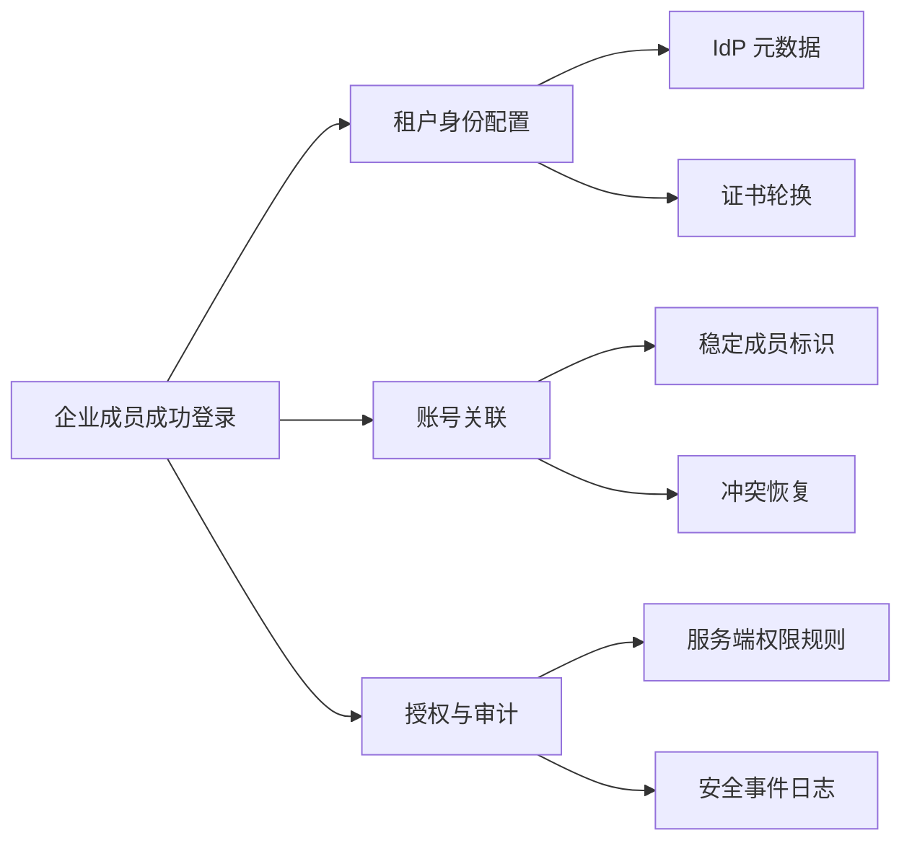
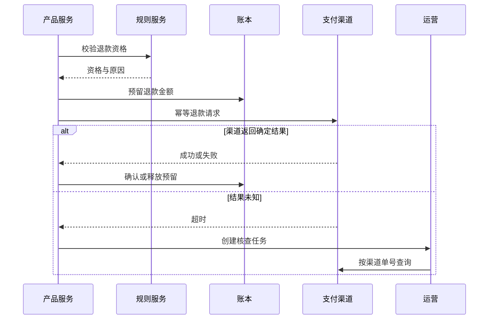

# 技术、数据、合规与运营依赖

依赖是产品结果成立前必须由其他系统、数据、规则或角色提供的条件。依赖管理的目标不是收集“等待事项”，而是证明每个前置条件何时就绪、失败时产品怎样降级，以及超过最晚决策点后如何改变范围。

## 前置知识

- 已明确目标用户、场景、目标和本轮范围。
- 能画出用户流程、系统边界和对象状态。
- 能区分负责人、执行者、审批者和知情者。
- 能为指标、数据字段和接口写出可验证口径。
- 已识别安全、隐私、可靠性和业务不变量。

## 一、什么是依赖

若事项 A 的结果不能在事项 B 缺失时成立，B 是 A 的依赖。

例如“企业成员使用公司账号登录”的结果依赖：

- 身份提供方提供符合约定的元数据。
- 系统能根据稳定标识关联成员。
- 域名和租户绑定规则已经确定。
- 证书轮换和时钟偏差被处理。
- 管理员能恢复错误映射。
- 登录事件有审计记录。

“另一个团队正在开发设置页”不一定是产品依赖。若可以使用现有后台配置完成试点，设置页只是自动化或规模化依赖，不阻塞价值验证。

### 依赖与相关事项

| 概念 | 判断标准 | 处理方式 |
| --- | --- | --- |
| 依赖 | 缺失会使结果不成立或越过底线 | 契约、负责人、就绪证据、降级 |
| 任务 | 完成交付所需的工作 | 排期与执行跟踪 |
| 风险 | 尚不确定的失败可能 | 验证概率、影响和应对 |
| 约束 | 当前不能普通交换的边界 | 作为方案门槛 |
| 假设 | 可被证据推翻的陈述 | 设计验证 |
| 偏好 | 有更好，没有也能成立 | 不得伪装成阻塞项 |

## 二、四类依赖

### 技术依赖

技术依赖来自系统能力和运行条件：

- 上游或下游 API 契约。
- 身份、权限和密钥管理。
- 数据库模式与迁移。
- 消息、任务和回调机制。
- 客户端最低版本。
- 性能、容量和可用性。
- 观测、告警和回滚工具。

技术依赖不能只写“接口完成”。就绪证据至少包括契约版本、认证方式、错误语义、容量、超时、幂等、测试环境和负责人。

### 数据依赖

数据依赖回答输入是否存在、合法、及时且能被正确解释：

- 数据来源与取得权限。
- 字段定义、单位、时区和枚举。
- 主体与对象的稳定标识。
- 完整率、准确率、唯一性和新鲜度。
- 历史覆盖与偏差。
- 标签或人工判断的一致性。
- 删除、保留和用途限制。

“已经有数据”不能证明数据可用于当前决定。客服文本可能有价值，但若没有合法使用范围、无法去除敏感信息或只覆盖高投诉用户，就不能直接代表全体用户。

### 合规依赖

合规依赖来自法律、合同、行业规范与组织政策，例如：

- 处理个人数据的合法基础、告知与同意。
- 数据地域、跨境传输和保留期限。
- 支付、健康、未成年人或受监管行业要求。
- 第三方许可和内容版权。
- 无障碍采购或公共服务标准。
- 企业合同中的审计、通知和删除承诺。

合规不是发布前的一次审批按钮。需求阶段就要让专业负责人判断适用规则、必要证据和不可接受的处理方式。产品文档记录决定与边界，不自行代替法律意见。

### 运营依赖

运营依赖由人工流程和持续服务能力提供：

- 客服解释、升级与退款。
- 内容审核和申诉。
- 销售配置、实施和客户成功。
- 人工复核、质检与例外处理。
- 值班、故障响应和状态沟通。
- 培训、知识库与权限管理。
- 第三方供应商支持。

人工兜底不是无限资源。必须写明工作量、单次工时、技能要求、服务时段、错误率、升级条件和停止扩大范围的阈值。

## 三、依赖图

下图以“企业单点登录试点”为例：



依赖图中的节点应是可验证结果，而不是“后端”“法务”“运营”这类组织名称。边表示结果依赖关系，不表示汇报关系。

### 找出关键路径

若每个节点都有预计最早完成时间，沿依赖链累加可以识别决定最早交付时间的关键路径。关键路径变化时，不能只更新计划，还要检查是否超过最晚安全决策点。

### 识别循环依赖

常见循环：

```text
数据团队等产品定义事件
产品等待数据提供基线
```

解除方式：

1. 产品先定义要回答的决策问题和候选口径。
2. 数据团队用现有字段给出可得性与偏差。
3. 双方冻结最小事件契约。
4. 用小样本端到端对账后再扩大。

循环依赖通常表示契约或决策权未拆清，不应通过反复催促解决。

## 四、依赖契约

每条关键依赖都要有一份最小契约。

```yaml
dependency:
  id: DEP-SSO-03
  result: "试点租户可以使用 SAML 2.0 登录"
  provider: "identity-platform"
  consumer: "workspace-access"
  owner: "identity-product-owner"
  required_by: "2026-08-12"
  latest_safe_decision: "2026-08-05"
  interface:
    metadata: "固定版本 XML"
    member_key: "不可变 external_id"
    clock_skew: "正负 3 分钟"
  readiness:
    - "测试租户登录、退出与证书错误均通过"
    - "错误码映射已评审"
    - "轮换演练已完成"
    - "审计事件可查询"
  degradation: "保留原有密码登录"
  stop_condition: "存在跨租户账号关联"
```

### 结果

写依赖提供的可观察能力，不写“完成开发”。

### 提供方与消费方

提供方负责契约中的输出，消费方负责按契约使用并处理错误。双方都要参加变更评审。

### 最晚安全决策点

这是仍可切换降级、替代或缩小范围而不破坏质量的最后日期。它通常早于最终发布日期。

### 就绪证据

就绪不是百分比。证据可以是契约测试、数据质量报告、权限审查、容量演练、运营排班或批准记录。

### 降级

降级说明依赖不可用时仍能提供什么真实结果。界面显示“稍后再试”不是完整降级，除非用户任务确实可以安全延后且状态可恢复。

### 停止条件

一旦出现不可交换风险，依赖即使按期交付也不能使用。例如跨租户关联、账务不平或未授权数据处理。

## 五、就绪层级

依赖状态不应只有“未开始、进行中、已完成”。

| 状态 | 含义 | 允许动作 |
| --- | --- | --- |
| 已识别 | 知道存在，但契约未定 | 不可承诺交付 |
| 已定义 | 结果、接口和责任已明确 | 可做方案与估算 |
| 可测试 | 测试环境与样本可用 | 可做集成验证 |
| 可试点 | 功能、观测、恢复和支持就绪 | 可限量发布 |
| 可规模化 | 容量、运维和长期责任就绪 | 可扩大范围 |
| 已退役 | 消费方迁移并停止依赖 | 删除契约与告警 |

“API 可调用”只说明可测试，不表示可以生产试点。若没有容量、告警、轮换和故障联系人，依赖仍未达到可规模化。

## 六、依赖策略

### 阻塞

缺失时不能合法、安全或正确提供结果，必须阻塞。例如支付记账不变量、服务端授权、个人数据处理依据。

### 降级

依赖失败时提供较窄但真实的结果。例如推荐服务不可用时展示受控热门内容，并明确不把降级曝光计入个性化实验。

### 替代

使用另一个提供方或流程满足相同契约。替代必须比较语义，不只是接口形状；支付渠道对退款、结算和争议处理的能力可能不同。

### 人工

用受控人工流程验证价值或处理低量例外。人工路径要记录输入、权限、双人复核、审计、容量与退出条件。

### 延后

把依赖相关能力移出本轮范围，同时确保现有契约不被破坏。延后要记录复查触发器。

### 内聚

若跨团队协调成本长期高于能力本身，且能力是产品核心，可以考虑把责任移入同一团队。组织调整是高成本决定，需要长期数据，不能作为单次延期的即时反应。

## 七、完整案例一：企业单点登录

### 目标与范围

目标：让三个试点企业的现有成员通过各自 IdP 登录工作区，同时保留原登录方式作为恢复路径。

范围：

- 每个工作区配置一个 SAML 身份提供方。
- 只关联已经存在且邮箱域匹配的成员。
- 管理员手工上传元数据。
- 登录成功后仍由服务端工作区权限模型授权。
- 配置、登录结果和账号关联进入审计日志。

非目标：

- 自动创建成员。
- SCIM 生命周期同步。
- 多 IdP 路由。
- 强制所有成员关闭密码登录。

### 依赖清单

| ID | 类型 | 依赖结果 | 就绪证据 | 失败策略 |
| --- | --- | --- | --- | --- |
| D1 | 技术 | 身份平台验证签名与 Audience | 契约与攻击样本测试 | 阻塞 |
| D2 | 数据 | 成员具有稳定内部 ID 和规范化邮箱 | 冲突扫描为零 | 阻塞 |
| D3 | 合规 | 登录审计字段与保留周期获确认 | 隐私与安全评审记录 | 阻塞 |
| D4 | 运营 | 管理员配置失败有升级路径 | 值班表和处理手册 | 人工兜底 |
| D5 | 外部 | 三家 IdP 提供测试元数据 | 测试租户登录证据 | 缩小试点 |

### 关键细节

SAML 的身份认证结果不能直接代替应用授权。即使 IdP 断言用户身份，服务端仍要根据当前成员状态、工作区和角色判断资源访问。

邮箱可能变化或被重新使用，不能作为唯一永久账号键。试点可用邮箱做受限初次匹配，但成功关联后保存稳定外部标识，并提供冲突恢复。

证书轮换不是未来优化。若只支持单证书且无重叠窗口，轮换会使所有企业登录中断。契约需明确元数据刷新与多证书过渡。

### 失败注入

1. 签名无效：拒绝登录，不泄露成员是否存在。
2. Audience 不匹配：拒绝断言，记录安全原因码。
3. IdP 时间比服务端快 5 分钟：按契约拒绝并给管理员诊断信息。
4. 邮箱同时匹配两个历史成员：不自动关联，进入人工恢复。
5. 成员已被停用：认证成功但授权拒绝。
6. IdP 不可用：保留原登录恢复入口。
7. 证书轮换：新旧证书重叠期都通过，旧证书到期后拒绝。

### 最晚决策

若试点 1 的测试元数据在 8 月 5 日前未就绪，不推迟其他两个试点；从发布范围移除该租户。若身份平台无法提供签名算法限制和安全日志，则整个试点阻塞，因为不能通过人工操作补偿认证安全。

## 八、完整案例二：自动退款

### 目标

符合固定规则的低金额订单，在商家同意后自动发起原路退款，并让用户在 24 小时内看见确定状态。

### 依赖图



### 四类依赖

技术依赖：

- 订单、支付与退款金额使用同一货币精度规则。
- 账本支持预留、确认和释放。
- 支付渠道接受幂等键并提供查询接口。
- 回调与主动查询可以收敛为一个最终状态。

数据依赖：

- 原支付渠道单号完整。
- 已退款金额与可退金额一致。
- 订单风险和争议状态及时更新。

合规依赖：

- 不同地区的退款时限和用户告知。
- 支付数据访问范围。
- 审计和财务对账要求。

运营依赖：

- 结果未知进入人工核查。
- 大额、争议或重复退款升级。
- 财务每天对账并处理不平项。

### 为什么不能把渠道回调当唯一依赖

回调可能延迟、重复或丢失。系统需要主动查询和业务幂等，不能在超时后直接把状态写为失败并允许用户再次提交，否则渠道实际成功时可能重复退款。

### 状态与降级

```text
requested -> eligible -> reserved -> submitted
submitted -> succeeded
submitted -> declined
submitted -> unknown -> succeeded | declined | manual_review
```

渠道不可用时，新请求保留在可取消的待提交状态，不向用户显示“退款成功”。账本不可用时阻塞提交，因为渠道成功但内部未记账会破坏财务不变量。

### 容量边界

人工核查每天最多 50 笔，平均每笔 8 分钟。若未知结果超过 30 笔或预计次日积压超过容量，自动退款停止扩大；已有请求继续对账。该阈值是运营依赖的生产契约，不是发布后的临时安排。

### 验收

- 同一订单并发提交只产生一次渠道退款。
- 所有渠道成功金额都有对应账本确认。
- 结果未知不会显示为失败或成功。
- 支付渠道重复回调不重复记账。
- 权限撤销后缓存页面无法发起退款。
- 人工核查动作记录操作者和原因。
- 每日账本与渠道金额差异为零，非零时阻塞扩大。

## 九、数据依赖的质量契约

对关键数据记录：

| 字段 | 含义 |
| --- | --- |
| 数据集 | 明确表、流或外部资源 |
| 负责人 | 谁能解释和修复 |
| 主键 | 怎样稳定识别对象 |
| 口径 | 字段、单位、时区和枚举 |
| 完整率 | 必填对象中有效值比例 |
| 新鲜度 | 事件到可用的最大延迟 |
| 唯一性 | 重复判定规则 |
| 合法用途 | 当前功能允许的处理目的 |
| 保留 | 删除和归档规则 |
| 降级 | 缺失时产品行为 |

示例：风险状态若允许延迟 24 小时，就不能用于实时自动退款资格。解决方式不是把空值当“无风险”，而是将未知状态排除自动化并进入人工路径。

## 十、合规依赖的工作方式

### 在需求阶段提出具体问题

不要问“这个功能合规吗”。应提供：

- 谁的数据。
- 从哪里取得。
- 处理哪些字段。
- 为何需要。
- 谁可以访问。
- 保存多久。
- 是否传给第三方或跨地域。
- 用户怎样知道、选择、撤回或删除。
- 自动化决定对用户有什么影响。

具体数据流才能支持专业判断。

### 保存决定

记录适用范围、限制、批准条件、负责人和重新评审触发器。产品范围或数据用途改变时，旧结论不能自动延伸。

### 不可降级项

无法建立合法处理依据、无法满足删除承诺或违反合同隔离的功能不能通过免责声明或人工审核上线。

## 十一、运营依赖的容量模型

```text
每周需求工时
= 每周进入人工路径的任务数
× 单任务平均处理分钟
/ 60
```

若每周有 180 个任务，平均 12 分钟，需要 36 小时。再考虑峰值、返工、质检、培训和休假，不能把一个 40 小时岗位视为足够容量。

运营契约还要定义：

- 服务时间和响应目标。
- 谁可以查看或修改对象。
- 标准处理步骤与禁止动作。
- 双人复核门槛。
- 结果如何写回系统。
- 错误如何申诉和修正。
- 超出容量时怎样限流。
- 何时必须自动化或停止功能。

## 十二、调试依赖问题

### 集成测试通过，生产失败

检查测试环境是否覆盖真实证书、数据规模、权限和错误响应。提供方的模拟服务可能永远返回理想结果。

### 依赖“已完成”，消费方仍不能上线

检查双方的完成定义是否只有交付物，没有消费方契约测试、观测和恢复。就绪必须由消费方在真实接口上验证。

### 同一数据在看板和业务系统不同

核对主键、时区、迟到数据、去重和模式版本。暂停产品效果解释，先恢复口径一致。

### 人工队列突然积压

拆分进入量、单次工时和返工率。若进入量随灰度扩大，降低曝光；若工时增加，检查规则变化和工具故障；若返工增加，检查输入质量。

### 上游变更没有通知

契约应有版本、兼容窗口和变更负责人。仅依赖群消息不是生产级变更机制。

## 十三、常见错误

| 错误 | 后果 | 修正 |
| --- | --- | --- |
| 按团队名列依赖 | 不知道需要什么结果 | 用可验证输出命名节点 |
| “接口完成”即就绪 | 忽略容量、错误和运维 | 使用就绪层级和契约测试 |
| 空数据按默认值处理 | 静默制造错误决定 | 未知单列并设置降级 |
| 合规留到上线前 | 已实现方案可能不可用 | 需求阶段提供具体数据流 |
| 人工兜底无容量 | 扩大后积压与错误失控 | 建容量模型和限流阈值 |
| 只记录截止日 | 错过可替代窗口 | 设置最晚安全决策点 |
| 上游负责所有失败 | 消费方无法恢复用户任务 | 双方定义错误语义与降级 |
| 依赖不可用就伪成功 | 用户重复操作或数据损害 | 显示真实状态并可恢复 |

## 十四、综合练习

选择一个依赖至少两个外部系统和一个人工流程的功能，提交：

1. 目标、范围和成功条件。
2. 技术、数据、合规、运营依赖清单。
3. 以可验证结果为节点的依赖图。
4. 每个关键依赖的提供方、消费方和契约。
5. 就绪层级与证据。
6. 最晚安全决策点。
7. 阻塞、降级、替代、人工或延后策略。
8. 数据质量契约。
9. 运营容量计算。
10. 至少六个失败注入与预期结果。

### 验收标准

- 每个依赖都能说明缺失时哪个产品结果不成立。
- “完成”由可观察证据定义，不使用百分比代替。
- 硬约束没有被降级或免责声明绕过。
- 外部系统超时、重复、迟到和结果未知均有状态。
- 数据缺失不会被误写为否定或成功。
- 人工路径具有权限、容量、质检和退出条件。
- 超过最晚决策点时有明确的缩范围或替代动作。
- 提供方变更可以通过版本和契约测试被发现。

## 来源

- [GOV.UK Service Manual：Governance principles for agile service delivery](https://www.gov.uk/service-manual/agile-delivery/governance-principles-for-agile-service-delivery)（访问日期：2026-07-18）
- [GOV.UK Service Manual：Managing technical risk](https://www.gov.uk/service-manual/technology/managing-technical-risk)（访问日期：2026-07-18）
- [OpenAPI Initiative：OpenAPI Specification 3.2.0](https://spec.openapis.org/oas/latest.html)（访问日期：2026-07-18）
- [OpenTelemetry：Semantic conventions](https://opentelemetry.io/docs/specs/semconv/)（访问日期：2026-07-18）
