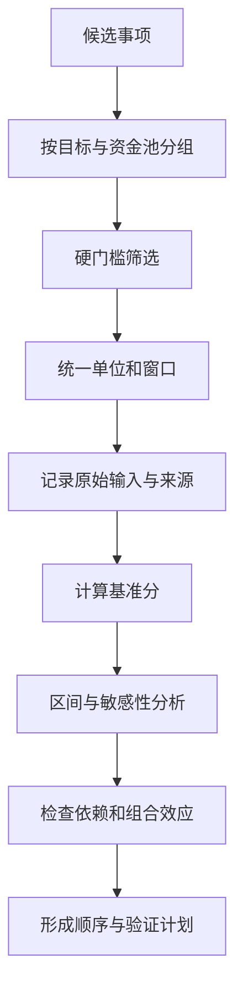

# RICE 与 Value/Effort 排序

RICE 与 Value/Effort 是在候选事项之间建立一致比较口径的方法。它们压缩证据以支持讨论，不会自动证明某项值得做，也不能取代安全、合规、战略边界和产品判断。

## 前置知识

- 候选事项指向清楚的用户问题与产品目标。
- 成功指标有分析单位、分母、时间窗和质量门槛。
- 能估算端到端工作，而非只估开发编码。
- 能区分事实、假设和主观尺度。
- 已识别不可用收益交换的硬约束。

## 一、先决定哪些事项可以被排序

不是所有工作都应进入同一张分数表。

### 先走门槛的事项

- 已确认的安全漏洞。
- 法规与合同固定期限。
- 账务、授权和数据一致性缺陷。
- 可靠性目标已经越界的修复。
- 产品明确承诺且取消成本不可接受的迁移。

这些事项先判断必须做、截止日期和最小安全范围。把它们与增长实验比较 RICE，可能得出“漏洞触达人数少所以延后”的错误结论。

### 可以相对排序的事项

候选项需要：

- 处于同一产品目标或资金池。
- 使用相近的时间窗。
- Reach 使用同一种受益单位。
- Impact 使用同一尺度。
- Effort 覆盖相同角色与生命周期。
- 没有尚未通过的硬门槛。

一个面向季度激活的功能和一个面向三年基础设施迁移的项目，通常不应直接用同一分数排成线性列表。

## 二、RICE 的四个输入

常见形式：

```text
RICE = Reach × Impact × Confidence / Effort
```

分数没有天然单位。只有在同一批候选中使用一致口径时，大小才有比较意义。

### Reach：触达

Reach 表示固定时间窗内可能从事项中受益的唯一分析单位。

定义必须包含：

- 对象：用户、账户、订单、工作区还是任务。
- 资格：哪些对象有机会遇到问题。
- 窗口：月、季度或发布后 90 天。
- 去重：同一对象多次行为如何处理。
- 来源：事件、日志、订单或可追踪证据。

错误示例：

```text
Reach = 页面浏览量 50,000
```

页面浏览量包含重复访问，也可能包含不会使用目标能力的人。

更合格的定义：

```text
Reach = 未来一个季度中，
至少一次提交英文以外搜索词、
且有文档访问权限的唯一工作区数。
```

Reach 不是总用户规模。如果能力只对管理员生效，分母应先筛选有资格的管理员或工作区。

### Impact：影响

Impact 表示每个被触达单位对目标结果的预期变化。没有可直接估算的数据时，可以使用事先固定的离散尺度。

示例尺度：

| 分值 | 语义 |
| ---: | --- |
| 3 | 可能直接改变核心结果 |
| 2 | 对核心结果有明显作用 |
| 1 | 有可观察但有限的作用 |
| 0.5 | 辅助作用 |
| 0.25 | 很弱或间接作用 |

数字只是标签。不能说 2 分必然是 1 分的两倍，除非团队用真实结果单位定义了比例。

Impact 应连接目标。例如“减少导入失败”不能使用“视觉更统一”的影响判断，除非能说明视觉变化怎样影响任务完成。

### Confidence：置信度

Confidence 表示输入与机制证据的可信程度，不是团队支持率。

可按证据层级设置规则：

| 置信度 | 证据条件示例 |
| ---: | --- |
| 90% | 目标群体的行为数据和小规模验证方向一致 |
| 70% | 多来源问题证据充分，但方案效果尚未验证 |
| 50% | 有重复信号，口径或因果机制仍不清 |
| 30% | 主要来自单一请求、竞品模仿或内部观点 |

同为 70% 的两项不表示概率经过统计估计，而表示按照团队规则处于同一证据等级。

不要用 Confidence 掩盖完全未知的关键假设。若价值假设失败会推翻方案，先验证可能比给低分更合理。

### Effort：工作量

Effort 是实现、验证、发布和维持候选项所需的总投入，通常以人周或人月表示。

应包含：

- 产品定义与规则梳理。
- 交互与内容设计。
- 前端、后端、客户端和数据工作。
- 安全、隐私和合规评审。
- 测试、迁移、灰度和回滚。
- 埋点、看板和告警。
- 运营培训与支持准备。
- 功能标记清理和长期维护。

不同角色并行不等于成本消失。例如产品 1 周、设计 1 周、开发 3 周、测试 1 周，总 Effort 可以是 6 人周，即使日历时间只有 3 周。

## 三、Value/Effort

Value/Effort 用更少输入做粗粒度比较：

```text
优先级倾向 = Value / Effort
```

Value 可以包含用户价值、业务价值、风险降低和战略能力，但必须分别定义。若把四种价值直接合成一个“高、中、低”，会隐藏分歧。

### 二维矩阵

| | 低 Effort | 高 Effort |
| --- | --- | --- |
| 高 Value | 优先验证或交付 | 拆分、验证最大假设 |
| 低 Value | 仅在机会成本很低时做 | 通常拒绝或延后 |

矩阵适合候选多、证据粗的早期筛选。它不适合对得分接近的重大投资作最终决定。

### Value 的拆分

```yaml
value:
  user: "减少目标任务失败"
  business: "降低试用流失"
  risk_reduction: "减少错误授权"
  strategic: "形成后续企业能力"
```

四项不能任意相加。错误授权属于硬门槛时，应先处理，而不是只作为一项加权价值。

## 四、完整排序流程



### 1. 分组

先按产品目标、用户群和决策期限分组。不同目标的预算分配是上层策略决定，不能靠单项分数偷偷完成。

### 2. 门槛

未通过安全、合规、可访问、数据可得和可恢复门槛的候选，不进入效用比较。

### 3. 冻结尺度

在看具体候选分布前定义 Impact 与 Confidence 尺度，防止为了喜欢的方案调整标签。

### 4. 保存来源

每个输入旁记录查询、样本窗口、估算参与者和限制。只保留最终分数无法复查。

### 5. 使用区间

Reach、Impact 和 Effort 都可能不确定。至少计算悲观、基准、乐观三种情景。

### 6. 做敏感性分析

逐项改变关键输入，观察排名是否稳定。若小幅变化就逆转，应先验证或把两项视为同一优先级区间。

### 7. 检查依赖

高分事项可能依赖低分基础能力；两个候选也可能共享开发成本。单项分数不能表达组合效应，需要单独记录。

### 8. 输出决定

输出不只是一列序号，还应包含：

- 立即交付。
- 先验证关键假设。
- 等待依赖。
- 延后并设置复查条件。
- 拒绝及理由。

## 五、完整案例一：知识库搜索改进

目标：提高工作区成员从搜索到打开有效文档的比例。季度候选：

1. A：查询拼写纠正。
2. B：结果中显示命中段落。
3. C：语义检索。
4. D：保存最近搜索。

### 统一输入

Reach 以“季度内至少一次出现零结果或立即改写查询的唯一工作区”为单位。Impact 使用固定 0.25、0.5、1、2、3 尺度。Effort 以总人月估算。

| 候选 | Reach | Impact | Confidence | Effort | RICE |
| --- | ---: | ---: | ---: | ---: | ---: |
| A 拼写纠正 | 1,200 | 1 | 80% | 2 | 480 |
| B 命中段落 | 2,000 | 0.5 | 90% | 1.5 | 600 |
| C 语义检索 | 1,600 | 2 | 50% | 6 | 266.7 |
| D 最近搜索 | 900 | 0.25 | 70% | 1 | 157.5 |

计算 A：

```text
1200 × 1 × 0.8 / 2 = 480
```

### 初步结论

B 得分最高，但这不表示直接全量上线。命中段落需要先通过权限片段不泄露和页面加载性能门槛。

C 的潜在影响高，但 Confidence 低且 Effort 大。它更适合先做离线评估和受控原型，而不是因总分低永久拒绝。

### 敏感性分析

B 的 Impact 若只有 0.25，则得分降至 300；A 仍为 480，排名逆转。B 的关键不确定性是片段是否真的提高有效文档打开，而不是实现能否完成。

于是形成的决定：

- A 进入开发。
- B 先对 10% 稳定工作区验证片段价值。
- C 先建立查询集与权限过滤评估。
- D 延后，复查条件为重复查询工作区比例超过 30%。

### 失败分支

若片段提高点击率但有效停留和后续任务完成下降，不能按点击率宣告成功。若权限过滤无法在片段级保持一致，B 直接阻塞，不用更高 RICE 抵消。

## 六、完整案例二：结算可靠性

目标：降低支付发起后订单结果未知的比例。候选：

- E：前端增加重试按钮。
- F：服务端支付幂等与主动查询。
- G：运营提供人工查询面板。
- H：增加第二支付渠道。

### 为什么不能直接计算

当前服务端允许重复支付的风险属于账务硬门槛。F 中的幂等和状态收敛不是普通增长候选，必须先进入可靠性工作。

剩余增量能力再做 Value/Effort：

| 候选 | 用户价值 | 风险降低 | Effort | 判断 |
| --- | --- | --- | ---: | --- |
| E 重试按钮 | 低；可能放大重复 | 负向 | 0.5 人月 | 拒绝 |
| F 主动查询 | 高 | 高 | 2 人月 | 与幂等一起优先 |
| G 查询面板 | 中 | 中 | 1 人月 + 持续人工 | 作为低量恢复 |
| H 第二渠道 | 高 | 中 | 5 人月 + 运维 | 等基线与量级 |

### 生产成本

G 的开发 Effort 低，但每周 100 笔、每笔 8 分钟会产生 13.3 小时持续人工成本。若只计算开发人月，G 会被错误排得过高。

### 决定

先完成 F，G 用作结果未知的限量恢复。H 的 Reach 只应计算主渠道不可用时受影响订单，而不是全部订单。E 因可能破坏幂等，不进入排序。

## 七、区间估算

假设候选 X：

- Reach：800–1,200。
- Impact：1–2。
- Confidence：50%–80%。
- Effort：2–4 人月。

悲观：

```text
800 × 1 × 0.5 / 4 = 100
```

乐观：

```text
1200 × 2 × 0.8 / 2 = 960
```

100 到 960 的区间说明当前输入不足。给出基准 400 并不会让结论可靠。应找出贡献最大的不确定项：通常先验证 Impact 或缩小 Effort 估算范围。

### 蒙特卡洛是否必要

当项目重大且已有可描述的输入分布时，可以模拟分数分布；但模拟不会改善错误口径。若 Reach 分母就选错，生成更多随机数只会更精确地重复错误。

## 八、依赖、组合与时间

### 依赖

候选 C 依赖统一权限过滤 P。单独给 P 的用户 Impact 可能很低，但没有 P，C、推荐和摘要都不能安全上线。应把 P 作为平台门槛或组合投资评估。

### 共享成本

若 A 与 B 共享查询日志改造，分别估算会重复计算。可以比较组合：

```text
A 单独：2 人月
B 单独：1.5 人月
A+B：2.7 人月
```

### 成本延迟

有截止窗口的价值会随时间衰减。例如税务规则必须在生效日前完成。RICE 不直接表示延迟成本，应在时间约束中单独处理。

### 可逆性

证据弱时，可灰度、可关闭、无数据迁移的候选比不可逆架构改造更适合先行。可逆性可以作为门槛或单独决策字段，不建议随意塞入 Impact。

## 九、常见操纵与修正

| 操纵 | 表现 | 修正 |
| --- | --- | --- |
| 放大 Reach | 用总注册或浏览量 | 使用有资格唯一单位 |
| 放大 Impact | 把愿景当单项效果 | 固定尺度并连接目标 |
| 放大 Confidence | 用支持者人数 | 按证据等级赋值 |
| 缩小 Effort | 只估编码 | 包含发布、运营和退役 |
| 改变窗口 | 不同候选用月与年 | 统一决策窗口 |
| 忽略守护 | 高增长掩盖风险 | 硬门槛先于评分 |
| 小数制造精确 | 输入粗糙却报 266.67 | 保留合理有效位和区间 |
| 分数永久有效 | 使用过期 Reach | 设置数据日期和复查 |

## 十、调试排序争议

### 先定位分歧字段

不要争论“谁更重要”，逐项比较 Reach 定义、Impact 机制、Confidence 证据和 Effort 范围。分歧往往集中在一个输入。

### 回到原始证据

抽查事件资格集合、去重和时间窗；检查 Impact 证据是否来自同类用户；检查 Effort 是否遗漏迁移、第三方和人工成本。

### 运行尺度校准

挑选三个已完成事项，用当时可得证据重新打分，再与实际结果比较。若团队持续高估某类 Impact 或低估运营成本，调整尺度规则。

### 记录反对意见

排序决定应保留未选方案、主要分歧和复查触发器。新证据出现时重新计算，而不是把旧分数当承诺。

## 十一、综合练习

选择同一目标下至少六个候选事项：

1. 定义可比较集合和被排除的硬门槛事项。
2. 写 Reach 对象、资格、窗口、去重和查询来源。
3. 建立 Impact 与 Confidence 的固定尺度。
4. 估算包含全生命周期的 Effort。
5. 计算 RICE 基准值。
6. 为三个关键输入给出区间。
7. 做敏感性分析并标记排名不稳定项。
8. 识别依赖、共享成本与组合。
9. 输出交付、先验证、等待、延后、拒绝五类决定。
10. 为每项决定设置复查触发器。

### 验收标准

- 所有 Reach 使用同一分析单位与窗口。
- Impact 分值能追踪到明确尺度和目标机制。
- Confidence 来自证据规则，而非投票。
- Effort 包含设计、数据、测试、发布、运营和退役。
- 安全、合规与业务不变量没有进入收益交换。
- 分数接近时展示区间，不伪造精确顺序。
- 依赖和组合效应没有被单项分数隐藏。
- 另一名学习者可用原始输入复算并得到相同结果。

## 来源

- [Intercom：RICE scoring model](https://www.intercom.com/blog/rice-simple-prioritization-for-product-managers/)（访问日期：2026-07-18）
- [GOV.UK Service Manual：Developing a roadmap](https://www.gov.uk/service-manual/agile-delivery/developing-a-roadmap)（访问日期：2026-07-18）
- [GOV.UK Service Manual：Governance principles for agile service delivery](https://www.gov.uk/service-manual/agile-delivery/governance-principles-for-agile-service-delivery)（访问日期：2026-07-18）
