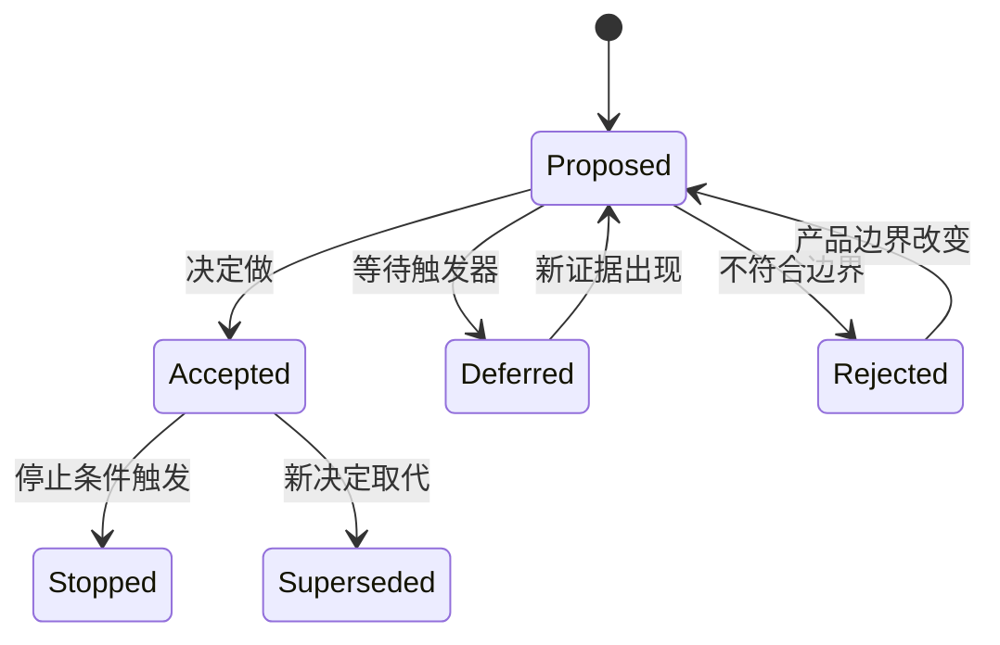

# 记录为什么做与为什么不做

产品决策记录保存当时的问题、证据、约束、选项、决定与后果，使“做、延后、拒绝、停止”都能被理解和复查。它记录的是决定成立的条件，不是为既定结论补理由。

## 一、为什么需要记录“不做”

待办列表只显示被选中的工作，会丢失三个关键信息：

- 哪些方案已经评估，为什么未选。
- 当时有哪些硬约束和未知项。
- 什么新证据出现时需要重新打开决定。

缺少这些信息会导致同一请求反复讨论、团队误以为遗漏、后来者按新环境评价旧决定，也会让沉没成本推动已经失效的方案继续。

决策记录不追求证明决定永远正确。它应允许未来明确地说：原先前提已改变，因此新决定取代旧决定。

## 二、四种决定状态

### 做

“做”表示已经承诺目标、范围、负责人和验证条件。它不是“大家觉得不错”，也不是“进入路线图”。

需要记录：

- 要改变的用户结果。
- 为什么现在做。
- 进入范围的端到端切片。
- 成功、守护和停止条件。
- 最晚复查日期。

### 延后

“延后”表示问题可能成立，但当前证据、依赖、成本或时机不支持投入。

合格理由：

```text
目标角色的月度有效请求为 12 个，
人工处理总计 3 小时；
自动化需要新增跨租户导出与审计能力。
当有效请求达到每月 50 个或人工处理超过 20 小时时复查。
```

“优先级低”“以后再做”没有可复查条件，不是完整决定。

### 拒绝

“拒绝”表示请求与当前问题、产品边界或不可接受风险不一致。拒绝功能不等于否认用户遇到的问题；记录中应保留问题及可用替代。

### 停止

“停止”用于已经投入的方案：关键假设被推翻、守护指标越界、依赖无法成立或机会成本不再合理。停止记录要说明如何关闭、迁移、通知和保留数据。



## 三、一条决策记录的结构

```markdown
# DEC-024 批量数据导出

- 状态：Deferred
- 决定日期：2026-07-18
- 有效范围：团队版工作区
- 决策者：产品负责人

## 问题
## 证据与限制
## 决策驱动因素
## 考虑的选项
## 决定
## 未选理由
## 后果与风险
## 替代路径
## 复查触发器
## 关联记录
```

### 问题

写目标用户、场景、当前工作流和结果损失，不从功能名开始。

### 证据与限制

事实保留来源、日期、样本和适用范围。把推断单独标记，避免“有 20 条请求”被扩写成“所有企业都需要”。

### 驱动因素

列真正改变选择的条件，例如数据隔离、目标用户覆盖、单位成本、上市窗口、可逆性。驱动因素应能解释选项为何产生不同结论。

### 选项

至少包含保持现状或非软件路径。每项描述机制、成本、风险和退出方式，而非只列名称。

### 决定与未选理由

决定要写选择了什么、从何时生效、谁负责。未选理由分别对应每个选项，不使用笼统的“综合考虑”。

### 后果

同时写正面与负面后果。选择不是免费：缩小范围可能更快验证，但暂时增加人工处理；引入第三方可能加快交付，但产生供应商和退出成本。

### 复查触发器

触发器应是可观察事实：

- 指标达到阈值。
- 关键依赖就绪。
- 法规、合同或平台规则改变。
- 人工容量越界。
- 固定日期到达。

## 四、事实、解释、假设与决定

| 类型 | 示例 | 能否直接当理由 |
| --- | --- | --- |
| 事实 | 90 天内 18 个目标工作区提交请求 | 可以，需保留范围 |
| 解释 | 请求来自季度审计压力 | 需要更多证据 |
| 假设 | 自助导出会减少客服工时 | 需要验证 |
| 约束 | 导出不得跨租户读取 | 作为硬门槛 |
| 决定 | 延后通用导出，先提供审计报表 | 是输出，不是证据 |

把决定写成事实会形成循环：“因为路线图上有，所以应该做”。路线图只是过去决定的表达。

## 五、完整案例一：批量导出

### 请求与证据

销售提出“所有列表都支持 Excel 导出”。过去 90 天记录：

- 18 个团队版工作区提出 27 次导出请求。
- 21 次用于季度权限审计。
- 4 次用于数据迁移。
- 2 次未说明用途。
- 客服人工生成审计报表平均每次 22 分钟。

目标不是“增加导出按钮”，而是让管理员在审计期间取得当前成员、角色和权限证据。

### 选项

| 选项 | 机制 | 主要成本 | 主要风险 |
| --- | --- | --- | --- |
| A 所有列表通用导出 | 前端列表统一下载 | 字段权限、异步任务、长期维护 | 敏感字段和公式注入 |
| B 专用审计报表 | 固定字段、服务端生成 | 覆盖场景较窄 | 不能满足迁移 |
| C 保持人工 | 客服按受控查询生成 | 开发少，持续人工 | 容量与响应时间 |

### 决定

选择 B；拒绝 A 的当前范围；C 保留为报表失败恢复。

理由：

- B 覆盖 21/27 的主要任务。
- 固定字段便于服务端授权、审计和测试。
- A 把所有列表字段变成外部数据契约，范围远超当前问题。
- 迁移需求样本少且需要不同数据完整性，不与审计混做。

### 非目标和后果

本轮不支持任意字段选择、不支持普通成员导出、不保证迁移完整性。负面后果是剩余 6 次请求仍需人工处理。

### 复查

- 数据迁移有效请求连续两个月超过 20 个。
- 人工处理超过每周 10 小时。
- 统一导出权限框架已经通过安全评审。

### 失败分支

若报表生成提高自助率，但出现一次跨租户数据，立即停止；安全门槛不能被客服工时下降抵消。CSV 中以 `=`, `+`, `-`, `@` 开头的字段按导出安全规则处理，避免电子表格公式执行风险。

## 六、完整案例二：社交动态

### 请求

团队协作产品的内部提案是增加“关注同事、动态流和点赞”，理由是竞品都有，可能提高日活。

### 当前产品目标

本季度目标是提高新工作区在 7 天内完成首次共同编辑的比例。证据显示主要流失发生在邀请与权限配置，而不是已建立协作后的内容发现。

### 选项

1. 完整社交图与动态流。
2. 在项目内显示与当前任务相关的最近变更。
3. 改进邀请、权限模板和首次共同编辑引导。
4. 保持现状。

### 决定

拒绝本周期的社交动态，选择 3；将 2 作为后续问题证据候选。

拒绝理由不是“开发太贵”，而是：

- 动态流解决的信息发现与当前最大流失点不一致。
- 需要新的关注关系、排序、隐私和内容治理。
- 日活可能因被动浏览提高，却不保证共同编辑价值。
- 没有证据表明目标新工作区因缺少动态流失败。

### 替代与复查

对“看不到团队发生什么”的问题，先用项目内最近变更验证，不建立全局社交关系。

复查触发器：

- 完成首次协作的工作区中，内容发现失败成为前三大流失原因。
- 项目内最近变更的持续使用与共同编辑存在稳定关系。
- 产品边界明确承担跨项目的信息发现。

### 反对意见记录

反对者认为动态流可能形成长期网络效应。记录保留该判断，但当前没有迁移成本、跨团队关系或供给增长证据。未来若证据出现，可新建决定取代本记录，而不是删除历史。

## 七、会议与路线图中的使用

### 会前

提案者先提交问题、证据、选项和所需决定。没有问题证据的功能请求进入证据收集，不直接投票。

### 会中

逐项确认：

- 哪些是事实，哪些是假设。
- 是否有不可交换约束。
- 哪个输入导致方案差异。
- 谁拥有最终决定权。
- 反对意见是否改变风险。

会议不是用多数票替代责任。投票可以收集判断，但决定者仍需记录依据与后果。

### 会后

把决定链接到 roadmap、需求、ADR、实验和停止条件。状态变化时追加或建立后继记录，不静默改写过去理由。

## 八、记录粒度

以下决定值得独立记录：

- 改变产品边界或目标用户。
- 引入难以逆转的数据模型或第三方。
- 拒绝高频或高影响请求。
- 在多个可行方案中作长期选择。
- 接受明显负面后果。
- 停止已投入项目。

普通文案调整或可逆的小实现选择可以进入需求变更日志，不必制造大量 ADR。

## 九、记录的生命周期

| 状态 | 处理 |
| --- | --- |
| Proposed | 正在收集证据，尚不可当承诺 |
| Accepted | 生效并连接执行与验收 |
| Deferred | 等待明确触发器 |
| Rejected | 在当前边界内不做 |
| Stopped | 已投入但停止 |
| Superseded | 被新记录取代，保留历史 |

每条记录要有负责人和复查日期。到期不代表自动做，而是检查前提是否改变。

## 十、失败与调试

### 理由只有“战略一致”

把战略拆成目标用户、结果、期限和不可做边界。无法映射到可观察结果时，理由不可执行。

### 每个拒绝都写资源不足

资源不足只是任何时候都成立的背景。需要说明机会成本：接受该事项会延后哪项更有证据的结果。

### 决定不断反复

检查记录是否缺少有效期和触发器，或事实与观点混在一起。新证据应建立新版本，不在口头争论中改变旧结论。

### 文档很多却没人使用

减少粒度，把记录链接到实际 roadmap 和 PRD；评审变更时强制引用决策 ID。不能改变执行的记录应归档。

### 记录被用于追责

决策记录用于重建当时条件和改进判断，不根据后来信息指责当时未知。若团队因记录受到惩罚，会隐藏不确定性和反对意见。

## 十一、常见错误

| 错误 | 修正 |
| --- | --- |
| 先决定再补证据 | 在提案阶段分开事实与假设 |
| 只写被选方案 | 保存未选项及分别理由 |
| 延后没有触发器 | 设置阈值、依赖事件或日期 |
| 拒绝功能等于否认问题 | 保留问题和替代路径 |
| “竞品有”直接成为理由 | 说明目标用户、机制与证据 |
| 只写正面后果 | 同时记录成本、风险和退出 |
| 删除旧决定 | 标为 Superseded 并链接新记录 |
| 所有小事都写 ADR | 仅记录长期、跨角色或难逆决定 |

## 十二、综合练习

从真实 backlog 选择三个请求，分别作出“做、延后、拒绝”决定。每份记录包含：

1. 问题与目标用户。
2. 至少三条证据及限制。
3. 事实、解释和假设分栏。
4. 三个选项，其中包含保持现状。
5. 驱动因素和硬约束。
6. 选择与每个未选项的理由。
7. 正面与负面后果。
8. 替代路径。
9. 复查触发器和负责人。
10. 与 roadmap 或需求的链接。

### 验收标准

- 未参与讨论的人能重建当时选择。
- “不做”说明产品理由，不只说明排期。
- 每个假设都有可能被证据推翻。
- 每个延后决定有可观察复查条件。
- 反对意见被准确保存。
- 新证据出现时能用新记录取代旧记录。
- 安全、合规和数据不变量没有被投票或收益抵消。

## 来源

- [Michael Nygard：Documenting Architecture Decisions](https://cognitect.com/blog/2011/11/15/documenting-architecture-decisions)（访问日期：2026-07-18）
- [GOV.UK Service Manual：Governance principles for agile service delivery](https://www.gov.uk/service-manual/agile-delivery/governance-principles-for-agile-service-delivery)（访问日期：2026-07-18）
- [GOV.UK Service Manual：Developing a roadmap](https://www.gov.uk/service-manual/agile-delivery/developing-a-roadmap)（访问日期：2026-07-18）
