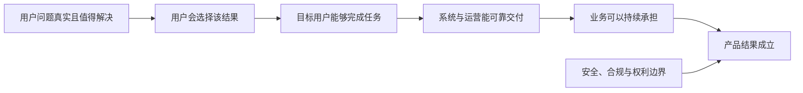
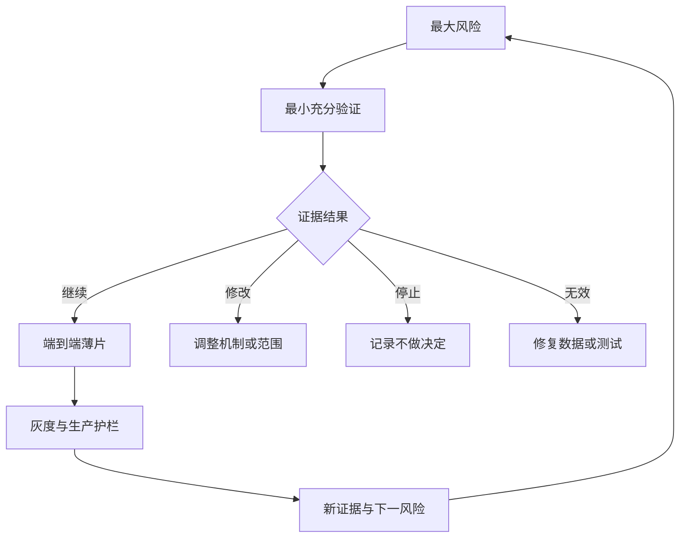

# 识别最大产品风险：先验证最可能让产品失败的假设

产品风险是方案赖以成立的关键条件可能不成立，并因此造成用户、业务或系统损失。识别最大产品风险的目的不是列出所有担忧，而是找出当前最值得优先降低的不确定性，设计成本与风险相称的验证，并据此继续、修改或停止投入。

## 前置知识与能力边界

先掌握：

- [目标用户、场景与限制](01-target-user-context.md)；
- [从功能回到用户问题](02-feature-to-user-problem.md)；
- [业务目标与产品目标](03-business-product-goals.md)；
- [成功指标与护栏指标](04-success-guardrail-metrics.md)；
- [范围与非目标](05-scope-non-goals.md)；
- [依赖识别](06-dependencies.md)。

本文讨论产品方案尚未被充分证明时，怎样选择先验证什么。安全、隐私、合规、账务正确性和权限隔离等硬约束不能通过“平均收益更高”抵消；涉及专业责任时还需要安全、法务、财务或领域负责人共同判断。

## 1. 从第一性原则理解风险

一个方案能够持续产生产品价值，至少需要下列条件同时成立：



任何必要条件失败，产品结果都可能失败。风险的基本表达为：

```text
我们依赖【假设 X】成立，
因为它是【结果 Y】的必要条件；
目前证据为【E】，仍未知【U】；
若 X 不成立，将导致【可观察损失 L】。
```

“这个功能可能没人用”只是担忧。可执行风险应写成：

```text
我们假设每周处理 50 单以上的运营人员，
会用批量导入替代逐条创建，
因为导入能把一次任务从 40 分钟降到 5 分钟。
目前只有工单频次和逐条创建日志，
尚未证明用户能够准备合格 CSV，也未证明错误恢复成本可接受。
若假设不成立，四周开发不会降低任务总时长。
```

## 2. 四类核心产品风险

### 2.1 Value：价值风险

价值风险回答：目标用户是否会选择使用、购买、切换、授权或持续采用这个结果。

需要检查：

- 问题是否发生在目标场景；
- 问题频率、强度和已有替代方式；
- 新结果是否明显优于当前做法；
- 用户是否愿意承担迁移、学习、输入数据和协作成本；
- 结果是否能在需要的时间点获得；
- 使用者、购买者、管理员和受影响者是否为同一人。

可用证据：

- 现有产品任务完成、放弃、重复操作和支持记录；
- 搜索词、失败日志、工作流观察和公开行为材料；
- 可撤销的入口实验或假门测试；
- Concierge/人工交付的真实任务结果；
- 有明确成本的预约、试用、迁移或付费承诺。

页面点击不能单独证明价值。点击可能来自好奇、误触或文案，必须追踪到目标任务结果和后续采用。

### 2.2 Usability：可用性风险

可用性风险回答：目标用户能否发现入口、理解状态、完成任务并从失败中恢复。

需要检查：

- 用户是否知道从哪里开始；
- 术语和对象是否与任务一致；
- 输入、默认值和影响范围是否可理解；
- 错误、等待、冲突和部分成功是否可恢复；
- 键盘、辅助技术、窄屏和长文本是否可完成；
- 新工作流是否要求用户掌握不存在的知识。

验证可以使用交互原型、可运行薄片、任务走查、可访问性测试和真实数据夹具。静态视觉稿不能验证键盘、异步、权限和错误恢复。

### 2.3 Feasibility：可行性风险

可行性风险回答：团队能否在时间、技术、数据、可靠性和运营边界内交付所需结果。

需要检查：

- 数据是否存在、准确、及时且可合法使用；
- 依赖系统是否提供所需 API、容量和稳定性；
- 延迟、吞吐、成本与尾部失败是否满足任务；
- 技术方案能否处理异常、回滚和数据迁移；
- 需要的技能、设备和第三方能力是否可获得；
- 人工运营是否能在目标规模下持续执行。

验证方式包括技术 spike、真实数据样本、容量测试、失败注入、供应商沙箱、权限模型验证和端到端 walking skeleton。

“工程师认为能做”不是完成验证；需要可重现结果、容量边界和未解决问题。

### 2.4 Viability：业务可持续风险

业务可持续风险回答：组织能否在商业、法律、销售、支持、品牌和运营边界内持续提供产品。

需要检查：

- 价格、毛利和单位经济是否成立；
- 销售与采购周期是否允许采用；
- 合同、数据驻留、知识产权和监管要求；
- 客服、审核、退款和争议处理成本；
- 产品是否损害现有渠道、合作伙伴或重要业务；
- 使用者获益是否会让付款者或管理员拒绝；
- 下线、数据导出和客户迁移责任。

业务可持续不是“老板是否喜欢”。它应落实为明确约束、负责人、证据和可计算成本。

## 3. 横向硬风险

四类产品风险之外，以下条件通常需要独立的发布门槛：

| 风险 | 必须回答 | 不能接受的处理 |
|---|---|---|
| 安全 | 能否被越权读取、修改或执行 | 依赖前端隐藏按钮 |
| 隐私 | 收集是否必要，保留和删除如何执行 | 先全量收集以后再说 |
| 合规 | 哪些主体、地区、数据受规则约束 | 用产品平均收益抵消违规 |
| 账务 | 金额、币种、税、退款能否对账 | 用 UI 成功提示代替账本事实 |
| 可访问性 | 核心任务能否由不同输入方式完成 | 发布后再补键盘和读屏 |
| AI 伤害 | 错误、偏差、注入和越权怎样影响决策 | 只检查语言是否流畅 |

高影响硬风险即使概率难估，也应先设控制和停止条件。

## 4. 风险、问题、假设与依赖的区别

| 对象 | 含义 | 示例 |
|---|---|---|
| 已知问题 | 已观察到的不利事实 | 28% 的导入任务因列映射失败 |
| 假设 | 尚未证明但可被证伪的陈述 | 自动映射可把失败降到 10% |
| 风险 | 假设不成立造成的损失 | 错误导入污染库存并增加人工修复 |
| 依赖 | 结果需要的外部条件或交付 | ERP 沙箱与字段字典 |
| 约束 | 方案不能违反的边界 | 不允许跨租户训练 |
| Issue | 风险已经发生 | ERP 沙箱延期两周 |

依赖存在不等于它是最大风险。稳定、可替换的依赖可能只需跟踪；没有负责人、没有 SLA 且会阻断全部价值的依赖才可能成为首要风险。

## 5. 建立风险清单

### 5.1 从因果链逐项提取

先画从输入到结果的因果链：

```text
目标用户遇到问题
→ 发现产品入口
→ 理解并开始任务
→ 提供必要数据
→ 系统正确处理
→ 用户相信并采用结果
→ 组织承担成本与责任
→ 目标指标改变
```

对每个箭头问：

1. 这一步需要什么条件成立？
2. 哪些是事实，哪些只是推断？
3. 条件失败会出现什么可观察结果？
4. 现有证据来自什么范围和时间？
5. 哪类验证能最便宜地改变决定？

### 5.2 风险记录字段

```yaml
risk:
  id: "R-AI-004"
  statement: "关键事实遗漏未被审核者发现"
  category: "value-and-safety"
  affected_result: "值班交接决定正确"
  assumption: "审核者能在 90 秒内识别所有高严重度遗漏"
  current_evidence:
    - "30 份历史交接记录上的离线回放"
  unknown:
    - "高压值班环境中的真实发现率"
  impact:
    severity: "critical"
    scope: "单次事故及其下游响应"
    reversibility: "low"
  owner: "product-ai-lead"
  next_test: "50 个固定事故夹具的盲审对照"
  decision_date: "2026-07-25"
  stop_condition: "任何 P0 事实遗漏被直接发布"
```

`owner` 负责推动验证和决定，不代表可以单独接受安全、法律或财务风险。

## 6. 怎样选出“最大”风险

最大风险不是简单的 `概率 × 金额` 最大值。早期产品往往没有可靠概率，且低概率高伤害不能被平均数掩盖。

### 6.1 五个判断维度

| 维度 | 问题 |
|---|---|
| 结果影响 | 不成立会让核心结果局部下降还是全部失效 |
| 证据缺口 | 当前证据能否覆盖目标用户、数据和生产条件 |
| 不可逆性 | 失败能否回滚、补偿和恢复信任 |
| 即将投入 | 不验证就继续会投入多少工程、迁移和组织成本 |
| 信息价值 | 一次验证是否会改变方案、范围或继续/停止决定 |

可以使用三档标记，不伪造精确概率：

```text
影响：致命 / 显著 / 局部
证据：缺失 / 间接 / 直接
可逆：低 / 中 / 高
投入：高 / 中 / 低
```

优先顺序通常是：

1. 违反硬约束或可能造成不可逆伤害；
2. 能让整个价值主张失效且证据缺失；
3. 会在即将发生的大额投入后才暴露；
4. 可用低成本验证明显改变决定；
5. 局部、可逆、已有充分证据的风险。

### 6.2 不同方案有不同最大风险

同一用户问题的候选方案：

| 方案 | 可能的最大风险 |
|---|---|
| 自动执行退款 | 权限和错误副作用不可接受 |
| 生成退款建议 | 人工是否会校验关键字段 |
| 提供规则检查器 | 规则覆盖率是否足够 |
| 改善帮助文档 | 用户是否能找到正确规则 |
| 人工专家服务 | 服务成本和响应时间是否可持续 |

不能只评估已经偏爱的方案。保留不同机制的候选，往往能避开最难控制的风险。

## 7. 设计最小充分验证

最小验证不是最小功能，而是以最低总成本获得足以改变决定的证据。

### 7.1 先写决定再选方法

```text
如果结果达到门槛 A：继续构建薄片；
如果落在区间 B：修改机制后再测；
如果低于门槛 C：停止该方案；
如果数据无效：修复测试，不把缺失解释为失败或成功。
```

没有预先决定门槛，团队容易在看到结果后移动标准。

### 7.2 验证方法与能回答的问题

| 方法 | 能验证 | 不能单独证明 |
|---|---|---|
| 日志/支持记录分析 | 频率、失败位置、已有行为 | 新方案会被采用 |
| 可点击原型 | 发现、理解、流程与术语 | 真实延迟、数据和错误恢复 |
| 可运行薄片 | 端到端契约、状态和技术边界 | 规模采用和长期留存 |
| Concierge | 结果是否有价值、工作流输入 | 自动化成本和容量 |
| Wizard of Oz | 用户对最终行为的反应 | 后台机制可以实现 |
| 技术 spike | 数据、API、性能和质量上限 | 用户是否愿意使用 |
| 假入口 | 选择意愿和场景分布 | 完整任务成功 |
| 灰度/影子 | 生产分布下的质量与可靠性 | 长期因果结果，除非设计充分 |

验证方法必须与风险类型匹配。不能用问卷证明系统能在 P95 500ms 内响应，也不能用技术 benchmark 证明用户愿意改变工作流。

### 7.3 控制暴露范围

风险越高，越应降低暴露：

- 使用合成或去标识数据；
- 影子运行，不把结果交给用户；
- 只读建议，不自动执行；
- 单租户、白名单或内部环境；
- 人工复核后才生效；
- 设置 kill switch、配额和回滚；
- 避免对不可逆动作做“先试试”。

## 8. 案例一：AI 事故摘要

### 8.1 目标与候选方案

目标：值班人员在事故交接时更快获得时间线、影响范围和待办。

候选方案：

- A：自动生成并直接发布摘要；
- B：生成草稿，由值班人员复核；
- C：只提取结构化事件，人工组织摘要。

### 8.2 风险清单

| 风险 | 类型 | 当前证据 | 影响 |
|---|---|---|---|
| 遗漏关键升级记录 | 价值/安全 | 20 份普通事故离线样例 | P0 决策错误 |
| Prompt injection 改写摘要 | 安全/可行性 | 未测试外部工单内容 | 越权指令或错误声明 |
| 值班人员不复核草稿 | 可用性/运营 | 只有流程规定 | 错误被直接传播 |
| 生成延迟超过交接窗口 | 可行性 | 平均 8 秒，无 P95 | 结果到达太晚 |
| Token 成本随日志增长失控 | 业务可持续 | 小事故估算 | 大事故成本不可控 |

最大风险不是“模型能不能生成通顺文本”，而是关键事实遗漏且未被发现。它影响核心结果、可能造成严重后果、现有证据不覆盖高风险事故，且自动发布不可逆。

### 8.3 验证设计

建立 50 个固定事故夹具：

- 20 个普通事件；
- 10 个时间线冲突；
- 8 个缺失字段；
- 6 个外部内容注入；
- 6 个 P0 关键升级。

比较人工基线、方案 B、方案 C。每个输出由未看方案标识的领域人员按原子主张检查：

- 关键事实召回；
- 不受证据支持的主张；
- 时间顺序；
- 影响范围；
- 审核者在 90 秒内发现的错误；
- P95 完成时间与成本。

预先门槛：

- P0 关键事实召回必须 100%；
- 不支持的高严重度主张为 0；
- 注入内容不能改变系统规则或调用工具；
- 90 秒复核后仍存在的 P0 错误为 0；
- 任一硬门槛失败，不自动发布。

### 8.4 结果如何改变方案

假设 B 的普通任务时间改善 40%，但 6 个 P0 样例中有 1 个遗漏未被审核者发现。总体平均不能抵消该失败。决定为：

- 不采用 A；
- B 只用于低风险事故草稿；
- P0 保持结构化提取加人工编写；
- 将遗漏样例加入回归集；
- 继续验证输入过滤和证据引用。

这不是“AI 功能失败”，而是自动化边界被证据收窄。

## 9. 案例二：批量 CSV 导入

### 9.1 目标

有 500–10,000 条资产的管理员需要从旧系统迁移数据。当前逐条创建耗时数小时。

### 9.2 初始风险

- Value：迁移是否足够频繁，值得长期维护导入器；
- Usability：管理员能否理解列映射和错误；
- Feasibility：不同编码、日期、枚举和关联对象能否可靠解析；
- Viability：支持团队是否会承担大量清洗工作；
- Safety：部分成功是否污染生产数据。

现有日志显示大量逐条创建，但不能证明 CSV 是最佳机制。管理员可能更需要 API、第三方迁移服务或一次性人工迁移。

### 9.3 最大风险判断

即将投入完整映射 UI、异步任务和回滚系统。最危险的未知项是：真实文件的结构差异是否能被统一导入机制可靠处理。若解析和映射不成立，视觉流程再完善也没有价值。

### 9.4 分阶段验证

第一步：只读分析器。

- 接受去标识的真实样本；
- 不写生产数据库；
- 输出编码、列、类型、重复和关联错误；
- 记录每类文件需要的人工规则。

第二步：预览与 dry run。

- 对 30 个固定夹具生成逐行结果；
- 展示将创建、更新、跳过和失败的对象；
- 校验重复键、权限和关联对象；
- 用户确认前不产生写入。

第三步：隔离写入。

- 在测试工作区执行；
- 使用幂等导入 ID；
- 原子提交或明确逐行结果；
- 支持撤销或删除整批新建对象；
- 对账数据库与预览结果。

### 9.5 决策门槛

```yaml
continue:
  parseable_files: ">= 90%"
  preview_row_accuracy: ">= 99.5%"
  critical_field_errors: 0
  rollback_success: "100%"
  median_manual_mapping_minutes: "<= 8"
stop_or_change:
  - "超过 20% 文件需要一次性自定义代码"
  - "无法在提交前识别关联对象冲突"
  - "撤销不能恢复到导入前状态"
```

若大量文件只出现一次且差异极大，最佳方案可能是受控迁移服务，而不是永久产品功能。

## 10. 风险评审记录

一份可复查记录应包含：

```yaml
review:
  product_result: "管理员完成可回滚的数据迁移"
  candidate: "CSV dry-run + batch commit"
  largest_risk:
    statement: "真实文件差异使通用映射无法可靠工作"
    category: "feasibility"
    evidence_strength: "indirect"
    impact: "core-result-fails"
    reversibility: "low-after-write"
  next_test:
    method: "30 个版本化文件夹具上的只读解析与预览"
    owner: "migration-pod"
    due: "2026-07-25"
    budget: "3 engineer-days"
  thresholds:
    continue: "解析率和逐行准确率达到门槛"
    modify: "错误集中在 2 类可建模格式"
    stop: "错误分散且需要逐客户代码"
  safeguards:
    - "不写生产"
    - "样本去标识"
    - "输出按租户隔离"
```

风险记录要链接原始证据、测试代码、结果和决定。不要只在会议白板上保留风险。

## 11. 调试不一致的证据

### 11.1 行为数据说问题很大，验证却没人采用

检查：

1. 日志事件是否把系统重试当成用户重复操作；
2. 目标用户和验证样本是否一致；
3. 验证发生在问题真正出现的时刻；
4. 新方案是否增加迁移或权限成本；
5. 当前替代方案是否已足够好；
6. 指标是否记录入口点击而非任务完成。

### 11.2 原型测试成功，上线失败

检查：

- 原型是否省略加载、空、错误和权限；
- 真实数据是否更长、更脏或存在冲突；
- 原型测试者是否获得了额外解释；
- 生产入口是否可发现；
- 状态能否刷新和跨设备恢复；
- 服务端结果是否与界面成功提示一致。

### 11.3 技术 spike 成功，生产不可行

检查：

- spike 是否只测平均值，没有 P95/P99；
- 数据规模、并发和租户隔离是否真实；
- 第三方限额和价格是否计入；
- 失败重试是否重复副作用；
- 人工审核和支持成本是否遗漏；
- 数据保留、删除和审计是否实现。

## 12. 常见失败模式

### 12.1 风险清单很长，没有顺序

没有最大风险就无法决定下一步。每轮必须选出一个主风险和少量硬门槛，其余风险进入队列并注明触发条件。

### 12.2 优先验证最容易的部分

团队常先验证按钮文案、颜色或理想路径，因为容易展示。这些结果不能降低数据、权限、价值或运营风险。

### 12.3 用意见数量代替证据强度

十个人重复同一个推断，不等于十份独立证据。记录来源是否独立、是否覆盖目标场景，以及能否被反例推翻。

### 12.4 把 MVP 当作风险验证

一个小功能仍可能包含大量无关工作，却没有触及最大未知项。验证物只实现获得决定所需的最短因果链。

### 12.5 只验证成功，不定义停止

没有停止门槛的实验会无限解释。运行前写出继续、修改、停止和数据无效四类动作。

### 12.6 总平均掩盖高风险失败

总体成功率 95% 可能包含全部权限样例失败。按用户、平台、风险、数据状态和任务类型分组，并给硬风险独立门槛。

### 12.7 验证本身伤害用户

假入口欺骗、未授权数据使用、不可逆实验和暗中改变价格都可能产生伤害。验证也必须满足知情、隐私、安全和恢复边界。

## 13. 与路线图和交付衔接

风险验证结果应改变路线图，而不是只增加一份报告：



路线图条目应表达要降低的风险或要实现的结果，例如：

```text
验证真实 CSV 的可解析边界
```

而不是直接承诺：

```text
完成智能导入器 2.0
```

前者允许证据选择 API、人工迁移或停止；后者把方案误当成目标。

## 14. 练习

选择一个计划中的功能，完成以下产出：

1. 写出用户结果和完整因果链；
2. 列出至少 3 个价值、3 个可用性、3 个可行性、3 个业务可持续风险；
3. 单独列出安全、隐私、合规和可访问性硬门槛；
4. 为每项标记证据强度、影响、可逆性和即将投入；
5. 选出一个最大风险并说明为何不是其他风险；
6. 设计一个 1–5 天可完成的最小充分验证；
7. 在运行前写继续、修改、停止、数据无效门槛；
8. 说明验证物不会伤害谁、泄露什么或产生何种不可逆副作用；
9. 将结果转为下一条路线图决定。

验收时，第三方应能仅根据记录复现：风险为何最大、测试改变什么决定、证据适用范围以及未解决风险。

## 来源

- [Silicon Valley Product Group：The Four Big Risks](https://www.svpg.com/four-big-risks/)（访问日期：2026-07-18）
- [GOV.UK Service Manual：How the discovery phase works](https://www.gov.uk/service-manual/agile-delivery/how-the-discovery-phase-works)（访问日期：2026-07-18）
- [GOV.UK Service Manual：Governance principles for agile service delivery](https://www.gov.uk/service-manual/agile-delivery/governance-principles-for-agile-service-delivery)（访问日期：2026-07-18）
- [Strategyzer：Validate Your Ideas with the Test Card](https://www.strategyzer.com/library/validate-your-ideas-with-the-test-card)（访问日期：2026-07-18）
