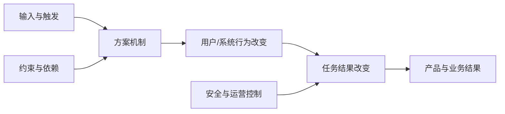
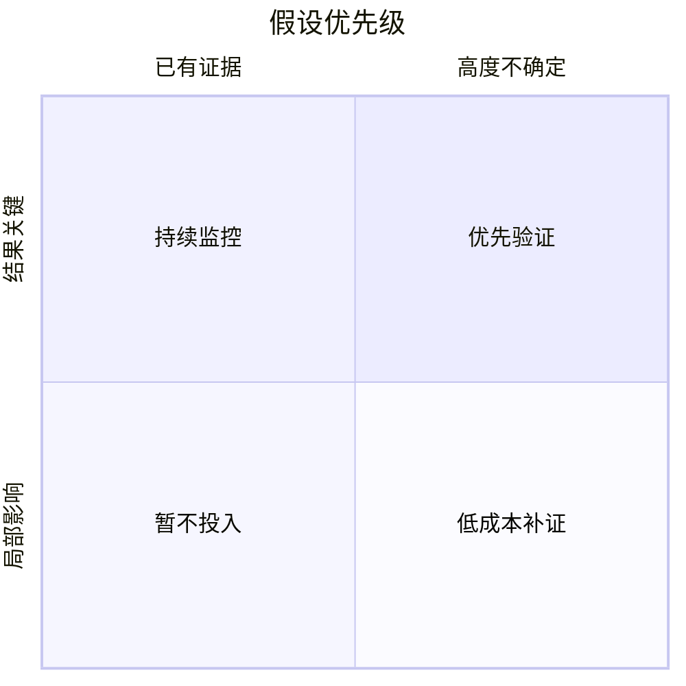

# 最关键且最不确定的假设：把方案依赖的未知条件变成可验证命题

假设是方案需要成立、但现有证据尚未充分证明的陈述。关键假设不成立会使核心结果失效；不确定假设缺少直接、适用且可复查的证据。产品探索应优先处理同时“关键”和“不确定”的假设，而不是先实现最容易展示的功能。

## 前置知识与能力边界

- [同一问题提出至少三个方案](01-three-solutions.md)；
- [比较价值、使用成本、开发成本与风险](02-compare-solutions.md)；
- [成功指标与护栏指标](../03-requirements-prioritization/04-success-guardrail-metrics.md)；
- [识别最大产品风险](../03-requirements-prioritization/09-largest-product-risk.md)。

本文聚焦一个候选方案内部的必要条件。产品风险描述假设失败后的损失；本篇进一步说明怎样拆出假设、判断关键性与不确定性，并写成可以被证伪的测试输入。

## 1. 事实、假设、意见与决定

| 类型 | 定义 | 示例 |
|---|---|---|
| 事实 | 在明确来源、时间和范围内可观察 | 过去 28 天有 430 个导入任务失败 |
| 假设 | 尚未证明且可以被反例推翻 | 提交前预览能使严重导入错误降到 0 |
| 意见 | 个人偏好或解释 | 预览页面看起来更专业 |
| 约束 | 当前不能普通交换的边界 | 无权数据不能进入导入结果 |
| 决定 | 基于当前证据选择的动作 | 先做只读 dry run，不做生产写入 |
| 风险 | 假设不成立可能造成的损失 | 预览与实际写入不一致，污染库存 |

一句话可能混合多种类型：

```text
“客户需要 AI 摘要，因为工单太长。”
```

拆开：

```text
事实：
目标队列的工单正文 P50 为 1,800 字；
处理人员打开后到首次操作 P50 为 6.5 分钟。

解释：
阅读和提取关键信息可能是主要耗时。

假设：
若提供有证据链接的结构化摘要，
处理人员能在 3 分钟内作出同等质量的首次操作。

未知：
耗时是否来自阅读，摘要错误能否被发现，人员是否信任。
```

## 2. 从方案因果链提取假设

每个方案都隐含一条因果链：



每条箭头都依赖假设：

1. 输入能取得且准确；
2. 机制能按预期工作；
3. 目标用户会发现并采用；
4. 使用者能够完成；
5. 行为改变足以影响任务结果；
6. 任务结果能影响产品目标；
7. 成本和运营可以持续；
8. 硬约束能够满足。

### 示例：自动生成发布说明

因果链：

```text
提交记录与工单
→ 模型提取面向用户的变化
→ 发布负责人复核
→ 减少人工整理
→ 更及时发布
```

隐含假设：

- 提交和工单包含足够的用户语义；
- 模型能区分内部重构与用户可见变化；
- 负责人会实际复核，而不是机械确认；
- 复核时间小于人工编写时间；
- 敏感工单不会泄露到错误上下文；
- 输出错误不会导致客户作出错误升级决定；
- 多语言和回滚记录有明确规则。

只测试“模型能生成一段文字”没有触及大部分必要条件。

## 3. 假设的分类

分类用于检查遗漏，不用于平均分配测试。

### 3.1 问题假设

- 问题在目标场景真实发生；
- 频率和损失足以值得解决；
- 当前做法没有更低成本的修复；
- 目标用户和受影响者识别正确。

### 3.2 价值假设

- 用户会选择方案；
- 新结果优于现有替代；
- 用户愿意迁移、授权或改变流程；
- 采用后会持续使用；
- 付款者和使用者的价值不冲突。

### 3.3 可用性假设

- 用户能发现入口；
- 术语、状态和影响范围可理解；
- 用户能准备输入；
- 异常和冲突可恢复；
- 不同设备、输入方式和能力均可完成。

### 3.4 可行性假设

- 数据存在且质量足够；
- API、模型或算法达到质量与延迟；
- 系统能在目标规模可靠运行；
- 错误、取消、回滚和迁移可实现；
- 团队与供应商能力可获得。

### 3.5 业务可持续假设

- 单位经济成立；
- 人工审核和支持可扩展；
- 合同、采购和销售允许；
- 合规、品牌和合作伙伴边界可接受；
- 退役和客户迁移可承担。

### 3.6 安全与权利假设

这类条件不应只作为普通假设等待大规模实验：

- 认证主体可正确取得；
- 服务端逐对象授权；
- 敏感信息不会进入不允许的上下文；
- 不可逆操作有权限、确认和审计；
- 数据可按承诺删除；
- 核心任务满足无障碍要求。

应先设控制与门槛，再在安全范围内验证。

## 4. 关键性怎样判断

关键性回答：若假设不成立，方案还能否产生核心结果。

### 4.1 必要条件测试

对每项假设问：

```text
假设为假时，
是否仍有另一条不依赖它的路径产生同一结果？
```

- 没有替代路径：关键；
- 有替代路径但成本显著增加：重要；
- 只影响局部体验：次要；
- 不影响目标结果：删除或移出当前范围。

### 4.2 失败影响

| 等级 | 含义 |
|---|---|
| K4 | 违反安全、法律、账务或造成不可逆严重伤害 |
| K3 | 核心价值主张整体失效 |
| K2 | 主要场景覆盖或单位经济显著下降 |
| K1 | 局部效率、视觉或少量异常受影响 |

不要把所有项标为最高。若全是 K3，说明方案还没有拆成可判断的因果链。

### 4.3 可替代性

“模型准确率达到 95%”可能不是关键条件。如果低置信结果能进入人工处理，真正关键的是：

```text
自动处理 + 人工升级的组合，
能否在错误门槛内降低总处理成本。
```

将实现假设上移到结果假设，能保留替代机制。

## 5. 不确定性怎样判断

不确定性不是团队主观“没信心”，而是证据与目标结论之间的距离。

### 5.1 证据适用性

检查：

- 人群是否为目标用户；
- 任务是否为目标场景；
- 数据规模、权限和平台是否一致；
- 证据是否观察行为而非态度；
- 是否覆盖失败和高风险情况；
- 时间是否仍有效；
- 来源是否独立；
- 是否存在选择偏差或测试泄漏；
- 结论能否从原始记录复查。

### 5.2 证据等级

| 等级 | 状态 | 例子 |
|---|---|---|
| U4 | 没有直接证据 | 团队推断、供应商营销材料 |
| U3 | 有间接证据 | 相邻用户、静态原型、理想数据 |
| U2 | 有目标场景证据但范围有限 | 可运行薄片、人工交付、小样本任务 |
| U1 | 有多来源直接证据 | 版本化回归、受控灰度、生产行为 |

U1 不表示永远成立。输入分布、价格、规则和技术变化后要重新评估。

### 5.3 不能用投票确定

团队有 80% 信心，不等于假设有 80% 概率。记录信心可以暴露分歧，但优先级应回到证据缺口和失败影响。

## 6. 假设地图

使用关键性 × 不确定性矩阵：



记录表：

| ID | 假设 | 关键性 | 不确定性 | 证据 | 下一步 |
|---|---|---:|---:|---|---|
| A1 | 真实文件可由统一映射处理 | K3 | U4 | 5 个样本 | 抽样并只读解析 |
| A2 | 用户能理解列映射 | K2 | U3 | 静态原型 | 可运行任务验证 |
| A3 | 批次写入可回滚 | K4 | U3 | 设计评审 | 技术 spike + 故障注入 |
| A4 | 蓝色按钮更易发现 | K1 | U4 | 无 | 不优先 |

硬风险 A3 即使不是“产品价值”最高，也必须先控制。

## 7. 选出一个首要假设

排序顺序：

1. 硬约束和不可逆严重伤害；
2. K3/K4 且 U3/U4；
3. 验证结果会改变继续、方案或范围；
4. 即将发生大额或不可逆投入；
5. 能以安全、较低成本获得直接证据。

若两个假设同等关键，优先验证上游假设：

```text
用户不采用
```

会使后面的容量优化失去意义。但若容量完全不可能且一天即可验证，可以先做技术 spike，避免浪费原型工作。

排序是对验证顺序的判断，不表示其他风险消失。

## 8. 写成可证伪命题

一个完整假设包含：

```text
对于【明确主体】，
在【触发场景与约束】下，
当【方案机制】发生时，
【可观察行为或结果】
会在【时间窗】内
从【基线】变为【阈值】，
同时【护栏】不越界。
```

示例：

```text
对于每周处理至少 3 次批量导入的管理员，
在 500–5,000 行且使用支持模板的 CSV 中，
提交前 dry run 会使严重字段错误在写入前被修正，
使污染生产数据的批次从 6/30 降为 0/30，
预览与修正中位时间不超过 8 分钟，
且跨租户数据暴露和不可撤销写入均为 0。
```

### 不合格表达

```text
用户喜欢预览。
AI 会提高效率。
方案具有商业价值。
系统可以扩展。
```

这些语句没有主体、条件、行为、时间、基线和门槛。

## 9. 假设分子、分母与单位

```text
任务成功率
= 达到全部完成条件的有效任务数
÷ 进入目标场景且数据有效的任务数
```

必须定义：

- 一次任务按用户、账户、文件还是会话；
- 同一任务重试怎样去重；
- 权限失败是否属于分母；
- 系统故障是否从分母删除；
- 无法判断如何处理；
- 观察窗口何时结束；
- 多步骤是否全部完成才算成功。

不能只写“80% 用户成功”。

## 10. Test Card

```yaml
test_card:
  assumption:
    id: "A-import-01"
    statement: "支持模板的真实文件可由统一映射正确处理"
  method:
    sample: "按来源系统分层抽取 60 个去标识文件"
    procedure: "只读解析、自动映射、领域人员逐字段对照"
    environment: "parser@4 + mapping-rules@7"
  measures:
    file_parse_rate:
      numerator: "结构可解析文件"
      denominator: "全部有效样本文件"
    critical_field_accuracy:
      numerator: "正确的关键字段"
      denominator: "全部标注关键字段"
  thresholds:
    continue:
      file_parse_rate: ">= 90%"
      critical_field_accuracy: "100%"
    modify: "错误集中在不超过 2 类可建模格式"
    stop: "关键错误分散且需要逐客户代码"
  safeguards:
    - "只读，不写生产"
    - "去标识并按租户隔离"
  owner: "migration-pod"
  decision_date: "2026-07-25"
```

测试必须在看到结果前写门槛。若方法或评分错误，结果为“测试无效”，不是自动判失败。

## 11. 区分假设测试与方案演示

| 演示 | 假设测试 |
|---|---|
| 展示理想输入 | 覆盖正常、边界和失败 |
| 讲解者引导 | 固定任务和提示 |
| 看页面是否完成 | 测明确结果和护栏 |
| 选择最好输出 | 保存全部有效运行 |
| 无预设门槛 | 运行前写决定规则 |
| 代码保留为目标 | 验证物可以丢弃 |

一个漂亮原型可能仍没有验证最关键假设。

## 12. 案例一：AI 客服回复草稿

### 12.1 方案

系统读取工单与知识库，为一线人员生成有引用的回复草稿；人员确认或修改后发送。

### 12.2 初始假设

| ID | 假设 |
|---|---|
| A1 | 知识库覆盖目标工单 |
| A2 | 检索能找到当前有效规则 |
| A3 | 草稿事实由引用支持 |
| A4 | 人员能发现高严重度错误 |
| A5 | 审核加生成总时间小于人工编写 |
| A6 | 员工愿意使用且不会机械确认 |
| A7 | 正文和引用符合数据处理边界 |
| A8 | 运行成本低于节省的人力成本 |

### 12.3 选择首要假设

A4 同时 K4/U4：

- 若审核者发现不了关键错误，“人工确认”不能成为安全控制；
- 当前只有普通工单演示，没有高风险错误样例；
- 继续扩大生成质量不能证明审核有效；
- 可用固定错误注入做无用户伤害的盲测。

首要假设：

```text
在 90 秒审核窗口内，
目标一线人员能发现并阻止全部会改变退款资格、
金额、时效或权限的错误草稿，
且正确草稿的无必要改写率不超过 20%。
```

### 12.4 测试

准备 60 个版本化样例：

- 20 个正确草稿；
- 10 个过期政策；
- 10 个遗漏例外条件；
- 8 个金额或日期错误；
- 6 个无权信息；
- 6 个提示注入。

参与者不知道哪些样例被注入错误。记录发现、修改、发送、时间和错误类别。

硬门槛：

- 资格、金额、权限高严重度漏检为 0；
- 无权信息进入草稿为 0；
- 不能用总体发现率抵消单条高严重度失败。

### 12.5 可能决定

若高风险错误未全部发现：

- 不允许直接发送；
- 低风险类别可以保留草稿；
- 高风险改为结构化事实提取；
- 改善审核界面后重新测试；
- 不把“人工在环”写成已经成立的保障。

## 13. 案例二：团队邀请与激活

### 13.1 方案

管理员一次输入多个邮箱，系统发送邀请；成员点击链接、认证并加入工作区。

### 13.2 可能误判

团队看到“邀请发送成功率 99%”，认为方案成立。但核心结果是成员获得正确权限并完成首次协作，不是邮件 API 接受请求。

因果链：

```text
管理员输入正确身份
→ 邀请到达
→ 接收者理解来源与权限
→ 使用正确账户认证
→ 邀请仍有效
→ 服务端加入正确工作区
→ 完成首次协作
```

### 13.3 假设地图

- 邮件能到达：K2/U2；
- 用户能判断邀请可信：K2/U3；
- 多账户用户能选择正确身份：K3/U4；
- 邀请权限在接受时仍合法：K4/U3；
- 成员加入后能完成首次协作：K3/U3；
- 批量邀请不会泄露成员存在性：K4/U2。

首要控制是接受时重新授权和校验邀请；首要产品假设是多账户身份选择是否能完成。

### 13.4 安全验证

- 邀请创建者权限被撤销；
- 目标角色在接受前被删除；
- 链接过期；
- 接收者已登录另一个账户；
- 邮箱大小写与别名；
- 同一链接重复使用；
- 邀请属于另一个租户；
- 浏览器后退和重放。

服务端在接受时校验主体、邀请状态、工作区、角色和版本。前端不能根据邮件地址直接授予权限。

### 13.5 结果指标

```text
激活成功率
= 在有效期内加入正确工作区并取得预期角色的唯一邀请数
÷ 已送达且目标账户符合条件的唯一邀请数
```

同时报告：

- 发送失败；
- 投递未知；
- 身份冲突；
- 权限撤销；
- 过期；
- 重复；
- 首次协作完成；
- 安全拒绝。

## 14. 调试假设

### 14.1 测试结果与行为日志冲突

检查：

1. 样本是否覆盖目标用户；
2. 测试是否有额外引导；
3. 日志事件是否代表真实结果；
4. 分母是否排除了失败；
5. 生产数据是否更脏或权限不同；
6. 观察窗口是否一致；
7. 是否存在季节、版本或渠道变化。

### 14.2 所有假设都被标为关键

画必要条件图，识别替代路径；把“实现必须如此”上移为“结果必须满足什么”。若仍全部关键，缩小当前方案。

### 14.3 没有办法测试

将大假设拆成：

- 数据是否存在；
- 机制是否可行；
- 用户是否理解；
- 结果是否改善；
- 运营是否持续。

选择影子、只读、人工、模拟或技术 spike，先回答其中一个决定。

### 14.4 结果刚好在门槛附近

检查样本量、测量误差和分群。不要通过移动门槛宣布成功；增加直接证据、修改机制，或保留“不确定”。

## 15. 常见失败模式

### 15.1 把任务写成假设

“完成原型”“接入 API”是输出，不是可证伪陈述。

### 15.2 把希望写成假设

“用户会喜欢”没有行为和门槛。改为选择、完成、重复使用或愿意承担成本。

### 15.3 用最容易的数据测试

理想 JSON 不能证明扫描 PDF 可解析；管理员不能代表普通成员；内部员工不能代表受监管客户。

### 15.4 同时改变多个变量

若模型、Prompt、检索和界面一起变化，只能判断整套候选，不应把提升归因于某一项。

### 15.5 看到结果后改成功标准

门槛、分母、排除和决定规则必须版本化。

### 15.6 忽略负向假设

同时测试“应发生”和“不应发生”。只测需要自动分类的工单，会得到对所有工单都分类的系统。

### 15.7 把没有证据当成成立

“尚未发现问题”只可能表示测试没有覆盖问题。

## 16. 假设台账

```yaml
assumption_ledger:
  version: 4
  solution: "reply-draft"
  assumptions:
    - id: "A4"
      statement: "审核者能阻止全部高严重度错误"
      criticality: "K4"
      uncertainty: "U4"
      status: "testing"
      evidence:
        - "review-study@2"
      owner: "support-product"
      next_decision: "2026-07-25"
    - id: "A5"
      statement: "总处理时间低于人工基线"
      criticality: "K2"
      uncertainty: "U3"
      status: "queued"
  changes:
    - date: "2026-07-18"
      reason: "新增无权信息错误类别"
```

台账应保留历史，不用新结论覆盖旧证据。

## 17. 与后续工作连接

假设决定验证物：

- 可用性假设 → 可交互原型与任务验证；
- 数据假设 → 样本审计与解析 spike；
- 质量假设 → 固定评估集与对照；
- 采用假设 → 有真实成本的行为验证；
- 运营假设 → Concierge 或小规模排班；
- 容量假设 → 负载和故障注入；
- 安全假设 → 威胁建模、权限测试和专业审查。

验证结果决定 MVP 范围。MVP 不是最少页面，而是通过必要条件、能形成最短价值闭环的方案。

## 18. 练习

选择一个候选方案：

1. 画从输入到产品结果的因果链；
2. 为每条箭头写至少一个假设；
3. 按问题、价值、可用性、可行性、可持续和安全分类；
4. 标记 K1–K4 与 U1–U4；
5. 说明为什么首要假设比第二名更优先；
6. 写成包含主体、场景、行为、窗口、基线、阈值和护栏的命题；
7. 写 Test Card；
8. 定义继续、修改、停止、测试无效；
9. 说明验证不会产生不可逆伤害；
10. 把结果写回假设台账和方案决定。

验收时，第三方应能根据同一输入重复判断分子、分母、门槛和决定。

## 来源

- [GOV.UK Service Manual：How the alpha phase works](https://www.gov.uk/service-manual/agile-delivery/how-the-alpha-phase-works)（访问日期：2026-07-18）
- [GOV.UK Service Manual：What happens at a service assessment](https://www.gov.uk/service-manual/service-assessments/how-service-assessments-work)（访问日期：2026-07-18）
- [Strategyzer：Validate Your Ideas with the Test Card](https://www.strategyzer.com/library/validate-your-ideas-with-the-test-card)（访问日期：2026-07-18）
- [Silicon Valley Product Group：Discovery — Judgement](https://www.svpg.com/discovery-judgement/)（访问日期：2026-07-18）

