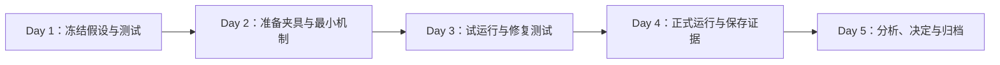

# 一周内完成的验证：用最小充分证据改变产品决定

一周验证是在五个工作日内，围绕一个关键假设设计、执行和复盘一次可改变决定的测试。时间盒限制的是测试范围，不降低证据、伦理、安全和数据质量要求。若问题需要长期留存、统计因果、监管审批或大规模可靠性证据，一周只能完成其中一个前置验证，不能声称最终结论已经成立。

## 前置知识与能力边界

- [最关键且最不确定的假设](03-critical-assumption.md)；
- [比较方案价值、成本与风险](02-compare-solutions.md)；
- [成功指标与护栏指标](../03-requirements-prioritization/04-success-guardrail-metrics.md)；
- [范围与非目标](../03-requirements-prioritization/05-scope-non-goals.md)。

本文假定已经有明确问题、候选方案、首要假设和负责人。一周验证不用于从零完成整个 Discovery，也不替代生产发布评审。

## 1. 一周验证的输出

五天结束时应得到：

```yaml
validation_result:
  assumption: "版本化的可证伪陈述"
  method: "实际执行的方法与环境"
  dataset: "样本、来源、排除与版本"
  observations: "原始计数、行为和失败"
  thresholds: "运行前确定的门槛"
  validity: "valid | limited | invalid"
  decision: "continue | modify | stop | collect-more"
  safeguards: "安全、隐私、权限与恢复结果"
  unresolved: "仍未回答的问题"
  next_owner: "下一动作负责人"
```

只有原型、演示视频或会议结论，不算完成验证。

## 2. 先判断是否适合一周

### 适合

- 检查真实数据是否存在、覆盖和可解析；
- 比较两个流程是否能完成固定任务；
- 运行技术 spike，确定 API、延迟或容量上限；
- 用人工交付验证结果是否有价值；
- 对固定样例比较方案质量；
- 验证高风险错误是否能被发现；
- 运行只读影子测试；
- 检查权限、取消、回滚和异常状态；
- 取得下一步投资所需的区间估计。

### 不适合直接下最终结论

- 长期留存和习惯形成；
- 季节性业务；
- 低频严重事故概率；
- 需要足够样本的 A/B 因果效应；
- 法律、伦理或安全专业审查；
- 大规模迁移后的长期数据质量；
- 新销售渠道的完整采购周期；
- 需要数月运营才能观察的单位经济。

这类问题可以把一周用于验证测量链路、样本可得性、最小机制或暴露风险。

## 3. 一周只能有一个主问题

合格问题：

```text
在 30 个版本化真实文件中，
只读解析与自动映射是否能达到
文件可解析率 ≥ 90% 且关键字段错误为 0，
从而决定是否继续建设自助导入？
```

不合格问题：

```text
用户喜欢导入吗？
产品可行吗？
AI 是否有效？
```

主问题可以有多个指标，但它们共同支持一个决定。

## 4. 时间盒与证据质量



时间不够时依次缩减：

1. 次要假设；
2. 视觉完成度；
3. 自动化程度；
4. 非关键场景；
5. 样本种类，但保留高风险样例；
6. 方案数量。

不能缩减：

- 权限与数据边界；
- 原始证据保存；
- 预先门槛；
- 高风险失败；
- 关键分子和分母；
- 验证是否有效的判断。

## 5. Day 1：冻结问题、假设和决定

### 5.1 写 Test Card

```yaml
test:
  id: "VAL-2026-07-18-01"
  decision: "是否进入可运行自助导入薄片"
  assumption:
    actor: "有迁移任务的团队管理员"
    context: "500–5,000 行支持范围 CSV"
    mechanism: "只读解析与自动列映射"
    expected: "关键字段正确且无需逐客户代码"
  measures:
    parse_rate:
      numerator: "结构可解析文件"
      denominator: "全部有效样本"
    critical_accuracy:
      numerator: "正确关键字段"
      denominator: "全部标注关键字段"
  threshold:
    continue: "parse_rate >= 90% and critical_accuracy = 100%"
    modify: "错误集中于两类可建模格式"
    stop: "需要逐客户代码或关键字段不可恢复"
  non_goals:
    - "不验证生产写入"
    - "不验证长期采用"
```

### 5.2 冻结范围

明确：

- 包含的角色、数据和平台；
- 不包含的异常；
- 样本如何选择；
- 谁能访问原始数据；
- 结果影响什么决定；
- 谁在周五决定；
- 决策者缺席时如何处理。

### 5.3 审查验证伤害

在测试前确认：

- 是否使用真实个人或商业敏感信息；
- 是否需要同意或专业审查；
- 是否会改变用户价格、权限或生产数据；
- 是否可能发送真实消息；
- 是否能撤销；
- 是否有 kill switch；
- 对照或延迟是否会伤害参与者。

高风险验证优先使用合成、去标识、只读、影子或沙箱。

## 6. Day 2：准备最小机制与夹具

### 6.1 验证物只实现必要因果链

| 假设 | 最小验证物 |
|---|---|
| 用户能理解流程 | 可交互原型，包含错误与返回 |
| 数据可解析 | 命令行解析器 + 版本化样本 |
| 结果有价值 | 人工交付真实结果 |
| 模型质量达到门槛 | 固定评估集 + 候选配置 |
| API 可承载 | 技术 spike + 负载夹具 |
| 审核能发现错误 | 盲审界面 + 错误注入 |
| 权限模型正确 | 测试租户 + 角色矩阵 |

不要为了展示完整而实现账户中心、主题、动画和完整后台。

### 6.2 建立样本清单

```yaml
sample:
  id: "csv-salesforce-014"
  family: "salesforce-export-v3"
  source_type: "authorized-deidentified-production"
  rows: 1840
  encoding: "utf-8"
  expected:
    required_columns: ["external_id", "name", "status"]
    critical_mappings: 3
  tags: ["large", "duplicate-id", "quoted-newline"]
```

同一家族的字段替换不能伪装成多个独立样本。按来源、规模、语言、风险和失败类型分层。

### 6.3 准备观察工具

- 任务起止和完成事实；
- 错误类型；
- 原始输入与版本；
- 系统输出；
- 人工修正；
- 请求与响应；
- 安全和权限决定；
- 退出、放弃和无效数据。

不要在周五才发现无法计算分母。

## 7. Day 3：试运行

试运行用于验证测试本身，不用于挑最好结果。

### 检查

1. 固定输入能否重放；
2. 说明是否给参与者额外提示；
3. 指标是否可由原始记录复算；
4. 错误分类是否互斥；
5. 计时是否区分主动时间和等待；
6. 权限和数据隔离是否生效；
7. 失败是否保存而非被重试覆盖；
8. 评分者是否看到方案标识；
9. 门槛是否在结果前冻结；
10. 测试能否真正改变决定。

### 试运行失败

若解析器崩溃、任务说明歧义或埋点缺失，应修复方法并重新开始正式运行。不能把方法故障计入方案失败，也不能悄悄删除。

记录：

```yaml
pilot_change:
  before: "将空文件记为不可解析"
  issue: "空文件属于无效输入，不应进入目标分母"
  after: "先按预设有效性规则分类"
  dataset_version: "sample-set@2"
  threshold_changed: false
```

## 8. Day 4：正式运行

### 8.1 使用冻结版本

保存：

- test card 版本；
- 样本版本；
- 原型或代码 commit；
- 模型、Prompt 和参数；
- 依赖夹具；
- 评分规则；
- 运行时间；
- 失败和重试；
- 实际偏离方案。

### 8.2 保存全部有效结果

不能：

- 失败后无限重试只保留成功；
- 删除“不配合”的参与者；
- 看完结果改标签；
- 只展示最好输出；
- 把超时从分母删除；
- 用人工补答案后仍记自动成功。

### 8.3 对异常做分类

```text
valid_success
valid_failure
invalid_input
method_failure
system_failure
withdrawn_or_cancelled
unknown
```

每类如何进入分母必须在 Day 1 定义。

## 9. Day 5：分析与决定

### 9.1 先验证数据完整

```text
期望运行数 = 实际记录数 + 明确缺失数
```

检查：

- 每个样本是否有结果；
- 是否有重复 ID；
- 排除是否符合预设；
- 失败是否保留；
- 版本是否一致；
- 高风险样例是否完整；
- 分子与分母可否复算。

### 9.2 展示原始计数

不只写：

```text
成功率 86%
```

应写：

```text
24/28 个有效文件可解析；
2 个无效文件按预设规则排除；
其中 3 个文件关键字段映射错误；
支持模板子集为 22/22；
非支持格式为 2/6。
```

### 9.3 按预设规则决定

| 结果 | 动作 |
|---|---|
| 达到 continue 且护栏通过 | 进入下一薄片 |
| 结果集中暴露可修正机制 | 修改后重新测 |
| 关键门槛失败 | 停止当前方案或换机制 |
| 测试本身无效 | 修复测试，不判断方案 |
| 区间仍跨越门槛 | 收集更多直接证据 |

### 9.4 保存反例

最有价值的输出常是：

- 哪类用户完全无法完成；
- 哪个数据格式打破机制；
- 哪个权限变化造成错误；
- 哪条高风险事实遗漏；
- 哪项成本远高于预期。

反例进入回归集和下一轮范围。

## 10. 方法选择

### 10.1 可交互原型

适合：

- 信息架构；
- 术语；
- 流程；
- 影响范围；
- 错误理解；
- 键盘与基本无障碍。

不足：

- 真实延迟；
- 数据质量；
- 服务端授权；
- 并发冲突；
- 长期采用。

原型应包含至少一个失败、返回和无权限路径，不能只演示成功。

### 10.2 Concierge

由人工提供计划中的结果：

- 验证输入是否可获得；
- 验证结果是否有用；
- 发现异常和运营步骤；
- 估算人工总时间。

必须记录人工做了什么，不能把人工能力误认为自动化已可行。

### 10.3 Wizard of Oz

用户操作看似连接系统，后台由人工完成。需要明确伦理、数据和风险边界，不用于不可逆或高责任决策。

### 10.4 技术 spike

适合数据、API、性能、模型和回滚。输出应为可重放代码、夹具、指标和边界，不是“工程师试过可以”。

### 10.5 假入口

可以观察用户是否在目标场景选择入口，但不能单独证明完整价值。入口文案不能欺骗，点击后应说明状态或提供合法替代。

### 10.6 影子运行

对真实流量复制输入但不影响用户结果：

- 检查生产分布；
- 比较建议与实际决定；
- 测延迟和成本；
- 不执行副作用。

仍需授权、隔离、保留和删除策略。

## 11. 案例一：AI 回复草稿审核

### 周一

假设：

```text
一线人员在 90 秒内能阻止所有资格、金额、权限高严重度错误，
正确草稿的中位审核时间低于人工编写基线 4 分钟。
```

门槛：

- 30 个高风险错误漏检为 0；
- 无权信息暴露为 0；
- 正确草稿审核 P50 < 2 分钟；
- 方法无效时不判断模型。

### 周二

建立 60 个版本化工单：

- 20 正确；
- 10 过期规则；
- 10 遗漏例外；
- 8 金额错误；
- 6 权限泄露；
- 6 提示注入。

界面只实现草稿、来源、编辑、拒绝和发送模拟。不会发送真实消息。

### 周三

用 5 个内部领域人员试运行。发现“拒绝草稿”按钮会暴露样例类别，因此改为统一的“完成审核”，重建测试版本。

### 周四

正式盲审。每个任务保存：

- 开始和完成；
- 发现错误；
- 文本修改；
- 来源展开；
- 最终决定；
- 高风险错误类别。

### 周五

结果：

```text
29/30 高风险错误被阻止；
1 个过期金额规则被发送；
正确草稿审核 P50 72 秒；
无权信息暴露 0。
```

尽管效率门槛通过，硬门槛失败。决定：不允许高风险队列使用自由文本草稿；改为结构化事实检查，并把失败样例加入回归集。

## 12. 案例二：CSV 导入解析

### 周一

决定：是否进入自助导入的可运行写入薄片。

主假设：支持范围文件可以统一解析和映射，无需逐客户代码。

### 周二

按来源系统和规模抽取 60 个去标识文件，建立字段金标。实现只读命令行解析器和 HTML 报告。

### 周三

试运行发现 4 个文件是导出失败产生的空文件。根据预设有效性规则标为 invalid input，不进入解析率分母，但单独报告来源失败率。

### 周四

正式运行并由领域人员复核关键字段。所有结果保留 parser version、input hash、映射和错误。

### 周五

结果：

```text
有效文件 56；
可解析 51/56 = 91.1%；
关键字段正确 148/153 = 96.7%；
5 个错误集中在跨时区日期；
无跨租户暴露。
```

解析率达标，关键字段门槛失败，但错误集中在一个可建模类别。决定为 modify：先实现显式时区选择和日期预览，再用同一 56 个文件回归；不进入生产写入。

## 13. 一周验证看板

```yaml
board:
  question: "一个主问题"
  decision_owner: "明确人员"
  day1:
    done: ["test card", "scope", "safeguards"]
  day2:
    done: ["fixtures", "minimal mechanism", "instrumentation"]
  day3:
    done: ["pilot", "method fixes", "version freeze"]
  day4:
    done: ["formal runs", "raw evidence", "failure log"]
  day5:
    done: ["validity", "counts", "decision", "archive"]
  blocked:
    - issue: "专业审查未完成"
      effect: "不能使用真实敏感数据"
      fallback: "使用合成夹具"
```

看板按证据产出，不按页面完成度。

## 14. 常见失败模式

### 14.1 周一还在争论问题

说明前置问题定义未完成。暂停验证，缩小为一个证据缺口，不要边做原型边猜目标。

### 14.2 周二开始造完整产品

回到假设，只保留测试所需因果链。验证代码允许丢弃。

### 14.3 周三试运行结果很好，直接计入正式结果

试运行可能影响方法和门槛。只在协议明确允许、且方法完全未变时合并。

### 14.4 周四只保存成功

失败、超时和取消必须保留；否则结果偏高。

### 14.5 周五才决定门槛

会产生事后合理化。门槛版本应早于正式运行。

### 14.6 用五天证明长期结果

明确结论边界，只决定下一投入。

### 14.7 参与者不足就降低安全门槛

样本不足意味着结论不确定，不表示风险可接受。

### 14.8 没有决定者

验证结果只变成报告。Day 1 明确谁在什么时间依据什么规则决定。

## 15. 调试验证

### 数据缺失

1. 检查样本获取授权；
2. 确认缺失本身是否是重要证据；
3. 使用合成夹具验证机制；
4. 降低结论范围；
5. 不用随手找到的数据代表目标分布。

### 指标算不出来

1. 回到分子、分母、单位；
2. 检查事件与权威结果关联；
3. 增加离线对账；
4. 试运行直到可复算；
5. 不用主观观察替代缺失指标。

### 结果分歧大

按角色、数据、平台和风险类型切片；检查任务说明、学习效应和评分一致性。保留分歧，不只报平均。

### 方法影响结果

记录引导、工具、等待和人工补充。若验证物不代表候选机制，只能回答更窄问题。

## 16. 归档与持续迭代

目录建议：

```text
experiments/
  VAL-2026-07-18-01/
    README.md
    test-card.yaml
    dataset-manifest.json
    protocol.md
    results/
    decision.md
```

不要提交未授权原始敏感数据。仓库只保留去标识夹具、hash、统计和合法证据位置。

下一轮引用：

- 上一假设版本；
- 失败样例；
- 修改机制；
- 新门槛；
- 仍未回答的问题。

## 17. 练习

为一个计划功能设计五天验证：

1. 只选一个 K3/K4 且 U3/U4 假设；
2. 写 Test Card 和四类决定；
3. 判断一周能回答什么、不能回答什么；
4. 设计最低伤害的验证物；
5. 建立至少 12 个正常、边界、失败样例；
6. 定义试运行与正式运行分界；
7. 保存全部有效结果；
8. 用原始计数复算指标；
9. 输出 continue/modify/stop/collect-more；
10. 归档证据和下一负责人。

验收时，任何人都应能用相同版本重放测试并理解决定边界。

## 来源

- [GOV.UK Service Manual：How the alpha phase works](https://www.gov.uk/service-manual/agile-delivery/how-the-alpha-phase-works)（访问日期：2026-07-18）
- [GOV.UK Service Manual：Making prototypes](https://www.gov.uk/service-manual/design/making-prototypes)（访问日期：2026-07-18）
- [GOV.UK Service Manual：What happens at a service assessment](https://www.gov.uk/service-manual/service-assessments/how-service-assessments-work)（访问日期：2026-07-18）
- [Strategyzer：Validate Your Ideas with the Test Card](https://www.strategyzer.com/library/validate-your-ideas-with-the-test-card)（访问日期：2026-07-18）

