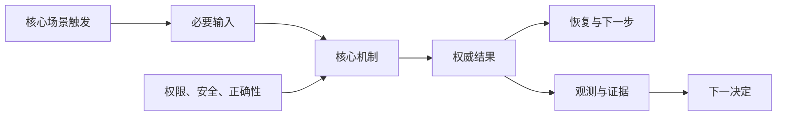
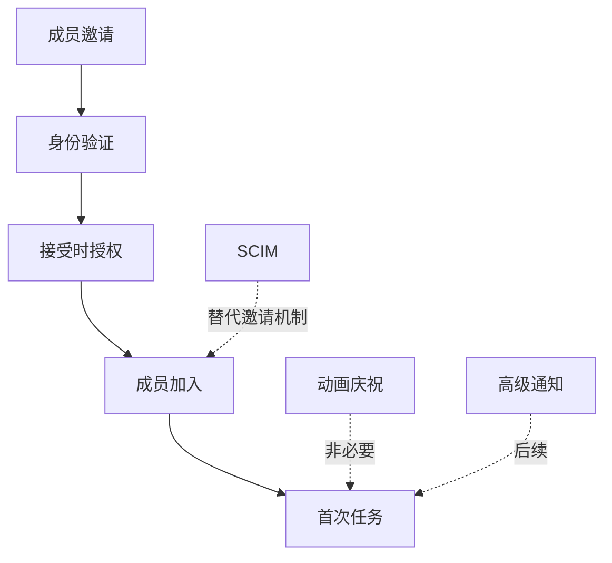

# 删除与核心价值无关的功能：用价值链和风险约束收缩 MVP

删除非核心功能，是从首个版本移除不能直接形成核心用户结果、不能控制必要风险、也不能产生下一决定所需证据的能力。删除包括完全不做、延后、改用人工、复用平台能力、用内容解决或缩小到只读，不等于简单隐藏入口。

## 前置知识与能力边界

- [MVP 的核心用户与核心场景](05-mvp-user-scenario.md)；
- [范围与非目标](../03-requirements-prioritization/05-scope-non-goals.md)；
- [依赖识别](../03-requirements-prioritization/06-dependencies.md)；
- [识别最大产品风险](../03-requirements-prioritization/09-largest-product-risk.md)。

安全、隐私、授权、账务、基本无障碍、错误恢复和可观测性不因“用户看不见”而成为非核心。它们是提供核心价值的必要约束。

## 1. 核心功能的三个来源

一个功能只有在至少满足一项时才进入首版：

1. 直接完成核心结果；
2. 使核心结果在合理失败下仍安全可用；
3. 产生验证关键假设所需的证据。



无法连接到这张图的功能，应被质疑。

## 2. 功能清单必须写成能力

不要审计“页面”和“模块名”，应审计用户或系统能力：

| 模糊功能名 | 可判断的能力 |
|---|---|
| 仪表盘 | 查看当前批次结果、失败数和可恢复操作 |
| 消息中心 | 在异步任务完成后取得结果入口 |
| 用户中心 | 查看当前身份和退出登录 |
| AI 助手 | 从批准文档生成带证据的回复草稿 |
| 高级设置 | 决定解析时区和重复键处理 |

页面可能包含核心和非核心能力；核心能力也可能跨多个页面。

## 3. 功能审计字段

```yaml
capability:
  id: "import.preview"
  statement: "提交前查看将创建、更新、跳过和失败的逐项结果"
  core_link:
    result: "正确、可审计、可撤销的资产导入"
    mechanism: "在写入前暴露影响范围和关键错误"
  required_for:
    - "数据正确性"
    - "用户确认"
  evidence:
    - "30 个文件中 6 个存在严重映射错误"
  cost:
    build: "medium"
    operate: "low"
  risk_if_removed: "错误写入直到提交后才发现"
  decision: "must"
```

每个功能都要有 `must / simplify / defer / replace / remove` 决定。

## 4. 判定问题

按顺序询问：

1. 删除后，核心用户还能达到完整结果吗；
2. 删除后，会不会违反硬约束；
3. 删除后，最常见失败能否恢复；
4. 删除后，关键假设是否仍能被验证；
5. 是否已有浏览器、操作系统、平台或人工路径；
6. 是否只提升少量用户的便利；
7. 是否因组织边界或技术偏好进入；
8. 是否为了未来可能需求提前抽象；
9. 是否引入新的数据、权限和运维责任；
10. 延后会不会比现在做更昂贵或不可逆。

## 5. 五类决定

### Must

没有它，结果不成立或不可安全交付：

- 真实授权；
- 核心处理；
- 权威结果；
- 必要校验；
- 错误和恢复；
- 最低可访问性；
- 关键监测；
- 数据删除或撤销。

### Simplify

保留机制，缩小形态：

- 只支持一种文件格式；
- 只提供手动激活 Tabs；
- 只做一个角色模板；
- 只允许人工确认后执行；
- 只提供 CSV 导出，不做自定义报表。

### Defer

价值真实，但不是首个闭环必要：

- 高级筛选；
- 多语言扩展；
- 批量模板管理；
- 自动化规则；
- 个性化布局。

需要重开条件，不写“以后再说”。

### Replace

使用现有能力：

- 原生文件选择器；
- 浏览器打印；
- 现有身份系统；
- 人工运营；
- 帮助文档；
- 已批准第三方服务；
- 通用导出。

替代仍需测试是否满足核心条件。

### Remove

没有足够价值、风险过高或机会成本不合理。记录原因，避免下轮重新争论。

## 6. 不能删除的“非功能”

### 授权

前端隐藏按钮不构成授权。服务端按主体、对象和动作检查。

### 错误状态

请求会失败、权限会变化、对象会冲突。没有错误恢复，核心路径只存在于演示。

### 无障碍

键盘、可访问名称、焦点和缩放是使用能力，不是装饰。

### 可观测性

没有任务结果、失败类型和护栏，无法判断 MVP 是否成立。

### 数据生命周期

收集、保留、导出和删除属于产品责任。不能先收集再补边界。

## 7. 反向规划

从完成事实倒推：

```text
完成事实：资产正确写入并可撤销
← 需要批次版本和撤销记录
← 需要幂等写入和逐项结果
← 需要 dry run 与用户确认
← 需要解析、映射和权限
← 需要文件和目标工作区
```

每一步必须能证明下一步。反向规划比从功能清单删项目更可靠。

## 8. 删除依赖链

删除功能要同时删除：

- 路由和入口；
- API 和 DTO；
- 数据字段；
-权限；
- 缓存；
- 埋点；
- 文档；
- 测试；
- 运营流程；
- 第三方合同；
- 迁移和兼容。

只隐藏 UI 会保留攻击面和维护成本。

## 9. 按价值密度切片

### 垂直切片

包含输入、处理、结果和恢复的一个场景。

### 水平切片

只完成 UI、API 或数据库层。不能独立提供价值。

优先垂直切片：

```text
支持 UTF-8 CSV 的完整导入
```

而不是：

```text
先做所有格式上传 UI，解析以后再说
```

## 10. 案例一：知识库问答 MVP

### 初始清单

- 自由问答；
- 多轮对话；
- 对话历史；
- 收藏；
- 分享；
- 多知识库；
- 文档上传；
- 自动抓取网页；
- Agent 工具执行；
- 个性化语气；
- 管理仪表盘；
- 反馈；
- 引用；
- 权限；
- 无答案；
- 评估与监控。

### 核心结果

内部支持人员从批准文档取得当前、可核对的产品步骤，或安全进入无答案。

### Must

- 固定批准知识库；
- 检索与来源版本；
- 引用；
- 无答案；
- 权限过滤；
- 固定评估集；
- 反馈结果类别；
- 请求失败与超时；
- 日志脱敏。

### Simplify

- 单轮问题；
- 一种语言；
- 只读；
- 不上传；
- 一个知识域；
- 只允许人工复制，不自动发送。

### Defer

- 多轮记忆；
- 个性化；
- 收藏；
- 自定义知识库；
- 自动执行；
- 高级仪表盘。

### 删除后的风险检查

去掉多轮不会破坏单轮任务；去掉引用会破坏核对和可信边界，因此引用不是装饰。

### 最小界面

1. 问题输入；
2. 回答或无答案；
3. 可打开引用；
4. 结果反馈；
5. 失败和重试；
6. 权限状态。

不需要角色头像、打字动画或对话侧栏。

## 11. 案例二：团队首次配置

### 初始清单

- 行业模板；
- 自定义模板；
- 成员邀请；
- SCIM；
- SSO；
- 权限预览；
- 数据源连接；
- 自动同步；
- 通知偏好；
- 教学视频；
- 任务清单；
- 进度庆祝；
- 支持聊天；
- 审计；
- 试用升级。

### 核心用户

20–200 人团队管理员，使用标准成员邀请和一个支持的数据源。

### Must

- 工作区身份；
- 成员邀请与接受；
- 一个安全角色模板；
- 权限预览；
- 一个数据源连接；
- 连接错误和重新认证；
- 首次任务完成；
- 管理员权限变化；
- 结果和支持入口。

### Replace

- 自定义培训改为文档；
- 实时聊天改为工单；
- 进度庆祝改为清晰完成状态；
- 自建身份改用已有认证。

### Defer

- SCIM；
- SSO；
- 自定义角色；
- 多数据源；
- 自动同步；
- 高级通知。

### 边界

大型企业需要 SSO 时不能进入核心流程后失败。入口明确范围并提供企业实施路径。

## 12. 功能依赖图



如果删除某节点使核心链断裂，就不是非核心；虚线增强或替代路径可延后。

## 13. 用异常检查删减

对每次删减注入：

- 网络中断；
- 权限撤销；
- 重复提交；
- 结果未知；
- 对象删除；
- 长文本；
- 窄屏；
- 键盘；
- 会话过期；
- 依赖不可用。

若删减导致没有合法恢复，需恢复最小机制。

## 14. 成本变化

删除功能的收益包括：

- 少一套 API；
- 少一种数据；
- 少一组权限；
- 少一种状态组合；
- 少一个第三方依赖；
- 少一条客服路径；
- 少一组迁移；
- 更小评估集；
- 更明确指标。

计算净变化：

```text
净节省 =
建设减少
+ 持续维护减少
+ 组合复杂度减少
- 替代方案成本
- 迁移和删除成本
```

人工替代不是零成本。

## 15. 删除后的指标

监控：

- 核心完成率；
- 被排除用户数量；
- 替代路径完成；
- 支持量；
- 功能请求；
- 错误和放弃；
- 手工操作成本；
- 护栏。

“有人请求”不自动证明要恢复功能。分析频率、强度、替代和机会成本。

## 16. 重开条件

```yaml
deferred:
  capability: "SCIM"
  reason: "首版核心用户规模不需要自动同步"
  evidence: "目标样本中 8% 有 SCIM 要求"
  alternative: "批量邀请"
  reopen_when:
    - "符合条件账户占比 >= 25%"
    - "成员维护超过管理员每周 2 小时"
    - "批量邀请错误率超过 2%"
  owner: "workspace-product"
```

没有重开条件，延后会变成隐形承诺。

## 17. 删除上线能力

已上线功能删除需要：

1. 读取调用与用户依赖；
2. 确认数据导出；
3. 公告和替代；
4. 停止新建；
5. 迁移现有对象；
6. 删除入口和服务端能力；
7. 回收权限和令牌；
8. 删除或保留数据；
9. 更新文档和 SDK；
10. 监控旧请求和支持。

Feature flag 关闭不是退役完成。

## 18. 常见失败模式

### 按开发成本删除

昂贵功能可能是价值核心；便宜功能也可能增加状态和认知。

### 把失败状态删掉

这只是把复杂度转移给用户和支持。

### 只保留管理者想看的功能

回到核心用户结果和证据。

### 为未来抽象

首版只有一个真实场景时，不建立万能配置平台。

### 用人工隐藏成本

记录每任务人工时间、错误和容量。

### 删除后仍保留 API

维护和安全成本没有消失。

### 非目标写得模糊

写清范围、替代和重开触发。

## 19. 调试范围膨胀

每次新增功能问：

```text
它连接核心链哪个节点？
没有它哪项完成事实失败？
它控制什么硬风险？
它验证哪个关键假设？
为什么现有能力不能替代？
本轮不做的可观察后果是什么？
```

无法回答则进入候选队列，不进入当前实现。

## 20. 评审输出

```yaml
mvp_scope:
  core_result: "支持人员取得有证据的当前步骤或安全无答案"
  must:
    - "approved corpus"
    - "retrieval"
    - "citations"
    - "no-answer"
    - "permission"
    - "evaluation"
  simplify:
    - "single-turn"
    - "one-language"
  defer:
    - "conversation-memory"
    - "custom-corpus"
  remove:
    - "avatar-animation"
  replace:
    - "analytics-dashboard -> versioned evaluation report"
  gates:
    - "unauthorized exposure = 0"
    - "high-risk unsupported claim = 0"
```

## 21. 练习

1. 写核心用户、场景和完成事实；
2. 列出所有候选能力；
3. 将每项连接到价值链；
4. 标记 must/simplify/defer/replace/remove；
5. 注入权限、失败、取消和未知；
6. 检查删除后是否仍完整；
7. 计算生命周期净节省；
8. 为延后项写重开条件；
9. 删除对应 API、数据和运营依赖；
10. 输出范围卡和依赖图。

## 来源

- [GOV.UK Service Manual：How to apply the Service Standard](https://www.gov.uk/service-manual/service-assessments/how-to-apply-the-service-standard)（访问日期：2026-07-18）
- [GOV.UK Service Manual：How the alpha phase works](https://www.gov.uk/service-manual/agile-delivery/how-the-alpha-phase-works)（访问日期：2026-07-18）
- [GOV.UK Service Manual：Making prototypes](https://www.gov.uk/service-manual/design/making-prototypes)（访问日期：2026-07-18）
- [GOV.UK Service Manual：Map and understand a user's whole problem](https://www.gov.uk/service-manual/design/map-a-users-whole-problem)（访问日期：2026-07-18）

