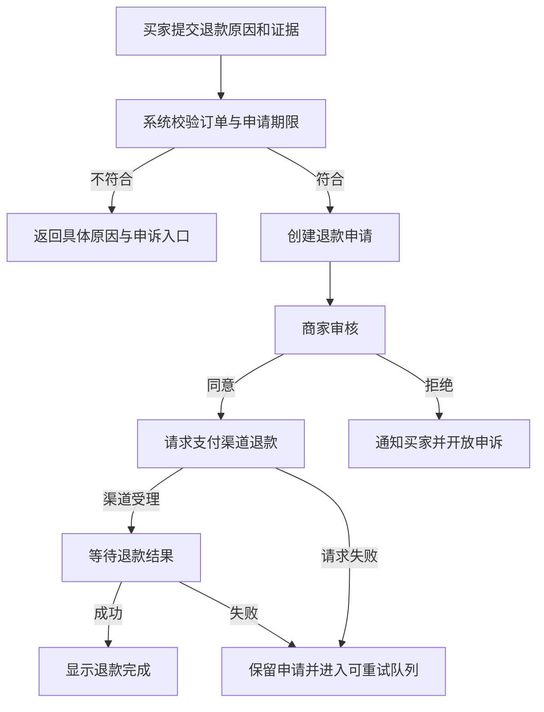
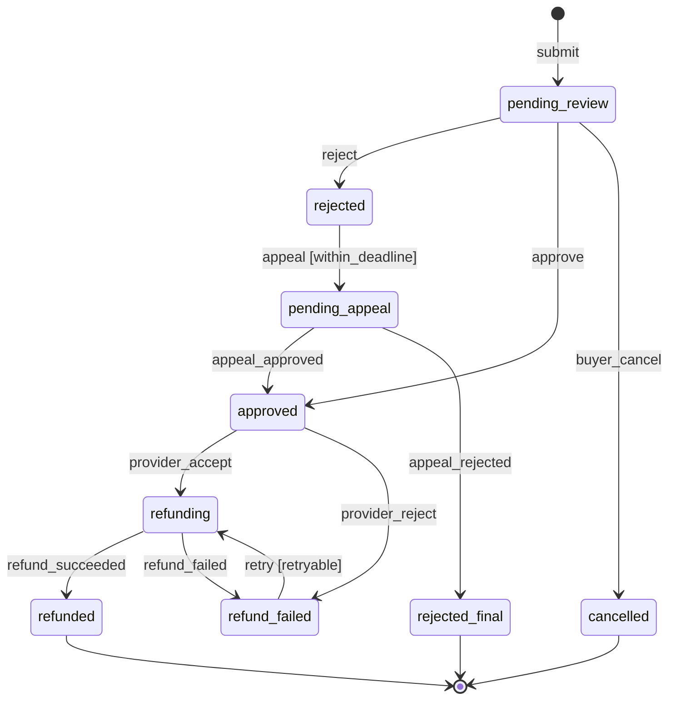
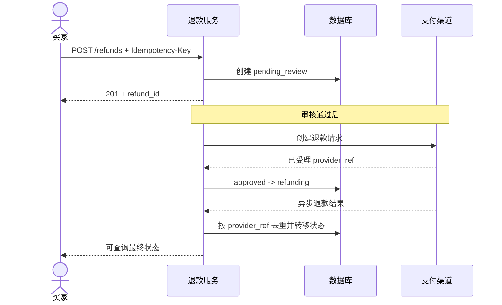
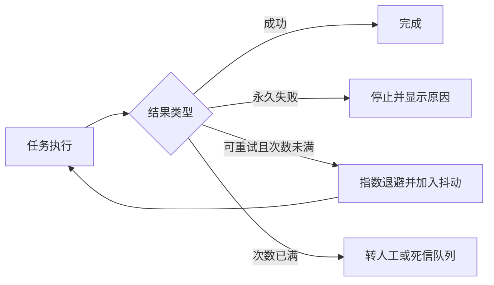

# 使用图表示流程与状态

流程图描述一次任务如何向前执行，状态图描述一个对象在整个生命周期中允许处于什么条件。两种图都包含节点和连线，但建模对象、问题和验收方式不同。

- 流程图回答：参与者下一步做什么，在哪个条件下分支，失败后回到哪里。
- 状态图回答：对象当前是什么状态，什么事件能改变它，转移必须满足什么条件。
- 时序图回答：多个参与者或系统按什么顺序交换消息。

一张图只承担一个主要问题。把页面、动作、对象状态、接口调用和数据库字段全部放进同一张图，会得到连线很多但无法实现和测试的“大图”。

## 一、先识别要建模的对象

### 1. 任务流程

任务流程以目标为起点，以可观察结果为终点。节点通常是：

- 人的动作；
- 系统动作；
- 业务判断；
- 等待外部结果；
- 失败恢复；
- 结束结果。

例如退款任务：



该图说明“发生什么”，但不能单独回答退款申请现在是否合法、哪些状态允许取消或重复回调如何处理。

### 2. 领域对象状态

状态是对象在一段时间内保持的业务条件，不是页面名称，也不是正在执行的函数。

退款申请可以有：



状态图的每条边应能转成一条业务规则，而不是只起到视觉装饰作用。

### 3. 系统交互时序

退款涉及产品服务、支付渠道和异步回调时，用时序图展开：



这张图说明消息顺序和同步、异步边界，但对象允许的全部转移仍以状态规则为准。

## 二、流程图的基本元素

### 1. 起点和终点

起点必须是可观察触发，例如“用户提交申请”“定时任务到期”“收到支付回调”。“进入系统”没有说明是谁、为何进入。

终点需要区分业务结果：

- 成功完成；
- 主动取消；
- 不符合条件；
- 可恢复失败；
- 不可恢复失败；
- 转人工处理；
- 超时结束。

只有一个“结束”节点会丢失结果差异，也无法设计后续通知和指标。

### 2. 动作

动作使用“主体 + 动词 + 对象”：

- 管理员确认导入；
- 系统校验文件；
- 审批人拒绝申请；
- 调度器重新执行任务。

“处理数据”“检查一下”“进行审核”没有明确输入和输出。系统动作还应在相邻规格中说明原子性：失败时是全部不写、部分写入，还是保留中间结果。

### 3. 判断

判断节点必须是能够得到确定答案的条件：

```text
申请是否仍在退款期限内？
当前角色是否具有 refund:approve 权限？
回调事件 ID 是否已经处理？
失败码是否允许自动重试？
```

每条出边应：

- 标签互斥；
- 覆盖所有可能结果；
- 包含未知或数据缺失；
- 指向具体动作或结果。

“是/否”只有在问题文字完整时才有意义。对于多值条件，应直接标记“可重试错误 / 永久错误 / 未知错误”，避免读图者不断返回判断节点寻找语义。

### 4. 泳道

多个参与者共同完成任务时，用泳道明确责任：

| 泳道 | 负责的动作 | 不应承担的动作 |
| --- | --- | --- |
| 买家 | 提交、补充、撤销、申诉 | 决定支付渠道真实结果 |
| 产品系统 | 校验、授权、保存、通知 | 伪造支付成功 |
| 商家审核人 | 依据规则批准或拒绝 | 绕过退款期限和权限 |
| 支付渠道 | 接受请求并返回资金结果 | 改写产品内审核原因 |
| 支持人员 | 处理例外和申诉 | 直接修改账务结果 |

当一条线跨越泳道时，需检查交接载荷、责任和超时。

### 5. 等待

等待不是空白。应记录：

- 等待什么事件；
- 最长等待多久；
- 期间对象处于什么状态；
- 用户能否取消或离开；
- 超时后怎样处理；
- 重复事件怎样去重。

异步流程漏画等待节点，常导致界面把“已提交”显示成“已完成”。

### 6. 循环

循环需要退出条件和次数边界：



“失败后重试”如果没有次数、间隔、幂等和停止条件，就不是完整规则。

## 三、状态机的基本元素

### 1. 状态

一个有效状态应满足：

- 对象可以在其中停留；
- 进入后有确定的允许操作；
- 可以从持久数据或确定规则恢复；
- 对监控、通知或权限有业务意义。

`clicking_submit`、`calling_api` 通常是短暂动作，不适合作为领域状态。`pending_review`、`refunding`、`refunded` 能决定后续行为，属于领域状态。

### 2. 事件

事件是已经发生的事实：

- `refund_submitted`
- `review_approved`
- `provider_accepted`
- `provider_reported_failure`
- `appeal_deadline_reached`

命令表达意图，如 `approve_refund`；事件表达结果，如 `refund_approved`。如果授权或业务条件不成立，命令可能被拒绝，不应产生成功事件。

### 3. 转移

一条状态转移至少包含：

```text
当前状态 + 触发事件 + 守卫条件 -> 新状态 + 副作用
```

可以写成规则表：

| 当前状态 | 事件 | 守卫条件 | 新状态 | 原子写入 | 后续副作用 |
| --- | --- | --- | --- | --- | --- |
| pending_review | approve | 有审核权限且金额未超限 | approved | 状态、审核人、时间、版本号 | 请求支付渠道 |
| pending_review | reject | 有审核权限且原因非空 | rejected | 状态、原因、版本号 | 通知买家 |
| refunding | provider_success | 回调关联匹配且未处理 | refunded | 状态、渠道流水、事件去重键 | 更新订单与通知 |
| refund_failed | retry | 错误可重试且次数未满 | refunding | 次数、下次执行时间 | 加入任务队列 |

图提供整体结构，规则表保存图中不适合承载的详细条件。

### 4. 守卫条件

守卫条件决定事件是否可以触发转移，例如：

- `amount <= reviewer_limit`
- `current_version == expected_version`
- `now <= appeal_deadline`
- `error_code in retryable_codes`

守卫失败后的行为必须确定：返回冲突、提示刷新、进入人工审核还是静默忽略。不能只写“条件不满足则不转移”，否则调用方无法恢复。

### 5. 初始、终止和吸收状态

- 初始状态说明对象创建时首先进入哪里。
- 终止状态说明生命周期完成，通常不再接受业务转移。
- 吸收状态是进入后只能保持自身的状态。

“已完成”不一定永远终止。例如结算完成后可能发生冲正。如果业务允许冲正，就应画出新事件和后续状态，而不是依赖管理员直接改库。

### 6. 复合与并行状态

当一个对象同时拥有相互独立的状态维度，不要强行组合成大量枚举：

```text
delivery_status: pending | shipped | delivered
payment_status: unpaid | authorized | captured | refunded
```

组合成 `shipped_and_authorized`、`shipped_and_captured` 会产生笛卡尔积。两个维度若有约束，用不变量连接，例如“发货前必须至少完成支付授权”。

只有当子状态共享清晰生命周期时才使用层级状态。过度嵌套会让团队无法判断实际活跃状态。

## 四、从流程中抽取状态机

按以下步骤转换：

1. 圈出流程中需要跨请求、跨设备或跨时间保存的对象。
2. 找出会改变允许操作的稳定条件。
3. 将动作改写为事件。
4. 为每条事件标注合法来源状态。
5. 写出守卫、目标状态和失败行为。
6. 添加重复、乱序、超时、撤销和人工修复事件。
7. 用规则表覆盖图中每条边。

例如“审核后调用支付并等待回调”可抽取为：

```text
pending_review --approve--> approved
approved --provider_accept--> refunding
approved --provider_reject--> refund_failed
refunding --provider_success--> refunded
refunding --provider_failure--> refund_failed
```

`approved` 不能省略。如果调用支付前进程崩溃，系统需要知道审核已经成功但渠道请求尚未确认，从而安全恢复。

## 五、并发、重复和乱序

### 1. 乐观并发

两个审核人可能同时操作。命令应携带读取时的版本：

```json
{
  "refundId": "rf_42",
  "command": "approve",
  "expectedVersion": 7
}
```

数据库更新条件为 `id = rf_42 AND version = 7 AND state = pending_review`。影响行数为 0 时返回冲突，并提供最新状态。不能让后写入者无声覆盖前一个决定。

### 2. 幂等

网络超时后客户端无法知道第一次提交是否成功。对业务写操作，应使用业务唯一键或幂等键关联第一次结果。

幂等不代表每次响应字节完全相同，而是重复相同意图不会产生额外业务效果。退款请求不能因重复点击创建两次退款。

### 3. 重复回调

外部系统可能重复发送同一事件。保存：

- 渠道事件 ID；
- 关联对象；
- 载荷摘要；
- 首次处理时间；
- 处理结果。

去重记录和状态转移应在同一事务边界内，避免“状态已改但去重记录没写”。

### 4. 乱序回调

若成功事件先于“受理”事件到达，不能把 `refunded` 倒退为 `refunding`。处理方式可以是：

- 根据事件版本拒绝旧事件；
- 只允许单调状态转移；
- 暂存缺少前置事件的消息；
- 向来源系统查询权威状态。

选择取决于外部协议是否提供序号、查询接口和最终一致性保证。

## 六、图与产品界面如何对应

领域状态不应直接一对一映射为页面。一个页面可以展示多个对象状态，同一对象状态也可能在列表、详情和通知中出现。

建立表现映射表：

| 领域状态 | 用户可见文案 | 允许操作 | 禁止操作 | 恢复入口 |
| --- | --- | --- | --- | --- |
| pending_review | 等待商家审核 | 撤销、补充材料 | 重复提交 | 查看预计时间 |
| approved | 审核通过，正在提交退款 | 查看详情 | 再次审核 | 联系支持 |
| refunding | 退款处理中 | 查看进度 | 再次发起退款 | 超时后查询 |
| refund_failed | 退款未完成 | 按原因重试或联系支持 | 假装成功 | 重试/支持 |
| refunded | 退款完成 | 查看流水 | 修改金额 | 申诉入口 |

前端的 `loading`、`disabled`、`dialogOpen` 是交互状态；服务端退款状态是领域事实。两者应分离，避免关闭弹窗就丢失正在处理的业务任务。

## 七、图怎样进入实现和测试

### 1. 生成状态转移测试

每条边至少有：

- 合法来源状态成功转移；
- 非法来源状态拒绝；
- 守卫成立；
- 守卫不成立；
- 重复事件；
- 并发版本冲突。

每个状态还需检查允许命令集合。只测试“快乐路径”无法证明状态机封闭。

### 2. 检查不可达状态和死路

- 是否存在从初始状态永远到不了的状态？
- 是否存在非终止状态没有任何出边？
- 是否存在只有失败才能进入、却没有恢复路径的状态？
- 是否存在可以绕过授权或审核的捷径？
- 是否存在无限循环且没有次数、时间或人工退出？

### 3. 对齐接口

状态转移接口应表达意图，而不是允许调用方任意设置状态：

```text
POST /refunds/{id}/approve
POST /refunds/{id}/reject
POST /refunds/{id}/cancel
```

比下面的接口更安全：

```text
PATCH /refunds/{id} { "status": "refunded" }
```

后者把状态机规则泄露给客户端，也允许绕过支付结果。

### 4. 对齐事件与监控

监控至少覆盖：

- 各状态当前数量与停留时间；
- 每条转移的成功、拒绝和冲突数量；
- 超过服务时限的对象；
- 重试次数和永久失败原因；
- 重复与乱序事件；
- 人工修复次数。

停留时间应从进入状态的可靠时间戳计算，而不是依赖页面打开时间。

## 八、版本演进

状态机上线后仍会变化。新增状态时要处理：

1. 旧记录如何映射；
2. 新旧服务版本并存时接受哪些状态；
3. 进行中的工作流是否迁移；
4. 回滚代码能否读取新状态；
5. 数据仓库和看板是否认识新枚举；
6. 客服工具能否解释新状态；
7. 外部 API 是否暴露稳定兼容值。

删除状态不等于删除枚举值。数据库、历史事件和外部消费者可能长期保存旧值。可以停止产生旧状态，但读取路径仍需定义兼容行为。

## 九、常见错误

### 把页面当状态

错误：`list_page -> detail_page -> success_page`。

页面变化不能说明对象是否合法或是否完成。应分别画用户导航和领域对象状态。

### 把动作当状态

错误：`clicking -> validating -> calling_api`。

这些是瞬时执行步骤。只有需要持久恢复或决定允许操作时，才提升为业务状态，例如 `awaiting_provider_result`。

### 只画成功路径

网络失败、权限变化、对象被删除、重复提交、超时和取消都是流程的一部分。缺失并不意味着实现不会遇到。

### 用线条代替规则

一条 `pending -> completed` 的线没有触发事件、守卫与副作用，无法形成接口和测试。

### 让图成为过期副本

状态枚举改动时应在同一个变更中更新图、规则表、测试和事件字典。图若无法与代码共同评审，很快会失去可信度。

## 十、评审清单

### 流程图

- [ ] 起点是具体触发，终点区分不同业务结果。
- [ ] 动作写明主体、动词和对象。
- [ ] 判断分支互斥、完备，并处理未知数据。
- [ ] 跨参与者交接标明载荷、责任和超时。
- [ ] 等待、重试、取消和人工恢复已经画出。
- [ ] 循环有次数、时间或业务退出条件。

### 状态图

- [ ] 状态是可停留、可恢复、影响允许行为的条件。
- [ ] 命令和事件没有混用。
- [ ] 每条转移有来源、事件、守卫、目标和失败行为。
- [ ] 初始、终止、并行和层级关系明确。
- [ ] 重复、并发、乱序和过期事件有规则。
- [ ] 不存在未解释的不可达状态或非终止死路。

### 落地

- [ ] 图中每条边能追溯到需求、接口或验收测试。
- [ ] 界面文案与操作由领域状态映射，而非直接等同。
- [ ] 监控可以发现长时间停留和非法转移。
- [ ] 状态新增、删除和回滚有数据兼容方案。
- [ ] Mermaid 图在 Obsidian 和 GitHub 中能够正常渲染。

## 来源

- [Object Management Group：Unified Modeling Language 2.5.1](https://www.omg.org/spec/UML)（访问日期：2026-07-18）
- [W3C：State Chart XML 1.0](https://www.w3.org/TR/scxml/)（访问日期：2026-07-18）
- [Mermaid：Flowcharts Syntax](https://mermaid.js.org/syntax/flowchart.html)（访问日期：2026-07-18）
- [Mermaid：State diagrams](https://mermaid.js.org/syntax/stateDiagram.html)（访问日期：2026-07-18）
- [IETF RFC 9110：HTTP Semantics](https://www.rfc-editor.org/rfc/rfc9110.html)（访问日期：2026-07-18）
