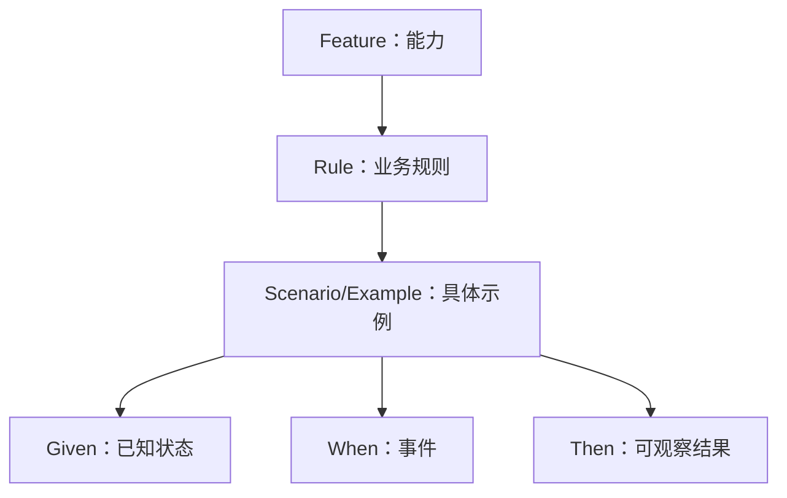

# Given/When/Then 验收条件：用具体示例描述业务规则

Given/When/Then 把一个业务规则放进具体上下文：Given 建立已知前置，When 描述一个关键事件，Then 断言对用户或外部系统可观察的结果。它可以作为讨论格式，也可以写成 Gherkin 并由 Cucumber 执行。

## 一、Gherkin 的结构层级



`Feature` 聚合一个能力；`Rule` 表达一条需要实现的业务规则；`Scenario` 与 `Example` 是同义关键词；每个场景用一组步骤说明具体例子。Feature 和 Rule 下的描述可提供背景，但 Cucumber 不把自由文本自动变成断言。

一个 `.feature` 文件只能有一个 Feature。Rule 从 Gherkin 6 起用于归组同一规则的示例。场景推荐保持少量关键步骤；步骤过多通常表示包含多个事件、界面操作细节或多个规则。

## 二、Given 的职责

Given 把系统置于已知状态，描述事件发生前已经成立的事实。它可以建立主体、资源关系、余额、时间或配置。

好的 Given：`Given 工作区 A 已启用仅允许 example.com 域的邀请策略`。坏的 Given：`Given 用户点击设置并勾选域限制`，后者把产生状态的界面过程写进前置。

Given 必须足以解释结果，但不应塞入与规则无关的环境搭建。数据库清理、浏览器启动和 mock server 属于 hooks 或测试基础设施。

多个场景共享的偶然前置可以放进 Background。一个 Feature 或 Rule 只能有一个 Background；不同场景需要不同前置时，应拆 Rule 或显式写 Given，不能用条件 hook 隐藏业务差异。

## 三、When 的职责

When 是触发规则求值的一个事件，可以由人、时钟或外部系统发起。一个场景通常只有一个核心 When，因为多个连续事件会让失败位置与业务意图模糊。

`When 管理员提交包含 3 个地址的邀请批次` 描述领域事件；`When 点击 id 为 submit 的按钮` 绑定 DOM 实现。只有专门验证 UI 控件时才需要后者。

并发场景可以把“另一编辑者已经保存 version 8”放在 Given，把当前编辑者提交 version 7 放在 When。不要用两个 When 叙述完整历史。

## 四、Then 的职责

Then 断言系统向主体或外部系统产生的可观察结果：页面消息、返回状态、下载文件、发送事件或余额。Cucumber 官方建议避免把数据库内部行作为唯一结果，因为它不是用户可见输出。

Then 应包含确定值或关系。`Then 优惠总额为 30 元` 可验证；`Then 系统正确计算优惠` 不可验证。

一个结果有多个观察面时可用 And：返回稳定错误码、没有创建付款、审计事件产生。不要把实现过程写成 Then，例如“调用 DiscountService 两次”。

## 五、And、But 与步骤匹配

And 和 But 继承前一个主关键词的语义，用于增加前置或结果。它们提高可读性，不产生新的执行阶段。

Cucumber 匹配步骤文本时不考虑 Given/When/Then 关键词，因此 `Given 账户余额为 100 元` 和 `Then 账户余额为 100 元` 会被视为重复文本。应使用不同领域语言：`Given 账户初始余额为 100 元`、`Then 账户可用余额应为 100 元`。

## 六、Scenario Outline、Data Table 与 Doc String

Scenario Outline 用 `<参数>` 和 Examples 表重复执行同一规则结构。只有当每一行遵循同一规则和步骤时才使用；不同错误恢复路径应拆成独立 Scenario。

```gherkin
Scenario Outline: 按会员等级限制折扣
  Given 订单原价为 <amount> 元
  And 当前会员等级为 <level>
  When 用户应用会员折扣
  Then 应付金额为 <payable> 元

  Examples:
    | amount | level | payable |
    | 100    | basic | 95      |
    | 100    | plus  | 90      |
```

Data Table 作为一个步骤的结构化参数，适合字段集合；Doc String 适合消息正文或 JSON 示例。它们传递数据，不自动定义业务断言。

## 七、案例一：优惠券叠加

业务规则：会员折扣与满减券可以叠加，两个优惠都基于商品小计；优惠总额不能超过商品小计；运费不参与折扣。

```gherkin
Feature: 订单优惠

  Rule: 会员折扣可以与一张满减券叠加

    Scenario: Plus 会员使用满 200 减 30 券
      Given 商品小计为 240 元
      And 运费为 12 元
      And 当前用户是享受 10% 折扣的 Plus 会员
      And 优惠券规则为商品满 200 元减 30 元
      When 用户确认使用该优惠券
      Then 会员优惠应为 24 元
      And 优惠券优惠应为 30 元
      And 应付金额应为 198 元

    Scenario: 商品小计未达到券门槛
      Given 商品小计为 180 元
      And 当前用户是享受 10% 折扣的 Plus 会员
      And 优惠券规则为商品满 200 元减 30 元
      When 用户确认使用该优惠券
      Then 优惠券应被拒绝并返回 code "threshold_not_met"
      And 会员优惠仍应为 18 元
```

第一场景计算：240−24−30+12=198。Then 分别断言优惠组成与最终金额，能定位规则差异。只断言 198 可能让两个错误计算偶然抵消。

### 边界示例

商品小计恰好 200 元、商品小计为 0、优惠超过小计、优惠券过期、币种不一致、重复提交同一券都需要独立示例。金额计算由服务端使用最小货币单位和明确舍入规则，前端展示不能成为结算权威。

### 失败注入

价格服务在确认阶段返回商品版本已变。系统不应沿用旧预览金额；返回 `price_changed` 与新明细，让用户重新确认。这个场景属于结算并发规则，不应硬塞进优惠门槛 Outline。

## 八、案例二：并发编辑冲突

文档使用乐观并发版本。编辑者读取 version 7；另一人先保存为 version 8；旧编辑者提交时服务端返回冲突和最新快照。

```gherkin
Feature: 文档编辑

  Rule: 旧版本不能覆盖新版本

    Scenario: 提交基于旧版本的修改
      Given 文档 D 的当前版本为 8
      And 编辑者的草稿基于版本 7
      When 编辑者提交该草稿
      Then 保存请求应返回 code "version_conflict"
      And 文档当前版本仍应为 8
      And 响应应包含最新版本摘要和冲突字段

    Scenario: 使用当前版本保存
      Given 文档 D 的当前版本为 8
      And 编辑者的草稿基于版本 8
      When 编辑者提交该草稿
      Then 保存应成功并返回版本 9
```

冲突场景的 Then 不规定必须弹某种 Modal，而规定可观察协议和不可覆盖不变量。交互设计可选择对比页、内联合并或重新加载。

失败注入让第一次保存响应延迟，用户又提交第二次修改。客户端用 requestId 和 baseVersion 关联结果；第一次成功不能覆盖第二份仍在编辑的草稿。

## 九、从规则表生成场景

先写决策表，再选每条结果路径的代表行：

| 有权限 | 版本匹配 | 输入合法 | 结果 |
|---|---|---|---|
| 否 | 任意 | 任意 | forbidden，不泄露内容 |
| 是 | 否 | 任意 | version_conflict |
| 是 | 是 | 否 | validation_error |
| 是 | 是 | 是 | 保存并递增版本 |

权限通常先于内容校验，避免无权限主体利用字段错误推断资源。场景顺序不代表实现顺序，规则文本应明确优先级。

## 十、可执行规格的代码边界

Step definition 把领域句子连接到驱动器。步骤复用按领域概念组织，不按 Given/When/Then 分文件。页面选择器、HTTP client、数据库 fixture 留在 driver/helper，避免 feature 文件充满实现。

场景必须独立；不能依赖前一个场景创建的数据。时间、随机数和外部服务可注入稳定控制。对不可逆写操作使用隔离环境和唯一测试身份。

## 十一、常见失败

| 失败 | 后果 | 修正 |
|---|---|---|
| Given 包含点击步骤 | 场景绑定界面 | 写已成立领域状态 |
| 多个 When | 一个场景测试多条链 | 拆按关键事件 |
| Then 检查内部方法 | 重构即失败 | 断言外部可见结果 |
| Outline 混合不同规则 | 表格列和分支爆炸 | 按 Rule 拆 Scenario |
| Background 太长 | 关键上下文被隐藏 | 只保留真正共同前置 |
| 只写成功 | 权限和恢复未知 | 从决策表覆盖拒绝与故障 |

## 十二、验收、生产与观测边界

Gherkin 场景证明已列规则在测试环境成立，不证明性能、可用性或业务价值。大批量、并发、延迟和安全扫描需要专用测试。发布后用稳定 result code 与 ruleVersion 统计分支，日志不能记录敏感正文。

需求变化先改 Rule 与示例，经评审后改 step 和实现。若测试先被改成适应当前错误行为，规格就失去约束作用。

## 十三、场景集合的覆盖审计

覆盖审计不按场景数量判断，而按规则分支和风险判断。给每个 Rule 建立 trace 表，列出正例、拒绝、边界、并发和依赖故障；场景 ID 关联自动化测试与实现结果码。

| 规则 | 正例 | 反例 | 边界 | 故障 |
|---|---|---|---|---|
| 满 200 减 30 | 240 可用 | 180 拒绝 | 恰好 200 | 价格版本变化 |
| 旧版本不可覆盖 | version 相同 | version 落后 | 资源已删除 | 响应乱序 |
| 邀请域限制 | 白名单域 | 非白名单域 | 大小写/子域 | 策略服务不可用 |

场景遗漏与代码覆盖率不同。代码行被执行不代表关键业务结果被断言；同样，Gherkin 场景通过也不代表所有实现分支都被测试。两者结合使用。

### Step definition 的失败诊断

undefined step 表示没有匹配定义；ambiguous step 表示多个表达式匹配同一文本；pending/failed 表示定义存在但未完成或断言失败。CI 报告要区分这些状态，不能把未执行场景统计为通过。

步骤文本应使用稳定领域词汇。若产品把“工作区”统一改名为“组织”，先决定领域概念是否真的变化；只为界面文案变化批量改步骤会增加无关维护。

### 数据准备与清理

测试 fixture 通过 API 或受控 builder 创建最小数据。直接共享长期测试账户会让场景因执行顺序污染。每个 Scenario 使用唯一资源 ID，并在隔离事务、临时租户或结束清理中保证可重复。

外部时间用可控 clock，随机数用固定 seed，第三方故障用 sandbox/stub。这样“过期一分钟”和“回调乱序”能稳定重现。

场景执行报告保存 Feature、Rule、Scenario、Examples 参数与失败步骤。相同 result code 在多个入口失败时，可按 Rule 聚合判断是业务规则回归还是单一驱动器问题。

## 十四、综合练习

为“异步生成订单导出”写 Feature，至少包含权限允许、权限拒绝、数量超限、重复幂等请求、处理中、成功、失败重试、链接过期和访问他人导出。

### 验收标准

- [ ] 每个 Scenario 只有一个核心 When。
- [ ] Then 全部是主体或外部系统可观察结果。
- [ ] Rule、Scenario Outline、Data Table 的使用理由明确。
- [ ] 权限、版本冲突和结果未知都有独立场景。
- [ ] 金额或时间边界有确定单位和边界值。
- [ ] 场景独立且失败注入可重复。

## 来源

- [Cucumber：Gherkin Reference](https://cucumber.io/docs/gherkin/reference/)（访问日期：2026-07-18）
- [Cucumber：Step organization](https://cucumber.io/docs/gherkin/step-organization/)（访问日期：2026-07-18）
- [RFC 2119：Requirement Levels](https://datatracker.ietf.org/doc/rfc2119/)（访问日期：2026-07-18）
