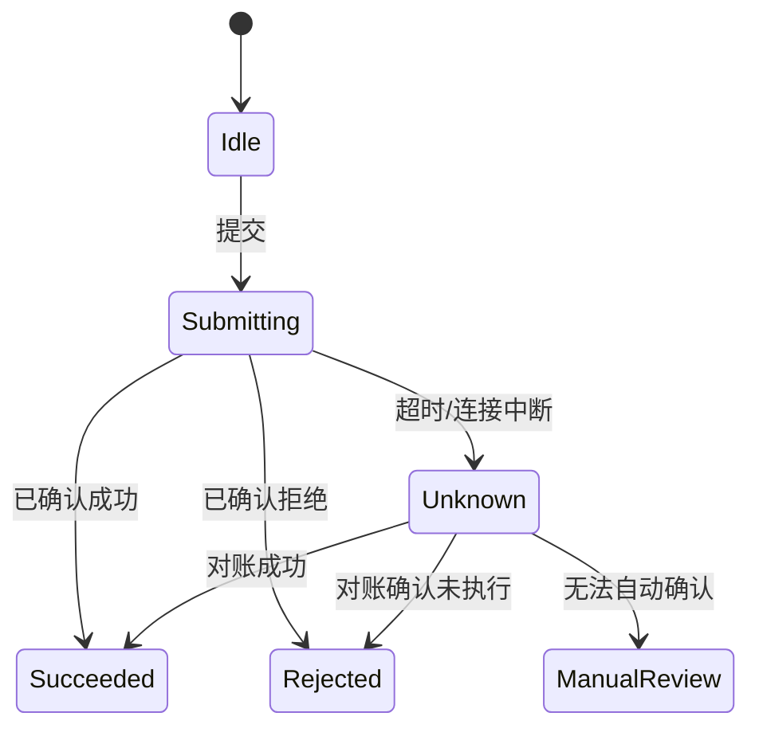

# 权限、冲突、失败与边界：把非成功路径写成产品规则

PRD 不能只描述谁在理想条件下完成操作。权限决定谁能对哪个资源执行什么动作；冲突处理并发事实；失败模型区分是否可重试和结果是否已发生；边界限定输入、容量、时间和数据范围。

## 一、四类边界不是同一问题

| 类别 | 核心问题 | 典型证据 | 最终执行位置 |
|---|---|---|---|
| 权限 | 主体能否操作该资源 | identity、role/capability、资源属性 | 服务端每个请求 |
| 冲突 | 基于旧事实的写入能否成立 | version、etag、幂等键 | 事务/受控服务 |
| 失败 | 操作未完成、已失败还是结果未知 | error kind、请求 ID、外部回执 | 状态机与对账 |
| 边界 | 哪些输入、数量、时间与状态允许 | schema、阈值、配额 | 多层校验，服务端最终保证 |

前端隐藏按钮不是授权；HTTP 500 不说明结果未发生；“最多 100 个”若不说明去重前后和整批/部分处理，仍不可实现。

## 二、权限模型的表达

权限判断至少包含主体、动作、资源、上下文和策略结果。`can(user, delete, document, context)` 比“管理员可删除”更完整，因为资源所有者、组织、文档状态和合规保留都可能改变结果。

### 1. 默认拒绝

没有命中明确允许规则时拒绝。新增 endpoint、资源类型或状态不能因为缺规则而开放。默认拒绝要由服务端配置和测试证明，不能只依赖框架当前默认值。

### 2. 每次请求重新验证

页面加载时有权限不代表点击时仍有权限。角色被撤销、资源转移或状态归档后，写请求需要重新检查。批量操作要对每个资源或明确集合策略验证。

### 3. 对象级与字段级

能查看订单不代表能查看身份证号，能编辑资料不代表能改结算主体。PRD 列出字段读取、写入和脱敏规则。导出、搜索、日志与通知也必须遵守字段权限。

### 4. 拒绝是否暴露资源

对其他租户资源，404 可避免确认存在性；对已进入产品上下文的资源，403 可能更利于恢复。选择需结合威胁模型与支持成本，并保持接口一致。

## 三、权限决策表

共享文档删除规则：所有者可删活动文档；组织管理员可删但受合规保留限制；编辑者不可删；归档文档需先恢复；法律保留中的文档任何普通角色都不可删。

| 主体 | 关系/能力 | 文档状态 | 法律保留 | 结果 |
|---|---|---|---|---|
| 所有者 | owner | active | 否 | allow |
| 编辑者 | edit | active | 否 | deny_not_owner |
| 组织管理员 | documents.delete_any | active | 否 | allow |
| 组织管理员 | documents.delete_any | active | 是 | deny_legal_hold |
| 所有者 | owner | archived | 否 | deny_invalid_state |
| 跨租户主体 | 任意 | 任意 | 任意 | not_found |

结果码是受控枚举。客户端可将 `deny_legal_hold` 显示为联系合规管理员，但不能自行覆盖。安全日志记录策略、主体、资源、动作和决策，不记录文档正文。

## 四、冲突的来源与选择

### 1. 乐观并发

读取资源时取得 version 或 ETag，写入携带基线。服务端只在当前版本匹配时更新，否则返回 409/412 与必要的新快照。PRD 说明冲突后是覆盖、合并、放弃还是重新审核。

### 2. 唯一约束冲突

同一工作区筛选器名称重复、用户名已存在属于业务冲突，不应当作网络故障自动重试。返回稳定字段路径或 conflict key。

### 3. 幂等冲突

同一幂等键与相同请求重复时返回原结果；同一键对应不同 payload 时拒绝 `idempotency_mismatch`。键的作用域、有效期和结果保存时间必须写明。

### 4. 并发删除与编辑

编辑提交时资源已删除，不能自动重建。返回 `resource_deleted`，允许用户复制未提交内容或另存新资源。

## 五、失败分类

已确认失败与结果未知必须分开。创建付款请求超时可能已被受理；立即换新幂等键重试会重复付款。Unknown 状态需要查询、回调或人工对账。

错误至少分为 validation、unauthorized、forbidden、notFound、conflict、rateLimit、temporary、permanent、cancelled、unknownOutcome。每类定义是否可重试、谁可修正、用户文案和日志级别。

## 六、边界条件的完整语法

一个数量上限应写：对象是什么、计数时点、去重规则、包含/不包含、单位、边界是否闭合、超限行为、并发更新。

例如：单次批量付款最多包含 500 个规范化后唯一收款指令；金额为人民币分的正整数；整批总额不超过 10,000,000 分；任一指令无效则整批不进入执行；请求体超过 2MB 在解析前拒绝。

时间边界写绝对时间来源和时区。`24 小时内` 要明确从创建成功的服务端时间起算，截止时刻是否包含。客户端时钟只显示，不作为授权依据。

## 七、案例一：共享文档删除

### 业务输入

文档 D 属于组织 A，版本 12，状态 active；Alice 是所有者；组织启用 30 天回收站；部分文档受 legal hold。

### 操作流程

1. 页面根据 capability 显示删除入口，但点击后服务端重新校验。
2. 请求携带 documentId、expectedVersion=12 和 idempotencyKey。
3. 服务端在事务中检查租户、能力、状态、legal hold 与版本。
4. 允许时转为 trashed version 13，写审计事件，不立即物理删除。
5. 同键重复返回同一 trash record。

### 可验证结果

| 注入 | API 结果 | 文档状态 | UI 恢复 |
|---|---|---|---|
| 所有者且无保留 | 200, version 13 | trashed | 提供撤销 |
| legal hold | 403 deny_legal_hold | active | 联系合规 |
| version 已为13 | 409 version_conflict | 不改变 | 刷新状态 |
| 跨租户 id | 404 | 不改变 | 返回列表 |
| 响应丢失但已执行 | 同键查询得原结果 | trashed | 显示已删除 |

撤销也是写操作，需要当前主体权限和回收期限。若文档已永久清理，返回 expired，不把历史正文从日志恢复。

## 八、案例二：批量付款

批量包含 200 个收款指令，总额 300 万分。审批人权限只覆盖成本中心 C1；请求中混入 C2。外部支付机构可能逐笔接收。

### 决策

预检阶段整批校验字段、成本中心、限额和重复收款引用。无 C2 权限时不向外部机构发送任何指令。执行阶段为每项生成本地 paymentId，批次状态聚合但不掩盖逐项状态。

### 状态

batch：draft→validated→executing→completed/partially_failed/failed/unknown。item：pending→submitted→confirmed/rejected/unknown。`partially_failed` 不能显示为批次失败后允许全部重试；只能重试明确 rejected 且可重试的项。

### 失败注入

机构在第 80 项后连接中断。前 79 项可能已受理，第 80 项结果未知，后续未发送。系统通过机构引用查询前 80 项，再决定剩余发送。人工对账前禁止生成新批次绕过。

### 验收

权限错误在任何外发前拒绝；同一收款引用在幂等期不重复付款；批次摘要计数等于所有 item 状态之和；金额由服务端按最小单位求和；审计记录审批人与策略版本。

## 九、错误优先级与信息泄露

一个请求可能同时无权限、版本旧和字段错误。通常先认证和对象范围授权，再做会泄露资源结构的详细校验。PRD 应写优先级，不让不同 endpoint 随意返回。

客户端不能根据错误文案判断类型；使用稳定 code 和可选 field path。面向用户的文案可本地化，日志保留 traceId 与策略决策。

## 十、重试规则

| 操作 | 自动重试 | 条件 |
|---|---|---|
| GET 查询 | 可 | 临时错误、预算内、尊重 Retry-After |
| 更新文档 | 通常不可盲重试 | expectedVersion 未变且请求可重放 |
| 创建付款 | 仅同幂等键 | 服务端保证同键同结果 |
| 权限拒绝 | 不可 | 等待权限变化后由用户重试 |
| validation | 不可 | 用户修正输入 |
| unknown outcome | 先对账 | 不生成新业务意图 |

指数退避需要上限和抖动，重试总时间受用户任务预算限制。429 使用服务端 Retry-After。

## 十一、发布和观测

发布前执行权限矩阵测试、跨租户对象引用测试、旧版本并发测试、重复幂等测试、外部超时和乱序回调。

指标包括授权拒绝率、策略 unknown 数、409 冲突率、unknownOutcome 停留时间、重复幂等命中、部分失败批次数和人工对账量。拒绝率上涨可能是攻击、权限配置错误或新 UI 误导，需要按策略版本和 endpoint 分解。

## 十二、威胁与故障场景清单

### 1. 越权引用

攻击者把自己文档的 ID 替换为同组织或跨组织 ID。测试不能只验证按钮不可见，要直接调用读取、更新、删除、导出和批量 endpoint。对象级授权对每个入口一致。

### 2. 批量接口漏检

单项删除有授权，批量删除只检查“用户是管理员”而未逐项检查租户和 legal hold。批量 PRD 要声明是 all-or-nothing 还是逐项结果，并保证未授权项不会因错误详情泄露。

### 3. TOCTOU

预检时允许，执行时资源状态或权限已经变化。预检只改善反馈；真正写入在事务或受控系统中重新验证。付款审批通过后限额被调整时，执行不能沿用旧预检。

### 4. 重放

攻击者重放曾经合法的删除或付款请求。幂等键可避免重复业务结果，但仍要绑定主体、操作、payload 哈希和有效期；不能让另一个用户复用键读取结果。

### 5. 时序侧信道

跨租户存在与不存在资源若响应内容或耗时差异巨大，可能泄露存在性。根据威胁模型统一外部结果，内部日志仍区分原因。不能为了时间一致性引入不受控长延迟。

## 十三、发布回滚与旧客户端

新增错误 code 时，旧客户端可能只认识通用失败。服务端应保持稳定 HTTP 类别与安全默认；未知 code 不能被旧客户端当成成功。删除旧权限能力前统计调用者和客户端版本。

策略发布使用 policyVersion。灰度期间日志同时记录旧/新策略的 shadow decision，但只由一个版本执行授权；差异用于评审，不能让两套策略随机决定。

回滚不能恢复已经执行的不可逆付款。功能 flag 只停止新批次，进行中批次继续对账。回滚计划需要写清数据状态、队列消息和外部机构请求如何收敛。

## 十四、综合练习

为“批量永久删除客户数据”建立权限、审批、版本、保留期、部分失败、外部存储清理和审计模型。

### 验收标准

- [ ] 权限表覆盖主体、动作、资源关系、状态和默认拒绝。
- [ ] 每个请求由服务端重新授权。
- [ ] 409、幂等冲突和唯一约束冲突分开。
- [ ] 结果未知有对账状态，不自动重复不可逆操作。
- [ ] 数量、金额、时间和请求尺寸边界精确定义。
- [ ] 权限错误不泄露跨租户资源。
- [ ] 监控能区分拒绝、冲突、临时失败和人工对账。

## 来源

- [OWASP Authorization Cheat Sheet](https://cheatsheetseries.owasp.org/cheatsheets/Authorization_Cheat_Sheet.html)（访问日期：2026-07-18）
- [OWASP Business Logic Security Cheat Sheet](https://cheatsheetseries.owasp.org/cheatsheets/Business_Logic_Security_Cheat_Sheet.html)（访问日期：2026-07-18）
- [HTTP Semantics RFC 9110](https://www.rfc-editor.org/rfc/rfc9110)（访问日期：2026-07-18）
- [RFC 2119：Requirement Levels](https://datatracker.ietf.org/doc/rfc2119/)（访问日期：2026-07-18）
