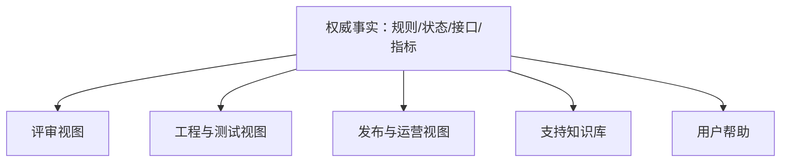

# 面向不同角色调整文档：单一事实与多种任务视图

同一产品变化会被决策者、设计开发、测试、运营、支持和最终用户以不同任务读取。调整文档不是把一份 PRD 复制后删减，而是建立权威事实模型，再按受众的决策、操作和风险生成可追踪视图。

## 一、先定义受众任务

受众不能只写职位。一个人可能在评审时是决策者，在排障时是操作人员。文档入口应根据读者此刻要完成的任务定义。

| 受众任务 | 需要回答 | 不需要首先看到 |
|---|---|---|
| 决定是否投资 | 问题、影响、目标、成本、风险、停止条件 | 字段级接口细节 |
| 设计和实现 | 规则、流程、状态、数据、依赖、非功能约束 | 宣传文案 |
| 验收 | 示例、边界、环境、预期结果、证据 | 方案探索全过程 |
| 发布运营 | flag、迁移、监控、回滚、负责人 | 每个组件 Props |
| 客服排障 | 症状、识别码、可安全操作、升级条件 | 内部密钥和敏感日志 |
| 最终用户 | 如何达成任务、限制、可恢复错误 | 内部架构和团队分工 |

## 二、四种文档任务

Diátaxis 区分 tutorial、how-to、reference、explanation。它们的组织原则不同，不应混成一篇万能文档。

### 1. Tutorial

以学习者获得能力为目标，提供受控路径和可见结果。教程选择一个可靠场景，不承担完整参数字典。

### 2. How-to

以已有目标的操作者为中心，给出达成某项任务的步骤、前置、分支和验证。它不从零教授所有概念。

### 3. Reference

按产品或接口结构准确列出字段、状态、默认值、错误和兼容性。参考材料应便于查找，避免夹杂长篇决策辩论。

### 4. Explanation

解释为何如此设计、概念关系、方案取舍与边界。它帮助形成理解，但不能代替操作步骤。

PRD 通常包含决策与实现输入；发布手册是 how-to；API schema 是 reference；架构决策和规则理由属于 explanation。

## 三、单一事实源

核心事实以稳定 ID 管理：目标 `GOAL-3`、规则 `RULE-INVITE-07`、状态 `STATE-export-expired`、错误 `ERR-domain_not_allowed`、指标 `METRIC-invite-success`。不同视图引用这些 ID，而不是复制后各自修改。



权威事实不等于一个巨大文件。它可以分散在可追踪工件中，但每项只有一个 owner 和更新入口。生成视图可以自动化，编辑必须回到源。

## 四、信息分级与最小披露

同一事实不一定能向所有受众公开。字段标记 public、customer-specific、internal、restricted。

- public：公开功能说明、非敏感限制。
- customer-specific：租户配置、自己的任务 ID。
- internal：内部服务名、flag、值班流程。
- restricted：密钥、个人数据、欺诈规则细节。

支持文档可以告诉客服使用 traceId 升级，但不能显示访问令牌。用户帮助可以解释“没有权限”，不能列出其他租户资源存在性。内部文档也遵循最小权限和保留期限。

## 五、读者契约

每个视图开头回答：目标读者、任务、前置、范围、最后更新的事实版本、反馈入口。这里的版本是内容依赖的产品/规则版本，不是无操作价值的编辑说明。

要求性词语需要定义。MUST 表示绝对要求，SHOULD 允许在理解后果的特定情况下偏离，MAY 表示可选。团队内部若使用“必须/应该/可以”，也要保持同样明确。

## 六、案例一：会员升级

功能允许个人会员升级为团队方案，涉及计费、席位、权限迁移和税务。

### 决策视图

包含受影响付费用户数、升级失败基线、收入假设、退款风险、开发成本、目标指标和停止条件。不列每个 API 字段。

### 工程视图

包含状态：eligible→quoting→confirming→processing→active/failed/unknown；计费端口、幂等键、税额版本、席位迁移、旧客户端兼容和权限不变量。

### 测试视图

覆盖有/无升级资格、当前方案、试用、欠费、优惠、税区、重复提交、支付超时、回调乱序、部分席位迁移失败。每个场景引用规则与错误 code。

### 发布视图

列出 feature flag 人群、迁移脚本 dry-run、支付成功率、unknown 停留时长、回滚条件、值班人。回滚只停止新升级，不能撤销已确认扣款。

### 客服视图

按症状索引：报价过期、支付已扣但方案未变、无升级权限。提供可见 taskId、允许执行的刷新/重试、何时升级支付团队。不得要求用户发送完整卡号。

### 用户帮助

How-to 说明升级前置、确认报价、完成支付和验证席位；Reference 说明计费周期、税、退款和权限；常见错误给出安全恢复。

### 一致性验证

所有视图引用 `ERR-quote_expired`。规则改为报价 15 分钟过期时，只修改权威规则和生成的 reference；发布监控阈值与测试时间 fixture同时收到影响提醒。

## 七、案例二：数据导出

管理员可异步导出订单，字段受角色、租户、地区和数据保留策略限制。

### PRD/工程

定义最大行数、字段白名单、快照时间、状态、加密、下载次数、过期、删除与审计。导出任务每次下载重新授权，链接本身不是永久凭证。

### 操作手册

步骤：确认队列健康；按 taskId 查询状态；检查对象存储元数据；仅在明确 failed 且可重试时重启；unknown 先对账。命令需说明环境、副作用和回滚。

### 支持文档

客服看到 `queued > 30min` 时收集 taskId、租户、创建时间和错误 code，不收集导出文件。跨租户或字段权限问题立即升级安全流程。

### 用户文档

解释如何选择范围、查看进度、下载和处理过期；明确导出只包含当前有权字段，权限变化可能使下载被拒绝。

### 失败注入

对象存储写成功但完成事件丢失。工程 runbook 用对象 key 与 checksum 对账，不能直接重新生成；用户视图显示处理中并提供稍后刷新，不暴露内部 bucket。

## 八、链接、嵌入与生成策略

优先引用稳定段落或结构化字段。Markdown 相对链接适合仓库导航；API/状态表可由 schema 生成。不要在五份文件复制同一错误码表。

自动生成内容要标明源和禁止手改区域；生成失败使 CI 失败。手写解释链接生成 reference。截图只能作为辅助，界面变化频繁时优先使用步骤和语义名称。

## 九、文档变更影响分析

规则改变时扫描：PRD 规则、Gherkin、API schema、监控、runbook、客服宏、用户帮助、培训和发布说明。影响矩阵记录必须同步、可延后和不可公开项。

| 变化 | 工程 | 测试 | 运营 | 支持 | 用户 |
|---|---|---|---|---|---|
| 新错误 code | 类型/映射 | 新场景 | 告警分类 | 故障树 | 安全文案 |
| 下载期限缩短 | 状态/清理 | 边界时间 | 对象清理 | 过期恢复 | Reference |
| 新权限 | 服务端策略 | 矩阵 | 审计 | 不泄露 | 操作前置 |

## 十、验证文档能否完成任务

文档测试不是只查错别字。选择目标受众，用真实但无敏感数据的场景执行：能否在不询问作者的情况下完成任务；是否误执行危险命令；是否知道成功证据和停止条件。

Reference 做 schema/link 检查；how-to 在临时环境 dry-run；runbook 演练依赖故障；用户帮助用可访问性和搜索词检查。

## 十一、常见失败

| 失败 | 原因 | 修正 |
|---|---|---|
| 一份 PRD 给所有人 | 不同任务互相干扰 | 建事实源和专属入口 |
| 复制五份规则表 | 修改不同步 | 结构化源与引用 |
| 给高层只写收益 | 风险和停止条件缺失 | 同时提供成本护栏 |
| 客服手册含密钥 | 把内部等于可公开 | 分级和访问控制 |
| 用户文档写内部服务 | 实现泄漏且无法行动 | 改为症状和恢复 |
| runbook 无验证 | 操作后不知是否成功 | 每步加观察点 |

## 十二、文档所有权与发布

事实 owner 对准确性负责，视图 owner 对任务可用性负责。功能发布 gate 检查必需视图；安全修复可先发布代码，但用户行为变化的文档必须进入明确补充任务。

文档与代码同仓可用 PR、link checker、schema diff 和 CODEOWNERS。面向客户站点还要验证权限、搜索索引、旧链接重定向和本地化。

## 十三、结构化事实示例

数据导出错误保存为结构化记录，而不是复制五份表格：

```yaml
id: ERR-export-expired
classification: internal
engineering:
  httpStatus: 410
  retryable: false
support:
  collect: [taskId, expiredAt]
  escalateWhen: "到期前返回 expired"
user:
  title: "下载链接已过期"
  action: "重新创建导出"
```

工程 reference 读取状态和重试；客服视图读取可收集字段；用户帮助读取安全文案。classification 控制哪些字段允许发布，生成器不能把内部升级条件直接发到公开站点。

schema 校验要求 id 唯一、retryable 与 action 一致、本地化 key 存在、链接目标有效。删除 code 前扫描 API、测试、告警、客服宏和旧客户端映射。

## 十四、本地化不是字符串替换

不同语言的术语、日期、金额、排序和文本长度会改变操作。权威规则保存单位、时区和格式语义，用户视图使用 locale 渲染。错误 code 稳定，文案按 locale 映射。

翻译输入包含功能上下文、占位符类型和禁译术语。占位符不能拼接成依赖英语顺序的半句；复数、性别和日期交给本地化能力。其他语言文档不能只复用英文截图。

客服搜索同时索引 code 与本地化症状，使用户描述“链接失效”时仍能找到 `ERR-export-expired`。

## 十五、Runbook 的危险操作边界

操作步骤分为只读诊断、可逆变更和不可逆操作。命令注明环境、权限、输入、预期输出、副作用、回滚和停止条件。生产删除、重放付款或批量重试不能成为无保护的复制命令。

Runbook 在 sandbox 或 dry-run 演练队列堆积、对象缺失和权限拒绝。演练发现的新状态和错误回写权威事实源，不只修补一份会议纪要。

演练记录执行者、环境、输入、实际输出、耗时和停止原因。只有“步骤已读”不能证明值班人员能在压力下找到正确入口，也不能证明命令在当前版本仍安全。

## 十六、综合练习

为“组织级 SSO 强制登录”建立事实源和五个视图：决策、工程测试、发布运行、客服、最终用户。

### 验收标准

- [ ] 每个视图写明读者任务和前置。
- [ ] 权限、错误、状态和指标只存在一个权威源。
- [ ] restricted 信息不会进入客服或用户视图。
- [ ] Runbook 有失败分支、验证和停止条件。
- [ ] 用户帮助不依赖内部服务名。
- [ ] 规则变化影响矩阵可找到全部消费者。
- [ ] 至少两名目标读者完成真实任务测试。

## 来源

- [Diátaxis：The Grand Unified Theory of Documentation](https://diataxis.fr/)（访问日期：2026-07-18）
- [Diátaxis：Reference](https://diataxis.fr/reference/)（访问日期：2026-07-18）
- [Diátaxis：How-to guides](https://diataxis.fr/how-to-guides/)（访问日期：2026-07-18）
- [RFC 2119：Requirement Levels](https://datatracker.ietf.org/doc/rfc2119/)（访问日期：2026-07-18）
