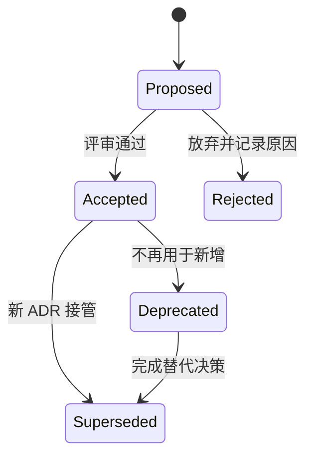

# ADR 与决策记录：保存重要选择的上下文与后果

Architecture Decision Record 记录一个影响系统结构、关键质量属性或难以逆转的选择。它至少包含上下文、候选方案、决定、理由、后果和状态。多个 ADR 组成 append-only 决策日志。

## 一、什么值得写 ADR

满足以下任一项通常值得记录：引入长期依赖；改变模块或数据边界；发布公共接口；影响安全、可用性、性能或合规；迁移成本高；团队存在多个合理方案。

局部变量名、容易撤销的实现细节不需要 ADR。完整接口设计、迁移步骤和操作手册可以链接到 ADR，但不能把 ADR 写成巨大设计文档。

## 二、ADR 与相邻工件

| 工件 | 回答 | 生命周期 |
|---|---|---|
| PRD | 为什么解决、为谁、规则与范围 | 随产品迭代 |
| Design doc | 方案如何工作、接口和时序 | 实现期持续更新 |
| ADR | 在当时约束下为何选择 A 而非 B | 接受后不可改历史 |
| Runbook | 线上如何操作和恢复 | 随运行环境更新 |
| Changelog | 对消费者发生了什么变化 | 按发布累积 |

ADR 引用 PRD 的功能与非功能需求，引用 benchmark 和 prototype 证据，再链接最终 design。它不复制所有内容。

## 三、最小字段逐项说明

### 1. ID 与标题

ID 稳定、唯一、不复用。标题写决策，例如“采用 PostgreSQL 全文搜索支持第一阶段商品检索”，不是“搜索讨论”。

### 2. 状态

Proposed 可评审和修改；Accepted 表示团队采用；Rejected 保留放弃理由；Deprecated 表示不建议新增使用；Superseded 表示新 ADR 接管。状态名称是团队约定，但语义必须一致。

### 3. Context

记录推动决策的事实、目标、约束、未知和决策期限。写当时流量、数据量、团队能力、兼容要求和安全边界。不要把后来结果改写进旧上下文。

### 4. Decision drivers

驱动因素应可比较：p95 延迟、相关性、运维人数、迁移窗口、成本上限、数据驻留。没有尺度的“高性能、易维护”无法排序。

### 5. Options

只列真实可行方案。每项用同一输入和评估方法比较，包含保持现状。明显不可用的陪衬方案会制造虚假合理性。

### 6. Decision

明确选择、适用范围、开始时间、禁止事项和例外流程。阶段性选择拆成多个 ADR 或明确阶段边界。

### 7. Consequences

同时写正面、负面和中性后果；负面项分配 owner、缓解任务或退出条件。选择 SaaS 还要记录数据流、供应商锁定、费用和故障依赖。

### 8. Validation 与复审触发

定义如何判断选择有效：指标、契约测试、架构 lint、成本账单。复审由条件触发，例如数据量增长 10 倍、价格变化、浏览器支持成熟，而不是无意义地定期重写。

## 四、从证据到决定

先冻结比较输入。若方案 A 用 100 万文档 benchmark，方案 B 用 1 万文档宣传数据，结论不可比较。实验记录环境、数据分布、查询集、预热、并发与成本。

权重用于显式讨论，不自动产生真理。对安全硬约束使用 gate：不满足数据驻留的方案直接淘汰，不用高性能分数抵消。

## 五、案例一：搜索索引方案

### Context

电商后台有 800 万商品，中文名称、SKU、品牌和类目检索。当前数据库 `LIKE` 查询 p95 2.4 秒，更新后 5 分钟内可检索即可；团队只有两名后端工程师，第一年基础设施预算每月 8,000 元。

### Drivers

1. p95 在 50 并发下低于 500ms。
2. Top-10 相关性基准 NDCG@10 不低于 0.78。
3. 索引延迟 p99 低于 5 分钟。
4. 支持中文分析与同义词。
5. 两人可值守，满足预算。

### Options

A：PostgreSQL FTS/pg_trgm；B：自管 OpenSearch；C：托管搜索服务；D：维持 LIKE 并优化索引。

### Evidence

使用脱敏后的 100 万商品、200 条标注查询和 50 并发压测。PostgreSQL p95 620ms/NDCG 0.70；OpenSearch 210ms/0.82 但预计值守高；托管服务 190ms/0.81、月估算 6,500 元；LIKE 1.3s/0.52。

### Decision

第一阶段采用托管搜索服务，通过 SearchPort 隔离供应商 API。商品写入后通过 outbox 同步；搜索不可用时后台允许按精确 SKU 回退，不自动返回不完整全文结果。

### Consequences

满足延迟与相关性；增加供应商依赖和索引对账；需要字段脱敏、重建脚本、预算告警和降级 runbook。三个月内建立双读相关性报告。

### Trigger

月费用超过 8,000 元、数据驻留要求变化、p95 连续一周超 500ms 或供应商能力不满足同义词管理时提出新 ADR。

### 失败注入

阻断搜索服务，验证 SKU 回退、错误提示和核心编辑流程；制造 outbox 重复与乱序，确认 document version 防止旧索引覆盖。

## 六、案例二：第三方支付接入

### Context

产品需要订阅支付和退款，首发两个地区。决定不是“选哪个 SDK”，而是选择支付能力边界、商户责任、数据合规和故障模型。

### Hard gates

供应商必须支持目标地区、服务端确认、幂等请求、webhook 签名、退款和合规数据处理。不满足任一 gate 的方案淘汰。

### Comparison

比较交易费率、结算周期、拒付工具、sandbox、SLA、数据出口、webhook 重放、迁移 token 能力和退出成本。费用按预估交易分布计算，不只比较宣传百分比。

### Decision

使用供应商 P，通过 PaymentPort 隔离；浏览器 SDK 只采集受控支付信息；订单成功以服务端 API/webhook 对账为准；所有创建使用幂等键；timeout 进入 unknown。

### Negative consequences

供应商故障阻断新支付；token 不完全可迁移；退款状态依赖 webhook。缓解包括 circuit/降级、人工对账、事件重放和合同退出条款。

### Supersede 场景

两年后新增地区不受支持。不能编辑旧 ADR 写成“选择 Q”；创建新 ADR，引用新增地区、迁移能力和双轨期，旧 ADR 标 Superseded 并链接新记录。

## 七、状态与不可变历史

AWS 与 Microsoft 指南都强调已接受记录不回写历史。可修复拼写或坏链接，但不能改当时理由和结论；实质变化创建新记录。

## 八、评审流程

1. 指定 owner 和决策期限。
2. Proposed ADR 在评审前提供阅读时间。
3. 评审者逐条关联 evidence 与 driver。
4. 未决动作有负责人；需要补证据则保持 Proposed。
5. Accepted 后记录参与者、日期和实现任务。
6. 代码评审发现违反 ADR 时链接记录，修改代码或提出 superseding ADR。

置信度可记录 high/medium/low。低置信但必须及时决定时，缩小可逆范围、设置更近复审 trigger 和实验。

## 九、把决定变成可执行约束

ADR 决定模块方向后，ESLint/Nx rule 链接 ADR ID；决定 API 兼容后，契约测试和 schema diff 执行；决定预算后，成本告警执行。没有自动化的规则仍需评审清单和 owner。

后果任务进入 backlog，包含迁移、监控、runbook 和删除兼容层。只写在 ADR 中不会自动完成。

## 十、Decision log 与检索

索引显示 ID、标题、状态、日期、owner、supersedes/supersededBy 和标签。按领域、质量属性、供应商检索。ID 不因目录移动改变。

CI 检查 frontmatter、编号唯一、本地链接、Accepted 必含 consequences/validation、supersede 双向链接。结构检查不能证明理由正确，但能阻止断链。

## 十一、常见失败

| 失败 | 后果 | 修正 |
|---|---|---|
| 只有结论 | 无法判断何时失效 | 写上下文和 drivers |
| 只列优点 | 成本无人承担 | 负面后果和 owner |
| 方案不是同一输入 | 比较失真 | 统一 benchmark |
| Accepted 后改正文 | 历史被覆盖 | 新 ADR supersede |
| 每个小决定都写 | 日志噪音 | 建显著性阈值 |
| ADR 代替设计文档 | 细节膨胀且结论不清 | 链接补充设计 |
| 没有执行约束 | 决定被绕过 | lint/test/评审 gate |

## 十二、安全与公开边界

公开仓库 ADR 不写密钥、未披露漏洞、合同机密和个人数据。可记录决策所需的脱敏事实，受限证据放权限受控系统并使用稳定引用。

供应商选择记录数据类别、传输地区、删除能力和 breach 责任，但具体凭证留在密钥系统。

## 十三、决策矩阵与证据强度

搜索方案的评分保留原始值，不只保留总分：

| Driver | Gate/权重 | PostgreSQL | OpenSearch | 托管搜索 |
|---|---:|---:|---:|---:|
| 数据驻留 | Gate | 通过 | 通过 | 通过 |
| NDCG@10 | 30% | 0.70 | 0.82 | 0.81 |
| p95 | 25% | 620ms | 210ms | 190ms |
| 月成本 | 20% | 2,000 | 5,500 | 6,500 |
| 值守负担 | 25% | 中 | 高 | 低 |

权重做敏感性分析。若成本权重从 20% 到 40% 就改变结论，ADR 要记录预算不确定性和复审条件。Gate 不参与加权，不满足直接淘汰。

证据强度区分供应商声明、实验 benchmark、脱敏生产回放和真实灰度。低置信证据对应更小初始范围和更强退出接缝。

## 十四、POC 的边界

POC 回答一个关键未知，例如中文相关性或 webhook 乱序，不是缩小版生产系统。它记录假设、数据、环境、通过阈值和销毁日期。

POC 代码通常缺少授权、错误处理、可观测性、容量和升级策略，不能直接复制到生产。ADR 使用 POC 结果作为证据，生产设计另行完成。

未达到 gate 时记录 Rejected 及原因，不能事后调低阈值证明偏好，也不能只保存成功截图。

## 十五、成本与退出量化

成本包含许可、基础设施、传输、值守、培训、迁移和停机风险。SaaS 按请求和存储分布计算；自管方案计入工程师值班与升级时间。

退出成本列出数据格式、token/身份迁移、双写时长、消费者改造数和合同期限。声称“可替换”需要第二适配器或契约测试证明。

采用后将真实成本与估算比较，偏差超过阈值触发复审，检查输入变化或估算错误。

## 十六、综合练习

为“前端采用单体仓库还是多仓库”写 Proposed ADR。用真实模块数、发布频率、权限隔离、构建时长和团队边界比较至少三方案。

### 验收标准

- [ ] 决策达到团队的架构显著性阈值。
- [ ] Context、drivers 和 hard gates 可验证。
- [ ] 至少三个可行方案使用同一输入比较。
- [ ] 正负后果都有 owner 或退出条件。
- [ ] Decision 写清范围、禁止事项和例外。
- [ ] Validation 连接到指标、测试或 lint。
- [ ] Supersede 流程保持旧记录不变。
- [ ] 内容不含密钥和受限证据。

## 来源

- [AWS：Architectural decision record process](https://docs.aws.amazon.com/prescriptive-guidance/latest/architectural-decision-records/adr-process.html)（访问日期：2026-07-18）
- [Microsoft Azure：Maintain an architecture decision record](https://learn.microsoft.com/en-us/azure/well-architected/architect-role/architecture-decision-record)（访问日期：2026-07-18）
- [AWS：Using ADRs to streamline decision-making](https://docs.aws.amazon.com/prescriptive-guidance/latest/architectural-decision-records/introduction.html)（访问日期：2026-07-18）
