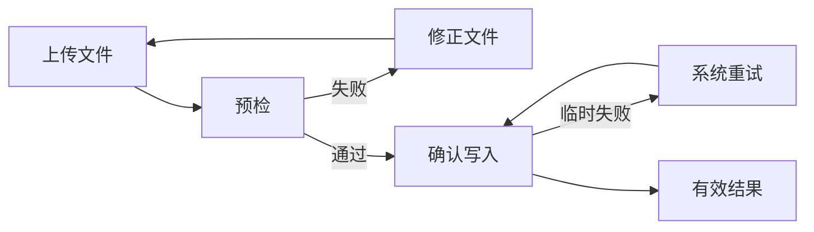
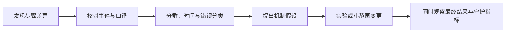

# 核心流程漏斗

漏斗把一个目标任务拆成有顺序的可观察步骤，计算进入任务的合格主体有多少到达每一步，以及在多长时间内完成最终结果。

漏斗适合回答：

- 哪一步之后完成比例明显下降；
- 哪些主体、版本或渠道的路径不同；
- 从开始到完成需要多久；
- 改动是否影响某个步骤和最终结果。

漏斗不能单独回答用户为什么退出，也不能证明某一步导致最终结果变化。退出可能是正常选择、资格不符、跨设备继续、数据缺失或系统故障。

## 一、漏斗的计算对象

一个漏斗定义至少包含：

```yaml
funnel:
  id: first_member_import
  version: 4
  unit: workspace_id
  cohort: "首次创建且有 members.import 权限的非内部工作区"
  entry: import_started
  steps:
    - import_started
    - file_parsed
    - validation_passed
    - write_confirmed
    - valid_member_created
  order: strict
  conversion_window: 24h
  deduplication: "每个工作区只取首次合格尝试"
  timezone: Asia/Shanghai
  exclusions: ["internal", "test", "suspended"]
```

如果单位、顺序或时间窗改变，同一批事件会产生不同数字。

## 二、先定义最终结果

漏斗的最后一步必须是业务结果，而不是页面或按钮：

| 较弱定义 | 问题 | 更可靠的结果 |
| --- | --- | --- |
| 点击“支付” | 请求可能失败 | 订单进入已支付且账务确认 |
| 到达成功页 | 刷新和直接访问会重复 | 服务端记录任务成功 |
| 点击“发送邀请” | 邮件可能未创建 | 至少一个有效邀请进入可追踪状态 |
| 看见回答 | 内容可能无证据 | 返回有权限证据支持的有效答案 |

前端事件适合分析交互摩擦，业务成功应尽量由权威服务端状态产生。两者都保留，才能区分“用户未操作”和“操作后系统失败”。

## 三、建立步骤

### 1. 每一步表达不同承诺

核心漏斗通常可拆为：


步骤太少无法定位问题；步骤太多会把滚动、焦点和普通页面浏览误当价值进展。

选择步骤的标准：

- 到达后任务承诺明显增加；
- 能从稳定事件或状态判断；
- 团队可以对该步采取不同改进；
- 与前一步不会因为普通重渲染反复触发；
- 对最终结果有明确机制联系。

### 2. 步骤事件的合同

```yaml
event: import_validation_completed
version: 2
actor_id: "usr_..."
workspace_id: "ws_..."
attempt_id: "imp_..."
occurred_at: "2026-07-18T09:21:04.351Z"
result: "passed | failed | partial"
error_codes: []
source: "import-service"
schema_version: 2
```

核心属性：

- `attempt_id` 把同一次任务的步骤连接起来；
- `workspace_id` 用于以工作区为分析单位；
- `occurred_at` 表示业务发生时间；
- `result` 区分成功和失败；
- `source` 说明权威产生方；
- `schema_version` 支持口径演进。

只有 `user_id` 通常不够。一个人可能同时操作多个订单或工作区，错误连接会把不同任务拼成虚假转化。

## 四、分子、分母和转化率

假设：

| 步骤 | 唯一合格工作区 |
| --- | ---: |
| 开始导入 | 1,000 |
| 文件解析成功 | 880 |
| 校验通过 | 650 |
| 确认写入 | 600 |
| 创建有效成员 | 570 |

### 总体转化

```text
570 / 1,000 = 57%
```

### 相邻步骤转化

```text
解析成功率 = 880 / 1,000 = 88%
校验通过率 = 650 / 880 = 73.9%
确认率     = 600 / 650 = 92.3%
写入成功率 = 570 / 600 = 95%
```

每一步的分母是到达前一步的同一 cohort。不能用当天所有活跃用户作分母，也不能把“点击次数”除以“唯一用户数”。

### 退出率

```text
相邻退出率 = 1 - 相邻转化率
```

“退出”只表示在窗口内未观察到下一步，不等于用户永久放弃。应在文案中使用“未在 24 小时内到达下一步”，避免把分析定义写成心理结论。

## 五、分析单位

| 单位 | 适用任务 | 风险 |
| --- | --- | --- |
| user_id | 每人只需完成一次的个人任务 | 共享账号、多设备身份合并 |
| workspace_id | 团队激活与协作 | 一人可代表整个工作区 |
| attempt_id | 可重复的独立尝试 | 重试会增加分母 |
| order_id | 购买、退款、履约 | 拆单和合单 |
| session_id | 短时连续操作 | 跨会话任务被截断 |

选择单位由产品问题决定。例如研究“工作区是否完成首次导入”应按工作区；研究“每次导入任务的可靠性”应按 attempt；研究“管理员需要重试几次”需要同时保留主体和 attempt。

同一个看板可以展示多个单位，但名称必须明确。

## 六、时间与顺序

### 1. 转化窗口

窗口从漏斗入口开始，而不是从报表查询日开始。

- 即时搜索可能使用 5 分钟；
- 注册激活可能使用 7 天；
- 企业审批可能使用 30 天。

窗口过短会把正常的长任务当退出；过长会延迟反馈并把无关后续行为连接起来。应查看完成时间分布，再选择能覆盖自然任务周期的窗口。

### 2. 严格顺序和宽松顺序

- 严格顺序：A 之后必须出现 B，再出现 C。
- 允许插入：A 与 B 之间可以发生其他事件。
- 任意顺序：要求事件集合出现，但不要求次序。

产品核心流程通常使用“指定顺序但允许无关事件插入”。只有业务明确允许步骤交换时才用任意顺序。

### 3. 开放漏斗和封闭漏斗

- 封闭漏斗要求从第一步进入。
- 开放漏斗允许从中间步骤进入。

评估端到端任务完成应使用封闭漏斗。诊断某个独立子流程时，开放漏斗可以包含已经在中间状态的对象。

混用后，第二步人数可能包含未进入第一步的人，图形不再呈典型递减。

### 4. 首次、最近或全部尝试

同一主体可以多次完成：

- 首次尝试：适合首次体验；
- 每个独立 attempt：适合系统可靠性；
- 任一尝试成功：适合主体最终结果；
- 最近一次：适合当前状态，但容易引入选择偏差。

规则必须冻结。不能在某一步取首次事件、下一步取最近事件，然后把两个不同任务拼接。

## 七、重试、回退和循环

真实任务并非单向：



漏斗可同时提供：

- 主体级最终完成率；
- attempt 级一次成功率；
- 每个主体的重试次数；
- 从首次开始到最终完成的时间；
- 常见回退路径。

若只看最终完成率，系统可能通过大量重试“成功”；若只看首次成功率，又会忽略用户最终是否达成目标。

## 八、资格、退出和排除

### 1. 资格应在入口前确定

购买漏斗不应把无法配送地区的访问者与可购买用户混为同一分母，除非问题正是研究资格发现。

资格条件需要来自入口时刻可得的信息。用最终购买结果反向定义“有购买意愿用户”会造成幸存者偏差。

### 2. 不要静默删除失败

服务端错误、页面崩溃和超时属于漏斗结果，不能从分母排除。合理排除通常是：

- 内部测试；
- 已知机器人；
- 明确不属于产品范围的对象；
- 数据损坏且无法判断是否合格，并单独报告比例。

### 3. 中途资格变化

若用户开始后权限被撤销，应保留在入口 cohort，并把结果标为“资格变化”或“被政策阻断”。静默移除会掩盖流程中的真实风险。

## 九、身份和跨设备

匿名访问后登录会产生两个 ID。身份合并必须定义：

- 合并时点；
- 能否把登录前事件回溯到账号；
- 多人共用设备怎样隔离；
- 删除账号后如何处理历史聚合；
- 同一工作区多人完成不同步骤是否算一个工作区转化。

对工作区级任务，可以允许 A 成员开始、B 成员完成，但需要同一个 `workspace_id + task_id`。对个人身份验证，则不能跨主体拼接。

身份规则变化会重算历史，必须版本化。

## 十、分群

先按预先有业务意义的维度分析：

- 新用户与老用户；
- 平台和应用版本；
- 地区与语言；
- 套餐与工作区规模；
- 获客来源；
- 权限角色；
- 网络或设备能力；
- 实验组。

每个分群同时显示样本量和置信不确定性。小样本的 100% 与大样本的 80% 不能只按百分比排序。

分群属性取哪个时点也需明确。按入口时的套餐分析，能避免升级后的用户被重新归类；按当前套餐分析则回答另一个问题。

## 十一、案例一：首次工作区配置

### 漏斗

1. 创建合格工作区；
2. 选择配置路径；
3. 通过权限校验；
4. 完成数据导入；
5. 邀请第二名成员；
6. 两名成员完成一次有效协作。

### 观察

总体 7 日转化从 34% 降到 31%。分解发现：

- 创建到选择路径不变；
- 权限校验通过率从 92% 降到 80%；
- 后续步骤在通过校验的 cohort 内稳定。

继续按应用版本分群，下降集中在桌面端 6.2.0；错误码显示目录权限请求被新系统策略拒绝。

结论只能写为“下降与 6.2.0 的权限校验失败同时出现，机制和错误码支持版本回归假设”。修复版本或受控回滚后比较，才能增强因果判断。

### 必须排除的数据错误

- 6.2.0 是否漏发 `permission_check_passed`；
- 服务端是否也记录相同失败；
- 新版本流量是否来自不同渠道；
- 工作区资格口径是否同期变化；
- 7 日窗口中的新 cohort 是否已经完全成熟。

## 十二、案例二：订单付款

### 业务步骤

```text
checkout_started
→ price_confirmed
→ payment_authorized
→ payment_captured
→ order_confirmed
```

不能用“成功页浏览”替代 `order_confirmed`。用户可能关闭页面，订单仍成功；也可能打开缓存页面而支付失败。

### 多次付款尝试

按订单计算最终完成率，按 payment_attempt 计算渠道成功率：

```text
订单完成率 = 最终确认订单 / 发起结账订单
首次授权成功率 = 首次授权成功订单 / 发起首次授权订单
尝试授权成功率 = 成功授权尝试 / 全部授权尝试
```

三个比率回答不同问题。

### 并发和幂等

同一订单重复点击支付不能形成多个独立订单成功。使用 `order_id` 与支付幂等键去重；回调乱序时以权威状态转移记录为准。

## 十三、从漏斗提出假设

漏斗发现薄弱环节后，按证据继续：



不要直接把“最大退出步骤”当最高优先级：

- 该退出可能是正常筛选；
- 该步人数大但改善空间小；
- 后续结果价值可能很低；
- 另一处小比例失败可能涉及安全或资金；
- 该步骤可能只暴露上游问题。

优先级需要结合影响、机制证据、风险和解决成本。

## 十四、实验中的漏斗

实验前冻结：

- 分流单位；
- 入口 cohort；
- 各步骤事件版本；
- 转化窗口；
- 主结果和守护指标；
- 多次尝试规则；
- 迟到数据截止时间。

实验组某中间步骤提高，不代表最终结果提高。中间指标只用于解释；最终结果和守护指标决定是否发布。

如果改动改变了步骤本身，例如删除一个表单页，应比较共同的业务入口与结果，而不是要求两组拥有完全相同的页面事件。

## 十五、数据质量检查

### 单调性

封闭严格漏斗中，后一步唯一主体数不应大于前一步。出现反常时检查开放入口、身份合并、事件乱序和查询实现。

### 守恒

每一步到达者应能拆为：

```text
到达前一步
= 到达下一步
+ 窗口内未到达
+ 明确排除/资格变化
+ 数据未知
```

不平衡说明分类遗漏。

### 客户端与服务端对账

对关键结果同时抽样：

- 点击确认但服务端无任务；
- 服务端成功但客户端无成功事件；
- 同一任务多个成功事件；
- 事件时间早于对象创建；
- 工作区或订单关联错误。

数据未知比例过高时，应停止解释产品效果，先修采集。

## 十六、常见错误

### 用页面 URL 代替业务步骤

单页应用、深链接和跨端流程会让 URL 与结果脱离。优先使用语义事件和服务端状态。

### 选择“最好看”的窗口

尝试多个窗口后只展示提升最大的一种，会制造分析偏差。窗口由自然任务周期预先决定。

### 把退出解释为不喜欢

漏斗只记录未观察到下一步。原因需要错误码、路径、任务观察、支持记录或实验。

### 平均步骤转化率

步骤分母不同，不能简单平均百分比。端到端转化以最终主体数除以入口主体数。

### 忽略尚未成熟的 cohort

今天进入 7 日漏斗的主体还没有完整观察时间。应只比较已成熟 cohort，或明确使用生存分析等处理删失的方法。

## 十七、评审清单

- [ ] 最后一步是权威业务结果，不是按钮或页面。
- [ ] 分析单位和任务关联 ID 明确。
- [ ] 入口资格使用当时可得信息定义。
- [ ] 顺序、开放/封闭、窗口和重复尝试规则冻结。
- [ ] 各步事件有来源、版本、时间和结果。
- [ ] 失败、资格变化和数据未知没有被静默删除。
- [ ] 跨设备或多人协作的身份拼接符合任务语义。
- [ ] 重试同时展示最终完成率和一次成功率。
- [ ] 分群属性时点明确，并显示样本量。
- [ ] 新 cohort 已获得完整观察窗口。
- [ ] 客户端行为与服务端结果定期对账。
- [ ] 从漏斗得到的是假设，不是未经验证的原因。

## 来源

- [GOV.UK Service Manual：Measuring completion rate](https://www.gov.uk/service-manual/measuring-success/measuring-completion-rate)（访问日期：2026-07-18）
- [Google Analytics：Funnel exploration](https://support.google.com/analytics/answer/9327974)（访问日期：2026-07-18）
- [Amplitude Docs：Funnel Analysis](https://amplitude.com/docs/analytics/charts/funnel-analysis/funnel-analysis-build)（访问日期：2026-07-18）
- [Mixpanel：Funnel analysis](https://mixpanel.com/blog/introduction-to-analytics-funnel-analysis/)（访问日期：2026-07-18）
