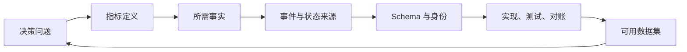
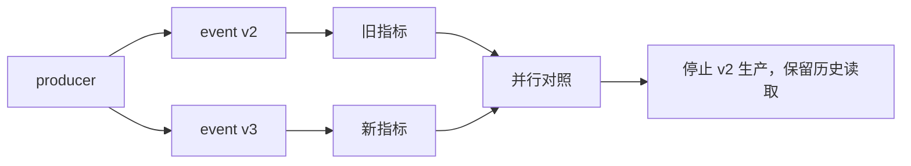

# 埋点事件与属性

埋点计划把产品问题转换成可验证的数据合同：记录哪些已经发生的事实、由哪个权威系统产生、用什么身份和业务对象关联、需要哪些属性解释，以及如何验证数据能够正确回答指标问题。

事件不是“用户点击了所有按钮”的流水账。一个可复用事件应表达稳定的业务或交互事实：

```json
{
  "eventId": "evt_01J...",
  "eventName": "member_import_completed",
  "eventVersion": 3,
  "occurredAt": "2026-07-18T08:32:11.482Z",
  "recordedAt": "2026-07-18T08:32:11.731Z",
  "actorId": "usr_42",
  "workspaceId": "ws_7",
  "object": {
    "type": "member_import",
    "id": "imp_93"
  },
  "properties": {
    "result": "partial",
    "acceptedCount": 47,
    "rejectedCount": 3,
    "sourceFormat": "csv"
  },
  "producer": "member-import-service"
}
```

## 一、从决策问题开始

埋点前先写要做的决定：

```text
我们需要判断【哪个产品机制】
是否改变【哪个主体在什么场景的结果】；
因此要比较【主指标】，
并监控【质量与风险守护指标】。
```

成员导入示例：

- 决策：是否把预检能力开放给全部工作区。
- 主指标：首次导入工作区在 24 小时内产生有效成员的比例。
- 诊断：解析、校验、确认、写入各步的结果和耗时。
- 守护：错误创建成员、越权读取、不可恢复失败和人工支持。

由问题反推事件：



若一个事件无法支持已知问题、合规审计或系统可靠性，应说明保留理由；否则不要默认采集。

## 二、事件、属性和实体

### 1. 事件

事件表示在某个时间点已经发生的事实：

- `import_started`
- `import_validation_completed`
- `import_write_confirmed`
- `member_import_completed`

名称用过去式或完成语义，避免 `import`、`button_click` 这类含义不确定的名称。

### 2. 属性

属性解释事件发生时的上下文：

| 类型 | 示例 | 规则 |
| --- | --- | --- |
| 结果 | success、failed、partial | 使用受控枚举 |
| 数量 | acceptedCount | 明确单位和边界 |
| 方式 | csv、xlsx、api | 不把展示文案当枚举 |
| 错误 | invalid_email | 稳定错误码，不采集原始敏感输入 |
| 版本 | schemaVersion、appVersion | 支持兼容和定位回归 |
| 实验 | experimentId、variant | 从分流系统注入 |

不要把高基数自由文本当普通属性。搜索词、错误堆栈和用户输入需要独立治理、脱敏、保留期限和访问控制。

### 3. 实体

实体是在多个事件间持续存在的业务对象，例如用户、工作区、订单、导入任务和实验分流。

事件保存当时必要的实体 ID 和快照属性。会变化的当前属性应另有实体表。分析“入口时套餐”不能用今天的工作区套餐回填过去。

## 三、选择事件粒度

### 业务结果事件

由权威服务产生，适合主指标和可靠性：

```text
order_confirmed
refund_completed
member_import_completed
document_published
```

### 产品行为事件

描述有明确意图的交互：

```text
import_file_selected
import_error_report_downloaded
retry_requested
```

### UI 诊断事件

仅在确有诊断需要时采集：

```text
dialog_opened
filter_applied
result_expanded
```

按钮位置、颜色和文案会变化，不应进入事件名。用稳定意图命名，再以 `surface`、`entryPoint` 等属性区分入口。

### 审计事件

审计日志回答谁对哪个受保护对象执行了什么动作，以及结果如何。它的完整性、访问和保留要求通常高于产品分析事件，不能假设普通分析管道可直接替代。

## 四、事件命名

一套命名规则要回答：

- 主体是否隐含在事件中；
- 动词采用请求还是完成语义；
- 对象使用单数还是领域名；
- 成功和失败拆事件还是用 `result`；
- 版本放在名称还是字段。

推荐：

```text
<domain_object>_<past_tense_action>
member_import_started
member_import_validated
member_import_completed
```

成功和失败是否共用事件取决于分析：

```json
{
  "eventName": "member_import_completed",
  "properties": {
    "result": "success | partial | failed"
  }
}
```

适合共享同一完成时点和公共属性的结果。若失败发生在完全不同阶段或拥有不同安全控制，可用独立事件。

禁止把事件名当自然语言随意扩展，例如同时存在：

```text
Import Finished
import_success
csv_upload_done
members_imported
```

这些事件会让同一指标出现多个不兼容来源。

## 五、事件 Schema

### 公共字段

| 字段 | 含义 | 约束 |
| --- | --- | --- |
| eventId | 事件唯一身份 | 全局唯一、重试不变 |
| eventName | 稳定事件类型 | 受控注册 |
| eventVersion | 语义版本 | 正整数 |
| occurredAt | 业务发生时间 | UTC ISO 8601 |
| recordedAt | 进入权威存储时间 | 不早于合理时钟边界 |
| producer | 产生服务或客户端 | 受控枚举 |
| actorId | 执行动作主体 | 可空但规则明确 |
| anonymousId | 登录前设备身份 | 受隐私和合并策略限制 |
| workspaceId | 租户或工作区 | 不从不可信客户端直接采信 |
| objectType/objectId | 业务对象 | 用于任务关联 |
| requestId | 请求链路 | 诊断关联，不替代 eventId |

### 事件专属字段

```json
{
  "$id": "member_import_completed.v3",
  "type": "object",
  "required": [
    "eventId",
    "eventName",
    "eventVersion",
    "occurredAt",
    "workspaceId",
    "importId",
    "result",
    "acceptedCount",
    "rejectedCount"
  ],
  "properties": {
    "eventName": { "const": "member_import_completed" },
    "eventVersion": { "const": 3 },
    "result": {
      "enum": ["success", "partial", "failed"]
    },
    "acceptedCount": {
      "type": "integer",
      "minimum": 0
    },
    "rejectedCount": {
      "type": "integer",
      "minimum": 0
    }
  },
  "additionalProperties": false
}
```

Schema 验证结构，跨字段不变量仍需额外检查：

```text
result=success -> rejectedCount=0
result=failed  -> acceptedCount=0
result=partial -> acceptedCount>0 AND rejectedCount>0
```

## 六、权威产生方

### 客户端适合记录

- 组件是否实际展示；
- 用户选择、展开、关闭；
- 浏览器性能和可恢复交互错误；
- 尚未发往服务端的本地行为。

### 服务端适合记录

- 权限判定；
- 写入是否提交；
- 支付、订单和任务结果；
- 跨客户端一致的对象状态；
- 重试、去重和后台任务。

点击“确认导入”由客户端记录意图；真正创建了有效成员由服务端记录结果。主指标不能只用点击事件。

客户端提交的 `workspaceId`、价格、角色和实验组不能自动视为可信事实。服务端应从已认证上下文和权威存储补全。

## 七、身份和对象关联

### 登录前后身份

需要确定：

- 登录前 anonymousId 怎样生成和轮换；
- 登录后是否允许把历史行为合并到 actorId；
- 共用设备怎样避免串人；
- 登出是否清除本地身份；
- 同意撤回和删除请求怎样传播。

身份合并不是简单执行 `anonymousId -> actorId`。如果一台公共设备被多人使用，回溯合并会把他人行为错误归属。

### 多主体协作

工作区级任务可能由 A 成员开始、B 成员完成：

```text
workspaceId + importId
```

负责连接同一任务；`actorId` 分别保留每一步实际操作者。是否算一个工作区转化由指标合同决定。

### 对象 ID

业务对象 ID 应稳定，不能用数组索引、页面位置或可修改名称。删除后也不应立即复用。

## 八、时间

同时保存：

- `occurredAt`：事实发生时间；
- `recordedAt`：数据平台接收时间；
- 可选 `clientSentAt`：客户端发送时间；
- 服务端序列或对象版本。

客户端时钟可能错误。资金、权限和业务状态优先使用权威服务端时间；客户端时间只用于解释离线行为，并需要合理偏差检查。

迟到事件策略：

```yaml
late_data:
  normal_window: 24h
  metric_freeze: T+3d
  after_freeze: "进入修订批次并记录影响"
```

不能因为报表已经发布就静默丢弃迟到成功，也不能每天无限重写历史而不说明版本。

## 九、幂等、重复和顺序

### 幂等

同一事实被重试时保持相同 `eventId`。采集端使用唯一约束去重：

```text
UNIQUE(producer, eventId)
```

如果客户端每次重试生成新 ID，数据平台只能用启发式规则猜测重复，容易误删真实重复行为。

### 业务重复

两个不同 eventId 也可能代表一次业务结果，例如服务重复发布订单成功。可按：

```text
orderId + stateTransitionVersion
```

建立业务唯一性检查，但原始重复事件应隔离保存以定位生产故障。

### 乱序

事件流中 `completed` 可能先于 `started` 到达。分析层可按 `occurredAt + sequence` 排序，但不能改写原始接收顺序。若缺少可信顺序，应标记未知。

## 十、隐私与安全

采集前建立字段分级：

| 级别 | 示例 | 处理 |
| --- | --- | --- |
| 公开/低风险 | 产品版本、受控错误码 | 常规访问 |
| 内部 | 工作区 ID、功能配置 | 最小权限 |
| 个人数据 | 用户 ID、IP、设备标识 | 目的限定、保留和删除 |
| 敏感数据 | 健康、政府证件、支付数据 | 默认不进入产品分析 |
| 秘密 | 密码、令牌、密钥 | 永不采集 |

不要采集：

- 密码、会话令牌和访问令牌；
- 完整支付卡数据；
- 未经治理的表单内容；
- URL 中的敏感查询参数；
- 文件正文和模型提示全文；
- 能被错误码或自由文本带入的秘密。

错误信息使用稳定错误码，原始堆栈进入访问更严格的运维系统。第三方分析 SDK 的发送目的地、跨境、保留和删除能力需要独立评审。

## 十一、事件字典

每个事件条目包含：

```yaml
event_name: member_import_completed
version: 3
description: "一次成员导入任务进入终态"
business_question:
  - "首次导入工作区是否在24小时内产生有效成员"
producer: member-import-service
trigger: "终态事务提交后"
unit: import_id
required_properties:
  - workspace_id
  - result
  - accepted_count
  - rejected_count
privacy:
  classification: internal
  prohibited:
    - raw_email
    - file_content
owner: import-domain
consumers:
  - first-import-funnel-v4
  - import-reliability-dashboard
```

字典还要记录废弃事件及替代项。只写名字和一句描述不足以维护。

## 十二、实现流程

### 1. 设计评审

产品说明问题和指标，研发确认权威触发点，分析人员确认单位和口径，安全/隐私确认字段边界，测试人员写验证数据。

### 2. Schema 注册

事件先注册再发出。CI 检查：

- 事件名是否已占用；
- 必填字段和类型；
- 枚举变更是否兼容；
- 禁止字段；
- owner 和消费者是否存在。

### 3. 代码产生

优先从 Schema 生成类型，避免每个调用方手写：

```ts
type ImportCompletedV3 = {
  eventName: "member_import_completed";
  eventVersion: 3;
  eventId: string;
  workspaceId: string;
  importId: string;
  result: "success" | "partial" | "failed";
  acceptedCount: number;
  rejectedCount: number;
};
```

类型不能代替运行时验证；外部和旧客户端输入仍需校验。

### 4. 联调

使用测试工作区产生已知序列：

```text
1 次开始
1 次解析成功
1 次校验 partial
1 次确认
1 次 completed(partial, 47, 3)
```

逐层对账客户端网络、采集入口、消息队列、原始表、清洗表和指标查询。

## 十三、数据质量测试

### 完整性

- 合格业务对象中有事件的比例；
- 必填 ID 缺失率；
- 各应用版本覆盖；
- 各平台和地区覆盖。

### 唯一性

- eventId 重复；
- 业务终态重复；
- 同一请求异常产生多次。

### 合法性

- 枚举未知值；
- 数量为负；
- 时间超出合理范围；
- result 与计数不一致；
- 工作区和对象关系错误。

### 连贯性

- 完成没有开始；
- 服务端成功无产品事件；
- 客户端成功事件对应服务端失败；
- 状态版本倒退；
- 漏斗后一步多于前一步。

数据质量指标也需要告警和负责人。

## 十四、版本演进

### 兼容变更

- 增加可选字段；
- 枚举增加值，但下游已经按未知值处理；
- 补充不改变语义的元数据。

### 破坏变更

- 修改字段含义；
- 改变单位；
- 改变触发时点；
- 修改身份或去重规则；
- 删除必填字段。

破坏变更创建新版本，并在迁移期并行：



不要把旧事件重命名后假装历史口径一致。

## 十五、案例一：批量邀请

需要回答：

- 预检是否减少无效发送；
- 哪类错误最常阻止邀请；
- 部分失败是否可恢复；
- 是否发生越权或邮件投诉。

事件：

```text
invitation_batch_started          客户端意图
invitation_preflight_completed    服务端校验结果
invitation_batch_confirmed        服务端接受命令
invitation_delivery_updated       每项投递结果
invitation_batch_completed        批次终态
```

错误属性只保留 `already_member`、`domain_not_allowed` 等代码，不记录原始邮箱。批次 ID 连接步骤，邀请 ID 连接单项。供应商超时导致未知状态时不能发出虚假成功。

## 十六、案例二：AI 回答与引用

不要记录完整问题和答案到通用分析事件。可采集受控事实：

```json
{
  "eventName": "answer_completed",
  "properties": {
    "result": "answered",
    "citationCount": 3,
    "retrievedChunkCount": 8,
    "latencyBucket": "5s_to_10s",
    "permissionFilterApplied": true,
    "modelConfigVersion": "answer-prod-17"
  }
}
```

问题主题如需分析，应使用经过治理的分类结果，并保存分类器版本和未知类。原文、提示、检索片段和模型输出属于更高风险调试数据，需要独立权限、保留和脱敏。

权威结果还包括：

- 用户是否停止生成；
- 引用是否能定位且有权限；
- 评估抽样中的证据支持结果；
- 成本和延迟；
- 明确无法回答。

## 十七、常见错误

### 事件命名绑定界面

`green_button_clicked` 在改版后失效。改为稳定意图，并把入口作为属性。

### 成功只由客户端声明

请求可能失败或被拒绝。客户端记录意图，服务端记录业务结果。

### 属性无限增加

高基数、自由文本和敏感数据会增加成本和风险。每个字段必须有问题、消费者和保留规则。

### 先上线再补埋点

缺少基线、实验分流和失败事件后，无法解释上线变化。埋点与功能作为同一交付物评审。

### 数据平台自动修复未知值

静默把未知枚举映射为 `other` 会隐藏生产回归。原始层保留、隔离并告警，语义层才按明确规则归类。

## 十八、评审清单

- [ ] 每个事件连接一个决策问题、指标或必要审计用途。
- [ ] 事件表达稳定事实，不绑定按钮位置和展示文案。
- [ ] 主结果由权威系统产生。
- [ ] eventId、任务 ID、主体和工作区身份各司其职。
- [ ] 时间、时区、迟到、重复和乱序规则明确。
- [ ] Schema 含必填、枚举、单位和跨字段不变量。
- [ ] 登录前后与多人协作的身份合并符合任务语义。
- [ ] 禁止采集字段和隐私分级进入 CI 与运行时检查。
- [ ] 事件版本变化不会静默重写历史。
- [ ] 测试覆盖完整性、唯一性、合法性和连贯性。
- [ ] 客户端、服务端、原始表与指标定期对账。
- [ ] 事件有 owner、消费者、保留期限和废弃计划。

## 来源

- [Segment Spec：Track](https://segment.com/docs/connections/spec/track/)（访问日期：2026-07-18）
- [Snowplow Docs：Tracking design](https://docs.snowplow.io/docs/fundamentals/tracking-design/)（访问日期：2026-07-18）
- [W3C：Data on the Web Best Practices](https://www.w3.org/TR/dwbp/)（访问日期：2026-07-18）
- [OWASP：Logging Cheat Sheet](https://cheatsheetseries.owasp.org/cheatsheets/Logging_Cheat_Sheet.html)（访问日期：2026-07-18）
