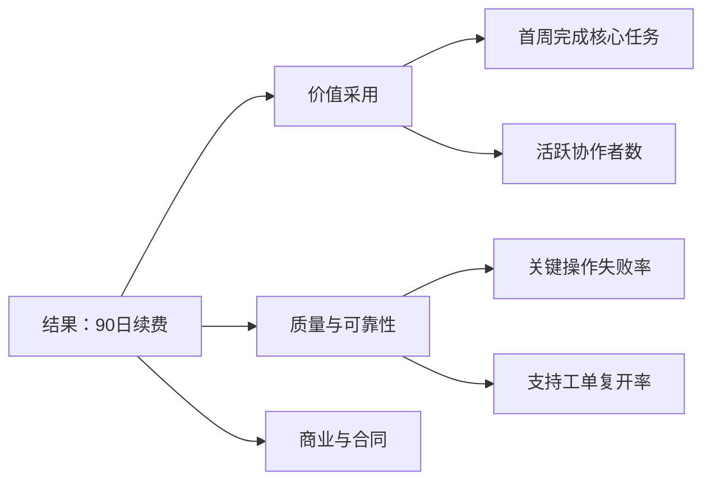

# 结果指标与过程指标：用时间、机制和可行动性连接目标

结果指标描述希望最终发生的用户或业务结果，通常在行为累积后才能观察；过程指标描述通向结果的中间行为或系统条件，通常更早变化。领先与滞后不是指标的固定标签，而是相对于某个决策时间和目标而言。

## 一、先确定结果、时间和分析单位

“续费率”必须写成指标合同：合约到期的付费工作区中，在到期后 7 天内成功续费的工作区比例；按工作区计数；排除内部测试；以服务端付款确认时间为准。

结果窗口决定滞后程度。月度续费在到期后才成熟，不能用当月尚未到期用户计算。工单 30 日复开率要等待 30 天，最近 cohort 尚未成熟。

| 字段 | 要求 |
|---|---|
| 决策 | 指标变化会触发什么行动 |
| 分析单位 | 用户、工作区、会话、订单或工单 |
| 资格 | 何时进入分母 |
| 结果 | 分子事件和权威来源 |
| 窗口 | 起点、长度、时区、成熟规则 |
| 聚合 | 比例、均值、中位数、分位数或总量 |
| 版本 | schema、规则和回填边界 |

## 二、领先指标需要满足的条件

一个过程指标只有在以下条件成立时才可用于提前判断：

1. 时间上先于目标结果。
2. 有合理机制连接目标，而非只相关。
3. 对团队可采取的改变有响应。
4. 在不同 cohort 和版本中关系相对稳定。
5. 不容易通过无价值行为提高。
6. 能及时、完整、低延迟地计算。

“发送更多通知”可能早于留存，却也可能造成退订；它不是天然好的领先指标。“首周有两名活跃协作者的工作区比例”更接近协作价值，但仍需历史分析或实验验证。

## 三、指标树不是因果证明



指标树把结果拆为可诊断组成。箭头表示待验证关系，不自动表示因果。价格、销售合同和客户结构也影响续费，不能把过程指标的变化全部归功于产品。

## 四、方向、弹性和阈值

先检查方向：过程指标升高时结果预期升还是降。再估计弹性：过程指标每变化一个单位，结果历史上变化多少。最后定义不确定区间和护栏。

二元结果可用比例：`renewal_rate = renewed_eligible_accounts / mature_eligible_accounts`。过程率类似。比较 cohort 时同时给分子、分母和置信区间。

均值受长尾影响。工单解决时长同时展示 median、p90 和超过 SLA 比例。把 p90 降低可能牺牲少数极难工单，需要复开率和满意度护栏。

## 五、建立候选过程指标

从结果失败路径反推可干预节点：

- 用户没有到达价值：激活、核心任务完成、协作建立。
- 用户到达但体验不稳定：错误、延迟、数据丢失。
- 用户获得价值但商业流程失败：报价、付款、合同。
- 指标被测量错误：事件缺失、身份断裂、窗口未成熟。

每个候选写机制假设和反例。例如“首周邀请成员→协作价值→续费”；反例是强销售客户被迫邀请但没有真实协作。护栏可用被邀请成员次周参与率。

## 六、历史验证

历史数据用于检查领先性，不证明干预效果。做时间对齐：过程指标在 `t0–t7`，结果在 `t90`；不能使用结果发生后的行为预测结果。

按 acquisition cohort、计划、规模、地区和版本分层。若总体正相关但各规模层内无关系，可能是大客户同时更爱邀请且更易续费。

可用简单模型评估预测增益，但要进行时间外验证。训练旧 cohort、验证新 cohort，避免同一用户泄漏。报告 AUC/校准并不意味着产品改变该过程会改变结果。

## 七、案例一：订阅续费

### 结果合同

分析单位为付费工作区。资格是合约在观察月到期且未主动迁移；结果是在到期后 7 天内服务端确认续费。最近 7 天到期账户不进入成熟分母。

### 候选过程

P1：购买后 7 天内完成首个共享项目的工作区比例。P2：首月有至少 3 个不同成员完成核心动作的比例。P3：到期前 30 天关键操作错误率。P4：到期前 14 天报价查看率。

### SQL 口径

```sql
WITH eligible AS (
  SELECT workspace_id, contract_end_at
  FROM subscriptions
  WHERE plan = 'paid'
    AND contract_end_at < CURRENT_DATE - INTERVAL '7 day'
), renewed AS (
  SELECT DISTINCT workspace_id
  FROM payment_events
  WHERE event_type = 'renewal_confirmed'
)
SELECT
  COUNT(*) FILTER (WHERE r.workspace_id IS NOT NULL)::numeric / NULLIF(COUNT(*),0) AS renewal_rate
FROM eligible e
LEFT JOIN renewed r USING (workspace_id);
```

生产 SQL 还需将 renewal 约束到相应 contract、7 日窗口和幂等业务事件，示例只展示成熟分母。

### 历史结果

假设首月多成员采用组续费率 82%（4,100/5,000），未采用组 54%（2,700/5,000）。差异 28 个百分点，但两组客户规模和销售渠道不同。

按规模分层后差异分别为 8、6、5 个百分点，说明总体差异被客户结构放大。下一步随机化新手协作引导，而不是承诺邀请会提升 28 点续费。

### 决策

短期看 P1/P2 判断引导是否改变协作建立；续费作为滞后主指标；护栏为退邀请率、关键错误、支持工单和席位滥用。

## 八、案例二：工单解决质量

结果不是“关闭工单数”，而是 30 日内未复开且客户确认解决的工单比例。分析单位为工单，资格排除垃圾与重复合并单。

候选过程：首次响应时间、首次转交次数、解决前诊断证据完整率、一次处理解决率。

### 反例

缩短平均关闭时间可通过过早关闭实现，导致复开增加。把关闭时长作为单一过程目标会被操纵。结果指标必须包含复开与客户确认。

### 分位数

某月 median 8h、p90 72h。下月 median 7h、p90 96h。均值或中位数看似改善，但尾部恶化；高价值客户可能集中在尾部。分层显示严重级别和客户计划。

### 实验

给随机分配的支持人员启用诊断清单。主要过程是证据完整率，结果是成熟后的 30 日一次解决率；护栏是首次响应、客服工作量和客户等待。随机单位需避免同一客服在两组交叉学习，可按团队或工单路由设计。

## 九、数据延迟与成熟度

看板显示 preliminary 与 mature。每个 cohort 记录 `eligible_count`、`mature_count`、`result_count`。成熟率低时不比较结果。

迟到付款和工单复开会修订历史。指标合同说明回填窗口和冻结时间。财务结果可能以最终账本为准，产品事件只作实时近似。

## 十、过程指标被操纵

当过程指标成为强目标，团队可通过降低门槛、重复触发或改变分母提高它。预防方式：

- 用业务结果事件而非点击。
- 同时看质量和用户控制护栏。
- 限制同一单位重复贡献。
- 审计事件版本和异常分布。
- 定期检查与结果关系是否漂移。

## 十一、监控与诊断

指标管线监控事件完整率、重复率、延迟、资格分母突变和维度 unknown。结果突变先排查 schema/版本/流量结构，再讨论产品。

领先指标提前报警时，给出预期会影响哪个成熟 cohort、方向和时间；到期后对预测与实际结果复盘。

## 十二、比例差与不确定性

续费、激活和一次解决率是二元结果。两组比例差 `Δ=p1-p0`，独立大样本标准误近似 `sqrt(p1(1-p1)/n1+p0(1-p0)/n0)`。低样本、极端比例或聚类数据需要更合适方法。

例：成熟 cohort A 820/1000=82%，B 700/1000=70%，差12点，近似标准误1.89点，95%区间约8.3–15.7点。区间表达抽样精度，不消除客户规模等混杂。

同一工作区多日事件不是独立样本。按工作区产生一个结果或使用聚类标准误；把事件行当样本会虚增精度。

## 十三、领先时间回测

对历史 cohort 模拟当时可见数据：第7日过程值能否在第90日结果成熟前预警。回测记录命中、误报、漏报、平均领先天数和触发后的可行动作。

阈值越敏感越早发现，也可能错误干预更多。团队依据误报与漏报成本选择，不在看到事故后回改阈值。

价格、渠道或产品定位变化会让过程→结果关系漂移。每条指标树边记录支持证据、最近验证 cohort、预期方向、领先时间和失效条件。

## 十四、干预验证

预测强不等于可干预。账户规模可预测续费，却不能通过虚增席位创造价值。随机化协作引导后，若协作建立提升而成熟续费不变，它不能继续作为续费领先代理，只能按独立用户价值评估。

过程和结果都改善仍检查护栏与实验完整性。若过程下降但结果暂未成熟，看板标记风险而不是提前宣布结果失败。

## 十五、常见错误

| 错误 | 修正 |
|---|---|
| 把任何早发生指标叫领先 | 写机制并做分层/实验验证 |
| 用尚未成熟 cohort | 显示成熟率并排除 |
| 指标树当因果图 | 标记假设与混杂 |
| 只优化过程 | 加结果与护栏 |
| 均值掩盖尾部 | 同看分位数和 SLA |
| 历史预测当干预效果 | 用实验或因果设计 |

## 十六、综合练习

为异步数据导出建立一个 30 日结果指标、3–5 个早期过程指标和护栏。

### 验收标准

- [ ] 结果合同包含分析单位、资格、窗口和成熟规则。
- [ ] 每个过程指标写时间顺序、机制和反例。
- [ ] SQL 不使用结果发生后的信息。
- [ ] 至少按两个重要混杂维度分层。
- [ ] 过程优化有质量、安全和成本护栏。
- [ ] 发布后有预测回顾和关系漂移检查。

## 十七、指标成熟度 SQL

```sql
SELECT
  cohort_week,
  COUNT(*) AS eligible,
  COUNT(*) FILTER (WHERE outcome_window_end <= :as_of) AS mature,
  COUNT(*) FILTER (
    WHERE outcome_window_end <= :as_of AND renewed
  ) AS renewed,
  COUNT(*) FILTER (
    WHERE outcome_window_end <= :as_of AND renewed
  )::numeric
    / NULLIF(COUNT(*) FILTER (WHERE outcome_window_end <= :as_of), 0)
    AS mature_renewal_rate
FROM renewal_cohorts
GROUP BY cohort_week;
```

`as_of` 固定分析时点，避免查询重跑时窗口悄悄变化。看板同时显示 `mature/eligible`；成熟率低的 cohort 只展示过程，不与成熟结果比较。

## 十八、结果与过程的责任分工

产品团队可负责引导、协作和任务成功过程；可靠性团队负责关键失败与延迟；商业团队负责报价和合同。一个过程指标只有明确 owner 和可接受干预，才进入行动看板。

跨团队指标不能拆成互相冲突目标。例如增长只追激活、可靠性只追零变化，会抑制实验。共同结果与护栏先确定，再为团队分配诊断指标。

指标 owner 对定义、查询和变更负责，业务 owner 对阈值和行动负责；两者不能互相替代。

季度评审检查：结果口径是否仍代表价值、过程关系是否漂移、护栏是否捕获伤害、是否出现指标攻击。评审结论进入版本记录。

## 来源

- [NIST：Confidence Limits for the Mean](https://www.itl.nist.gov/div898/handbook/eda/section3/eda352.htm)（访问日期：2026-07-18）
- [Google Analytics：Cohort exploration](https://support.google.com/analytics/answer/9670133?hl=en)（访问日期：2026-07-18）
- [Causal Diagrams for Empirical Research](https://escholarship.org/uc/item/6gv9n38c)（访问日期：2026-07-18）
