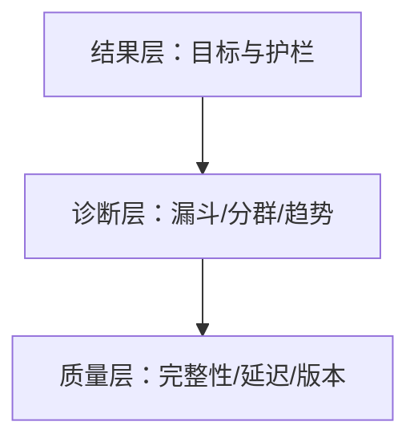

# 产品指标看板：把决策、口径与诊断组织在同一入口

产品看板是为特定决策提供状态、变化、解释路径和数据质量的界面。它不是把所有可计算数字排成卡片。每个图都应回答谁在何时做什么决定。

## 一、先写看板契约

| 字段 | 示例 |
|---|---|
| audience | 增长与产品负责人 |
| cadence | 每日诊断、每周决策 |
| decision | 是否扩大激活流程发布 |
| primary | 成熟 cohort 7 日激活率 |
| guardrails | 错误、退订、支持量 |
| latency | T+1，回填 7 天 |
| owner | 产品分析负责人 |
| source | 指标合同与查询版本 |

没有 decision 的图表进入探索工作台，不直接放高层健康看板。

## 二、三层信息架构



结果层限制在少量核心结果和关键护栏；诊断层允许按流程、cohort、版本和来源下钻；质量层告诉读者数据是否可信。

## 三、卡片必须包含什么

一张指标卡包含当前值、分子/分母、比较基线、实际变化、相对变化、成熟状态、区间、更新时间、定义链接和质量状态。

从 2% 到 3% 是 +1 个百分点、相对 +50%。只显示“+50%”会放大小基线。总量需显示观察窗口与季节基线。

颜色不能是唯一信号。红/绿阈值有业务依据，配合文字、图标和可访问名称。

## 四、时间序列

选择日/周/月粒度应匹配决策和噪声。周同比可处理星期结构，仍需标注节假日、发布和数据事故。移动平均平滑噪声但引入滞后，不替代原始点。

纵轴截断会夸大变化；比例通常从 0 起或明确标注。双轴易制造关系，优先分面或标准化。

## 五、比较基线

可比基线包括上一完整周期、去年同期、计划目标、控制组和统计过程基线。不要在看到数据后挑最有利基线。

实验图显示 treatment/control 的绝对值、difference、区间、样本和 SRM 状态，不只显示 uplift。

## 六、案例一：SaaS 激活看板

结果为工作区创建后 7 天内发布首个项目且第二成员参与。最近 7 天 cohort 未成熟。

### 结果层

成熟 cohort 激活率 38.2%（1,910/5,000），上四周 40.0%，差 -1.8 点；95% 区间；护栏为邀请退订、关键错误和支持工单。

### 诊断层

漏斗：创建→配置→邀请→成员参与→发布。按来源、规模、版本、国家分群；显示群内率和流量权重。

### 质量层

成员参与事件完整率 99.2%，但 Android 8.4 为 91%，导致某 cohort 激活被低估。看板顶部显示 degraded，禁止自动扩大发布。

### SQL 模型

```sql
SELECT acquisition_week,
       COUNT(*) FILTER (WHERE mature) AS mature_workspaces,
       COUNT(*) FILTER (WHERE mature AND activated) AS activated_workspaces,
       COUNT(*) FILTER (WHERE mature AND activated)::numeric
         / NULLIF(COUNT(*) FILTER (WHERE mature),0) AS activation_rate
FROM workspace_activation_facts
GROUP BY acquisition_week
ORDER BY acquisition_week;
```

fact 表保留规则版本和各步骤时间，不能只存最终布尔。

### 决策

下降主要来自 paid 来源权重增加；Android 事件缺失也影响。先修数据再评估产品，不用不可信看板决定回滚。

## 七、案例二：支付成功率看板

分析单位是逻辑付款意图，多个网络重试按幂等键去重。成功是账本/支付服务确认，不是客户端 success page。

### 结果层

成功率、unknown outcome、重复扣款、p95 确认时间、支付金额与退款护栏。

### 诊断

按 provider、支付方式、币种、国家、客户端版本和错误 code。漏斗区分创建意图、供应商接收、确认和订单激活。

### 事故

某日客户端 success 事件下降 20%，服务端确认率不变。客户端版本 9.2 路由埋点丢失，不是付款事故。权威结果与诊断事件分层避免错误告警。

另一次 provider B 的 unknown 升高，最终成功率在 30 分钟回填后恢复。实时看板显示 preliminary，不把 unknown 立即计为失败。

## 八、阈值与告警

看板供观察，告警要求明确 owner、影响、持续时间和响应。静态阈值适合安全/业务 SLO；动态基线适合季节指标，但必须处理发布与结构变化。

告警条件示例：成熟支付成功率低于 97% 且分母>1000，连续 10 分钟；或重复扣款任何一例立即高优先级。

避免对每个图告警。无行动手册的告警制造疲劳。

## 九、数据质量面板

监控新鲜度、完整性、唯一性、合法性、连贯性和分布漂移。

- 新鲜度：源事件到可查询时间。
- 完整性：权威业务记录有对应事实。
- 唯一性：业务 event_id 重复。
- 合法性：枚举/范围/schema。
- 连贯性：成功不早于开始、漏斗单调。
- 漂移：unknown/版本/来源权重突变。

质量状态影响主指标展示，不能藏在另一个无人看的页面。

## 十、权限与隐私

高层看板不显示个人行。小群体按阈值隐藏/合并；导出明细需额外权限和审计。人口属性可能受阈值与同意限制。

URL 筛选、缓存和截图都不能泄露租户或敏感 segment。共享链接重新授权。

## 十一、性能与成本

大查询使用预聚合、增量模型和查询缓存；缓存 key 包含指标版本、筛选和权限。看板显示数据 as-of。

预聚合不能丢失重新计算所需的分子分母。只存 rate 无法正确再聚合。

## 十二、版本与变更

指标定义变更以新版本并行计算，标注断点。历史回填说明范围；不能在折线中静默拼接不同口径。

删除图前检查决策、告警和消费者；保留重要事故注释，但不要让手工注释成为唯一历史。

## 十三、可用性测试

给目标读者一个问题：“激活为何下降，能否扩大 Android 发布？”观察能否找到成熟度、分群和质量警告。记录误读。

看板截图评审不足；用真实筛选、窄屏、键盘和无数据/延迟/错误状态测试。

## 十四、视觉编码

趋势用线，离散群用点/条，分布用直方/箱线/分位数，cohort用矩阵。饼图不适合许多类别或精确比较。面积和3D不用来比较率。

颜色状态配文字和图标；tooltip不是唯一入口。图提供可访问摘要或等价数据表。纵轴、单位、缺失与抑制值可见。

## 十五、查询血缘

每张卡记录 metric_id、definition_version、query commit、source tables、as_of、refresh job 和 owner。点击定义能到 SQL 与数据测试。

缓存 key 包含指标版本、筛选与权限。查询升级与旧版并行，对比总量、分群和断点再切换。

## 十六、事故模式

管线延迟时显示最后完整时间、受影响指标和禁止决策，不把旧值涂绿。事故时固定筛选和as-of，保存trace与发布注释。

临时诊断在复盘后转为正式图或删除，避免首页永久堆积。

## 十七、移动和无障碍

窄屏保留名称、当前值、变化和质量，诊断分层进入。表格有表头和键盘导航，高对比与色觉缺陷检查纳入验收。

## 十八、查询成本

记录扫描量、刷新频率和缓存命中。秒级刷新只用于可实时行动事故；成熟留存不需每分钟计算。预聚合保留分子分母和维度。

## 十九、常见错误

| 错误 | 修正 |
|---|---|
| KPI 墙 | 按决策分层 |
| 只显示百分比 | 分子分母区间 |
| 最近 cohort 混入 | 成熟状态 |
| 红绿无依据 | 阈值合同 |
| 质量另放 | 主页面降级 |
| rate 再平均 | 聚合分子分母 |
| 客户端声明成功 | 权威服务端事件 |

## 二十、综合练习

为异步数据导出创建结果、诊断和质量三层看板。

### 验收标准

- [ ] 看板写明受众、决策和 cadence。
- [ ] 每张卡含分子分母、比较和成熟度。
- [ ] 至少两个诊断下钻能区分解释。
- [ ] 数据降级会阻止错误决策。
- [ ] 告警有阈值、owner 与 runbook。
- [ ] 小群体和导出有权限保护。
- [ ] 查询保存指标版本与 as-of。

## 二十一、导出任务看板设计

结果层：

- 成熟任务成功率：完成窗口结束后 confirmed / eligible。
- p90 首次可下载时间。
- 过期前至少下载一次的任务比例。
- 护栏：越权下载、重复生成、对象泄漏、每成功导出成本。

诊断层：

| 维度 | 用途 |
|---|---|
| 数据量 bucket | 判断容量与长尾 |
| 格式 CSV/XLSX | 编码或内存问题 |
| 客户端版本 | 下载交互 |
| worker version | 处理回归 |
| error code | 可重试与永久失败 |
| 租户计划 | 配额和优先级 |

质量层对账 `export_tasks`、队列消息、对象存储 manifest 和客户端下载。对象存在但任务仍 processing 属于状态对账故障；不能仅重跑。

## 二十二、看板状态设计

看板本身覆盖 loading、empty、partial、stale、error、permission denied 与 success。Empty 区分“无符合数据”和“管线没有产出”。Partial 显示缺失来源，不按零填充。

筛选改变时 URL 保存可分享的非敏感状态。直接链接重新授权。权限变化后已打开页面刷新并清除不再允许的缓存。

## 二十三、审计查询正确性

对每个 rate 运行守恒测试：

```sql
SELECT
  SUM(success_count) <= SUM(eligible_count) AS numerator_valid,
  SUM(eligible_count) > 0 AS denominator_nonzero
FROM metric_daily
WHERE metric_version = :version;
```

对漏斗检查后一步唯一单位不超过前一步；对状态检查终态互斥；对金额检查最小单位与账本对账。测试失败使看板 degraded。

## 二十四、决策会议输出

会议不以“看过看板”结束。记录决定、证据 as-of、使用的定义版本、未决解释、owner 和复查日期。截图不能替代查询链接。

如果数据质量不支持决定，输出应是修复测量或收集证据，而不是凭感觉选择增长/回滚。看板价值来自更好的决策，不是访问次数。

## 二十五、指标字典抽屉

每张图提供同页定义：业务含义、公式、资格、窗口、单位、权威来源、延迟、owner、版本和已知限制。用户不必跳到另一个系统才能判断分母。

变更前后定义同时可读。折线断点点击能看到 migration、回填范围和不可比区间。

## 二十六、筛选语义

全局筛选只影响声明兼容的卡片。若收入按账本地区、激活按工作区地区，不能用一个“地区”控件假装相同。每卡显示实际应用的 dimension。

筛选为空时显示 no matching data，不显示0。0是有效数值，null是未知，suppressed是隐私隐藏，三者视觉和导出不同。

## 二十七、导出与 API

看板导出包含指标版本、as-of、筛选和分子分母，不只导出格式化率。API 返回 machine-readable status：complete/preliminary/degraded/suppressed。

下载重新授权并审计；共享快照有过期与撤销。敏感分群不能通过直接改 API 参数绕过 UI 阈值。

## 二十八、发布验收

用固定 fixture 对 SQL、API 和页面值三方对账；随机抽取单位追溯到源事件。模拟迟到回填、版本断点、权限变化、管线失败和缓存过期。

刷新后相同 as-of 应复现同值。实时指标允许变化，但需显示 watermark，避免会议中数字不断跳动无法决策。

## 来源

- [Google Analytics Data API：Advanced Use Cases](https://developers.google.com/analytics/devguides/reporting/data/v1/advanced)（访问日期：2026-07-18）
- [Google Analytics：Cohort exploration](https://support.google.com/analytics/answer/9670133?hl=en)（访问日期：2026-07-18）
- [NIST：Confidence Limits for the Mean](https://www.itl.nist.gov/div898/handbook/eda/section3/eda352.htm)（访问日期：2026-07-18）
