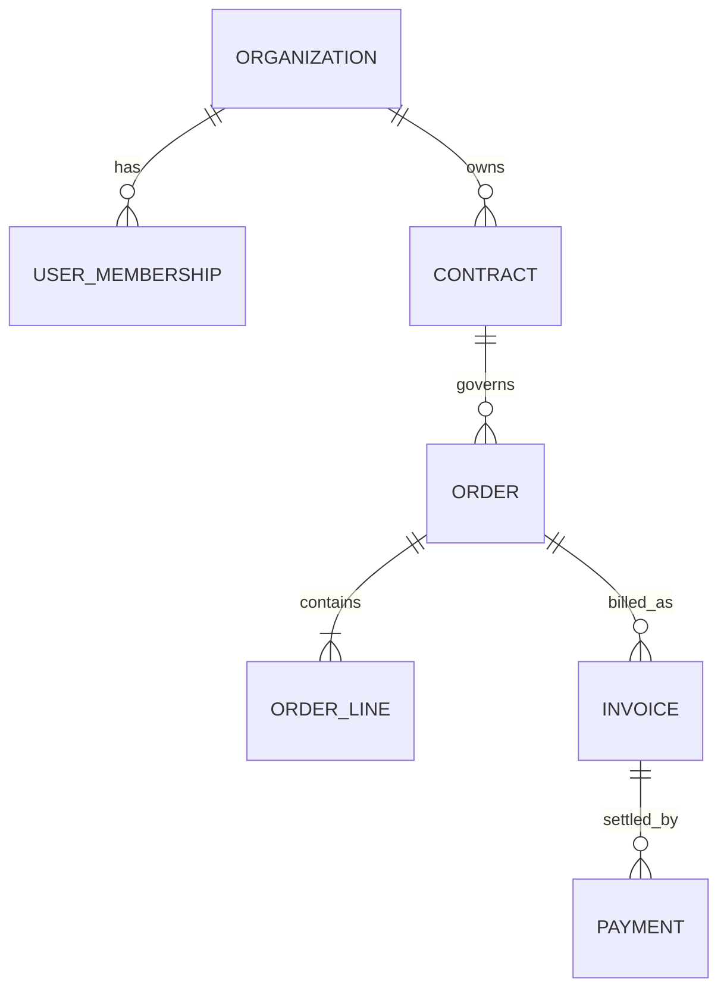
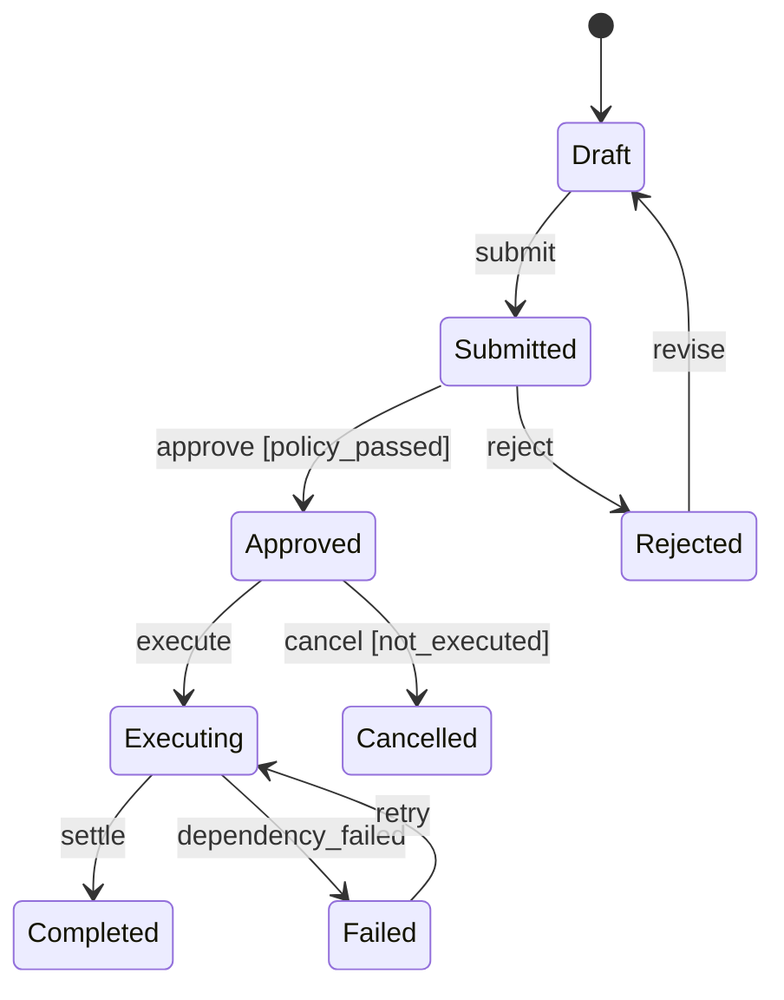

# B 端产品的业务对象、权限、流程与实施

B 端产品同时服务使用者、管理员、购买者与治理角色。产品方案必须把业务对象、状态、权限、审计、配置和迁移连接成一个可执行系统；页面和流程图不能替代服务端不变量。

## 一、从业务对象开始

业务对象是具有稳定身份、属性、关系和生命周期的业务实体，例如客户、合同、订单、发票、付款、项目和审批单。表格行或页面卡片只是对象的呈现。

### 1.1 对象定义

每个核心对象至少定义：

- 唯一标识：内部不可变 ID 与可能变化的业务编号分开。
- 归属：属于哪个租户、组织或法律实体。
- 属性：值域、必填、来源和修改权限。
- 关系：一对一、一对多、多对多及删除行为。
- 状态：当前业务阶段和允许转移。
- 不变量：任何入口都必须满足的规则。
- 历史：哪些变化需要版本、审计或有效期。

例如“发票金额等于有效行项目之和减去折扣加税”是业务不变量，应由服务端和数据库约束维护；界面显示正确不能保证批量导入或 API 写入正确。

### 1.2 标识与编号

内部 ID 用于稳定引用，不应包含会变化的部门、地区或年份语义。业务编号可供人阅读、按规则生成，但修改编号不能改变对象身份。

外部系统 ID 以命名空间保存：`source_system + external_id`。只保存一个“外部 ID”会在多系统迁移时碰撞。

### 1.3 关系与基数

合同与订单不是简单父子：一个合同可能产生多订单，订单也可能引用框架合同的不同条款。关系要写业务含义、有效期和删除策略。



删除组织不能直接级联删除法定发票和审计。逻辑关闭、匿名化、法定留存与物理删除需要分别设计。

## 二、角色与权限矩阵

### 2.1 授权模型

NIST RBAC 模型的核心元素包括用户、角色、权限、操作和对象，并支持角色层级与职责分离。产品权限设计要进一步加入租户和资源作用域。

```text
授权判定 = 主体身份
         + 激活角色
         + 资源与动作
         + 租户/项目作用域
         + 上下文约束
         + 显式拒绝与职责分离
```

认证回答“是谁”，授权回答“能否对该资源执行该动作”。登录成功不意味着拥有任何业务权限。

### 2.2 权限粒度

不要用页面名作为权限。权限表达业务动作：`invoice.read`、`invoice.issue`、`invoice.void`、`payment.refund`。查看与导出、编辑与审批、创建与发布通常风险不同。

作用域示例：

- 全组织：组织管理员。
- 部门：财务主管只管理所属法人或成本中心。
- 项目：项目成员访问特定项目。
- 自有对象：销售只能编辑自己负责的草稿。
- 字段：客服可看订单但不能看完整支付信息。

### 2.3 权限矩阵

| 角色 | 合同查看 | 合同编辑 | 订单审批 | 发票作废 | 权限管理 |
| --- | --- | --- | --- | --- | --- |
| 销售 | 所负责客户 | 草稿 | 否 | 否 | 否 |
| 销售主管 | 所属区域 | 审核前 | 一级 | 否 | 否 |
| 财务 | 全法人 | 财务字段 | 金额复核 | 是 | 否 |
| 审计员 | 只读全量 | 否 | 否 | 否 | 否 |
| 租户管理员 | 元数据 | 否 | 否 | 否 | 是 |

矩阵只定义角色上限。实际授权还要与资源作用域、对象状态和职责分离共同判断。

### 2.4 职责分离

静态职责分离禁止同一用户同时拥有冲突角色；动态职责分离允许拥有多个角色，但同一业务实例不能同时执行冲突动作。

例如创建付款和批准付款可由同一用户在不同组织角色中具备，但同一付款实例不能自建自批。系统保存 `created_by` 并在批准时服务端校验，而不是只在界面隐藏按钮。

### 2.5 权限生命周期

覆盖邀请、激活、转岗、临时授权、休假代理、停用和离职。临时权限必须有到期时间；管理员离职前要转移唯一责任；停用用户的历史记录保留原主体身份。

权限测试至少包含越权、跨租户、角色变化、缓存过期、并发撤销、批量 API 和导出。

## 三、状态机与审批流程

### 3.1 状态机五要素

- 状态：业务上可区分且影响允许动作的阶段。
- 事件：尝试触发变化的业务动作。
- 守卫：转移前必须成立的条件。
- 副作用：通知、记账、外部调用和审计。
- 补偿：副作用部分成功时恢复业务一致性的动作。



状态不是页面步骤。`已审批` 和 `执行中` 必须分开，因为审批成功后外部支付仍可能失败。

### 3.2 转移表

| 当前状态 | 事件 | 角色 | 守卫 | 新状态 | 副作用 |
| --- | --- | --- | --- | --- | --- |
| 草稿 | 提交 | 发起人 | 字段完整 | 待审批 | 冻结审批快照 |
| 待审批 | 批准 | 审批人 | 非发起人且额度内 | 已审批 | 写审批记录 |
| 已审批 | 执行 | 财务系统 | 未执行且账户有效 | 执行中 | 创建幂等指令 |
| 执行中 | 回执成功 | 系统 | 回执匹配指令 | 已完成 | 记账与通知 |
| 执行中 | 超时 | 系统 | 超过 SLA | 状态未知 | 查询外部结果 |

外部调用超时不等于失败。若对方已经执行但响应丢失，直接重试会重复付款。进入“状态未知”，使用幂等键和查询接口确认。

### 3.3 审批策略

审批策略输入可以是金额、部门、风险等级和合同类型。策略版本要与提交快照绑定；审批期间策略更新不应悄悄改变正在处理的实例。

并行审批要定义 all-of、any-of、法定人数和拒绝优先级。代理审批记录原审批人、代理人、授权依据和有效期。

### 3.4 BPMN 的边界

OMG BPMN 提供任务、事件、网关、池和消息流等标准图形，适合跨角色沟通业务过程。图形本身不定义数据库事务、授权、幂等和故障恢复；实现仍需状态转移表与服务契约。

## 四、数据责任、日志与合规

### 4.1 数据责任

欧盟委员会对 GDPR 角色的说明：控制者决定个人数据处理的目的与方式，处理者代表控制者处理。产品中“客户上传、供应商存储”不自动决定角色，需按具体处理目的和合同判断。

每类数据建立记录：主体、字段、处理目的、合法依据、来源、接收方、地区、保留、删除、控制者/处理者和责任人。

数据最小化要求只收集完成明确目的所需字段。以后“可能有用”不是无限保留的业务目的。

### 4.2 操作日志

审计日志回答谁在何时、从何上下文、对哪个对象执行什么、结果如何、使用什么策略版本。NIST SP 800-92 强调组织需要建立日志管理基础设施与过程，而不是只生成日志文件。

```json
{
  "event_id": "evt_01J...",
  "occurred_at": "2026-07-22T08:15:31.482Z",
  "tenant_id": "org_2048",
  "actor": {"type": "user", "id": "usr_391"},
  "action": "payment.approve",
  "resource": {"type": "payment", "id": "pay_882"},
  "decision": "denied",
  "reason_code": "separation_of_duty",
  "policy_version": "payment-policy-17",
  "request_id": "req_..."
}
```

不记录密码、Token、完整支付数据和不必要正文。日志读取本身需要权限和审计；防篡改、时间同步、留存与导出要按风险设计。

### 4.3 业务历史与安全日志

业务时间线给用户解释状态；安全审计用于调查和证明控制。两者可以共享事件来源，但展示字段、保留和访问角色不同。

“删除记录”不能删除证明谁执行删除的最小审计事件，但审计保留也不能成为永久保存所有个人数据的借口。

## 五、标准、配置与定制

### 5.1 四层能力

1. 标准能力：所有租户共享同一语义和版本。
2. 配置：在受控选项中改变规则、字段或流程。
3. 扩展：通过稳定 API、Webhook 或插件实现外部逻辑。
4. 定制分支：客户专属代码或数据模型。

优先级不是绝对禁止定制，而是先计算长期代价。越靠后，测试组合、升级、支持和安全责任越高。

### 5.2 配置设计

配置项定义默认值、合法值、作用域、继承、权限、生效时机、版本、回滚和冲突。配置错误可产生生产事故，需预览、校验、审计和草稿发布。

例如审批额度不是自由文本脚本，而是结构化规则：币种、金额区间、部门、审批层级、优先级和冲突检测。

### 5.3 定制决策

评估五项：是否代表目标市场重复需求；能否用通用对象表达；是否隔离故障；升级成本；客户愿意承担的价格与期限。

单一客户高合同额不自动证明定制合理。若专属逻辑触及核心授权和数据模型，未来每次发布都要承担回归与安全成本。

## 六、系统迁移、导入与实施

### 6.1 六阶段


迁移不是上传 CSV。还包括历史、附件、权限、关系、时区、枚举、重复、外部 ID 和增量变化。

### 6.2 数据画像

对每个源表统计行数、主键唯一性、空值、枚举分布、日期范围、非法编码、重复和关系孤儿。先测量再制定清洗规则。

### 6.3 映射规则

映射文档包含源字段、目标字段、转换、默认、无效处理、责任人和可逆性。未知枚举不能全部映射为“其他”而不保留原值，否则后续无法修复。

### 6.4 试迁与对账

试迁使用真实脱敏切片，覆盖大客户、长文本、多语言、历史状态和异常关系。对账至少比较总量、金额校验和、关键状态分布、关系完整性、附件哈希和权限抽样。

```text
迁移完成率 = 成功进入目标系统且通过业务校验的对象 / 应迁对象
```

“脚本无报错”不等于迁移完成。

### 6.5 切换与回退

切换策略可以停机迁移、双写、变更数据捕获或增量补偿。双写会产生顺序、失败和冲突问题，必须有来源优先级和对账。

回退条件在切换前定义。若新系统已产生新交易，回退不只是恢复备份，还要处理新旧系统之间的业务差异。

## 七、使用者、管理员与购买者

### 使用者价值

关注任务完成、等待、错误和协作。使用者需要清楚当前状态、下一动作和恢复方法。

### 管理员价值

关注批量配置、权限、身份生命周期、策略、审计、导入导出和故障诊断。管理员体验不能由大量单用户页面拼接。

### 购买者价值

关注采用、风险、总拥有成本、合同、服务水平和退出能力。购买者需要汇总证据，但不能用漂亮看板替代真实业务结果。

三者可能冲突：严格权限增加使用步骤；按席位收费抑制邀请；过度配置降低标准化。产品决策要明确取舍和补偿，而不是让某一角色隐性承担成本。

## 八、案例一：采购与付款系统

### 输入

组织有四个法人、23 个部门和 1,400 名员工。采购申请按金额与类别审批，付款由财务执行。现有问题是同一人可创建并批准、外部付款超时后重复提交、审计导出缺少策略版本。

### 对象与权限

核心对象为采购申请、审批实例、订单、发票、付款指令和外部回执。付款指令拥有独立幂等键，不能以审批单 ID 直接代表一次执行。

角色包括申请人、部门审批人、采购、财务复核、付款执行和审计员。动态职责分离禁止申请人批准同一实例，静态职责分离禁止付款执行者兼任权限管理员。

### 流程

审批完成后生成不可变快照。付款从“已审批”进入“执行中”；超时进入“状态未知”，先查银行回执。确认未执行才允许使用同一幂等键重试。

### 验证

权限测试覆盖跨法人、转岗缓存、代理到期和批量 API。流程测试注入银行响应丢失、重复回执和审批期间策略变更。

### 失败分支

若管理员把所有部门加入一个高权限角色以简化配置，系统检测角色成员异常增长并要求二次批准。审批通过不代表安全，权限变化仍需最小权限和审计。

## 九、案例二：CRM 数据迁移

### 输入

源系统有 2.1 万客户、8.4 万联系人、12 万活动和 3 TB 附件；存在共享邮箱重复联系人、已删除员工仍为负责人、地区枚举不一致。

### 处理

团队先固定源系统 as-of，建立外部 ID 命名空间。客户按税号、域名和人工规则去重；无法确定的冲突进入待确认，不自动合并。

负责人映射到有效用户；离职员工的历史活动保留原显示名和主体 ID，新任务转移到部门队列。附件按哈希校验，权限按客户团队重建。

### 试迁与切换

三轮试迁分别覆盖普通、中型和最大客户。业务对账要求客户与联系人关系 100% 完整、金额总和一致、权限抽样零越权。

正式切换采用周末全量加短期增量同步。新系统写入开始后旧系统只读，避免双向冲突。

### 失败分支

第二轮发现 4% 联系人的地区被默认成总部地区。脚本成功但业务含义错误。团队撤销试迁，补充“未知”状态和人工修复队列，不用看似完整的默认值掩盖缺失。

## 十、综合练习

为一个多租户审批产品提交领域与实施设计。

### 验收标准

- [ ] 核心对象有 ID、归属、关系、状态、不变量和历史。
- [ ] 权限矩阵使用资源动作，不用页面名代替。
- [ ] 跨租户、作用域、职责分离和临时权限有服务端测试。
- [ ] 状态机包含事件、守卫、副作用、超时与补偿。
- [ ] 审批策略版本与实例快照绑定。
- [ ] 数据角色、目的、保留和删除责任明确。
- [ ] 审计事件能追踪主体、动作、对象、结果和规则版本。
- [ ] 标准、配置、扩展和定制的升级成本可比较。
- [ ] 迁移包含画像、映射、试迁、业务对账、切换与回退。
- [ ] 使用者、管理员和购买者分别有价值与失败场景。

## 来源

- [NIST：Role Based Access Control](https://csrc.nist.gov/projects/role-based-access-control)（访问日期：2026-07-22）
- [NIST：Proposed Standard for Role-Based Access Control](https://csrc.nist.gov/pubs/journal/2001/08/proposed-nist-standard-for-rolebased-access-contro/final)（访问日期：2026-07-22）
- [OMG：Business Process Model and Notation 2.0.2](https://www.omg.org/spec/BPMN/2.0.2/)（访问日期：2026-07-22）
- [NIST SP 800-92：Guide to Computer Security Log Management](https://csrc.nist.gov/pubs/sp/800/92/final)（访问日期：2026-07-22）
- [European Commission：Data controller or data processor](https://commission.europa.eu/law/law-topic/data-protection/rules-business-and-organisations/obligations/controllerprocessor/what-data-controller-or-data-processor_en)（访问日期：2026-07-22）
