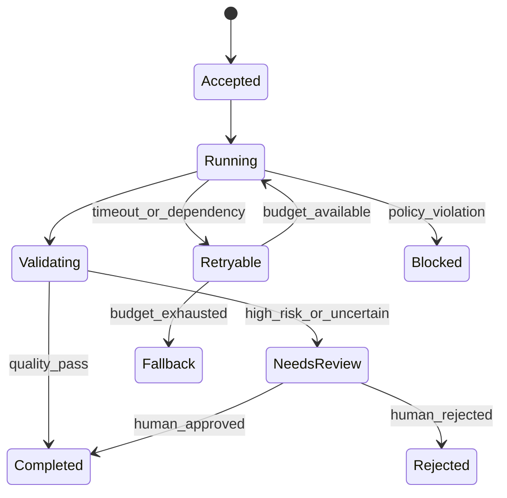

# AI 产品必要性、质量评估与运行治理

AI 产品不是把模型接到界面。产品必须证明 AI 相对确定性方案带来净收益，并建立输出质量、证据、人工确认、成本、延迟、隐私、降级和持续评估机制。

## 一、先判断 AI 是否必要

### 1.1 任务分解

把需求拆为输入、目标输出、允许变化、错误后果、反馈速度和可逆性。然后依次比较：

1. 固定规则或状态机。
2. 数据库查询、全文搜索或排序。
3. 传统统计/机器学习模型。
4. 生成式模型或代理。

能用确定性规则完整表达的合规、授权、金额和状态不变量，不应交给概率模型决定。AI 可以解释或辅助，但最终约束由代码和受控系统执行。

### 1.2 AI 适用条件

AI 更适合输入变化大、输出存在多个可接受答案、规则难以完整枚举且可从样本反馈评估的任务，例如分类、抽取、摘要、检索辅助和草稿生成。

还要满足：有足够目标流量样本；错误可检测或可恢复；收益覆盖模型与治理成本；用户能理解能力边界。

### 1.3 基线比较

| 方案 | 能力 | 确定性 | 主要成本 | 典型边界 |
| --- | --- | --- | --- | --- |
| 规则 | 精确执行已知条件 | 高 | 规则维护 | 长尾组合爆炸 |
| 搜索 | 返回匹配证据 | 结果可复现 | 索引与内容治理 | 不生成综合答案 |
| 传统模型 | 分类/预测 | 概率输出 | 训练与监控 | 任务边界较固定 |
| 生成式模型 | 开放生成与转换 | 输出有变异 | 推理、评估与风险 | 可能编造或不遵循约束 |

AI 方案至少超过一个简单基线。若关键词规则已达到 97% 任务成功，而大模型提高 0.5 个百分点却增加不可接受错误和十倍成本，采用 AI 缺少产品依据。

## 二、定义输出质量

NIST AI RMF 把有效可靠、安全、透明、可解释、隐私增强和公平等特征纳入风险管理，并强调这些特征要在具体场景中权衡。质量不是单一“准确率”。

### 2.1 质量契约

为每个任务写：

- 输入范围：语言、长度、文档类型、权限和新鲜度。
- 输出结构：字段、格式、引用和允许拒答。
- 评价维度：正确、完整、相关、证据一致、风格或可执行性。
- 不可接受错误：触发停止、人工接管或禁止动作的错误。
- 决策阈值：上线、扩大或回退所需结果。

### 2.2 错误分类

| 错误 | 定义 | 示例 | 处置 |
| --- | --- | --- | --- |
| 事实错误 | 与可验证事实冲突 | 错误合同金额 | 阻止自动执行 |
| 无证据陈述 | 来源不支持结论 | 引用段落未提该结论 | 标为失败或拒答 |
| 遗漏 | 缺少任务必需信息 | 摘要漏掉终止条件 | 人工复核/重试 |
| 指令偏离 | 未按结构或政策输出 | 输出自由文本而非字段 | 结构校验与降级 |
| 越权 | 使用无权数据或执行动作 | 引用其他租户文档 | 零容忍停止 |
| 有害建议 | 造成安全、权益或重大损失 | 未确认即建议停药 | 禁止自动化与专家接管 |

严重度由后果、可检测性和可恢复性共同决定。格式错误容易检测，跨租户泄露即使罕见也不可接受。

### 2.3 指标

分类任务可用 precision、recall、F1；抽取可按字段 exact match 与容错匹配；检索可用 recall@k、MRR、NDCG；生成任务需要基于评分规则的人评与自动检查组合。

```text
Precision = TP / (TP + FP)
Recall    = TP / (TP + FN)
F1        = 2 × Precision × Recall / (Precision + Recall)
```

阈值取决于错误代价。自动阻止交易要求高 precision，安全线索筛查可能更重 recall，并把误报交给人工。

平均分必须配切片、分布和置信区间。少数高风险样本不能被大量简单问题稀释。

## 三、引用、证据与人工确认

### 3.1 证据绑定

引用要连接到具体声明，而不是在答案末尾罗列文档。每条证据至少保存文档 ID、版本、片段位置、检索时间和用户访问权限。

答案生成后执行 entailment 或规则检查只能降低风险，不能证明正确。对高风险任务，人工可直接打开原文核对。

### 3.2 检索与生成边界

检索失败有不同原因：无权访问、无相关文档、索引过期、切分丢失、排序错误。系统不应把“没有检索到”解释为“事实不存在”。

生成层只能使用被授权证据；权限过滤在检索前和读取时执行，不能依赖模型遵守“不要泄露”。

### 3.3 人工确认设计

欧盟 AI Act 对高风险系统规定与风险相称的人类监督，并要求监督者能理解能力与局限、识别异常、避免过度依赖并在必要时干预或停止。即使具体产品不属于其法律适用范围，这些机制仍可作为高风险设计检查项。

有效人工确认需要：

- 有足够证据和差异展示。
- 有时间、能力和权限拒绝。
- 拒绝不会受到不合理绩效惩罚。
- 修改和理由可记录。
- 高风险动作在确认前不可执行。

只增加一个默认高亮的“确认”按钮会产生自动化偏误，不能构成有效监督。

## 四、成本、延迟与隐私

### 4.1 端到端成本

```text
每成功任务成本 =
  模型输入输出
  + embedding与检索
  + 工具/API
  + 重试与回退
  + 审核与人工接管
  + 观测和存储
  --------------------------------
  成功完成且达到质量阈值的任务数
```

按请求平均成本会隐藏代理循环、长上下文和失败重试。报告 p50、p95 和高成本切片。

### 4.2 延迟预算

端到端延迟由排队、检索、模型首 Token、生成、工具、校验和网络组成。流式输出降低感知等待，但最终动作仍要等结构和安全校验完成。

```text
T_total = T_queue + T_retrieval + T_model + T_tools + T_validation + T_network
```

为同步建议、后台报告和代理任务分别设 SLO。长任务应可取消、显示进度、保存中间状态并在完成后通知。

### 4.3 成本控制

- 路由：简单任务使用小模型，高风险或困难样本升级。
- 缓存：只缓存可安全复用且新鲜度明确的结果。
- 上下文：检索必要片段，避免整库输入。
- 输出限制：结构和最大长度明确。
- 循环预算：工具次数、Token、时间和金额上限。
- 批处理：非实时任务合并，但注意数据隔离和失败重放。

成本优化必须在同一质量与风险门槛下比较。

### 4.4 隐私与供应链

记录数据类别、目的、处理位置、保留、训练用途、子处理者和删除能力。默认不发送完成任务不需要的字段；日志和评估集同样受数据治理约束。

模型供应商、向量库、可观测平台和人工标注方构成数据链。合同承诺不能替代技术最小化、访问控制、加密和审计。

## 五、失败降级与人工接管

### 5.1 失败状态



“失败”不能只有一个错误页。超时、限流、结构无效、证据不足、风险命中、工具部分成功和用户取消需要不同恢复动作。

### 5.2 降级策略

- 生成失败转为搜索结果，而不是编造答案。
- 高级模型不可用时，小模型只处理已验证的低风险任务。
- 工具写操作失败时停止后续步骤并查询真实状态。
- 引用不足时明确拒答并提供人工或原文入口。
- 成本预算耗尽时保存进度，等待确认后继续。

降级能力必须真的满足最低任务标准。把质量不足的模型称为“降级”不等于可接受。

### 5.3 上下文交接

人工接管包包含用户目标、已确认输入、模型输出、证据、工具调用与结果、失败原因、风险标记和允许下一动作。不要要求用户重新陈述所有信息，也不要把模型内部推理当作事实交给人工。

### 5.4 不可逆动作

付款、删除、发布、权限变更和外发消息使用：确定性授权、参数校验、预览、明确确认、幂等键、执行回执和审计。模型只能提出动作草案。

## 六、真实评估数据集

### 6.1 评估单元

每条样本包含输入、上下文、权限、期望行为、评分规则、错误严重度、来源切片和版本。期望行为可以是多个可接受结果或“应拒答”。

### 6.2 抽样框

从目标生产流量按任务和风险分层抽样，不只收集演示成功例。包括：

- 常见正常任务。
- 长尾语言、格式和长度。
- 空、冲突、过期和恶意输入。
- 权限边界与跨租户诱导。
- 工具失败和状态未知。
- 不可接受错误的高风险样本。

### 6.3 数据集分层

- 开发集：迭代提示与流程，可频繁查看。
- 回归集：已知故障与关键能力，变更必跑。
- 盲测集：减少对测试集过拟合，限制查看。
- 线上观察集：验证真实分布、漂移和交互行为。

同一文档的近重复片段不能跨集合，否则结果过于乐观。数据集、评分器、模型、提示、检索索引和工具版本共同决定结果。

### 6.4 标注协议

定义每个标签、边界例、证据要求、冲突仲裁和不知道选项。双人独立标注只对需要人工判断的关键样本使用；一致率低说明规则或任务含糊，不应只强迫一致。

### 6.5 评估报告

```text
总体结果 + 置信区间
各任务/风险/语言/长度切片
严重错误绝对数量
相对当前生产和简单基线的差异
成本与延迟分布
人工接管率和接管成功率
已知未覆盖范围
```

## 七、质量、体验、成本与商业模式

### 7.1 质量—成本前沿

比较多个配置在同一数据集上的质量、严重错误、成本和延迟。被另一个方案在所有维度支配的配置不应上线。

更高平均质量未必值得更高成本。只在目标任务达到最小有意义改善、严重错误不增加且单位经济允许时升级。

### 7.2 体验约束

体验指标包括完成率、等待、修改率、放弃、接管、信任校准和恢复。用户频繁修改可能表示输出质量不足，也可能是产品定位为协作草稿；必须结合任务完成判断。

### 7.3 商业模式

- 席位：易预算，但推理成本可能与席位无关。
- 用量：收入与成本接近，但抑制尝试并制造账单不确定。
- 能力层级：高级模型/低延迟收费，需让差异可观察。
- 结果收费：价值强，但结果定义与归因困难。
- 混合：基础平台费加用量，兼顾承诺与重度成本。

每种模式都要模拟轻、中、重账户的收入、直接成本、支持和风险事件。平均账户为正不代表尾部账户可持续。

### 7.4 风险预算

商业增长不能消费不可接受安全、权益和隐私风险。一般质量错误可设统计阈值；跨租户泄露、未经确认的高影响动作采用零容忍停止。

## 八、案例一：合同问答助手

### 输入与必要性

法务团队每周处理 400 个合同问题，关键词搜索需要人工阅读多个版本。确定性规则负责权限、合同状态和金额计算；AI 只负责检索证据、生成摘要草稿。

### 质量契约

每个答案必须逐条引用有效合同版本；无证据或冲突时拒答。不可接受错误包括引用其他客户合同、遗漏终止条件、把草案当生效条款。

评估集 600 题，按条款类型、语言、扫描质量和版本冲突分层。主要指标为“全部关键声明有正确证据”的答案比例，而不是文本相似度。

### 方案比较

关键词基线合格率 62%，小模型 RAG 为 81%，大模型为 86%。大模型成本是小模型 3.4 倍；在低风险简单问题上两者差异仅 1 点，在冲突条款上差 12 点。

团队采用路由：简单单文档问题走小模型，检测到多版本或高风险条款走大模型并人工确认。

### 失败分支

上线前测试发现索引权限更新延迟五分钟。模型提示不能防止泄露。团队阻塞发布，将权限过滤移到实时授权服务，并加入权限撤销回归样本。

### 验证

Canary 观察严重错误、证据合格、拒答、延迟、人工接管和每成功答案成本。人工确认前不允许答案外发给客户。

## 九、案例二：客服退款代理

### 输入

目标是缩短退款处理时间。退款资格由订单状态、金额、时限和风险规则确定；这些规则可精确编码。AI 用于理解用户描述、收集缺失信息和生成解释。

### 状态与工具

代理先读取订单，结构化用户意图，调用确定性资格服务，再生成退款草案。超过 500 元、规则冲突或身份异常进入人工。

执行退款需要人工确认、幂等键和支付回执。工具超时进入状态未知，先查询支付系统，不直接重试。

### 评估

评估集包含正常退款、重复请求、部分退款、已拒付、跨账户、提示注入和支付超时。主要结果为端到端正确解决，护栏为错误退款、越权访问和重复退款。

### 成本与商业

小额常规请求自动完成可降低等待；复杂请求的模型循环和人工接管成本更高。团队按成功解决成本分层，不按模型请求数汇总。

### 失败分支

一次支付超时后，代理再次调用产生重复退款。复盘发现工具没有稳定幂等键，且“超时”错误被错误分类为可重试。

修复包括持久化业务动作 ID、状态未知查询、重复回执测试和支付写操作统一确认。提示词修改不能修复执行层不变量。

## 十、运行验证

### 发布门槛

- 离线评估超过简单基线和当前生产。
- 关键切片达到阈值，严重错误绝对数在限制内。
- 成本与延迟在轻、中、重任务下可接受。
- 权限、隐私、工具幂等和人工接管完成演练。
- 模型、提示、索引、工具和评估版本可追溯。

### 持续监控

监控输入分布、任务组合、拒答、错误、人工修改、接管、成本、延迟、供应商变化和安全事件。没有即时真值的任务通过抽样复核和延迟结果回填。

模型供应商更新、检索语料变化或工具契约变化都可能改变系统行为，需触发回归评估。

## 十一、综合练习

为一个真实 AI 功能完成产品与评估方案。

### 验收标准

- [ ] 与规则、搜索和非 AI 基线比较，说明 AI 的净增益。
- [ ] 输入范围、输出结构、质量维度和不可接受错误明确。
- [ ] 主要指标含切片、分布和置信区间。
- [ ] 引用逐条绑定声明并保留权限与版本。
- [ ] 人工确认者有证据、时间、能力和拒绝权。
- [ ] 成本按成功任务计算并包含重试、审核与接管。
- [ ] 端到端延迟拆到检索、模型、工具和校验。
- [ ] 数据最小化、供应链、留存与删除可核验。
- [ ] 超时、低置信、风险命中和工具部分成功有不同状态。
- [ ] 不可逆动作使用确定性授权、确认、幂等和回执。
- [ ] 评估集来自目标流量并覆盖长尾与高风险样本。
- [ ] 质量、体验、成本和商业模式在同一决策表中比较。

## 来源

- [NIST：AI Risk Management Framework](https://www.nist.gov/itl/ai-risk-management-framework)（访问日期：2026-07-22）
- [NIST AI 600-1：Generative Artificial Intelligence Profile](https://nvlpubs.nist.gov/nistpubs/ai/NIST.AI.600-1.pdf)（访问日期：2026-07-22）
- [NIST AIRC：AI RMF Core](https://airc.nist.gov/airmf-resources/airmf/5-sec-core/)（访问日期：2026-07-22）
- [OECD：AI Principles](https://www.oecd.org/en/topics/ai-principles.html)（访问日期：2026-07-22）
- [EU：Artificial Intelligence Act 2024/1689](https://eur-lex.europa.eu/legal-content/EN/TXT/?uri=CELEX:32024R1689)（访问日期：2026-07-22）
