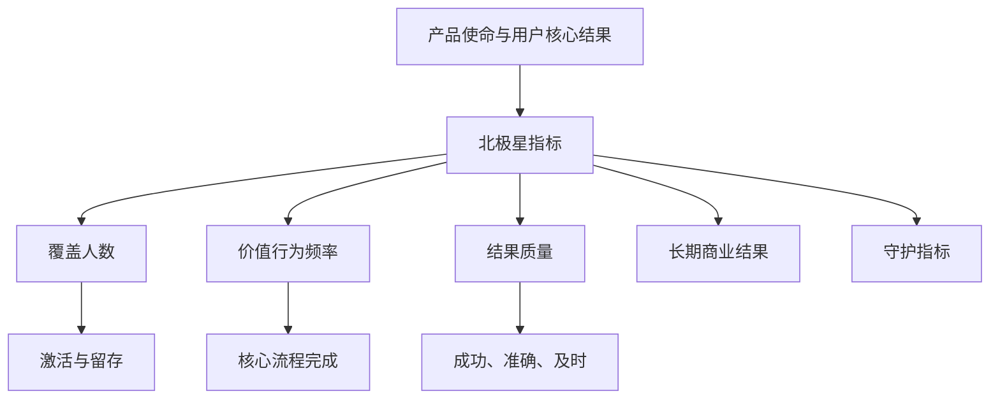
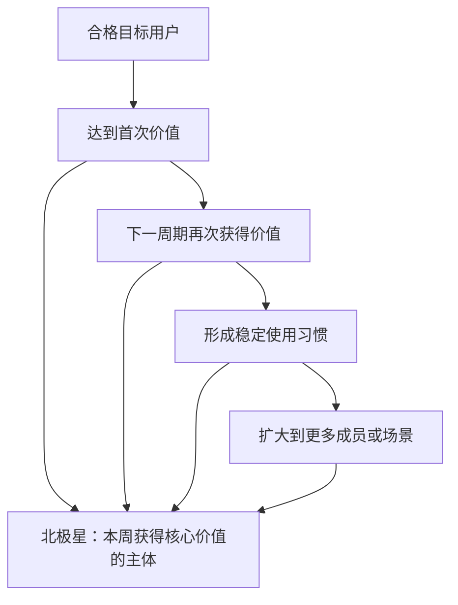

# 产品北极星指标

北极星指标是一个长期关注的产品结果指标，用于表达目标用户是否持续获得产品的核心价值。它不是企业唯一需要看的数字，也不是把所有团队绩效压缩成同一个目标。

北极星指标需要与输入指标、质量指标、风险守护指标和商业结果一起使用：



北极星指标负责方向，指标树负责解释变化和找到可行动的杠杆，守护指标负责阻止团队以破坏质量、安全或长期价值的方式优化。

## 一、北极星指标与其他指标的区别

| 类型 | 作用 | 时间尺度 | 示例 |
| --- | --- | --- | --- |
| 北极星指标 | 表达核心用户价值是否扩大 | 月、季度、年 | 每周完成有效协作的工作区数 |
| 输入指标 | 描述团队可影响的前置行为 | 天、周 | 首次邀请完成率 |
| 结果指标 | 判断某个项目是否达到目标 | 项目窗口 | 新导航使任务完成率提高 8 个百分点 |
| 守护指标 | 限制不可接受的副作用 | 实时、天、周 | 越权事件、错误率、退订率 |
| 健康指标 | 监控系统和业务基本运转 | 实时、天 | 可用性、延迟、支付成功率 |
| 商业指标 | 描述收入与经济结果 | 月、季度 | 收入、毛利、续费率 |
| 虚荣指标 | 数字可增长但与价值关系弱 | 任意 | 累计注册数、累计页面浏览 |

北极星指标可以与商业指标相关，但不应默认等同。收入增长可能来自涨价、一次性大单或提高抽成，而用户获得的结果并未改善；使用量增长也可能来自重复操作、错误重试或强制流程。

## 二、什么是“核心价值”

“价值”必须落到目标主体的可观察结果，而不是产品页面上的任意活动。

可以按四层拆解：

1. **功能输出**：系统生成了什么，例如创建文档。
2. **用户行为**：人做了什么，例如分享文档。
3. **任务结果**：目标是否完成，例如团队完成评审并发布决定。
4. **长期结果**：任务结果是否持续产生，例如团队每周稳定完成协作。

只统计输出容易被系统自动生成放大；只统计点击容易奖励无效操作。北极星应尽量接近任务结果，同时保持数据可得和足够短的反馈周期。

### 示例：团队文档产品

候选指标：

| 候选 | 优点 | 主要缺陷 |
| --- | --- | --- |
| 每周页面浏览量 | 易采集、反馈快 | 重复刷新也增长，无法证明完成工作 |
| 每周创建文档数 | 对创作行为敏感 | 空文档和重复模板会放大 |
| 每周活跃用户数 | 覆盖范围清楚 | 打开产品不等于获得价值 |
| 每周完成有效协作的工作区数 | 同时包含内容、协作与结果 | 需定义“有效协作” |

“有效协作”可以定义为：同一工作区在自然周内至少有一个非测试文档，被两名及以上成员进行实质编辑或评审，并最终进入明确的完成状态。具体阈值必须用产品事实验证，不能照搬其他产品。

## 三、选择北极星指标的七个条件

### 1. 指向用户结果

指标上涨时，目标主体获得结果的概率或规模应合理增加。

检查：

- 是否只需重复点击就能提高？
- 系统自动任务是否会被当成人的价值行为？
- 失败重试是否增加分子？
- 指标是否偏好高频用户而忽略低频但高价值任务？

### 2. 与长期价值有可检验关系

应检验历史上更高指标值是否与留存、续费或其他长期结果相关，但相关不等于因果。

需要：

- 固定分析单位；
- 按首次进入时间建立 cohort；
- 避免用未来信息定义当期分组；
- 控制套餐、规模、地区和获客来源等明显混杂；
- 用实验或自然变化继续验证可干预性。

### 3. 对产品改进有响应

指标过于滞后会失去日常决策价值。例如年度续费非常重要，但团队无法每周获得稳定反馈。可以保留续费作为长期商业结果，以“每周完成关键工作流的付费工作区数”作为更快的产品价值指标。

### 4. 不容易被低成本操纵

如果推送通知、自动刷新、默认勾选或拆分动作就能让数字增长，指标会奖励错误行为。

防操纵规则包括：

- 按唯一主体去重；
- 只计业务成功结果；
- 排除内部、机器人和测试流量；
- 为最短有效时长或最低质量设置门槛；
- 同时展示负向守护指标；
- 定期抽样核对原始记录。

### 5. 定义稳定且可计算

任何分析人员使用同一数据版本都应得到相同结果。指标合同至少包含：

```yaml
metric_id: weekly_workspaces_with_effective_collaboration
version: 3
unit: workspace_id
window:
  type: calendar_week
  timezone: Asia/Shanghai
eligible:
  plan: ["free", "pro", "enterprise"]
  exclude: ["internal", "test", "suspended"]
numerator:
  condition: >
    至少一个文档由两个及以上非机器人成员发生实质编辑或评审，
    且文档在同一自然周进入 completed 状态
deduplication: "workspace_id + calendar_week"
late_data_policy: "T+3 日冻结，之后修订进入变更日志"
owner: product-analytics
```

### 6. 能被指标树解释

北极星变化应能拆解为可核对的数学关系或清晰机制。

例如：

```text
每周有效协作工作区
= 每周合格活跃工作区
× 发起协作的比例
× 协作达到有效门槛的比例
```

若三个因子使用相同 cohort 和时间窗，乘积关系成立。若分母不同，不能把它们硬连成乘法树。

### 7. 与使命和商业可持续性兼容

指标只表达用户价值而完全不受商业约束，企业可能无法持续提供服务；只表达收入，又可能奖励短期榨取。两者的关系应显式说明：


这是一项需要验证的机制假设，不是所有产品天然成立。

## 四、怎样建立候选指标

### 第一步：写清使命和目标主体

使命应描述改变，而不是产品形态：

```text
帮助小型软件团队把分散的需求、决定和实现证据连接起来，
减少遗漏与重复确认，使每次发布都可追溯。
```

接着说明谁是核心主体：开发者、产品负责人、整个工作区还是企业管理员。不同主体决定分析单位。

### 第二步：识别价值时刻

列出用户真正得到结果的时刻：

- 需求被拆成可实现任务；
- 决策与代码变更建立关联；
- 发布前发现未满足的验收条件；
- 新成员能从记录恢复上下文。

不要先看现有埋点再决定价值。埋点只能反映已经采集的行为，可能恰好漏掉最重要的离线或跨系统结果。

### 第三步：写候选及反例

| 候选 | 它代表的价值 | 上涨但价值未涨的反例 |
| --- | --- | --- |
| 关联需求的合并请求数 | 决定与实现可追溯 | 把一个变更拆成很多小 PR |
| 通过验收门的发布数 | 发布质量得到验证 | 降低验收门槛 |
| 每周完成闭环的工作区数 | 团队持续完成完整流程 | 用自动化批量制造完成记录 |

反例越容易出现，越需要调整定义或增加守护指标。

### 第四步：用历史数据做一致性检查

检查：

- 分布是否被极少数大客户支配；
- 新老用户是否有完全不同的自然频率；
- 周末、节假日和季节性如何影响；
- 指标增长是否只来自新增而非留存；
- 事件缺失、延迟和重复比例；
- 与任务完成、留存、支持成本的关系。

历史分析用于排除明显不合理候选，不能证明未来优化该指标一定产生长期价值。

### 第五步：评审可行动性和风险

对每个候选评分时保存证据，不只保存数字：

| 条件 | 候选 A：活跃用户 | 候选 B：有效协作工作区 |
| --- | ---: | ---: |
| 接近用户结果 | 2/5 | 5/5 |
| 对产品变化响应 | 5/5 | 4/5 |
| 定义可复现 | 5/5 | 3/5 |
| 抗操纵 | 2/5 | 4/5 |
| 可拆解 | 4/5 | 4/5 |
| 跨团队可理解 | 5/5 | 4/5 |

评分差距小于判断误差时，应保留多个候选运行一段时间，而不是用总分强行制造唯一答案。

## 五、建立指标树

### 1. 数学拆解

对计数型北极星，可以按主体和频率拆：

```text
有效价值总量
= 获得至少一次价值的主体数
× 每个主体的平均有效次数
× 每次结果的质量权重
```

使用“质量权重”需要非常谨慎。把主观分数乘入总量会隐藏真实分布。更稳妥的方式通常是设置最低质量门槛，并单独展示质量分布。

### 2. 用户生命周期拆解



新增、留存和复活应分开。北极星增长若完全来自一次性新增，而留存恶化，长期结果可能下降。

### 3. 可控输入指标

团队应拥有能直接通过产品机制改变的输入，而不是被要求“提高北极星”：

| 团队 | 可控输入 | 机制 |
| --- | --- | --- |
| 新用户体验 | 首次价值完成率 | 缩短配置、提供可修复错误 |
| 协作 | 邀请后参与率 | 清楚权限、通知和待办 |
| 平台 | 核心流程成功率 | 可靠请求、幂等和恢复 |
| 内容发现 | 有效结果打开率 | 改善索引、排序和解释 |

输入指标与北极星之间是待验证关系。指标树不是因果图；线条只表示团队当前认为存在机制联系。

## 六、守护指标

优化任何单一指标都会产生局部激励，需要至少覆盖：

### 质量

- 任务成功而非仅发起；
- 错误结果占比；
- 撤销、退款或返工；
- 人工支持率。

### 用户控制

- 退订和关闭率；
- 误触与取消；
- 通知投诉；
- 数据删除请求。

### 安全与公平

- 越权事件；
- 敏感数据暴露；
- 不同群体的成功率差异；
- 无障碍关键任务失败。

### 系统与成本

- P95/P99 延迟；
- 错误率与可恢复率；
- 单次有效结果的计算或人工成本；
- 供应商限额和队列积压。

守护指标应有明确停止阈值。只有图表而没有动作规则，异常时团队仍会争论是否继续。

## 七、案例一：B2B 协作产品

### 候选

1. 周活跃用户数；
2. 每周编辑文档数；
3. 每周完成有效协作的工作区数。

选择第三项，因为它以工作区为单位，要求两名及以上成员完成实质协作和结果确认，更接近团队价值。

### 指标合同

```sql
WITH eligible AS (
  SELECT workspace_id
  FROM workspace_daily
  WHERE week_start = DATE '2026-07-13'
    AND is_internal = false
    AND is_suspended = false
),
effective_docs AS (
  SELECT workspace_id, document_id
  FROM document_activity
  WHERE occurred_at >= TIMESTAMP '2026-07-13 00:00:00+08:00'
    AND occurred_at <  TIMESTAMP '2026-07-20 00:00:00+08:00'
  GROUP BY workspace_id, document_id
  HAVING COUNT(DISTINCT human_member_id) >= 2
     AND COUNT_IF(activity_type IN ('substantive_edit', 'review')) >= 2
     AND MAX(CASE WHEN document_state = 'completed' THEN 1 ELSE 0 END) = 1
)
SELECT COUNT(DISTINCT e.workspace_id)
FROM eligible e
JOIN effective_docs d USING (workspace_id);
```

查询只是实现示例。生产定义还要说明撤回完成、成员跨工作区、迟到事件和事件重放。

### 诊断

北极星下降 9% 时，先拆：

- 合格活跃工作区下降 2%；
- 发起协作比例持平；
- 达到有效门槛比例下降 7%。

继续按版本分群发现下降集中在新编辑器版本。再检查流程漏斗，发现评审完成事件未在离线恢复后补发。此时应先修数据和状态恢复，不能解释为用户价值下降。

## 八、案例二：AI 文档问答

“回答次数”不是良好北极星。模型重复回答、用户反复改写和无效答案都会让它增长。

候选为“每周获得有证据支持的有效答案的工作区数”，有效答案要求：

- 用户问题进入支持范围；
- 系统返回答案或明确无法回答；
- 引用能够定位到用户有权限查看的原文；
- 用户未立即以同一意图重复提问；
- 抽样评估中的证据支持率达到门槛。

守护指标：

- 无权来源引用为 0；
- 引用不支持答案的抽样率低于阈值；
- P95 首个可见结果时间；
- 每个有效答案成本；
- 明确无法回答率按问题类型分布。

如果团队只优化有效答案数，可能降低“无法回答”门槛并产生臆测，因此证据支持率和权限事件是硬守护项。

## 九、上线、版本与治理

### 指标版本

定义变化时不要静默重算：

```yaml
change:
  metric_id: weekly_workspaces_with_effective_collaboration
  from_version: 2
  to_version: 3
  effective_at: "2026-07-20"
  change: "排除仅由自动化机器人产生的评审事件"
  estimated_impact: "-4.2% based on previous 8 weeks"
  backfill: "v2 与 v3 并行展示 8 周"
  approvers: ["product-analytics", "data-platform"]
```

### 数据质量

每天检查：

- 事件量与历史区间；
- 必填 ID 缺失；
- 重复事件；
- 客户端与服务端成功差异；
- 迟到数据比例；
- 新版本事件覆盖；
- 时区边界；
- 内部流量排除。

### 决策记录

指标异常后保存：

- 观察到的变化；
- 使用的数据版本；
- 排除的数据质量问题；
- 分群和拆解；
- 当前解释与不确定性；
- 采取的动作；
- 复查时间。

只有异常截图而没有动作与复查，会形成无法学习的看板历史。

## 十、何时需要更换北极星

以下变化会触发重新评审：

- 产品使命或核心主体改变；
- 从单边工具变为多边市场；
- 产品从一次性任务变为持续服务；
- 指标与长期留存或结果的关系长期失效；
- 指标被自动化、定价或组织结构轻易操纵；
- 一个指标无法表达多个独立核心产品。

更换时保留旧指标一段并行窗口，解释历史趋势断点。不要为了“始终上升”而在下降时临时修改口径。

## 十一、常见错误

### 直接使用累计值

累计注册数几乎只会上升，不能说明当前用户是否获得价值。改用固定时间窗内的合格主体或 cohort 结果。

### 用 DAU 代表所有产品价值

对于报税、旅行预订或年度审计等低频任务，频繁访问可能意味着任务没有完成。自然频率必须来自真实使用场景。

### 把收入设为唯一北极星

收入是必要商业结果，但无法区分价格、数量、用户价值和成本。应同时建立用户结果指标和经济约束。

### 为每个团队设一颗互不相关的“北极星”

团队输入指标可以不同，但应能连接到共同产品结果。否则只是把 KPI 改名。

### 把指标树当作因果证明

数学恒等拆解可以解释数量构成；行为之间的箭头仍是假设，需要实验、准实验或其他证据验证。

## 十二、评审清单

- [ ] 指标描述目标主体获得的核心结果，不是任意活动。
- [ ] 分析单位、窗口、时区、分子、分母和排除项明确。
- [ ] 重复、迟到、撤回和机器人流量有处理规则。
- [ ] 已列出“指标上涨但价值未上涨”的反例。
- [ ] 与长期结果的关系有数据支持，但未误称为因果。
- [ ] 指标对合理的产品变化有足够快的响应。
- [ ] 指标树的数学关系使用一致分母和 cohort。
- [ ] 每个输入指标有能影响它的机制和负责人。
- [ ] 质量、安全、用户控制和成本守护指标有停止阈值。
- [ ] 指标定义版本化，变化有并行对照和影响说明。
- [ ] 看板能区分真实变化与数据质量故障。
- [ ] 北极星不被用作个人绩效的唯一评价。

## 来源

- [GOV.UK Service Manual：Using performance data to improve your service](https://www.gov.uk/service-manual/measuring-success/using-data-to-improve-your-service-an-introduction)（访问日期：2026-07-18）
- [GOV.UK Service Manual：How to set performance metrics for your service](https://www.gov.uk/service-manual/measuring-success/how-to-set-performance-metrics-for-your-service)（访问日期：2026-07-18）
- [Amplitude：The North Star Playbook](https://info.amplitude.com/rs/138-CDN-550/images/Amplitude-The-North-Star-Playbook.pdf)（访问日期：2026-07-18）
- [Mixpanel：What is a North Star metric?](https://mixpanel.com/blog/north-star-metric/)（访问日期：2026-07-18）
- [W3C Web Platform Design Principles](https://www.w3.org/TR/design-principles/)（访问日期：2026-07-18）
