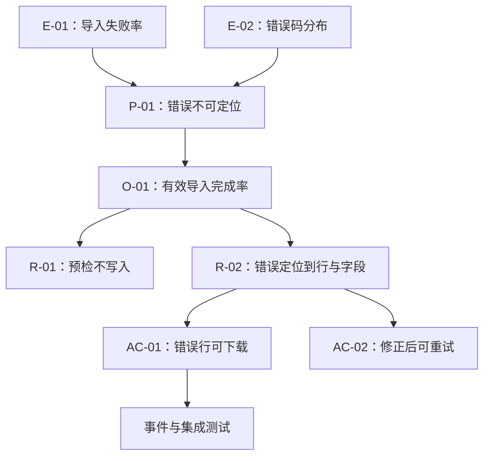

# 写清为什么做与不做什么

PRD 中的“为什么做”负责证明待解决的问题真实存在、值得现在处理，并说明期望改变的结果。“不做什么”负责明确本轮不会改变的相邻问题、用户、场景与系统能力。

这两部分共同限定决策空间。只有功能清单而没有理由，团队无法判断需求变化是否仍服务于目标；只有目标而没有非目标，任何相关诉求都可能被解释为范围的一部分。

## 一、从问题到方案的完整链路

一项需求至少包含五种不同对象：

| 对象 | 回答的问题 | 示例 |
| --- | --- | --- |
| 事实 | 现在实际发生了什么 | 近 28 天有 31% 的新工作区未完成首次数据导入 |
| 问题 | 哪个主体在何种场景受到什么阻碍 | 管理员无法判断 CSV 中哪些行不符合导入规则 |
| 结果 | 问题解决后什么可观察结果会改变 | 管理员能修正错误并完成有效导入 |
| 方案 | 系统或流程怎样产生改变 | 导入前预检并按行返回可修复错误 |
| 输出 | 团队具体交付什么 | 预检接口、错误列表、修正后重试、埋点和告警 |

它们的关系是：


错误写法通常把链路压缩成一句“为了提升体验，增加智能导入”。“提升体验”没有主体、场景和结果，“智能导入”又已经指定方案，因此既不能验证理由，也不能比较其他路径。

## 二、“为什么做”的组成

### 1. 目标主体

主体是直接获得结果或承担成本的人，而不是笼统的“用户”。

应明确：

- 角色：管理员、编辑者、审批人、访客或系统集成方。
- 条件：新用户还是长期用户，免费版还是企业版，是否拥有特定权限。
- 分析单位：人、工作区、订单、文档、会话或设备。
- 排除条件：内部测试账号、机器人流量、历史迁移数据等。

同一个功能对不同主体可能产生相反结果。例如，自动发布减少编辑者操作，却增加审批人的风险。PRD 不能只记录受益者而忽略承担错误成本的人。

### 2. 触发场景

场景说明需求在何时出现，至少写出：

- 前置状态；
- 触发事件；
- 当前工作流；
- 关键限制；
- 失败后的后果。

“管理员需要导入数据”过于宽泛。更可执行的描述是：

> 管理员首次创建工作区后，需要把旧系统导出的 CSV 导入成员目录；旧文件中可能存在重复邮箱、未知角色和无效日期。现有页面只返回“导入失败”，管理员无法定位错误行，只能修改整份文件后反复尝试。

这段描述可以直接导出数据格式、错误定位、重试和幂等要求。

### 3. 可观察事实

事实必须带有来源、时间、口径和限制。

| 证据 | 可以支持什么 | 不能单独证明什么 |
| --- | --- | --- |
| 服务端任务结果 | 完成、失败及错误类型 | 用户为什么放弃 |
| 前端行为事件 | 页面和控件的实际使用路径 | 后端业务结果已经成功 |
| 搜索日志 | 用户使用的词和零结果查询 | 没搜索的人是否也有相同需求 |
| 客服工单 | 高摩擦问题的具体表现 | 全体用户中的发生比例 |
| 销售或实施记录 | 企业购买与落地阻碍 | 最终使用者的日常行为 |
| 可用性任务 | 特定任务中的理解和操作问题 | 真实环境下的长期留存 |

证据表应保存原始位置，而不是只粘贴结论：

```yaml
evidence:
  - id: E-01
    statement: "1,240 个首次导入任务中有 384 个未产生有效成员"
    source: "warehouse://product/import_tasks/v3"
    window: "2026-06-01/2026-06-28"
    unit: "workspace_id"
    denominator: 1240
    exclusions: ["internal_workspace", "automated_test"]
    limitation: "只能确认业务结果，不能确认放弃原因"
```

### 4. 影响

影响不是把人数乘以一个主观权重。需要分别描述：

- 用户结果：是否无法完成目标、需要返工、等待或转到人工渠道。
- 发生范围：受影响主体的数量和占比。
- 发生频率：一次性迁移、每周重复还是每次核心任务都会出现。
- 严重程度：轻微摩擦、结果错误、资金损失、权限泄露或合规风险。
- 业务结果：激活、履约成本、续费、投诉或支持压力。
- 系统结果：失败重试、资源浪费、数据污染或不可恢复状态。

不要把收入机会直接等同于用户价值。销售预测能够支持商业优先级，但不能证明方案会改善目标主体的结果。

### 5. 为什么现在做

“现在”需要有可验证的时间条件：

- 证据达到预先定义的严重度或频率阈值；
- 上游规则、平台能力或法规发生确定变化；
- 当前架构窗口能以显著更低的成本完成迁移；
- 即将发布的依赖会放大现有问题；
- 前置实验已经消除关键不确定性。

“行业都在做”“竞争对手上线了”“AI 很热门”只能触发调查，不能单独构成立项理由。竞争变化是否重要，取决于它是否改变目标用户的选择、预期或迁移成本。

### 6. 目标结果

目标写结果，不写界面或实现：

```text
在【时间窗口】内，
【目标主体】于【触发场景】
能够完成【可观察结果】，
主指标从【基线】达到【目标】，
同时【质量/风险守护指标】不越界。
```

导入示例：

```yaml
outcome:
  actor: "首次导入成员的工作区管理员"
  window: "任务创建后 24 小时"
  primary_metric:
    name: "有效导入完成率"
    definition: "产生至少一个有效成员的工作区 / 发起导入的合格工作区"
    baseline: 0.69
    target: 0.82
  guardrails:
    - "错误创建的成员占比 <= 0.1%"
    - "跨工作区数据泄露事件 = 0"
    - "P95 预检时间 <= 5 秒"
```

目标不等于承诺因果。上线后指标达到阈值，也要排除同期渠道变化、样本构成变化和埋点故障。

## 三、目标、需求、范围和非目标的区别

| 概念 | 内容 | 是否描述实现 |
| --- | --- | --- |
| 目标 | 希望改变的用户或业务结果 | 否 |
| 需求 | 为实现结果必须满足的行为和约束 | 可以描述系统行为，不应锁死内部实现 |
| 范围 | 本轮承诺覆盖的主体、场景、规则和交付物 | 是 |
| 非目标 | 本轮明确不追求的相邻结果 | 否，但可说明因此不交付哪些能力 |
| 后续项 | 有证据支持但排在之后的工作 | 可以 |
| 未决问题 | 尚无足够证据做决定的事项 | 否 |

“非目标”不是“低优先级需求”的别名。非目标声明本轮成功不依赖该结果；后续项则意味着需求成立，只是暂不排期。

## 四、怎样写非目标

### 1. 按边界类型排除

非目标可以从五类边界检查：

| 边界 | 应回答的问题 | 导入功能示例 |
| --- | --- | --- |
| 主体 | 哪些角色不在本轮服务范围 | 不支持普通成员发起组织级导入 |
| 场景 | 哪些触发情境不覆盖 | 不处理持续双向同步 |
| 结果 | 哪些相邻结果不作为成功条件 | 不以提高成员活跃率作为本轮目标 |
| 能力 | 哪些系统行为不会提供 | 不自动猜测未知角色 |
| 质量级别 | 哪些规模或服务等级尚不承诺 | 单文件暂不支持超过 100,000 行 |

### 2. 每条非目标包含理由

合理写法：

> 不支持 Excel 宏执行。目标是导入表格数据，执行文件内代码不会提高数据正确性，反而扩大安全边界。首版只读取受支持工作表中的值。

不合理写法：

> 暂不支持高级能力。

后者没有说明“高级”是什么、为什么排除，也无法帮助研发和测试判断边界。

### 3. 区分非目标与硬约束

- “不允许读取其他工作区数据”是安全约束，不是可以重新排序的非目标。
- “本轮不做跨工作区复制”是范围选择。
- “未来可能支持跨工作区复制”是候选后续项。

把约束写成非目标会产生危险含义：仿佛后续版本可以在没有新决策的情况下移除底线。

### 4. 不用非目标隐藏必要工作

以下事项通常不能仅靠一句“不在范围”排除：

- 新能力必然引入的权限校验；
- 写操作的失败恢复与幂等；
- 数据删除和保留义务；
- 基础无障碍；
- 监控、告警和回滚；
- 已支持平台上的关键兼容路径。

如果当前版本确实无法满足，应停止发布、缩小使用范围或采用人工控制，而不是把风险移出文档。

## 五、把理由变成可追踪结构

需求发生变化时，应能从交付物追溯到目标和证据：



建议给关键对象稳定 ID：

```yaml
requirement:
  id: R-02
  outcome: O-01
  evidence: [E-01, E-02]
  behavior: "预检错误必须包含稳定错误码、源行号和字段名"
  acceptance: [AC-01, AC-02]
  owner: "import-domain"
  status: "approved"
```

稳定 ID 让设计稿、接口、测试、埋点和发布记录可以引用同一对象。标题可以修改，ID 不应复用。

## 六、范围变化时怎样判断

收到新增诉求时，依次检查：

1. 它是否是目标结果成立的必要条件？
2. 它是否用于满足既有硬约束？
3. 它是否只是当前方案的一种实现偏好？
4. 它是否服务于未纳入范围的主体或场景？
5. 纳入后是否改变权限、数据、成本或上线风险？
6. 是否存在更小的方式验证它的必要性？

可以使用变更表：

| 变更 | 与目标关系 | 新成本或风险 | 决定 |
| --- | --- | --- | --- |
| 错误定位到源行 | 直接消除核心阻碍 | 需保留行号映射 | 纳入 |
| 自动修复未知角色 | 不是完成导入的必要条件 | 可能扩大权限 | 不纳入 |
| 支持下载错误报告 | 弱网络下完成修复所需 | 需处理敏感数据 | 纳入，文件 15 分钟过期 |
| 导入后发送欢迎邮件 | 服务激活的后续阶段 | 邮件合规与退订 | 独立立项 |

决定不是投票结果。硬约束不参与普通价值评分；证据不足时应标记未知，而不是用精确分数掩盖不确定性。

## 七、完整示例：成员导入预检

### 背景与事实

- 观察窗口：2026-06-01 至 2026-06-28。
- 分析单位：首次发起成员导入的非内部工作区。
- 1,240 个合格工作区中，856 个在 24 小时内产生有效成员。
- 384 个未完成工作区中，服务端记录了 611 次失败尝试。
- 失败尝试的前三类错误为重复邮箱、未知角色和日期格式错误。
- 客服工单能够说明错误信息难以理解，但不能用于估算总体发生率。

### 问题

首次迁移成员的管理员收到文件级失败结果，无法确定需要修改的行和字段。管理员必须重复修改整份文件并重新上传；部分管理员改用逐个创建成员，部分直接停止配置。

### 为什么现在做

接下来两个版本将把邀请、权限组和项目分配统一依赖成员目录。若首次导入仍不可修复，新流程会放大当前阻碍。现有导入服务已经输出结构化错误码，可以在不执行自动修复的前提下增加预检。

### 目标

- 24 小时有效导入完成率从 69% 提高到至少 82%。
- 错误创建成员比例不超过 0.1%。
- 任何跨工作区数据访问事件为 0。
- 预检 P95 在 5 秒内完成。

### 范围

- CSV UTF-8 文件；
- 10,000 行以内；
- 上传后先预检，不产生写入；
- 错误包含错误码、行号、字段与修复建议；
- 预检通过后由管理员明确确认写入；
- 相同幂等键重复提交不创建重复成员；
- 错误报告下载链接 15 分钟过期。

### 非目标

- 不执行 Excel 宏，也不读取外部链接。
- 不自动猜测未知角色，因为错误授权比人工修正成本更高。
- 不提供与旧系统的持续同步；本轮只处理一次性迁移。
- 不以提升导入后成员活跃度作为成功条件；活跃度属于后续激活流程。
- 不支持超过 10,000 行的在线处理；大文件先通过受控离线迁移。

### 未决问题

- 10,000 行限制覆盖多少目标工作区，需要从真实文件大小分布确认。
- 错误报告是否包含敏感字段，需要安全评审确定脱敏规则。
- 多语言错误消息的首发范围，需要按目标用户语言分布决定。

### 停止或调整条件

- 出现一次高严重度越权读取，立即关闭入口并保留审计证据。
- 错误创建成员比例超过 0.1%，回滚到旧写入路径。
- 完成率未提高但预检使用率高，检查错误建议是否可执行。
- 预检通过率异常升高而后续写入失败，优先核对校验规则是否与写入规则漂移。

## 八、反例与修正

### 反例一：以功能作为原因

错误：

> 为了支持 AI 能力，增加智能总结。

修正：

> 项目负责人每周需要从 30 至 80 条更新中识别阻塞项；当前人工整理中有 18% 的已标记阻塞未进入周报。目标是减少遗漏，候选方案包括结构化填报、规则聚合和模型总结，先比较其准确性与维护成本。

### 反例二：目标没有分母

错误：

> 将成功数提高 20%。

修正：

> 在创建后 7 天内，完成首次发布的合格工作区占比从 42% 提高到 50%；合格工作区排除内部测试与受合同限制的迁移账号。

### 反例三：非目标等于“以后再说”

错误：

> 移动端、权限和异常情况不在范围。

修正：

> 首版入口只对桌面端管理员开放；服务端权限规则与现有写接口一致。移动端不显示入口，但已有对象在移动端仍可只读查看。网络失败保留草稿并允许使用同一幂等键重试。

### 反例四：把证据限制删除

错误：

> 80% 用户都要求批量操作。

修正：

> 最近 90 天 126 张相关工单中有 101 张提到重复操作；工单样本偏向遇到问题并主动求助的人，不能推断为全体用户的 80%。下一步用行为日志估算符合条件任务的总体规模。

## 九、评审清单

### 理由

- [ ] 目标主体、触发场景和分析单位明确。
- [ ] 每条关键事实带来源、窗口、口径和限制。
- [ ] 问题没有预先锁定某个界面或技术。
- [ ] 影响同时覆盖用户、业务和风险成本。
- [ ] “为什么现在”包含真实变化或决策阈值。
- [ ] 目标有基线、分母、时间窗和守护指标。

### 非目标

- [ ] 分别检查主体、场景、结果、能力和质量级别。
- [ ] 每条非目标说明排除理由。
- [ ] 非目标与后续项、未知项和硬约束分开。
- [ ] 没有用非目标排除权限、恢复、隐私、监控或基础无障碍。
- [ ] 范围外路径在界面和接口上有确定行为。

### 可追踪性

- [ ] 证据、问题、目标、需求和验收条件可互相追溯。
- [ ] 范围变化会同步更新测试、埋点、发布和回滚。
- [ ] 决策记录包含负责人、日期和重新评审触发器。
- [ ] 指标异常时能区分产品结果、数据质量和系统故障。

## 来源

- [GOV.UK Service Manual：Understand users and their needs](https://www.gov.uk/service-manual/service-standard/point-1-understand-user-needs)（访问日期：2026-07-18）
- [GOV.UK Service Manual：Learning about users and their needs](https://www.gov.uk/service-manual/user-research/start-by-learning-user-needs)（访问日期：2026-07-18）
- [GOV.UK Service Manual：Understanding and meeting policy intent](https://www.gov.uk/service-manual/design/understanding-and-meeting-policy-intent)（访问日期：2026-07-18）
- [W3C Web Platform Design Principles](https://www.w3.org/TR/design-principles/)（访问日期：2026-07-18）
- [Kubernetes Enhancement Proposal Template](https://github.com/kubernetes/enhancements/blob/master/keps/NNNN-kep-template/README.md)（访问日期：2026-07-18）
