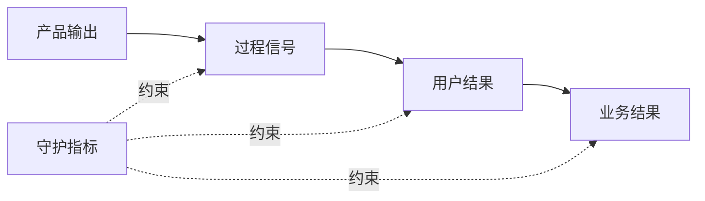

# 成功指标与守护指标

成功指标量化目标结果是否改善；守护指标监测改善过程中不能被牺牲的质量、安全、公平、成本或长期价值。两者共同定义“什么变化算成功”，避免团队只优化一个容易上升的数字。

## 前置知识与能力边界

先掌握：

- [频率、严重度、影响范围与证据可信度](../problem-evidence/14-frequency-severity-reach-confidence.md)；
- [产品分析与日志](../problem-evidence/12-product-analytics-logs.md)；
- [业务目标与产品目标](03-business-product-goals.md)。

本文讨论需求定义阶段的指标设计。事件埋点、漏斗、分群、实验统计和因果推断会在产品数据模块继续展开。

## 1. 指标不是单独一个名称

一个可执行指标至少包含：

| 字段 | 作用 | 示例 |
|---|---|---|
| 决策问题 | 为什么计算 | 自助流程是否让更多合格用户完成退款 |
| 事件/事实 | 计数对象 | `refund_completed`，服务端确认成功 |
| 分子 | 成功对象 | 窗口内完成的合格退款申请 |
| 分母 | 可获得机会 | 窗口内开始且满足自助资格的申请 |
| 单位 | 人、账户、任务或事件 | 去重后的申请 `refund_id` |
| 窗口 | 何时归因 | 开始后 24 小时内 |
| 过滤 | 哪些对象进入 | 生产环境、标准规则、非内部账户 |
| 分组 | 哪些差异需检查 | 渠道、设备、资格类型、新老用户 |
| 数据源 | 从哪里计算 | 服务端事务事件与资格快照 |
| 基线 | 改动前水平 | 过去 8 周中位数 29.2% |
| 目标范围 | 期望变化 | 50%–58% |
| 质量检查 | 数据是否可信 | 缺失、重复、延迟和版本 |
| 所有者 | 谁解释并行动 | 退款产品负责人和数据分析 |

只写“转化率”“留存率”“成功率”会让不同人使用不同分母、窗口和去重规则，最终得到无法比较的数字。

## 2. 三层指标结构



### 2.1 输出指标

页面上线、实验覆盖、功能可用账户数。它们证明交付发生，不证明价值产生。

### 2.2 过程与领先指标

资格理解、流程开始、关键步骤完成、首次价值时间。这些信号较快，但必须有理由说明它们预测最终结果。

### 2.3 结果与滞后指标

任务完成、错误减少、持续使用、续约、成本或风险变化。它们更接近目标，但反馈慢且受外部因素影响。

一个需求通常选择一个主要成功指标、少量诊断指标和关键守护指标，不应把所有可见数字都设成 KPI。

## 3. 成功指标的选择

### 3.1 从目标反推事实

产品目标是“让合格用户正确完成自助退款”，主要事实应是服务端确认的退款完成，而非按钮点击或页面访问。

### 3.2 选择可干预且有价值的结果

指标既要接近价值，又要在当前需求可影响范围内。季度续约太慢，可同时使用“账户在 7 天内完成真实协作闭环”作为领先结果，但不能把它宣称为续约本身。

### 3.3 防止被轻易操纵

如果团队能通过自动打开页面、重复发通知或隐藏退出入口让指标上升，它不是稳健成功标准。增加任务完成、质量和用户控制约束。

### 3.4 统一分析单位

- 人：衡量独立使用者结果；
- 账户/组织：衡量 B2B 采用与续约；
- 任务/申请：衡量一次工作流；
- 事件：诊断交互频率；
- 金额：衡量收入、成本或损失。

同一用户多次点击不能当成多个成功用户；同一账户多人活跃也不能直接等于多个续约机会。

## 4. 守护指标的类别

### 4.1 质量

错误率、返工、部分失败、结果准确性、客服升级和撤销比例。

### 4.2 安全与合规

未授权访问、欺诈损失、敏感数据暴露、审计缺失和违规操作。

### 4.3 可靠性与性能

可用性、失败率、延迟分位数、队列积压和恢复时间。平均延迟会隐藏尾部失败，应查看 p95/p99 等分位数。

### 4.4 用户控制与体验

误触、取消、撤销、强制选择、通知关闭、无障碍完成率和人工接管。

### 4.5 长期价值

短期点击上升时检查留存、投诉、退订、续约和信任相关信号。

### 4.6 成本

单任务基础设施、模型调用、人工复核、支持和运营成本。成功量上升但单位经济恶化可能不可持续。

### 4.7 公平与分群差异

检查设备、辅助技术、地区、语言、权限和关键用户组是否出现显著结果差异。不得无目的收集敏感属性；分析需要合法目的、最小化和访问控制。

## 5. 公式、窗口和边界

### 5.1 比例

```text
自助完成率 = 24 小时内完成的合格申请数 / 开始自助流程的合格申请数
```

要说明“合格”在开始时还是完成时判断。若资格规则中途变化，保留开始时的规则版本快照。

### 5.2 漏斗

```text
资格确认 → 金额确认 → 提交 → 服务端完成 → 用户看到结果
```

严格漏斗要求同一任务按顺序发生；开放漏斗和页面访问不能替代任务级顺序。跨设备时需要合法的身份拼接规则。

### 5.3 时间指标

```text
完成时间 = 服务端完成时间 - 首次有效开始时间
```

报告中位数与尾部分位数。被用户主动暂停 3 天的任务是否计入，要根据决策问题说明。

### 5.4 成本

```text
单位处理成本 =（人工 + 基础设施 + 模型 + 第三方 + 失败返工成本）/ 成功完成任务数
```

分母应是成功完成，不是调用次数。失败重试会增加成本，不能被成功调用量稀释。

## 6. 应用案例一：自助退款

### 6.1 目标与指标合同

产品目标：合格用户能快速、正确完成自助退款并追踪状态。

主要成功指标：

```text
名称：合格申请 24h 自助完成率
分子：开始后 24h 内状态进入 completed 的唯一 refund_id
分母：进入自助流程且资格快照 eligible=true 的唯一 refund_id
过滤：生产环境；排除内部测试、人工预创建和欺诈拦截
窗口：按申请开始周形成 cohort，等待 24h 后封口
基线：过去 8 个完整周的周中位数
```

诊断指标：资格页退出率、提交失败率、完成时间 p50/p95、结果页到达率、人工接管原因。

### 6.2 守护指标

| 指标 | 阈值或判断 | 原因 |
|---|---|---|
| 错误退款率 | 不高于基线允许带 | 防止放宽规则换取完成率 |
| 欺诈损失/退款金额 | 不增加 | 保护资金安全 |
| 客服重复联系率 | 不增加 | 防止“完成”后仍无法理解 |
| 无障碍任务完成差距 | 不扩大 | 防止流程排除辅助技术用户 |
| 单笔成功成本 | 低于人工基线 | 验证可持续性 |
| p95 完成时间 | 在约定 SLO 内 | 防止平均值掩盖长尾 |

### 6.3 数据实现

```json
{
  "event": "refund_completed",
  "event_id": "evt_01",
  "refund_id": "ref_812",
  "account_id": "acct_hmac_31",
  "eligibility_snapshot": true,
  "rule_version": "refund-v7",
  "channel": "self_service",
  "occurred_at": "2026-07-17T03:24:18Z",
  "environment": "production"
}
```

完成事件由服务端在事务结果确定后发送；客户端按钮点击只能作为诊断事件。事件 ID 用于去重，时间统一为 UTC，展示时再转换用户时区。

### 6.4 失败注入

模拟重复提交、支付网关超时后实际成功、资格规则更新、跨日完成和用户刷新。验证同一退款只计一次，未知状态不误计成功，cohort 不因晚到事件无限变化。

### 6.5 决策

成功指标从 29.2% 升到 53%，但错误退款率从 0.6% 升到 1.1%，不算成功。先暂停扩大流量，按规则类型定位错误，并恢复高风险类别人工审核。

## 7. 应用案例二：通知改版

### 7.1 错误成功指标

“通知点击率提高”容易通过夸张文案、重复发送和更大按钮提升，却可能增加打扰并损害用户目标。

### 7.2 用户目标

项目负责人需要及时处理真正阻塞交付的事项，同时不被低价值通知淹没。

主要成功指标：收到需要行动的通知后 24 小时内完成目标动作的任务比例。

诊断指标：送达、打开、进入任务、完成、忽略原因。守护指标：每用户通知数、关闭通知比例、退订、投诉、重复通知、误报、任务逾期和关键通知漏发。

### 7.3 比较两个方案

| 方案 | 可能提升 | 主要守护风险 |
|---|---|---|
| 增加发送频率 | 打开次数 | 打扰、退订、重复 |
| 按紧急度聚合并明确动作 | 目标动作完成 | 分类错误、关键消息延迟 |

如果聚合后点击率下降、目标动作完成率上升且退订下降，应判断为改善。点击率不是最终目标。

### 7.4 分群

按角色、项目活跃度、时区、通知类型和渠道分析。管理员与普通成员收到的动作不同，不能用一个平均完成率解释。

### 7.5 失败分支

目标动作完成率上升可能因为只向最活跃用户发送，覆盖率却下降。增加“所有满足规则任务中成功触达的比例”作为守护/诊断，避免选择性发送制造结果。

## 8. 数据质量与可观测性

### 8.1 事件治理

事件定义应包含名称、触发时机、生产方、必需属性、类型、示例、所有者和版本。客户端与服务端同名事件要明确权威来源。

### 8.2 常见数据故障

- 重复：重试或多端同时上报；
- 缺失：拦截器、离线或代码分支漏发；
- 延迟：批处理和网络使窗口未封口；
- 顺序错误：客户端时钟不准；
- 身份错误：匿名与登录用户错误合并；
- 版本漂移：属性意义变化但事件名不变；
- 环境污染：测试和内部账号进入生产分析。

### 8.3 指标健康检查

每天或每次发布检查事件量、唯一 ID 比、必填属性缺失、未知枚举、时间延迟、环境分布和客户端/服务端差异。指标异常先排数据链路，再解释产品行为。

## 9. 基线、目标与波动

基线应覆盖完整业务周期。月末结算产品不能只取普通一周；季节性业务需要与可比周期对照。

目标值来源可以是：

- 历史分布和可达上限；
- 用户问题的最低可接受阈值；
- 运营容量或 SLO；
- 小规模试点；
- 相似流程的内部基准；
- 财务模型要求。

不要从行业平均数直接推导本产品目标。记录估算假设与置信区间；样本小或波动大时不要用一次变化决策。

## 10. 调试指标设计

逐项检查：

1. 主要指标是否对应用户结果；
2. 分子、分母、单位和窗口是否明确；
3. 是否能通过强制曝光或重复操作刷高；
4. 输出、过程、产品结果和业务结果是否混淆；
5. 是否有质量、安全、成本和长期价值守护指标；
6. 是否按关键角色和场景分组；
7. 服务端事实与客户端行为是否区分；
8. 晚到、重复、取消、恢复和部分成功怎样处理；
9. 基线是否覆盖业务周期；
10. 指标越界后是否有明确动作。

### 指标决策表

```text
主要指标达到 + 守护指标正常 → 扩大或继续。
主要指标未达到 + 诊断链路改善 → 检查时间窗与机制，谨慎迭代。
主要指标达到 + 守护指标恶化 → 停止扩大，定位伤害并回滚/修正。
主要指标与数据同时异常 → 先修数据质量，不解释产品效果。
```

## 11. 与产品和工程流程集成

- 需求定义：目标、成功指标、守护指标一起进入范围；
- 交互设计：覆盖失败、取消、恢复和可访问性状态；
- 工程：权威事件在业务事实确定处产生，带幂等 ID 和版本；
- 数据：维护 tracking plan、质量监控和口径变更记录；
- 实验：提前注册主要指标和决策规则，避免结果后挑指标；
- 发布：灰度期间实时监测可靠性与风险守护指标；
- 复盘：同时解释产品机制、外部因素和数据质量。

## 12. 可复用指标合同

```markdown
## 决策问题

## 指标定义
- 名称：
- 类型：主要成功 / 诊断 / 守护：
- 分子：
- 分母：
- 单位与去重键：
- 时间窗与封口：
- 过滤与分群：
- 数据源与权威事件：
- 基线与目标范围：
- 所有者：

## 数据质量
- 重复、缺失、延迟与版本处理：
- 测试和内部流量过滤：

## 决策规则
- 继续：
- 调整：
- 停止/回滚：
```

## 13. 综合练习

为“批量审批”“AI 摘要”或“通知改版”选择一个需求：

1. 写出产品目标和业务目标；
2. 定义一个主要成功指标和 3–5 个守护指标；
3. 完整写出分子、分母、单位、窗口、过滤和分群；
4. 指定权威事件与生产位置；
5. 设计重复、晚到、取消和部分失败测试；
6. 写出一种能刷高主要指标的错误做法，并用守护指标阻止；
7. 定义继续、调整和回滚条件。

验收标准：工程可以无歧义实现事件，数据可以复算指标，产品可以根据结果采取动作；主要指标上升但用户受损时，守护指标能够及时暴露问题。

## 来源

- [GOV.UK Service Manual：Using performance data to improve your service](https://www.gov.uk/service-manual/measuring-success/using-data-to-improve-your-service-an-introduction)（访问日期：2026-07-17）
- [GOV.UK Service Manual：How to set performance metrics for your service](https://www.gov.uk/service-manual/measuring-success/how-to-set-performance-metrics-for-your-service)（访问日期：2026-07-17）
- [Department for Education：Be accountable for your outcomes](https://apply-the-service-standard.education.gov.uk/guides/product-management-principles/principle-3-be-accountable-for-your-outcomes)（访问日期：2026-07-17）
- [Amplitude Docs：Create a tracking plan](https://amplitude.com/docs/data/create-tracking-plan)（访问日期：2026-07-17）
