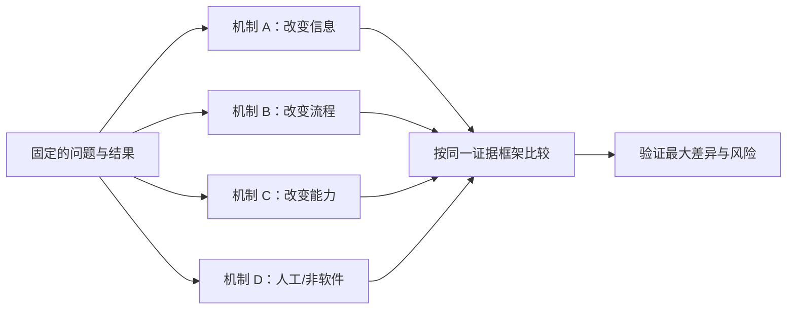

# 同一问题提出至少三个方案：从问题空间进入方案空间

为同一问题提出多个方案，是在承诺开发前比较不同作用机制。多个方案必须服务于同一个目标用户、场景和结果，但可以通过内容、流程、规则、人工服务、数据、集成或软件功能等不同方式改变结果。

“三个不同布局”通常仍是一个方案的视觉变体；“自建、采购、复用现有能力”则是交付方式差异，也不能自动代表用户机制不同。

## 前置知识与能力边界

先掌握：

- [从功能回到用户问题](../requirements-prioritization/02-feature-to-user-problem.md)；
- [成功指标与护栏指标](../requirements-prioritization/04-success-guardrail-metrics.md)；
- [范围与非目标](../requirements-prioritization/05-scope-non-goals.md)；
- [识别最大产品风险](../requirements-prioritization/09-largest-product-risk.md)。

本文处理已经确认值得继续探索的问题。若目标用户、触发场景、当前阻碍和期望结果仍不清楚，应先回到问题定义。

## 1. 问题与方案的边界

问题定义描述：

```text
谁
在什么触发场景
试图完成什么结果
受到什么可观察阻碍
造成什么成本或风险
```

方案定义描述：

```text
通过什么机制
改变哪个行为、信息、能力或约束
使目标结果更容易发生
并承担哪些新成本和风险
```

示例：

```text
问题：
负责 20 个服务的值班人员在告警发生后，
需要在 5 分钟内确认责任服务和最近变更，
但当前必须在三个系统中按不同标识搜索，
导致首次响应中位时间为 11 分钟。
```

以下是不同层级的表达：

| 表达 | 类型 | 原因 |
|---|---|---|
| 建一个告警工作台 | 预设方案 | 已经指定软件形态 |
| 把按钮从右侧移到左侧 | 视觉变体 | 没有改变作用机制 |
| 在告警中附加服务与变更上下文 | 机制 | 改变信息到达方式 |
| 统一三个系统的服务标识 | 机制 | 消除跨系统映射阻碍 |
| 建立值班分诊服务 | 机制 | 由人工承担识别与路由 |

## 2. 为什么不能只有一个方案

只有一个方案时，团队实际只能回答“做还是不做”，无法判断：

- 是否存在更低成本的非软件路径；
- 最大风险是否可以通过改变机制避开；
- 用户总成本是否被转移到别处；
- 依赖、权限和运营边界是否可替换；
- 小范围验证应该验证问题还是验证某个实现细节；
- 已有产品、内容、流程或 API 是否已经能解决。

多方案不是为了延长讨论。它让团队在投入前暴露隐含选择，并为停止某个方案保留继续解决问题的空间。



## 3. “至少三个”的准确含义

数字三不是自然定律，而是最低探索约束：

- 一个方案很容易等同于最先想到的实现；
- 两个方案容易退化为支持与反对；
- 三个方案迫使团队增加一个不同机制；
- 超过五个后，若仍没有清晰差异，可能只是在列功能组合。

有效方案需要在因果机制、承担者或交付路径上存在实质差异。

### 无效的三个方案

```text
A：左侧弹窗
B：右侧抽屉
C：独立页面
```

如果三者都要求用户填写相同字段、触发同一处理、得到同一反馈，它们只是容器变体。

### 有效的三个方案

```text
A：提交前实时校验，阻止无效数据进入
B：允许提交，后台批处理并提供逐项修复
C：提供标准模板与迁移服务，先把数据变成合格格式
```

三个方案分别改变错误发生时点、系统责任和用户工作方式。

## 4. 先冻结共同输入

比较方案前先固定：

| 输入 | 必须明确 |
|---|---|
| 目标用户 | 角色、能力、权限和数据规模 |
| 触发场景 | 何时、从哪里开始、有什么时间压力 |
| 目标结果 | 由什么业务事实证明完成 |
| 当前路径 | 工具、步骤、等待、返工和替代方式 |
| 硬约束 | 安全、隐私、合规、无障碍和账务 |
| 成功指标 | 单位、分母、窗口和基线 |
| 非目标 | 本轮不解决什么 |

若每个方案面向不同用户或结果，它们不能直接比较，应拆成不同问题。

## 5. 生成不同机制的方案

### 5.1 改变信息

通过更早、更准确或更有结构的信息降低决策成本：

- 把状态和下一步放到任务入口；
- 将分散来源聚合并保留证据；
- 提供规则、示例、模板或检查清单；
- 对不同角色显示与权限相符的内容；
- 在错误发生前展示影响范围。

信息方案适合“用户缺少正确事实”，不适合“用户没有权限或系统没有能力”。

### 5.2 改变流程

通过删除、合并、重排或自动推进步骤减少阻碍：

- 取消重复审批；
- 把高频路径提前；
- 在来源系统完成任务，不要求跳转；
- 把串行步骤改为安全并行；
- 将异常与正常路径分开处理。

流程优化必须检查控制为何存在。删除审批不能破坏授权、审计或责任分离。

### 5.3 改变产品能力

增加系统可以执行的新动作：

- 批量处理；
- 自动校验；
- 差异比较；
- 可撤销写入；
- 搜索、过滤或聚合；
- API、Webhook 或自动化规则。

能力方案通常工程成本更高，需要验证数据、权限、容量、错误和运维。

### 5.4 改变责任主体

把任务分配给更适合的主体：

- 用户自助；
- 管理员集中配置；
- 专家或运营服务；
- 第三方合作伙伴；
- 自动化系统；
- 人机协同。

责任转移会改变成本、等待、可扩展性和风险，不能把人工工作隐藏在“智能”功能背后。

### 5.5 改变渠道或集成位置

在任务本来发生的地方提供能力：

- 浏览器扩展；
- 邮件或消息入口；
- IDE 插件；
- API 与 Webhook；
- 现有工作台嵌入；
- 导入/导出。

集成减少切换，但引入第三方权限、版本、限额和下线依赖。

### 5.6 非软件与不做

可能的结果包括：

- 修改内容或培训；
- 改变政策和运营流程；
- 提供人工服务；
- 开放数据或 API，由其他产品解决；
- 复用或采购已有工具；
- 当前证据不足，暂不解决。

不做是一个合法决定，但应说明问题成本为什么低于机会成本。

## 6. 方案卡

每个候选使用同一结构：

```yaml
solution:
  id: "S2"
  name: "告警上下文聚合"
  target_problem: "跨三个系统确认责任服务与最近变更"
  mechanism: "按稳定服务 ID 聚合只读上下文并附在告警详情"
  user_flow:
    start: "打开告警深链"
    action: "查看服务、负责人、部署和关联证据"
    result: "确认责任服务并进入响应"
  changes:
    user: "不再手工复制三个不同标识"
    system: "建立服务 ID 映射和只读聚合"
    operations: "维护映射冲突与数据新鲜度"
  assumptions:
    - "三个来源能映射到稳定服务 ID"
    - "上下文延迟不超过告警处理窗口"
  risks:
    - "错误映射把告警交给错误团队"
  non_goals:
    - "不自动执行修复"
  smallest_test: "20 个历史告警的影子聚合"
```

卡片必须写机制和系统变化，不能只放一张界面图。

## 7. 强制产生差异的方法

### 7.1 改变一个核心前提

对当前方案逐项反转：

- 如果不能增加新页面怎么办；
- 如果不能保存新数据怎么办；
- 如果响应必须在 1 秒内怎么办；
- 如果用户不能学习新流程怎么办；
- 如果不能使用 AI 怎么办；
- 如果只能只读，不能写入怎么办；
- 如果目标数据不存在怎么办；
- 如果预算只有十分之一怎么办。

反转不是为了制造荒谬点子，而是发现被默认的约束。

### 7.2 改变处理时点

| 时点 | 示例 |
|---|---|
| 任务之前 | 模板、预检、默认配置 |
| 任务进行中 | 实时校验、建议、自动完成 |
| 提交之前 | 预览、风险确认、dry run |
| 提交之后 | 异步处理、逐项结果、撤销 |
| 问题发生后 | 诊断、恢复、补偿 |

相同能力放在不同时间，会改变用户成本和失败恢复。

### 7.3 改变自动化程度

```text
只提供事实
→ 提供建议
→ 生成草稿
→ 人工确认后执行
→ 低风险自动执行
→ 全自动
```

自动化程度越高，错误副作用、权限、审计和回滚要求越高。AI 方案尤其需要把“生成内容”和“执行动作”分开。

### 7.4 改变解决范围

- 只解决最高频场景；
- 只解决最严重失败；
- 解决完整端到端路径；
- 只提供公共基础能力；
- 交给领域工具处理；
- 将异常路径单独服务化。

范围不同不是随意删功能，而是选择最短价值闭环。

## 8. 团队生成过程

### 第一步：单独写问题

会议开始时只展示问题卡、证据、约束和指标，不展示现有设计稿。现有设计会锚定方案。

### 第二步：独立产生

产品、设计、工程、数据和运营先独立写候选。独立阶段降低职级和最先发言者的影响。

每个候选必须回答：

1. 改变什么机制；
2. 谁承担新的工作；
3. 哪个必要条件最不确定；
4. 最小验证是什么；
5. 若失败能否继续解决问题。

### 第三步：按机制聚类

把相同机制的视觉变体合并。不要按提案人分组。

### 第四步：补一个非软件方案

检查内容、流程、人工服务、采购、API 和不做，避免默认“必须开发 UI”。

### 第五步：完善 3–5 张方案卡

此时才补充流程图、技术依赖、运营责任和风险。不必把每个候选做成高保真原型。

## 9. 案例一：客服工单分流

### 9.1 问题

一线支持每天处理 1,200 条工单。32% 的工单第一次被分到错误队列，中位转派两次，用户获得首次有效处理需要 14 小时。

目标不是“上线 AI 分类”，而是：

```text
有处理权限的正确队列在 30 分钟内取得工单，
且不能因自动分类泄露敏感正文或把高风险工单静默降级。
```

### 9.2 方案 A：提交前引导

机制：

- 用户选择对象和目标；
- 表单根据对象显示最少必要字段；
- 高辨识度规则直接映射队列；
- 无法判断时进入人工分流。

改变：

- 信息在来源处结构化；
- 用户承担少量选择；
- 分类结果更可解释。

主要风险：

- 用户不知道内部队列语言；
- 额外字段增加放弃；
- 恶意用户可选择高优先级。

最小验证：

- 在历史工单上模拟 5 个用户可理解字段；
- 检查字段能否区分队列；
- 用可点击原型验证普通用户是否理解。

### 9.3 方案 B：规则加模型建议

机制：

- 确定规则先处理产品、地区和合同；
- 模型只为剩余工单给出队列与置信；
- 一线人员确认或改写；
- 改写结果进入经过处理的评估集。

改变：

- 不要求用户理解组织结构；
- 自动化仅提供建议；
- 运营承担低置信复核。

主要风险：

- 模型对少数语言和新产品退化；
- 正文进入外部服务造成数据风险；
- 人员机械确认建议。

最小验证：

- 去标识历史集影子运行；
- 按语言、产品和风险级别评估；
- 测量确认者能否发现错误。

### 9.4 方案 C：集中分诊岗与队列所有权

机制：

- 设立轮值分诊；
- 每个队列有明确接收条件和负责人；
- 15 分钟未认领自动升级；
- 记录误分原因，先修规则和组织边界。

改变：

- 人工承担判断；
- 不依赖模型；
- 同时暴露队列职责模糊问题。

主要风险：

- 峰值容量不足；
- 运营成本高；
- 问题根因可能是队列设计而非分类。

最小验证：

- 两周单地区轮值；
- 测量处理容量、误分、首次有效处理与运营成本。

### 9.5 初步决定

三者不是互斥功能包。可以先用 C 验证队列边界并积累原因，再用 A 处理确定规则，最后判断 B 是否有足够增量价值。

若一开始只提出“训练分类模型”，团队会错过组织职责不清这一根因。

## 10. 案例二：新团队首次配置

### 10.1 问题

创建工作区后的管理员需要配置成员、权限、数据源和通知。只有 41% 在 7 天内完成首次有效任务；日志显示用户在四个设置页往返。

### 10.2 方案一：任务清单

- 首页展示按依赖排序的步骤；
- 每一步显示完成事实和错误；
- 可跳过非必要步骤；
- 刷新后从服务端状态恢复。

机制：提高可见性和进度理解。

风险：清单可能把错误流程包装得更清楚，却没有减少工作。

### 10.3 方案二：默认模板

- 按团队类型提供最小权限和通知模板；
- 管理员预览差异后应用；
- 所有默认值可追踪和撤销；
- 高风险权限不自动开启。

机制：减少决策和重复输入。

风险：模板分类不准确，错误默认值的影响范围大。

### 10.4 方案三：导入现有配置

- 从支持的系统读取成员与项目；
- 先 dry run；
- 显示冲突和将产生的对象；
- 按批次提交并可回滚。

机制：复用已有事实，避免重新配置。

风险：第三方权限、字段映射、数据新鲜度和回滚复杂。

### 10.5 方案四：首次配置服务

- 管理员提交目标和约束；
- 实施人员建立配置草稿；
- 管理员确认后生效；
- 记录高频重复步骤，为自动化提供证据。

机制：由专业服务承担低频高复杂任务。

风险：成本、等待和规模。

### 10.6 验证顺序

1. 用日志重建实际往返和失败状态；
2. 用人工配置服务确认最小必要输入；
3. 用模板原型验证默认值能否覆盖高频类型；
4. 对真实但去标识数据做导入技术 spike；
5. 再比较任务清单是否仍能产生独立价值。

验证顺序由最大风险决定，不由界面完成度决定。

## 11. 从候选到可比较输入

三个方案必须使用同一比较表：

| 字段 | 方案 A | 方案 B | 方案 C |
|---|---|---|---|
| 作用机制 |  |  |  |
| 用户新增成本 |  |  |  |
| 系统新增责任 |  |  |  |
| 运营新增责任 |  |  |  |
| 预期结果变化 |  |  |  |
| 最大风险 |  |  |  |
| 硬约束 |  |  |  |
| 最小验证 |  |  |  |
| 可逆性 |  |  |  |
| 退役成本 |  |  |  |

不应在这一阶段用总分直接选赢家。先确认输入口径一致，并识别需要验证的关键差异。

## 12. 失败模式

### 12.1 三个方案实际是功能档位

“基础版、标准版、高级版”只改变功能数量。重新寻找不同机制、主体或处理时点。

### 12.2 先做一个高保真方案，其余只写一句话

细节丰富会造成偏好。比较前把所有方案完善到同等信息层级。

### 12.3 把技术选型当产品方案

React、Vue、自研模型和供应商模型是实现选择。先说明用户和系统行为如何不同。

### 12.4 忽略现有替代方案

用户已经在用表格、脚本、消息、人工服务或另一个产品。新方案必须比较迁移与切换成本。

### 12.5 所有方案都依赖同一未验证前提

三个界面都依赖不存在的数据，就没有分散风险。至少提出一个不依赖该数据的路径。

### 12.6 自动化隐藏人工成本

模型异常、规则维护、审核、争议和支持都是真实运营责任，必须写入方案卡。

### 12.7 只比较开发成本

低开发成本可能带来更高用户操作、支持、错误和退役成本。比较总成本与结果。

## 13. 调试方案讨论

### 13.1 团队无法提出第三个方案

按顺序检查：

1. 问题是否已经写成方案；
2. 是否默认必须做 UI；
3. 能否改变责任主体；
4. 能否改变处理时点；
5. 能否只提供事实而不自动执行；
6. 能否改内容、流程或政策；
7. 能否复用、采购或提供 API；
8. 不做的真实后果是什么。

### 13.2 方案无法公平比较

检查目标用户、结果、时间窗和范围是否一致。一个方案解决完整流程，另一个只处理入口，不能用同一“开发天数”直接比较。

### 13.3 讨论变成偏好争论

把争论改写成待验证陈述：

```text
争论：用户更喜欢自动化。
假设：在可撤销且显示影响范围时，
目标管理员会让系统自动处理低风险项目，
且人工改写率低于 10%。
```

随后选择能改变决定的证据，而不是继续表态。

## 14. 生产与生命周期边界

方案卡不只描述上线：

- 数据如何迁移、导出和删除；
- 权限改变后如何收回能力；
- 依赖中断时如何降级；
- 错误副作用如何撤销或补偿；
- 规则、模板和模型由谁更新；
- 指标如何发现方案不再有效；
- 用户如何迁移到替代方案；
- 功能退役后链接、文档和数据如何处理。

一个上线快但无法安全退役的方案，不一定比开发稍慢但边界清楚的方案更便宜。

## 15. 练习

选择一个已经有默认方案的问题：

1. 用用户、场景、结果、阻碍重写问题；
2. 隐藏现有设计；
3. 独立生成至少 8 个粗候选；
4. 按机制合并为 3–5 个实质方案；
5. 至少保留一个非软件或复用方案；
6. 为每个方案填写相同方案卡；
7. 写出最大风险和最小验证；
8. 检查所有方案是否依赖同一未验证前提；
9. 说明若首选失败，哪些证据和能力仍可复用。

验收时，第三方应能明确指出每个方案如何改变因果链，而不是只看出页面长得不同。

## 来源

- [GOV.UK Service Manual：How the discovery phase works](https://www.gov.uk/service-manual/agile-delivery/how-the-discovery-phase-works)（访问日期：2026-07-18）
- [GOV.UK Service Manual：How the alpha phase works](https://www.gov.uk/service-manual/agile-delivery/how-the-alpha-phase-works)（访问日期：2026-07-18）
- [GOV.UK Service Manual：Making prototypes](https://www.gov.uk/service-manual/design/making-prototypes)（访问日期：2026-07-18）
- [GOV.UK Service Manual：Measuring the benefits of your service](https://www.gov.uk/service-manual/measuring-success/measuring-service-benefits)（访问日期：2026-07-18）

