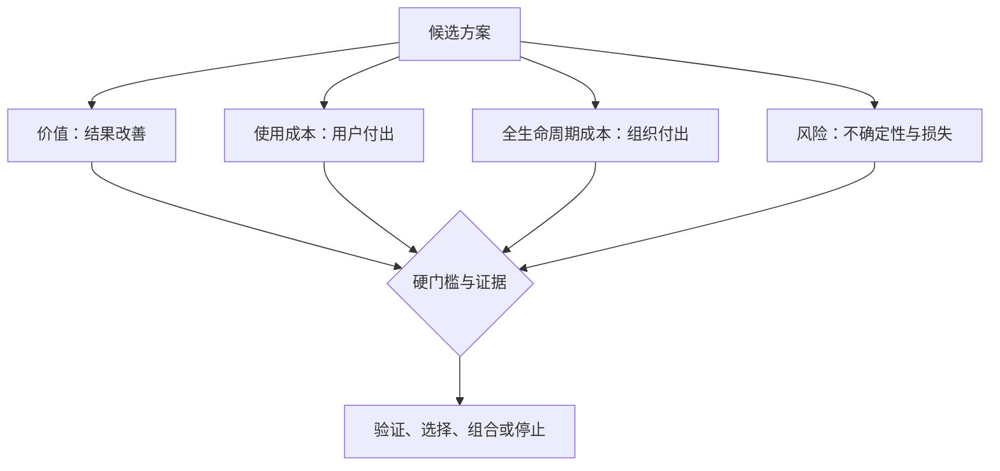

# 比较价值、使用成本、开发成本与风险

方案比较是在相同用户、场景、结果和约束下，判断不同机制可能产生的收益、用户承担的总成本、组织承担的全生命周期成本，以及方案失败或造成伤害的风险。比较的目的不是算出一个“客观总分”，而是暴露关键差异、不可交换的门槛和需要先验证的不确定性。

## 前置知识与能力边界

- [同一问题提出至少三个方案](01-three-solutions.md)；
- [成功指标与护栏指标](../requirements-prioritization/04-success-guardrail-metrics.md)；
- [依赖识别](../requirements-prioritization/06-dependencies.md)；
- [RICE 与 Value-Effort](../requirements-prioritization/07-rice-value-effort.md)；
- [识别最大产品风险](../requirements-prioritization/09-largest-product-risk.md)。

本文适用于候选机制已经写清、但证据仍有不确定性的阶段。它不能替代安全审查、法律意见、财务模型、技术设计或可访问性测试；这些专业结论应成为门槛或输入。

## 1. 比较对象必须同口径

可比较的方案需要共享：

```yaml
comparison_scope:
  target_actor: "每天处理 50 条以上退款申请的运营人员"
  trigger: "收到需要判断资格的退款申请"
  desired_result: "在 10 分钟内完成正确、可审计的退款决定"
  analysis_unit: "refund_case"
  observation_window: "申请进入后 24 小时"
  baseline: "人工跨三个系统核对"
  hard_constraints:
    - "服务端重新授权"
    - "金额和币种可对账"
    - "不向无权人员暴露订单信息"
```

以下比较无效：

- A 面向大型企业，B 面向个人用户；
- A 只处理正常路径，B 包含全部异常；
- A 报开发一次性成本，B 报三年总成本；
- A 用用户任务时间，B 用页面点击；
- A 假设数据和 API 已存在，B 把依赖建设计入成本；
- A 的收益为年收入，B 的收益为单次满意度。

## 2. 四个核心维度



### 2.1 价值

价值描述方案使目标结果改善多少、覆盖多少对象、持续多久。

至少分开：

- 用户价值：时间、成功、质量、可理解性、控制和恢复；
- 业务价值：收入、成本、风险、战略能力和服务质量；
- 公共或生态价值：公平、可达性、互操作和外部影响；
- 学习价值：验证能否改变后续高成本决定。

价值必须连接结果，不把功能数量、页面访问和模型输出量当成价值。

### 2.2 使用成本

用户使用一个方案会付出：

| 成本 | 示例 |
|---|---|
| 发现 | 找到入口、判断是否适用 |
| 学习 | 理解术语、规则和新心智模型 |
| 输入 | 准备数据、授权、填写和校验 |
| 操作 | 点击、切换、等待和重复步骤 |
| 迁移 | 导出、清洗、映射和重新配置 |
| 协作 | 取得审批、交接和处理冲突 |
| 风险 | 害怕误操作、隐私和责任 |
| 恢复 | 修正错误、撤销、申诉和联系客服 |
| 持续维护 | 更新规则、成员、集成和数据 |

自动化可能降低操作成本，却增加检查和信任成本；模板可能降低首次配置成本，却增加理解默认值的成本。

### 2.3 全生命周期成本

开发成本只是一部分：

```text
总成本 =
发现与验证
+ 设计与工程
+ 数据与迁移
+ 测试与安全
+ 基础设施与第三方
+ 运营与审核
+ 支持与争议
+ 监控与迭代
+ 合规与审计
+ 退役与迁移
```

一次性脚本开发很快，但如果每个客户都需要人工修复，长期成本可能高于可复用导入器。采购产品减少初始工程，也会增加许可证、集成、供应商锁定和退出成本。

### 2.4 风险

风险包括：

- 价值风险：用户不采用或结果改善不足；
- 可用性风险：用户不能完成或无法恢复；
- 可行性风险：数据、技术、容量或运营不成立；
- 业务可持续风险：成本、合同、销售或支持不成立；
- 安全、隐私、合规、账务和可访问性硬风险；
- 交付风险：关键依赖和能力不能按时获得；
- 退役风险：方案失败后数据和用户无法迁移。

风险不是成本的同义词。成本是预计会发生的投入；风险是条件不成立时的损失分布和不确定性。

## 3. 价值怎样量化

### 3.1 写出基线和目标

```text
当前：
每周 800 个退款任务，
其中 68% 在 24 小时内完成，
每个任务中位主动处理 12 分钟，
错误决定率 3.2%。

目标：
24 小时完成率提高到至少 85%，
主动处理降到 6 分钟，
错误决定率不高于 1%，
无权数据暴露为 0。
```

价值估算：

```text
每周节省主动时间
= 每周符合范围的任务数
× 每个任务预计节省时间
× 实际采用比例
× 方案成功比例
```

若 800 个任务中只有 60% 符合范围，预计采用 70%，每次节省 6 分钟：

```text
800 × 60% × 70% × 6 分钟 = 2,016 分钟 = 33.6 小时/周
```

不要直接用 `800 × 6`，那假设覆盖和采用都是 100%。

### 3.2 价值区间

早期参数不确定时使用区间：

| 参数 | 保守 | 中性 | 乐观 |
|---|---:|---:|---:|
| 每周符合任务 | 350 | 480 | 600 |
| 采用率 | 40% | 70% | 85% |
| 单次节省 | 3 分钟 | 6 分钟 | 8 分钟 |
| 每周节省 | 17.5 小时 | 33.6 小时 | 68 小时 |

区间显示决定对哪些参数敏感。若只有乐观场景成立，应先验证高敏感参数。

### 3.3 不能相加的价值

以下项目可能重复：

- 节省任务时间和节省人工成本；
- 提高完成率和增加完成任务数；
- 减少支持请求和降低支持成本；
- 风险避免金额和实际减少损失；
- 收入增加和客户留存价值。

建立因果树，避免对同一结果重复计数。

## 4. 使用成本怎样计算

### 4.1 按任务阶段分解


每一阶段记录：

- 主动操作时间；
- 系统等待时间；
- 出错比例；
- 返工次数；
- 需要的专业知识；
- 需要协作的人数；
- 敏感授权和不可逆决定；
- 放弃后的后果。

### 4.2 不同角色分别计算

一个方案可能：

- 为普通成员节省 5 分钟；
- 给管理员增加每周 2 小时规则维护；
- 给客服增加申诉处理；
- 给安全团队增加审计；
- 给财务增加对账。

不能用主要用户的收益隐藏其他受影响角色的成本。

### 4.3 时间不是唯一成本

让用户更快完成错误任务没有价值。使用成本还包括：

- 认知负荷；
- 错误后果；
- 控制权丧失；
- 隐私暴露；
- 信任损失；
- 被迫切换工具；
- 无障碍障碍；
- 专业责任。

需要用行为证据、任务验证、错误率和恢复结果共同判断。

## 5. 组织成本模型

### 5.1 一次性建设

- 问题和数据分析；
- 原型与验证；
- 架构和接口；
- 前后端实现；
- 数据迁移；
- 无障碍、安全和性能测试；
- 文档与培训；
- 发布、回滚和观测。

### 5.2 持续成本

- 计算、存储、网络和第三方费用；
- 模型、规则、模板和内容维护；
- 告警与 on-call；
- 客服与申诉；
- 人工审核；
- 数据质量与重新索引；
- 安全补丁和合规复审；
- 多语言和平台兼容；
- 指标与评估集维护。

### 5.3 变化成本

产品不是一次交付：

- 新字段和规则；
- 依赖 API 版本；
- 权限模型改变；
- 数据规模增长；
- 法律和合同变化；
- 用户工作流迁移；
- 模型和供应商更新。

方案接口越稳定、边界越清晰，变化成本越低。

### 5.4 退出成本

提前回答：

- 数据能否导出；
- 第三方依赖能否替换；
- 用户能否回到旧流程；
- 旧链接和 API 如何处理；
- 已执行副作用能否补偿；
- 训练、索引和日志如何删除；
- 运营岗位如何迁移。

退出成本高会降低方案可逆性。

## 6. 硬门槛先于加权

以下条件不应通过加权抵消：

```yaml
gates:
  security:
    unauthorized_access: 0
  accounting:
    unexplained_balance_difference: 0
  accessibility:
    core_keyboard_task: "pass"
  reliability:
    duplicate_irreversible_side_effect: 0
  legal:
    required_basis_and_contract: "confirmed"
```

一个方案节省大量时间，也不能因此允许跨租户泄露。先淘汰不满足硬门槛的方案，再比较价值与成本。

## 7. 证据强度

估算值应注明证据：

| 等级 | 证据 | 使用方式 |
|---|---|---|
| E0 | 纯推断 | 只能用于提出验证 |
| E1 | 相邻场景或公开材料 | 给出宽区间 |
| E2 | 当前产品行为数据 | 建立基线，注意因果限制 |
| E3 | 目标场景原型/人工交付 | 判断工作流和结果 |
| E4 | 可运行薄片/影子生产 | 判断真实数据与技术 |
| E5 | 受控灰度或长期结果 | 支持扩大投入 |

方案分数不能比输入证据更精确。E0 假设不应写成精确到小数的收益。

## 8. 比较表

```yaml
option:
  id: "B"
  mechanism: "规则优先，模型建议，人工确认"
  value:
    target_delta: "24h 完成率 +12 至 +20pp"
    coverage: "符合规则或模型置信门槛的 60–80%"
    evidence: "E3"
  user_cost:
    added: "每条建议确认 20–45 秒"
    removed: "跨系统搜索 4–8 分钟"
  lifecycle_cost:
    build: "8–12 人周"
    monthly_ops: "审核、模型调用、回归评测"
    exit: "可回退人工队列，需删除模型缓存"
  risks:
    largest: "审核者机械确认错误建议"
    hard: "敏感正文不得进入未批准服务"
  next_test:
    "200 条去标识工单的盲审对照"
```

表内保留区间、单位、证据和不确定性。

## 9. 加权矩阵的正确用法

### 9.1 只压缩，不替代原始信息

示例权重：

| 维度 | 权重 |
|---|---:|
| 核心结果改善 | 30% |
| 用户总成本 | 20% |
| 全生命周期成本 | 15% |
| 最大风险 | 20% |
| 可逆性与学习价值 | 15% |

评分前先定义 1、3、5 的锚点：

```text
核心结果改善
1：没有直接机制，只改善表面指标
3：覆盖主要场景，预计产生可测改善
5：直接改变核心阻碍，已有目标场景证据
```

### 9.2 灵敏度分析

若方案 A 总分 3.8，B 为 3.7，输入误差可能大于差异。改变合理权重后：

| 场景 | A | B | 结论 |
|---|---:|---:|---|
| 默认权重 | 3.8 | 3.7 | A 略高 |
| 用户成本优先 | 3.5 | 4.0 | B 更高 |
| 风险优先 | 3.2 | 3.9 | B 更高 |

结论依赖权重时，不要宣布 A 胜出。应验证使结果翻转的参数。

### 9.3 禁止伪精确

评分 `4.23` 并不比 `高/中/低` 更可靠。保留原始区间、门槛和反例。

## 10. 案例一：客服工单分流

候选：

- A：用户提交前选择结构化类别；
- B：规则 + 模型建议 + 人工确认；
- C：集中人工分诊。

### 10.1 固定基线

```text
每周工单：6,000
首次分配正确率：68%
首次有效处理 P50：14 小时
敏感工单占比：7%
分诊人工：2.5 FTE
```

### 10.2 使用成本

| 成本 | A | B | C |
|---|---|---|---|
| 用户新增输入 | 20–60 秒 | 无 | 无 |
| 一线确认 | 无 | 20–45 秒 | 无 |
| 分诊等待 | 低 | 低置信时存在 | 所有工单存在 |
| 错误恢复 | 用户重选或人工改分 | 人工改写建议 | 人工重新分配 |
| 学习 | 用户理解类别 | 员工理解建议置信 | 分诊员理解全部队列 |

### 10.3 组织成本

| 成本 | A | B | C |
|---|---|---|---|
| 建设 | 表单、规则、兼容旧入口 | 数据、模型、审核 UI、评估 | 队列、排班、SOP |
| 持续 | 类别和文案维护 | 模型、评估、审核、供应商 | FTE 与培训 |
| 峰值 | 表单吞吐稳定 | 推理限额与延迟 | 人员容量 |
| 退出 | 可保留旧表单 | 删除缓存并回退人工 | 调整岗位和流程 |

### 10.4 风险

- A 最大风险：用户不理解内部分类，放弃或乱选；
- B 最大风险：建议造成自动化偏见，审核者机械确认；
- C 最大风险：容量和成本随工单线性增长。

硬门槛：

- 敏感正文不进入未批准的模型服务；
- 高风险工单不能因低置信静默降级；
- 每个分配决定可追踪；
- 所有方案均由服务端重新授权。

### 10.5 决定

不能只根据“B 自动化程度最高”选择。先运行：

1. A 的结构化字段在历史工单上的可分辨率；
2. C 的两周容量试点，建立真实分诊原因；
3. B 在同一处理集上的盲审，测机械确认。

若 C 显示错误主要来自队列职责重叠，应先修组织规则；训练模型只会学习不稳定标签。

## 11. 案例二：数据迁移

候选：

- A：自助 CSV 导入；
- B：提供迁移 API 与脚本；
- C：收费迁移服务；
- D：采购已有迁移平台。

### 11.1 价值

| 结果 | A | B | C | D |
|---|---|---|---|---|
| 低代码管理员自助 | 高 | 低 | 中 | 取决于产品 |
| 大型客户定制 | 中 | 高 | 高 | 取决于连接器 |
| 首次交付速度 | 中 | 中 | 高 | 高 |
| 长期重复使用 | 高 | 高 | 低 | 高 |

### 11.2 成本边界

A 的开发不只是上传页面，还包括编码、映射、预览、异步处理、逐项结果、幂等、撤销和支持。

B 需要稳定 API、认证、限流、版本和技术文档，用户还需要工程能力。

C 需要人员、排期、数据处理协议、操作审计和质量复核，成本近似随客户增长。

D 需要许可证、集成、数据边界、供应商稳定性和退出计划。

### 11.3 情景模型

| 情景 | A | B | C | D |
|---|---:|---:|---:|---:|
| 每月 10 个标准迁移 | 建设成本难回收 | 采用低 | 可承受 | 许可证可能过高 |
| 每月 200 个标准迁移 | 自助价值高 | 部分客户适用 | 人员不可扩展 | 可能合适 |
| 每月 20 个高度定制迁移 | 例外多 | 技术客户适用 | 高价值 | 连接器覆盖不足 |

采用哪种机制取决于任务分布。不能用平均“每月 50 个”掩盖标准与定制的双峰。

### 11.4 组合方案

比较不要求只选一个：

- 标准格式使用 A；
- 大客户使用 B；
- 异常和一次性迁移使用 C；
- D 只覆盖成熟连接器。

组合后必须重新计算边界：谁判断分流、失败怎样升级、数据是否重复处理、客户是否能理解责任。

## 12. 不确定性与信息价值

### 12.1 找到会翻转决定的变量

假设 A 的长期价值依赖“标准文件占比 ≥ 70%”。当前只有 15 个样本，估计为 40–85%。这项不确定性会改变自助导入是否值得建设，应优先抽样。

相反，如果第三方许可证在所有合理场景都超过预算，再精确测用户点击不会改变决定。

### 12.2 验证成本也要比较

| 未知项 | 验证 | 成本 | 可能改变 |
|---|---|---:|---|
| 标准文件占比 | 抽样 100 个去标识文件 | 2 天 | A 是否继续 |
| API 吞吐 | 真实夹具容量 spike | 3 天 | B 架构与成本 |
| 人工处理时间 | 20 个任务计时 | 1 周 | C 单位经济 |
| 供应商覆盖 | 固定连接器清单验证 | 2 天 | D 是否可用 |

先做高信息价值、低伤害的验证。

## 13. 常见失败模式

### 13.1 把收入当作价值，把成本当作开发天数

收入需要采用、价格、留存和毛利；成本需要覆盖用户、运营、基础设施和退役。

### 13.2 不同方案使用不同乐观程度

首选方案用乐观采用率，其他方案用保守估计，会预设结论。使用同一情景和证据等级。

### 13.3 加权分数抵消硬风险

安全、账务和合法性不进入平均分。它们是门槛。

### 13.4 忽略用户迁移

新流程比旧流程每次快，但首次迁移需两天配置。对低频用户，累计收益可能永远无法覆盖迁移。

### 13.5 忽略人工和模型运营

审核、纠错、评估、供应商更新和申诉都是持续成本。

### 13.6 用点击证明价值

点击最多说明入口被触发。继续追踪任务完成、质量、重复使用和护栏。

### 13.7 只看平均值

按用户规模、平台、权限、任务类型和高风险场景分组。P95 等待和少数越权不能被平均掩盖。

## 14. 调试比较结果

### 14.1 所有方案都“差不多”

检查：

1. 是否只是同一机制的视觉变体；
2. 评分锚点是否模糊；
3. 是否遗漏用户和运营成本；
4. 是否所有字段都填中间分；
5. 证据是否太弱；
6. 哪个变量会翻转选择。

### 14.2 最便宜方案总是胜出

检查价值是否只写短期、是否遗漏错误与恢复、是否把依赖建设算作“已有”、是否忽略长期维护。

### 14.3 最高价值方案无法交付

区分：

- 真实硬约束；
- 可通过缩小范围控制的风险；
- 需要先做公共能力的依赖；
- 只是习惯或组织边界；
- 可由组合方案提供的部分价值。

### 14.4 结果与团队直觉冲突

不要立即改权重。先找出直觉依赖的事实是否缺失，并将其加入模型；如果无法写成事实或假设，不能作为隐藏修正项。

## 15. 评审输出

最终记录应包含：

```yaml
decision:
  selected: ["A-standard-import", "C-exception-service"]
  rejected:
    - id: "D-vendor"
      reason: "固定连接器只覆盖 35% 目标来源"
  deferred:
    - id: "B-api"
      trigger: "技术客户占迁移请求超过 25%"
  hard_gates:
    - "dry-run 与提交结果一致"
    - "跨租户暴露为 0"
    - "整批撤销通过"
  evidence:
    baseline: "migration-sample@3"
    cost_model: "migration-cost@2"
  unresolved:
    - "长期标准格式漂移"
  review_trigger:
    - "例外服务连续两月超过 2 FTE"
    - "标准文件占比低于 60%"
```

记录不仅说明选了什么，也说明证据范围、为什么不选、何时重开。

## 16. 练习

选择上一课的三个方案：

1. 固定用户、场景、结果、基线、单位和时间窗；
2. 分别估算用户价值和业务价值；
3. 按任务阶段列使用成本；
4. 列建设、持续、变化与退出成本；
5. 写每个方案的最大风险和硬门槛；
6. 为关键数字注明区间和证据等级；
7. 建立保守、中性、乐观三个情景；
8. 进行一次权重和参数灵敏度分析；
9. 找出最可能翻转决定的未知项；
10. 写验证、选择、组合、延后或停止决定。

验收时，所有百分比和成本应可由原始计数复算；任何硬风险都不能被总分抵消。

## 来源

- [GOV.UK Service Manual：Measuring the benefits of your service](https://www.gov.uk/service-manual/measuring-success/measuring-service-benefits)（访问日期：2026-07-18）
- [GOV.UK Service Manual：How the alpha phase works](https://www.gov.uk/service-manual/agile-delivery/how-the-alpha-phase-works)（访问日期：2026-07-18）
- [GOV.UK Service Manual：Using commercial off-the-shelf products and services](https://www.gov.uk/service-manual/technology/commercial-off-the-shelf-products-and-services)（访问日期：2026-07-18）
- [GOV.UK Service Manual：Planning in agile](https://www.gov.uk/service-manual/agile-delivery/planning-agile)（访问日期：2026-07-18）

