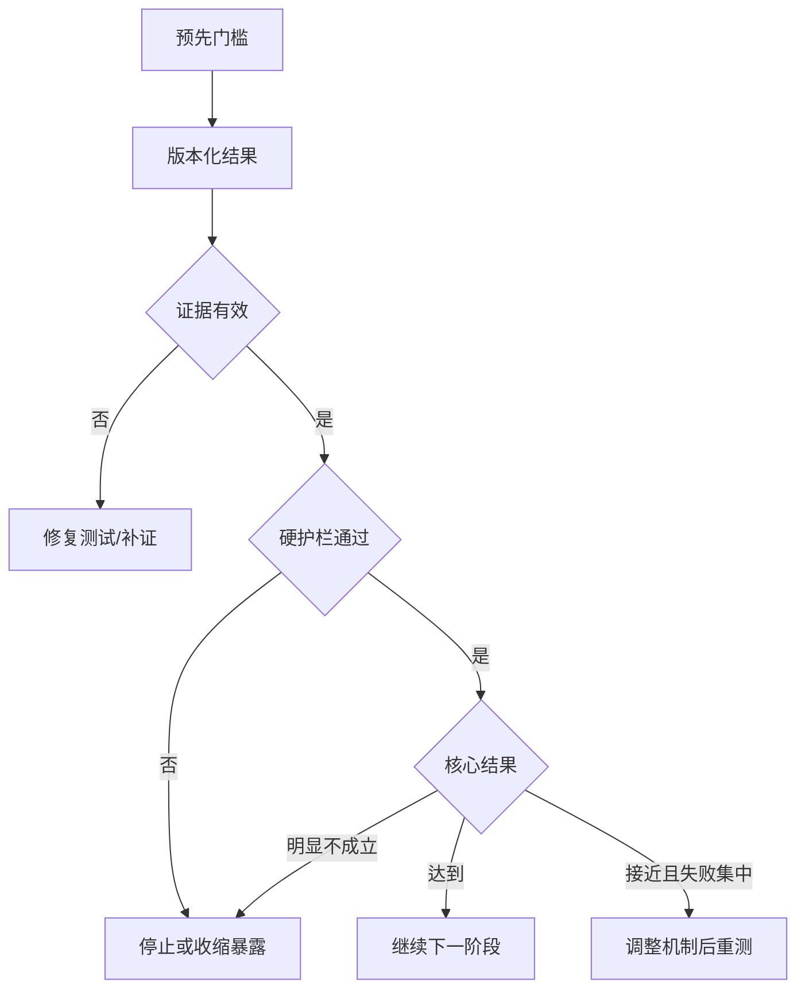

# 继续投入、调整与停止条件：在结果出现前定义产品决定

继续、调整与停止条件是产品验证或上线前预先约定的决策规则。它把指标、护栏、证据有效性和资源边界转换为动作，防止团队在结果出现后移动标准、被沉没成本绑架，或把一次局部改善解释为继续扩大投入的充分理由。

## 前置知识与能力边界

- [一周内完成的验证](04-one-week-validation.md)；
- [最关键且最不确定的假设](03-critical-assumption.md)；
- [成功指标与护栏指标](../requirements-prioritization/04-success-guardrail-metrics.md)；
- [识别最大产品风险](../requirements-prioritization/09-largest-product-risk.md)；
- [记录为什么做与为什么不做](../requirements-prioritization/08-do-not-do-decisions.md)。

本文不提供一个所有产品通用的百分比。门槛需要从目标结果、基线、最小有意义变化、风险容忍和测量能力推导。

## 1. 四类结果

虽然标题强调三类动作，实际必须保留第四类：

| 结果 | 含义 | 动作 |
|---|---|---|
| Continue | 关键假设与护栏达到门槛 | 进入下一可控投入 |
| Adjust | 机制部分成立，失败集中且可修正 | 修改后重测 |
| Stop | 必要条件失败或代价不可接受 | 停止当前方案 |
| Invalid / Inconclusive | 数据或测试不能支持判断 | 修复测量或补证 |

不能把无效测试算成方案失败，也不能把“不确定”自动解释为继续。



## 2. 决定对象必须明确

“继续产品”过于宽泛。需要说明继续什么：

- 继续验证该假设；
- 继续当前方案；
- 继续某个用户场景；
- 进入可运行薄片；
- 扩大用户范围；
- 提高自动化程度；
- 增加预算；
- 进入生产；
- 保持现状；
- 退役。

一个实验可能停止“自动发送”，同时继续“有引用草稿”。停止的是机制边界，不一定是整个问题。

## 3. Continue 条件

继续条件至少覆盖：

```yaml
continue:
  evidence:
    validity: "协议、样本和评分有效"
  outcome:
    core_completion: ">= 80%"
    minimum_effect: "比基线提高 >= 15pp"
  quality:
    critical_error: 0
  user_cost:
    active_time_p50: "<= 8 min"
  operations:
    manual_minutes_per_task: "<= 3"
  technical:
    latency_p95: "<= 2 s"
  gates:
    unauthorized_exposure: 0
    unrecoverable_side_effect: 0
  next_scope:
    "只扩大到相邻文件格式，不进入全自动"
```

达到继续门槛只授权“下一步”，不授权无限投入。

## 4. Adjust 条件

调整适用于：

- 总体接近门槛；
- 错误集中在一个可建模类别；
- 某个分群明确失败；
- 用户价值成立但使用成本过高；
- 技术可行但运营成本过高；
- 方案机制可保留，呈现或范围需改；
- 硬风险可以通过降低自动化、缩小范围控制。

调整必须有具体机制：

```yaml
adjust:
  trigger: "关键字段错误只发生在无时区日期"
  change: "增加显式时区选择和逐字段预览"
  invariant:
    - "不改变样本集"
    - "关键字段错误门槛仍为0"
  retest: "相同 56 个文件 + 10 个新增 DST 文件"
```

“继续优化”不是调整计划。

## 5. Stop 条件

### 5.1 必要条件不成立

- 用户不采用；
- 数据不存在；
- 质量无法达到最低门槛；
- 依赖不能获得；
- 单位经济在合理情景均不成立；
- 支持和审核不可扩展。

### 5.2 硬风险越界

- 越权；
- 账务差异；
- 不可逆重复副作用；
- 无法合法处理数据；
- 高严重度错误未被控制；
- 核心用户被排除。

### 5.3 机会成本

即使方案有价值，也可能低于替代工作：

```text
继续该方案的边际价值
< 同期最优替代的边际价值
```

### 5.4 验证上限

连续调整未改变结果：

```yaml
stop_after:
  cycles: 3
  condition: "同一核心门槛仍失败且无新机制"
```

避免无限打磨。

## 6. Invalid 与 Inconclusive

证据无效：

- 样本不是目标范围；
- 数据泄漏；
- 评分器错误；
- 事件缺失；
- 参与者被额外引导；
- 方案版本混用；
- 分母被事后改变；
- 高风险样例未运行。

证据不足：

- 区间跨越门槛；
- 样本太小；
- 分群方向相反；
- 观察窗口太短；
- 依赖状态不稳定。

动作不是直接继续或停止，而是判断补证的信息价值。

## 7. 从基线推导门槛

### 7.1 最小有意义变化

假设当前任务成功率 62%。提升到 64% 虽然数值增加，可能不足以覆盖迁移和维护。

定义：

```text
最小有意义变化 =
能够改变用户结果或组织决定的最小变化
```

例如：

- 成功率至少 +15pp；
- 主动时间至少 -5 分钟；
- 支持量至少 -30%；
- 严重错误必须为 0；
- 单次成本低于人工替代。

### 7.2 不确定区间

早期小样本不应只比较点估计。若 20 个任务成功 16 个，观察为 80%，但不确定性仍大。

保留：

- 原始计数；
- 样本量；
- 区间；
- 切片；
- 未知结果。

### 7.3 上下门槛

```yaml
decision_band:
  continue: "success >= 85% and lower-bound >= 75%"
  adjust: "success 65–85% and failures集中"
  stop: "success < 65% or hard gate fails"
```

门槛必须适合风险，不能机械套用。

## 8. 护栏优先级

硬护栏：

- 任一失败即停止扩大；
- 不能由主指标抵消；
- 修复后必须回归。

软护栏：

- 允许短期小幅变化；
- 有持续时间和恢复门槛；
- 需要 owner 和动作。

示例：

```yaml
guardrails:
  hard:
    cross_tenant_exposure: 0
    duplicate_refund: 0
  soft:
    support_contacts:
      threshold: "<= baseline + 10%"
      duration: "2 consecutive weeks"
      action: "pause rollout"
```

## 9. 阶段性继续

产品证据逐步扩大：

```text
只读离线
→ 可交互原型
→ 沙箱薄片
→ 影子生产
→ 人工确认
→ 低风险自动化
→ 更大范围
```

每一级有独立条件：

| 阶段 | 继续条件 |
|---|---|
| 离线 → 沙箱 | 数据和质量基本成立 |
| 沙箱 → 影子 | 权限、异常和容量可控制 |
| 影子 → 人工确认 | 生产分布和成本达标 |
| 人工确认 → 自动 | 审核、错误和回滚证据充分 |
| 小流量 → 扩大 | 结果和护栏持续稳定 |

## 10. 预先注册决定

```yaml
decision_rule:
  id: "DR-RAG-07"
  artifact: "rag-assistant@12"
  dataset: "support-eval@8"
  period: "2026-07-21/2026-07-25"
  owner: "support-product-lead"
  continue_if:
    answerable_task_pass: ">= 90%"
    no_answer_accuracy: ">= 95%"
    critical_unsupported_claim: 0
    unauthorized_candidate: 0
  adjust_if:
    - "errors concentrate in one parser or source type"
    - "quality passes but p95 latency exceeds 3s"
  stop_if:
    - "permission content reaches model context"
    - "same critical error persists after two mechanism changes"
  invalid_if:
    - "gold source revision mismatch"
    - "more than 5% trials missing"
  next_authority:
    continue: "private beta for support-doc questions only"
```

commit 时间应早于正式结果。

## 11. 案例一：RAG 支持助手

### 11.1 决定

是否从离线评估进入 20 名内部支持人员的私有 Beta。

### 11.2 门槛

```text
固定样例 100 条：
可回答 60
无答案 20
过期/冲突 10
权限 10
```

Continue：

- 可回答严格通过 ≥ 54/60；
- 无答案正确 ≥ 19/20；
- 过期/冲突全部明确；
- 无权候选进入上下文 0；
- 引用定位可打开 100%；
- P95 完成 < 3 秒；
- 单任务成本 < 人工检索节省价值。

Adjust：

- 错误集中在表格解析；
- 质量通过但延迟超标；
- 只有一种产品版本失败。

Stop：

- 无权内容进入模型；
- 高风险无支持主张；
- 两轮检索改进后 Recall 仍低于门槛；
- 人工检索更快且更可靠。

### 11.3 实际结果示例

```text
可回答：55/60
无答案：18/20
冲突：10/10
权限泄露：0
引用可打开：100/100
P95：2.4s
```

总体接近通过，但无答案门槛失败。错误都来自知识库范围判断。决定为 Adjust：增加 answerability 分类和范围提示，重新跑同一 20 条无答案与配对正常样例；不进入 Beta。

## 12. 案例二：批量导入

### 12.1 决定

是否从只读解析进入沙箱写入。

Continue：

- 有效文件可解析 ≥ 90%；
- 关键字段正确 100%；
- 预览与计划写入一致 100%；
- 权限和租户隔离通过；
- 每文件人工修正 P50 ≤ 8 分钟。

Adjust：

- 错误集中在可建模的日期或枚举；
- 文件可解析但用户不能理解错误；
- 性能超标但小批量可用。

Stop：

- 需要逐客户代码；
- 无法在写前识别严重冲突；
- 预览和写入无法使用相同规则；
- 无法提供批次回滚。

### 12.2 结果

解析与关键字段通过，但 30 个文件中 12 个需要超过 20 分钟修正，主要因为错误按行重复显示。

这不是核心机制失败。Adjust：按错误原因聚合、提供批量修正规则，再验证任务时间；仍不进入生产写入。

## 13. 上线后的条件

离线通过不代表生产永久通过。上线条件：

```yaml
rollout:
  cohort: "eligible-admins-10%"
  duration: "14 days"
  continue:
    core_completion: ">= 80%"
    severe_error: 0
    support_rate: "<= 5%"
  pause:
    p95_latency: "> 10 min for 2 hours"
  rollback:
    data_corruption: "> 0"
    cross_tenant_exposure: "> 0"
  owner: "migration-oncall"
```

明确谁有权暂停和回滚。

## 14. 决策日志

```yaml
decision:
  date: "2026-07-25"
  rule: "DR-RAG-07"
  result_artifact: "eval-run@33"
  validity: "valid"
  outcome: "adjust"
  evidence:
    - "no-answer 18/20, threshold 19/20"
  change:
    - "add explicit corpus scope classifier"
  unchanged:
    - "permission gate"
    - "dataset core"
  next_test: "2026-07-29"
  rejected:
    - "lower no-answer threshold"
```

记录为何没有移动门槛。

## 15. 沉没成本

已经投入的时间不能成为继续理由。决策看：

```text
从现在继续的预期价值
vs
从现在开始的剩余成本与风险
vs
最佳替代
```

已建设能力可提取：

- 数据管道；
- 评估集；
- 权限模型；
- 通用组件；
- 领域知识；
- 失败样例。

停止方案不等于全部投入浪费。

## 16. 何时调整，何时换方案

调整当前机制：

- 失败集中；
- 根因已知；
- 核心因果链仍成立；
- 修正成本有限；
- 仍有可证伪测试。

换方案：

- 失败来自必要条件；
- 每次修正只是增加例外；
- 运营成本线性增长；
- 核心用户不愿采用；
- 硬风险只能靠人工承诺；
- 其他机制能避开风险。

## 17. 连续监控与漂移

重新打开决定的触发：

- 用户构成变化；
- 数据格式变化；
- 模型或供应商升级；
- 价格变化；
- 法律和政策变化；
- 高风险事件；
- 支持量上升；
- 指标定义变化；
- 替代产品出现。

历史通过只适用于当时版本和范围。

## 18. 常见失败模式

### 只有成功条件

团队会无限调整。必须写停止和无效。

### 门槛在结果后确定

产生事后合理化。版本化并提前 commit。

### 总指标通过就扩大

检查高风险、分群、尾延迟和单位成本。

### 调整没有机制

“优化体验”不可验证。写具体改变。

### 停止条件过于极端

“完全没人用才停止”会锁定投入。使用最小价值和机会成本。

### 不确定自动继续

需要判断补证的信息价值，不是默认开发。

### 频繁查看后提前停止

若是统计实验，按预设分析计划；不要因中途波动随意宣布。

### 门槛被 KPI 绑架

指标服务决定，不鼓励隐藏失败或改变分母。

## 19. 调试决定

### 团队对门槛争议

回到基线、用户损失、替代方案、最小有意义变化和风险容忍。把分歧参数化并做情景分析。

### 结果跨越门槛

报告区间与样本；找会改变决定的证据；缩小结论范围。

### 分群相反

不要用平均。可能需要只继续一个核心场景，停止另一个。

### 护栏变差但主指标改善

按预设硬/软级别行动。硬门槛失败立即停止扩大。

### 决策者想例外

记录新证据、授权主体、期限和风险 owner。不能静默覆盖规则。

## 20. 决策评审模板

```text
1. 决定对象是什么？
2. 结果版本和范围是什么？
3. 证据有效吗？
4. 原始计数与分母是什么？
5. 核心门槛达到吗？
6. 硬护栏达到吗？
7. 哪些分群失败？
8. 继续只授权哪一步？
9. 调整改变什么机制？
10. 停止后哪些资产可复用？
11. 谁执行，何时复查？
```

## 21. 练习

1. 为一个当前验证写决定对象；
2. 定义 Continue/Adjust/Stop/Invalid；
3. 从基线写最小有意义变化；
4. 将护栏分为硬和软；
5. 写样本、窗口和原始计数；
6. 说明继续只授权哪一阶段；
7. 设置最大调整轮数；
8. 写沉没成本之外的判断；
9. 模拟一项主指标通过但硬护栏失败；
10. 输出版本化决策日志。

## 来源

- [GOV.UK Service Manual：How the alpha phase works](https://www.gov.uk/service-manual/agile-delivery/how-the-alpha-phase-works)（访问日期：2026-07-18）
- [GOV.UK Service Manual：Governance principles for agile service delivery](https://www.gov.uk/service-manual/agile-delivery/governance-principles-for-agile-service-delivery)（访问日期：2026-07-18）
- [GOV.UK Service Manual：Measuring the success of your service](https://www.gov.uk/service-manual/measuring-success/measuring-the-success-of-your-service)（访问日期：2026-07-18）
- [Strategyzer：Validate Your Ideas with the Test Card](https://www.strategyzer.com/library/validate-your-ideas-with-the-test-card)（访问日期：2026-07-18）

