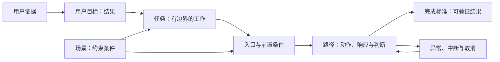

# 用户目标、任务、场景、入口、路径与完成标准

这六个概念用于把用户要取得的结果，转化为可设计、可实现、可验证的交互过程。它们不是页面清单，也不等同于业务流程图。

## 六个概念的边界

| 概念 | 回答的问题 | 合格的描述 | 不应写成 |
| --- | --- | --- | --- |
| 用户目标 | 用户最终要改变什么状态？ | 在截止前补齐材料，使报销可以继续处理 | 打开报销详情页 |
| 任务 | 用户为了目标要完成什么工作？ | 找到缺失发票并提交给当前报销单 | 点击“上传”按钮 |
| 场景 | 哪些实际条件会改变任务的执行方式？ | 手机端、弱网、只有相册中的发票照片、提交截止时间临近 | 喜欢蓝色、性格谨慎等无证据且不影响决策的描述 |
| 入口 | 用户从哪里开始或恢复任务？ | 待办通知、报销详情、上传失败后的恢复链接 | 只写产品首页 |
| 路径 | 用户和系统如何一步步到达结果？ | 用户选择文件，系统校验，用户修正失败项，系统更新报销状态 | 页面 A → 页面 B → 页面 C |
| 完成标准 | 怎样客观判断任务成功？ | 文件已关联到正确报销单、校验通过、状态变为待审批，用户看到结果与下一步 | 用户点击了“提交” |

### 用户目标

用户目标描述用户想获得的结果，而不是产品提供的功能。一个可靠的目标应满足三个条件：

- 即使更换产品或界面，目标仍然成立。
- 能指出目标达成前后的状态变化。
- 粒度足以指导当前范围内的设计。

“管理报销”过于宽泛，无法确定任务边界；“点击上传发票”又过于接近解决方案。“在截止前补齐缺失发票，使报销可以进入审批”能够同时限定结果、对象和时间约束。

### 任务

任务是用户为达成目标而执行的一组有边界的活动。任务至少应记录：

- **主体**：谁执行，拥有什么权限。
- **对象**：处理哪个订单、文件、账户或其他实体。
- **触发**：什么事件使任务现在需要发生。
- **前置条件**：开始前必须满足什么条件。
- **终止条件**：成功、失败或取消时，任务在哪个状态停止。

现有组织流程不能直接当作用户任务。它可能包含历史形成的审批、重复录入或部门分工，设计时应先确认哪些步骤确实服务于用户目标，哪些只是当前实现。

### 场景

场景是会影响交互决策的实际条件集合，不是完整的人物传记。常见维度包括：

- 设备、屏幕尺寸、输入方式和辅助技术；
- 网络质量、使用地点、光线、噪声和被打断的可能性；
- 时间压力、频率、数据量和错误成本；
- 账户权限、组织角色、登录状态和可用渠道；
- 用户已有知识、所持材料、需要与谁协作；
- 隐私、安全、合规和无障碍要求。

只保留会改变入口、信息、控件、反馈、路径或完成标准的条件。没有证据的条件应标记为“待验证假设”，不能写成已知事实。

### 入口

入口是用户进入或恢复具体任务的起点，而不只是站点首页。一个任务可能同时具有：

- 导航或站内搜索入口；
- 外部搜索、分享链接或深链入口；
- 邮件、短信、推送和待办通知入口；
- 完成上一个任务后的衔接入口；
- 草稿、超时、断网或失败后的恢复入口；
- 无权限、链接失效或对象已变更时的受限入口。

每个入口都要说明它携带的上下文。例如通知深链是否已经定位到正确报销单，链接失效后是否能回到可继续操作的位置。

### 路径

路径由四类信息组成：用户动作、系统响应、用户判断和状态变化。它通常包含主路径、分支、异常处理、中断恢复和取消，不应只是一串页面名称。

路径中的每一步都应能回答：

1. 用户此刻掌握什么信息，要做什么决定？
2. 系统接收什么输入，执行什么校验或状态变更？
3. 用户怎样知道系统发生了什么？
4. 失败、返回或中断后，从哪里继续？

### 完成标准

完成标准是可观察、可判定的成功条件。它通常同时覆盖：

- **对象状态**：数据写入正确对象且内容完整。
- **业务状态**：系统进入预期状态，例如“待审批”。
- **用户可见结果**：用户知道任务是否成功、哪些内容生效以及下一步是什么。
- **后续可用性**：重新进入后仍能看到结果，相关参与者能够继续处理。

最后一次点击不是完成标准。接口返回成功也不一定代表用户目标达成：数据可能关联错误、异步处理可能失败，或者用户没有得到可理解的确认。

任务成功率、完成时间和错误次数是评估体验的指标，不应代替任务本身的完成标准。先定义什么算成功，再选择怎样测量成功的难度与效率。

## 六个概念怎样连接



目标决定任务为何存在；任务和场景共同决定需要支持哪些入口与路径；完成标准判断路径是否真正到达结果。异常路径可以返回主路径，也可以以明确的失败、取消或不符合资格结果结束。

路径不是越短越好。低风险、重复性任务通常应减少不必要步骤；涉及付款、删除、授权或不可逆操作时，确认、复核和短暂延迟可能是必要的风险控制。判断依据是步骤是否帮助用户正确完成目标，而不是步骤数量本身。

## 从证据得到设计记录

用户目标和场景应由证据支持。个人学习或独立项目不一定能立即开展用户访谈，也可以先使用：

- 已有研究报告、客服记录、帮助中心问题和公开反馈；
- 对真实任务的观察、可用性测试记录或错误案例；
- 搜索词、入口来源、漏斗、失败码和放弃位置等行为数据；
- 法规、业务规则、设备能力和技术限制等约束材料。

行为数据能够指出“哪里发生了问题”，通常不能单独解释“为什么发生”。没有直接证据时可以继续设计，但必须把结论写为假设，并记录验证方式。

可以用下面的格式先写目标：

```text
当【触发或场景】发生时，
【用户类型】需要【完成某项任务】，
以便【获得与界面无关的结果】。
证据：【来源或“待验证假设”】
```

“用户需要一个上传按钮”已经预设了解决方案。更合适的写法是：“收到材料缺失通知后，报销申请人需要补交正确发票，以便报销继续审批。”上传、拍照、扫描或从票据库选择，都可以在后续设计中比较。

## 完整应用示例：补交报销发票

### 1. 已知证据与假设

| 类型 | 内容 | 设计影响 |
| --- | --- | --- |
| 已知规则 | 缺少合规发票时不能进入审批 | 提交前必须校验材料状态 |
| 已知环境 | 通知链接可能在手机上打开 | 入口和文件选择需要支持移动端 |
| 已知状态 | 报销单可能已撤回、已关闭或已由他人处理 | 进入任务时必须重新读取最新状态 |
| 待验证假设 | 用户通常只有相册照片，没有本地 PDF | 先支持相册选择，并通过测试验证优先级 |

### 2. 目标、任务与场景

- **用户目标**：在截止前补齐缺失发票，使当前报销单可以继续审批。
- **任务**：为指定报销单找到正确发票，提交并确认系统接受该发票。
- **主体与权限**：报销申请人，可编辑自己的待补充报销单。
- **触发**：收到材料缺失通知，或在报销列表看到“待补充”。
- **前置条件**：用户已登录；报销单仍可补充；用户持有可识别的发票文件。
- **关键场景**：手机端操作、网络可能中断、截止时间临近、错误文件会延误审批。

### 3. 入口

| 入口 | 必须保留的上下文 | 受限情况 |
| --- | --- | --- |
| 待办通知深链 | 报销单 ID、缺失材料类型 | 未登录时认证后返回原任务；链接失效时说明原因 |
| 报销列表 | 当前状态、截止时间 | 已关闭的报销单不可显示可操作按钮 |
| 报销详情 | 已提交材料、缺失项 | 无权限时不泄露报销内容 |
| 上传草稿恢复 | 草稿文件、上传进度、失败原因 | 文件已删除时要求重新选择 |

### 4. 主路径与系统状态

1. 用户从通知进入，系统验证身份、权限和报销单最新状态。
2. 系统显示缺失的材料、截止时间、支持的文件要求和当前报销单标识。
3. 用户选择发票；系统显示文件名、缩略图或关键识别结果，供用户确认对象是否正确。
4. 用户提交；系统执行格式、大小、可读性、重复文件和必要业务字段校验。
5. 校验通过后，系统将文件关联到该报销单，并把状态从“待补充”更新为“待审批”。
6. 系统显示成功结果、报销单标识、当前状态和后续处理说明。

需要同时设计的异常与恢复路径包括：

- 文件格式或大小不符合要求：指出具体问题，保留报销单上下文并允许重新选择。
- 网络中断：显示未完成状态；恢复后继续上传或明确要求重试，不能展示成功。
- 发票重复或内容无法识别：保留文件预览，说明需替换还是可以人工复核。
- 报销单已关闭或权限改变：停止提交，说明当前状态和可采取的下一步。
- 用户主动取消：不改变报销业务状态；若保存草稿，应明确保存范围和有效期。

### 5. 完成标准

该任务只有在以下条件全部满足时才算成功：

- 文件存储成功，并关联到通知所指向的报销单；
- 必要校验通过，或明确进入人工复核状态；
- 报销单状态按规则更新，不再错误地显示“待补充”；
- 用户看到成功或人工复核结果、报销单标识和下一步；
- 用户重新进入报销详情后，能看到已提交材料和一致的最新状态。

如果系统接受文件但仍需人工判断，应把“已提交，等待复核”作为阶段性结果，不能把它写成“发票已通过”。

## 可复制的任务设计模板

```markdown
## 任务名称

- 证据：
- 待验证假设：
- 用户目标：
- 执行主体与权限：
- 任务对象：
- 触发条件：
- 前置条件：
- 场景约束：

### 入口

| 入口 | 携带的上下文 | 无效或受限时的处理 |
| --- | --- | --- |
|  |  |  |

### 主路径

1. 用户动作：
   - 系统响应：
   - 用户判断：
   - 状态变化：

### 分支、异常与恢复

| 触发条件 | 系统处理 | 用户看到什么 | 如何继续或结束 |
| --- | --- | --- | --- |
|  |  |  |  |

### 完成标准

- 对象状态：
- 业务状态：
- 用户可见结果：
- 重新进入后的结果：

### 评估指标

- 任务成功率：
- 完成时间：
- 错误与放弃位置：
```

## 常见错误与修正

| 错误 | 造成的问题 | 修正方式 |
| --- | --- | --- |
| 把按钮或页面写成目标 | 过早锁定解决方案 | 改写为用户要获得的外部结果 |
| 默认所有人从首页开始 | 深链和通知入口缺少上下文或返回路径 | 枚举直接、外部、通知和恢复入口 |
| 把路径画成页面序列 | 看不到决策、校验、状态和失败 | 每一步同时写用户动作、系统响应、用户判断和状态变化 |
| 只设计理想主路径 | 真实错误发生后无法继续 | 为权限、空状态、无效输入、中断和重复提交设计终止或恢复方式 |
| 用“接口成功”判断完成 | 用户可能仍不知道结果，业务状态也可能未更新 | 同时检查对象、业务和用户可见结果 |
| 为缩短流程删除必要确认 | 高风险任务更容易误操作 | 依据错误成本和可逆性决定确认与复核 |
| 把分析数据当成原因 | 知道放弃位置，却误判动机 | 用任务观察或可用性测试补充原因证据 |

## 验证步骤

1. 选择一个能够稳定复现的任务，准备成功、无权限、无效输入和网络中断所需的测试数据。
2. 分别从首页导航、直接链接、通知或恢复入口开始，检查是否都保留正确对象与任务上下文。
3. 沿主路径执行，逐步记录用户动作、系统反馈、状态变化和需要作出的判断。
4. 触发每个异常条件，确认错误信息说明发生了什么、数据是否已生效以及下一步是什么。
5. 达到完成页后重新进入对象详情，核对界面结果、后台业务状态和相关参与者看到的状态是否一致。
6. 记录任务是否成功、完成时间、错误、放弃位置和“以为成功但实际未成功”的情况。
7. 将发现的问题回写到场景、入口、路径或完成标准，并标明证据来源与复测结果。

## 练习与完成标准

选择一个公开产品或自己的项目，分析“重置密码”“取消订单”或“提交内容”中的一个任务。使用本文模板产出一页任务设计记录。

练习完成时应满足：

- 目标没有按钮名、页面名或预设方案，且描述了结果状态；
- 任务包含主体、对象、触发、前置条件和终止条件；
- 至少记录三个不同入口，其中一个是失败恢复或中断恢复入口；
- 主路径的每一步都包含用户动作和系统响应；
- 至少覆盖无权限、无效输入、中断和重复操作中的两个异常；
- 完成标准能通过数据状态与用户可见结果共同验证；
- 已知事实有证据来源，尚未确认的内容明确标为假设；
- 另一位读者可以只依据记录复现任务并判断是否成功。

## 来源

- [ISO：ISO 9241-11:2018 Ergonomics of human-system interaction — Part 11: Usability: Definitions and concepts](https://www.iso.org/standard/63500.html)（访问日期：2026-07-17）
- [GOV.UK Service Manual：Learning about users and their needs](https://www.gov.uk/service-manual/user-research/start-by-learning-user-needs)（访问日期：2026-07-17）
- [GOV.UK Service Manual：Scoping your service](https://www.gov.uk/service-manual/design/scoping-your-service)（访问日期：2026-07-17）
- [GOV.UK Service Manual：Introduction to designing government services](https://www.gov.uk/service-manual/design/introduction-designing-government-services)（访问日期：2026-07-17）
- [GOV.UK Service Manual：Usability benchmarking a website or whole service](https://www.gov.uk/service-manual/measuring-success/usability-benchmarking-a-website-or-whole-service)（访问日期：2026-07-17）
