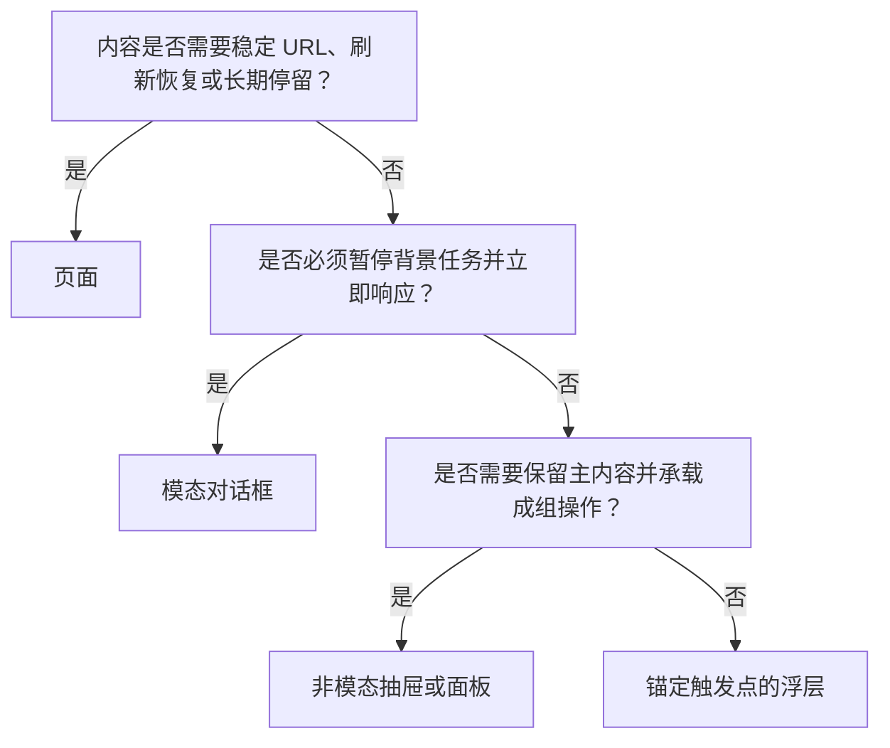

# 页面、对话框、抽屉与浮层

页面、对话框、抽屉和浮层是四种不同的任务容器。选择容器会直接改变 URL、导航历史、焦点范围、背景是否可操作、任务恢复方式和小屏行为。

## 概念边界

| 容器 | 核心特征 | 适合 | 不适合 |
| --- | --- | --- | --- |
| 页面 | 独立内容上下文，通常有稳定 URL 和导航位置 | 长内容、多步任务、可分享或需刷新恢复的状态 | 仅包含一句补充说明的短暂内容 |
| 模态对话框 | 位于当前上下文之上，打开后背景不可交互 | 必须立即作答的短任务、高风险确认、阻断性选择 | 浏览、比较大量内容或长表单 |
| 非模态对话框 | 临时窗口，但用户仍可与背景交互 | 需要一边参考主内容一边调整的辅助工具 | 必须阻止背景修改的原子操作 |
| 抽屉 | 从视口边缘出现的面板；可以是模态或非模态 | 主对象的详情、筛选、短编辑，且需保留主上下文 | 多层导航、复杂多步任务或需独立分享的内容 |
| 浮层 | 与触发元素或局部区域关联的轻量临时层 | 少量选项、局部控制、补充信息 | 关键确认、长内容或不可恢复操作 |

“抽屉”和“浮层”主要描述视觉与空间关系，不自动决定模态性。设计规范必须另行说明背景能否操作、焦点是否受限、是否通过外部点击关闭以及关闭是否会丢失输入。

HTML `dialog` 与 Popover API 是平台能力，不等于完整的产品决策。`dialog.showModal()` 会进入顶层并使背景处于不可交互状态；非模态 `show()` 不会。Popover API 负责显示与隐藏浮层，但内容语义、键盘模型和关闭后的业务结果仍需设计者定义。

## 选择机制



这个判断只给出初始方案。还要用内容长度、任务风险、设备宽度、深链要求和无障碍行为复核：桌面上的抽屉在窄屏上可能应变成全屏页面；浮层中的内容增长后可能需要升级为对话框或页面。

## 各容器必须定义的行为

### 页面

- URL 是否唯一，筛选、分页、选中对象和步骤是否需要写入 URL。
- 浏览器前进、后退、刷新和直接打开深链时恢复什么状态。
- 页面标题、主标题、导航当前项和焦点落点是否一致。
- 加载、空、失败、无权限、对象不存在和过期状态如何显示。
- 未保存编辑离开时是自动保存、阻止离开还是允许丢弃。

### 模态对话框

- 打开后焦点进入对话框，`Tab` 和 `Shift+Tab` 保持在其中。
- 对话框具有可访问名称；标题通常通过 `aria-labelledby` 关联。
- 背景在视觉、指针、键盘和辅助技术层面都不可操作。
- `Escape`、关闭按钮、取消按钮和遮罩点击的行为必须明确。
- 关闭后焦点返回触发控件；若触发控件已消失，则进入符合后续任务的元素。
- 未保存输入、异步提交和重复点击期间能否关闭必须定义。

WAI-ARIA APG 是实现指导，不是规范性设计系统。原生 `<dialog>` 能处理一部分顶层、焦点和关闭行为，仍需测试实际浏览器与辅助技术组合。

### 抽屉

- 明确是模态还是非模态，不能只靠遮罩颜色暗示。
- 说明打开是否改变 URL 或历史记录，浏览器返回键是关闭抽屉还是离开页面。
- 非模态抽屉应允许用户在主内容和抽屉间按自然顺序移动焦点。
- 模态抽屉遵循对话框的焦点约束、名称和关闭要求。
- 宽度应受内容与视口约束；放大到 200% 或窄屏时不能遮挡必要操作。

### 浮层

- 触发控件应暴露展开状态和关联关系；打开、关闭后焦点去向明确。
- 纯补充说明不应只能通过悬停获得，键盘焦点和触屏也要可达。
- 菜单、列表框、对话框和普通说明具有不同语义与键盘模型，不能统一写成 `role="popover"`；ARIA 中没有通用的 `popover` 角色。
- 轻量浮层通常允许轻触外部关闭，但若包含未保存输入，应明确确认或保留策略。
- 锚点消失、滚动离屏、窗口缩放和空间不足时，应重新定位或关闭。

## 完整案例：在订单列表中修改配送地址

### 初始需求

用户在订单列表发现地址错误，需要在发货前修正。地址修改需要校验，但不是多步骤流程。

### 方案比较

| 方案 | 收益 | 代价与风险 | 结论 |
| --- | --- | --- | --- |
| 独立页面 | 可深链、刷新恢复、适合复杂地址 | 离开列表上下文，短任务成本较高 | 地址规则复杂或需多步验证时使用 |
| 模态对话框 | 明确聚焦短任务，防止同时修改列表 | 小屏空间有限，必须处理焦点和未保存关闭 | 当前场景的默认选择 |
| 抽屉 | 可同时看到订单信息 | 若为模态，本质接近对话框；若非模态，可能同时改动订单状态 | 需要持续比较多个订单字段时使用 |
| 浮层 | 打开快、靠近触发点 | 地址表单过长，错误信息与软键盘易溢出 | 不使用 |

### 对话框状态

```text
关闭
  → 打开并加载当前地址
  → 可编辑
  → 本地校验失败 / 服务端校验中
  → 保存成功并关闭 / 保存失败并保留输入
  → 取消并关闭
```

具体行为：

1. 用户在某订单行选择“修改地址”，对话框标题包含订单标识。
2. 焦点进入标题或第一个需要修改的字段；背景订单列表不可操作。
3. 提交时禁用重复提交，但不要禁用取消所需的全部退出机制。
4. 字段错误显示在字段附近，并在提交后提供错误摘要；输入保持不变。
5. 保存成功后关闭对话框，更新该订单行并通过状态消息宣布“订单 1024 的配送地址已更新”。
6. 焦点返回该订单行的“修改地址”按钮；若该行因筛选消失，焦点移到列表标题或下一项合理位置。

小屏验证若发现内容需要多次滚动、软键盘遮挡操作或地址包含多阶段验证，则使用全屏页面，并保留返回订单列表的上下文。

## 可执行设计步骤

1. 写清任务目标、内容长度、风险、是否需要比较背景内容。
2. 列出 URL、刷新恢复、分享、历史记录和返回键要求。
3. 用选择机制得到候选容器，并记录为何排除其他容器。
4. 为容器定义打开、初始焦点、Tab 顺序、提交、取消、关闭和焦点恢复。
5. 补齐初始、加载、成功、失败、无权限、过期和未保存状态。
6. 在桌面、窄屏、200% 放大和内容增长条件下复核容器是否仍适用。
7. 将无法由静态稿表达的行为写进交付规范，并通过可运行原型验证。

## 常见错误与边界

- 用模态对话框展示可以在原页面直接出现的普通说明，制造无必要中断。
- 把视觉像抽屉的容器称为“非模态”，但背景实际上被遮罩和焦点锁定。
- 将长表单放进浮层，外部点击后直接丢失输入。
- 通过 CSS 隐藏对话框，却未执行正确关闭流程，导致背景仍被阻塞。
- 关闭对话框后把焦点送到页面顶部，使键盘用户丢失任务位置。
- 只在桌面判断容器；小屏、放大、虚拟键盘出现后操作不可见。
- 嵌套多个模态层。确有连续决策时，优先合并内容或进入新页面。

## 验证步骤

1. 仅用键盘打开、操作和关闭容器，确认焦点可见、顺序合理且不会丢失。
2. 用屏幕阅读器确认容器名称、模态状态、错误与保存结果可被感知。
3. 在浏览器执行前进、后退、刷新和直接打开 URL，检查状态恢复符合规范。
4. 在 320 CSS 像素宽度与 200% 缩放下完成任务，确认内容与关闭控件可达。
5. 制造慢请求、保存失败、权限改变和触发元素消失，验证输入保留与焦点恢复。
6. 对比关闭按钮、`Escape`、遮罩点击和系统返回手势，确认结果一致或差异有明确理由。

## 练习与完成标准

为“从项目列表快速新建任务”选择容器，完成一份行为规范。

完成时应满足：

- 比较页面、对话框、抽屉和浮层，并用任务要求说明选择理由；
- 明确 URL、历史记录、背景交互和小屏转换规则；
- 画出至少六个状态及其转换；
- 写出打开、Tab、`Escape`、提交、取消和关闭后的焦点行为；
- 覆盖加载失败、重复提交和未保存关闭；
- 另一位开发者能依据规范实现，测试者能判断每项行为是否通过。

## 来源

- [WHATWG HTML Standard：Interactive elements](https://html.spec.whatwg.org/multipage/interactive-elements.html)（访问日期：2026-07-17）
- [W3C WAI-ARIA APG：Dialog (Modal) Pattern](https://www.w3.org/WAI/ARIA/apg/patterns/dialog-modal/)（访问日期：2026-07-17）
- [W3C WAI-ARIA APG：Introduction](https://www.w3.org/WAI/ARIA/apg/about/introduction/)（访问日期：2026-07-17）
- [W3C WAI：Understanding SC 4.1.3 Status Messages](https://www.w3.org/WAI/WCAG22/Understanding/status-messages.html)（访问日期：2026-07-17）
