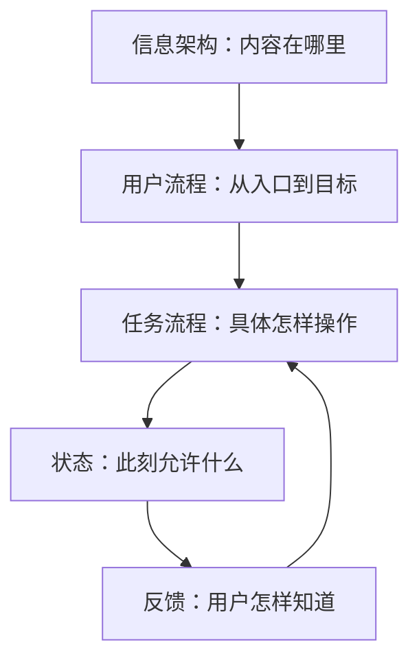
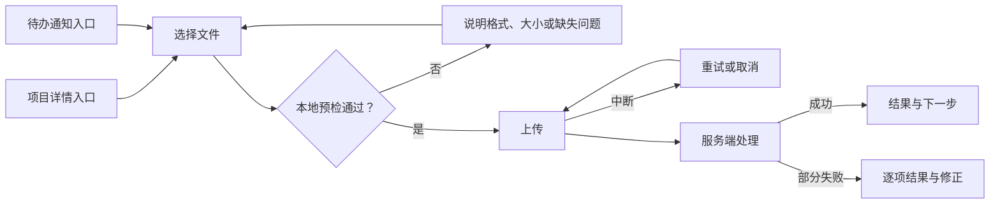

# 信息架构、用户流程、任务流程、状态与反馈

信息架构、用户流程、任务流程、状态和反馈处于不同设计层次：信息架构组织内容与功能，流程组织行动与判断，状态描述某一时刻的条件，反馈让状态变化可被用户感知。把它们混成一张页面连线图，会遗漏入口、分支、数据条件和恢复机制。

## 概念边界

| 概念 | 研究对象 | 典型产物 | 不能替代 |
| --- | --- | --- | --- |
| 信息架构（IA） | 内容与功能的分类、命名、层级、导航和检索 | 内容模型、分类体系、导航模型、站点地图 | 具体任务如何完成 |
| 用户流程 | 用户从不同入口达到目标的端到端路径 | 含入口、分支、渠道和出口的流程图 | 每一步的控件级操作细节 |
| 任务流程 | 在给定场景下完成一个有边界任务的操作序列 | 步骤、判断、输入、系统响应和完成条件 | 整个产品的信息组织 |
| 状态 | 系统、对象、页面或控件在某时刻的数据与可操作条件 | 状态表、状态机、数据条件 | 用户对变化的理解 |
| 反馈 | 对动作、进度、结果或错误的可感知响应 | 文案、视觉变化、声音、触觉、焦点或状态消息 | 真实的数据与业务状态 |

站点地图只是 IA 的一种视图；线框图连线只是流程的一种表达；Toast 只是反馈的一种形式。设计完整性取决于各层之间能否追踪，而不是产物数量。

## 五层怎样协作



以“上传文件”为例：IA 决定上传入口属于项目、资料库还是任务；用户流程覆盖通知、项目详情和直接链接等入口；任务流程描述选择文件、校验、上传与确认；状态机区分未选择、上传中、处理中、成功和失败；反馈显示进度、错误原因与恢复操作。

## 信息架构

### 组成部分

- **内容模型**：有哪些对象、属性和关系，例如项目包含文件，文件具有版本与处理状态。
- **组织体系**：按主题、任务、对象、角色、时间或混合维度分类。
- **命名体系**：导航、标题、搜索结果和操作使用一致、可区分的语言。
- **导航体系**：用户怎样从当前位置到达相关内容。
- **搜索与检索**：可搜索字段、筛选、排序、结果呈现和无结果恢复。

IA 的分类维度应反映用户寻找信息的方式。组织架构和数据库表可以提供约束，但不应自动变成导航结构。

### 验证问题

- 同一对象是否在多个位置重复且状态不一致？
- 用户能否从任务语言预测入口名称？
- 层级是否稳定，还是经常因权限或组织调整变化？
- 搜索结果是否显示足够上下文以区分同名对象？

## 用户流程与任务流程

### 用户流程

用户流程从目标和场景开始，至少包含：

- 用户类型与目标；
- 站内、外部、通知和恢复入口；
- 权限、登录和对象状态等前置条件；
- 关键选择、跨渠道步骤和异常出口；
- 成功、失败、取消和不符合资格等结束状态。

### 任务流程

任务流程把其中一个任务展开到可执行粒度。每个节点使用统一格式：

```text
触发条件 → 用户动作 → 系统处理 → 可见反馈 → 结果状态 → 下一步
```

如果一个节点只有“打开页面”，还不足以实现或测试。应继续说明页面基于什么数据进入哪个状态，用户能执行什么，系统响应后状态怎样变化。

## 状态模型

### 状态层级

- **系统状态**：在线、维护、认证服务不可用。
- **对象状态**：草稿、处理中、已发布、已归档。
- **页面或区域状态**：初始、加载、空、成功、失败、无权限、过期。
- **控件状态**：默认、悬停、焦点、按下、禁用、只读、忙碌、无效。

不同层级可以组合。例如页面已加载成功，但某个文件对象仍在服务端处理中；提交按钮处于禁用状态不代表整个页面不可用。

### 用条件定义状态

状态名称必须映射到可判断条件：

| 状态 | 进入条件 | 可执行操作 | 离开条件 |
| --- | --- | --- | --- |
| `uploading` | 文件已通过本地预检并开始传输 | 取消 | 传输完成、失败或取消 |
| `processing` | 服务端收到完整文件并异步解析 | 离开页面、稍后查看 | 解析成功或失败 |
| `failed-retryable` | 暂时性网络或服务错误 | 重试、替换文件 | 重试成功或用户取消 |
| `failed-final` | 文件永久不符合规则 | 替换文件 | 新文件通过预检 |

“错误状态”过于宽泛。是否可重试、数据是否已写入、用户输入是否保留，会决定完全不同的交互。

## 反馈模型

反馈回答四个问题：系统是否收到动作、正在做什么、结果是什么、用户下一步能做什么。

| 反馈类型 | 适用情况 | 要求 |
| --- | --- | --- |
| 控件内反馈 | 点击、选择、输入等即时动作 | 靠近动作，不仅依赖颜色 |
| 区域内状态 | 列表刷新、模块失败、局部保存 | 保留上下文，提供重试或下一步 |
| 状态消息 | 不移动焦点的动态结果或进度 | 程序可确定，使辅助技术能获知 |
| 焦点转移 | 新页面、对话框、必须立即处理的错误 | 落点合理，避免无理由中断 |
| 持久结果页 | 支付、申请、删除等重要完成结果 | 包含对象、结果、时间和后续操作 |

`role="status"` 适合非紧急状态更新；`role="alert"` 或 assertive live region 只应用于重要且时间敏感的信息，滥用会持续打断屏幕阅读器用户。状态消息不能只显示图标或颜色。

## 完整案例：上传项目数据文件

### 用户流程



### IA 决策

- 文件属于项目对象，主要入口放在项目详情的“数据文件”区域。
- 通知深链携带项目 ID，并在登录后返回同一任务。
- 文件详情具有独立 URL，可查看版本、处理结果和错误报告。
- 搜索结果显示项目名、文件名、版本和处理状态，避免同名文件混淆。

### 任务流程节点

| 节点 | 用户动作 | 系统处理 | 反馈与状态 |
| --- | --- | --- | --- |
| 选择 | 选择 CSV 文件 | 检查扩展名、大小和基础结构 | 显示文件名；失败时给出可修正原因 |
| 上传 | 确认上传 | 传输文件 | 显示可感知进度并允许取消 |
| 处理 | 等待或离开 | 异步解析数据 | 明确“已上传，处理中”，不伪装成最终成功 |
| 完成 | 查看结果 | 更新文件和项目状态 | 显示成功数、失败数、错误下载和下一步 |

### 关键状态与恢复

- 取消上传：终止传输，清理未完成数据，允许重新选择。
- 页面关闭：若服务端已收到文件，重新进入后恢复处理状态。
- 部分成功：保留成功记录，列出失败项及是否可只重试失败项。
- 重复文件：说明检测依据，允许查看现有版本或确认新版本。
- 权限变化：停止进一步写入，保留已经完成的权威结果。

## 可执行设计步骤

1. 列出核心对象、属性、关系、术语和用户寻找方式，建立 IA 草图。
2. 写目标、场景、入口、前置条件和完成标准。
3. 画端到端用户流程，加入分支、跨渠道、失败、取消和恢复。
4. 选择一个关键任务，按统一节点格式展开任务流程。
5. 为每个节点标注系统、对象、页面和控件状态。
6. 为每次状态变化指定可见反馈、辅助技术通知、持续时间和下一步。
7. 用真实数据和故障条件运行流程，修正不能映射到数据条件的状态。

## 常见错误与边界

- 用站点地图代替完整 IA，遗漏内容模型、命名和检索。
- 用户流程从首页开始，忽略通知、搜索和恢复入口。
- 流程图只连接页面，没有用户判断、系统处理和状态。
- 用“加载”“失败”描述全部状态，却不写进入与离开条件。
- 服务器开始处理就显示“完成”，造成阶段性成功与最终成功混淆。
- 所有结果都使用短暂 Toast，重要错误消失后无法恢复。
- 动态更新只改变颜色或图标，键盘与辅助技术无法获知。

## 验证步骤

1. 从每个入口进入任务，确认对象与上下文一致。
2. 对流程图每条边制造对应条件，检查不存在无法到达或无法退出的状态。
3. 记录前端展示状态与后端权威状态，验证刷新和重新登录后保持一致。
4. 仅用键盘完成主路径、失败修正、取消和恢复。
5. 用屏幕阅读器检查加载、进度、结果和错误能否在不丢失焦点的情况下获知。
6. 制造断网、超时、部分成功、权限变化和并发更新，验证下一步明确。

## 练习与完成标准

为“批量邀请项目成员”建立 IA、用户流程、任务流程、状态表和反馈规范。

完成时应满足：

- IA 说明成员对象、项目关系、入口和术语；
- 用户流程至少包含两个入口、权限分支和三个结束状态；
- 任务流程每一步包含动作、系统处理、反馈与结果状态；
- 状态表覆盖加载、空、部分成功、失败、取消和重复邀请；
- 反馈区分非阻断状态消息与需要焦点的上下文变化；
- 通过刷新、键盘、屏幕阅读器和故障注入验证。

## 来源

- [W3C WAI：Page Structure Tutorial](https://www.w3.org/WAI/tutorials/page-structure/)（访问日期：2026-07-17）
- [W3C WAI：Understanding SC 4.1.3 Status Messages](https://www.w3.org/WAI/WCAG22/Understanding/status-messages.html)（访问日期：2026-07-17）
- [W3C WAI-ARIA APG：Introduction](https://www.w3.org/WAI/ARIA/apg/about/introduction/)（访问日期：2026-07-17）
- [GOV.UK Service Manual：Scoping your service](https://www.gov.uk/service-manual/design/scoping-your-service)（访问日期：2026-07-17）
