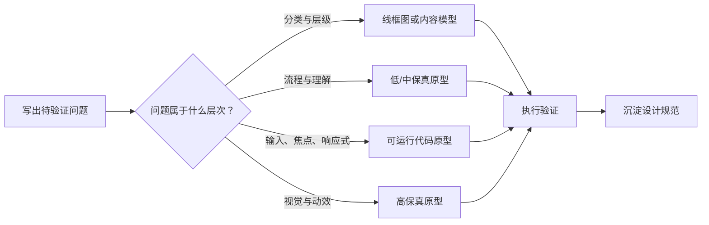

# 线框图、原型保真度与设计规范

线框图用于表达结构，原型用于模拟一部分真实行为，保真度描述模拟在哪些维度接近成品，设计规范用于把决策转化为可实现、可检查的规则。它们服务于不同问题，不能互相替代。

## 概念边界

| 产物 | 核心用途 | 能证明 | 不能证明 |
| --- | --- | --- | --- |
| 线框图 | 表达信息层级、区域、控件与导航关系 | 内容优先级和大致结构 | 真实交互、性能和最终视觉质量 |
| 低保真原型 | 快速模拟概念与主流程 | 入口、步骤、顺序是否可理解 | 真实输入、滚动、焦点和等待体验 |
| 中保真原型 | 用真实文案、数据和关键状态走查任务 | 任务路径、内容、分支和反馈 | 完整平台行为与后端结果 |
| 高保真原型 | 接近最终视觉、动效与局部行为 | 视觉层级、过渡和细节理解 | 生产性能、兼容性、安全和可访问性合规 |
| 设计规范 | 定义结构、状态、行为、内容与实现边界 | 团队应实现和验收什么 | 实现本身是否正确 |

保真度不是单一的“高或低”。一个原型可能视觉保真度高，但数据、内容、交互和技术保真度低。选择原型时应分别说明：

- **结构保真度**：布局和信息关系有多接近成品。
- **内容保真度**：文案、数据长度和数据分布是否真实。
- **交互保真度**：输入、滚动、键盘、焦点、分支和恢复实现到什么程度。
- **视觉保真度**：颜色、排版、图标、间距和动效有多完整。
- **数据与技术保真度**：是否连接真实接口、延迟、错误和平台能力。

## 由问题决定产物



原则是使用能回答当前问题的最低必要成本，不是固定从低保真顺序升级到高保真。若要验证键盘焦点，纸面原型无法回答；若要验证分类命名，先制作完整视觉稿不会增加有效证据。

## 线框图怎样制作

线框图至少应表达：

- 页面或容器的目的和主标题；
- 主要、次要与辅助内容的顺序；
- 导航、输入、列表、详情与操作区域；
- 关键入口、出口和页面间关系；
- 代表性内容长度、空状态和错误区域；
- 对响应式变化的结构假设。

灰色方块和占位文案不能帮助判断真实内容。即使视觉低保真，也应使用接近真实长度的标题、标签、错误和数据，避免低估换行、密度与信息差异。

## 原型范围怎样定义

每个原型开始前写一张范围卡：

```markdown
- 待验证问题：
- 目标任务与场景：
- 参与入口：
- 实现的路径和状态：
- 未实现部分：
- 假数据与真实数据：
- 通过标准：
- 原型结果不得外推到：
```

原型应只模拟验证所需的行为，但不能让体验者误以为未实现行为已经可用。假按钮应删除、禁用并说明，或真实连接到明确的占位结果；不能点击后无响应。

### 关键状态

至少根据任务选择：初始、加载、空、成功、失败、无权限、离线、过期、部分成功、取消、重试和并发冲突。静态原型可以为状态建立独立画板；可运行原型应提供测试开关或固定数据，使每个状态可重复触发。

### 键盘、焦点与响应式

需要验证以下问题时，应使用浏览器或平台可运行原型：

- 自然 Tab 顺序、焦点可见性、对话框焦点约束与关闭后恢复；
- 表单标签、错误关联、动态状态消息和辅助技术语义；
- 内容重排、缩放、软键盘、滚动和触控目标；
- 原生控件、浏览器历史、文件上传和拖放等平台行为。

设计工具中的热点连线无法证明这些行为。高保真视觉也不能替代语义和输入方式测试。

## 设计规范应包含什么

### 组件规范

- 组件用途、适用条件与禁止场景；
- 结构、可访问名称、语义和内容要求；
- 默认、悬停、焦点、按下、选中、禁用、只读、加载和错误状态；
- 鼠标、触控、键盘与辅助技术行为；
- 内容长度、图标、国际化和无障碍约束。

### 流程规范

- 入口、前置条件、主路径、分支和完成标准；
- 每一步的用户动作、系统响应、数据状态和反馈；
- 失败、取消、中断、重试、过期和并发处理；
- URL、浏览器历史、草稿和刷新恢复。

### 响应式规范

不要只交付三个固定宽度截图。应说明内容在什么条件下换行、堆叠、隐藏、滚动或改变容器，以及信息优先级是否保持。断点是实现条件，不是设备名称的替代品。

### 可验收表达

“按钮置灰”只描述外观；“请求进行时阻止重复提交，按钮保留可读名称并显示忙碌状态；请求失败后恢复可操作，输入保持不变”才是可实现和可测试的规则。

## 完整案例：邀请项目成员

### 待验证问题

用户能否理解邀请结果中“已邀请”“已是成员”“地址无效”三类状态，并修正失败项？

### 原型策略

| 维度 | 选择 | 理由 |
| --- | --- | --- |
| 结构 | 中保真 | 需要真实结果分组和错误摘要 |
| 内容 | 高保真 | 邮箱长度、重复项和错误文案直接影响理解 |
| 交互 | 可运行 | 需要验证键盘、粘贴多个地址、焦点和部分成功 |
| 视觉 | 中保真 | 品牌细节不影响当前问题 |
| 数据 | 固定测试集 | 必须重复制造三类结果 |

### 原型状态

1. 初始：空输入，提交不可用，但原因无需只靠禁用表达。
2. 输入：支持逐个输入或粘贴多个地址，明确分隔规则。
3. 本地错误：格式错误关联到具体项，可键盘定位和删除。
4. 提交中：防止重复提交，保留输入上下文。
5. 部分成功：分别列出成功、已存在和失败；只允许重试失败项。
6. 完全失败：保留全部输入，说明是否有任何邀请已发出。
7. 完成：用户可返回成员列表，列表显示最新成员或待接受状态。

### 规范摘录

```text
当结果为部分成功时：
- 标题显示“3 个邀请已发送，2 个需要处理”；
- 成功项不再进入重试请求；
- 失败项保留输入与服务端原因；
- 焦点移动到结果标题；
- 修正后提交只发送失败项；
- 返回成员列表后，通过状态消息宣布成员列表已更新。
```

## 可执行工作步骤

1. 把“想看看方案”改写为可以判断对错的验证问题。
2. 确定参与者、任务、场景、路径和通过标准。
3. 分别选择结构、内容、交互、视觉和数据保真度。
4. 制作最小原型，加入真实文案、代表性数据和必要状态。
5. 显式标注未实现内容和原型限制。
6. 执行任务走查或测试，记录观察事实而非只收集偏好。
7. 把被证实的决策写成状态、行为与验收规范。
8. 在真实实现中重新验证原型无法证明的性能、兼容性和无障碍行为。

## 常见错误与边界

- 把静态页面连线称为完整交互原型，却没有输入、状态或失败。
- 用“低保真”作为使用无意义占位文案的理由。
- 只设计成功路径，测试者无法重复制造错误。
- 高保真动效造成已经完成开发的错觉。
- 用原型顺滑程度推断真实接口性能。
- 只标像素与颜色，不写语义、状态、键盘和数据条件。
- 原型测试发现问题后只修改画面，没有更新规范与假设记录。

## 验证步骤

1. 让未参与制作的人依据范围卡说明原型能与不能验证什么。
2. 用预设数据逐一触发主路径、空、失败、部分成功和取消。
3. 仅用键盘完成原型任务，核对焦点顺序、可见性和恢复。
4. 在 320 CSS 像素、200% 缩放和真实长文案下检查结构。
5. 对照规范逐条标记“原型可证明”“需代码验证”“需生产数据验证”。
6. 实现后重复关键任务，确认规范没有因技术差异失效。

## 练习与完成标准

为“批量上传图片并处理失败项”设计一套原型计划和规范。

完成时应满足：

- 写出一个明确验证问题与可观察通过标准；
- 分别说明五种保真度维度，而不是只写“中保真”；
- 覆盖选择、上传、进度、取消、部分成功、失败和重试；
- 使用真实文件名、大小、错误和长内容；
- 写出键盘、焦点、状态消息和响应式规则；
- 标明原型不能证明的后端、性能与兼容性问题；
- 规范足以让开发者实现，让测试者逐条验收。

## 来源

- [GOV.UK Service Manual：Making prototypes](https://www.gov.uk/service-manual/design/making-prototypes)（访问日期：2026-07-17）
- [W3C WAI：Forms Tutorial](https://www.w3.org/WAI/tutorials/forms/)（访问日期：2026-07-17）
- [W3C WAI-ARIA APG：Introduction](https://www.w3.org/WAI/ARIA/apg/about/introduction/)（访问日期：2026-07-17）
- [W3C WAI：Evaluating Web Accessibility Overview](https://www.w3.org/WAI/test-evaluate/)（访问日期：2026-07-17）
