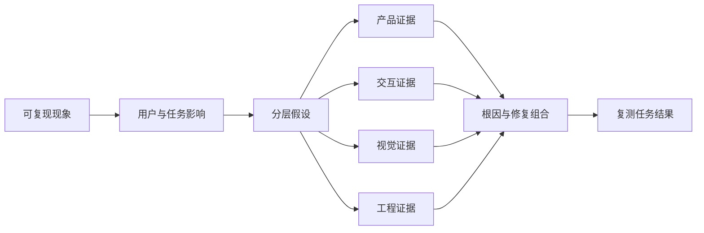

# 区分产品、交互、视觉与工程问题

产品、交互、视觉和工程是分析问题的四个观察层次，不是互斥的责任部门。一个用户现象通常由多层共同造成；分类的目的，是找到可验证的机制、合适的证据和有效的修复方式。

## 四类问题的边界

| 层次 | 主要问题 | 典型证据 | 典型修复 |
| --- | --- | --- | --- |
| 产品 | 为谁解决什么问题，规则与范围是否正确 | 用户目标、业务规则、采用与完成数据、约束材料 | 调整价值、范围、规则、优先级或资格条件 |
| 交互 | 用户如何完成任务，能否理解状态并恢复 | 任务走查、流程、状态表、操作记录、可用性观察 | 调整结构、路径、控件、反馈、错误预防与恢复 |
| 视觉 | 信息能否被清楚感知、区分和阅读 | 对比与排版检查、视觉层级、缩放与不同显示条件 | 调整层级、排版、颜色、图标、间距和动效 |
| 工程 | 系统是否可靠、正确、快速、安全地执行 | 日志、追踪、性能指标、错误码、兼容与自动化测试 | 修复实现、数据一致性、性能、安全或平台兼容 |

### 容易混淆的情况

- “用户无法提交”可能是资格规则未解释、表单错误难修正、禁用样式不清楚或接口失败。
- “页面很慢”首先是可观察现象。真实耗时属于工程证据；等待期间没有状态与取消属于交互问题；加载过多非必要内容可能来自产品范围。
- “按钮不明显”可能是视觉对比与层级，也可能是操作名称不理解、操作出现时机错误或用户根本不需要该功能。

不要先按组织结构归类。先描述事实，再建立多个可证伪假设。

## 从现象到根因



同一个证据可能支持多个假设，但不能直接证明全部原因。例如错误日志证明请求失败，不能证明用户是否理解失败；任务观察显示用户重复点击，不能证明接口是否收到重复请求。

## 第一步：写事实而不是评价

问题记录应包含：

```markdown
- 时间与版本：
- 用户角色与权限：
- 设备、浏览器、网络和辅助技术：
- 前置数据状态：
- 复现步骤：
- 预期结果：
- 实际可观察结果：
- 对任务的影响：
- 发生频率与影响范围：
- 现有证据：
- 未知项：
```

“体验很差”不可验证。“在订单 1024 的支付页点击‘确认支付’后，8 秒内按钮、页面和屏幕阅读器均无状态变化；用户再次点击，产生两次请求”是可复现事实。

## 第二步：建立分层假设

针对上述支付现象，可以提出：

| 层次 | 假设 | 证伪所需证据 |
| --- | --- | --- |
| 产品 | 支付确认规则要求了不必要的同步检查 | 业务规则、失败原因分布、规则负责人确认 |
| 交互 | 操作后没有等待反馈，也没有阻止重复提交 | 可运行界面、键盘与屏幕阅读器走查 |
| 视觉 | 忙碌状态存在，但与默认状态难以区分 | 状态截图、对比和不同视觉条件检查 |
| 工程 | 支付接口延迟或幂等控制失效 | 网络追踪、服务日志、请求 ID、幂等测试 |

假设应能被推翻。“用户不认真”不能直接指导取证或修复；应改写为“关键费用信息在提交前是否可见且可理解”。

## 第三步：选择证据

### 产品证据

- 用户目标、当前替代方式和任务完成结果；
- 业务规则、资格、价格、权限和合规材料；
- 功能采用、留存、完成率与放弃位置；
- 客服问题、取消原因和公开反馈。

指标显示相关关系，不自动证明原因。数据发现某步骤放弃多，应结合规则、任务观察或实现证据定位机制。

### 交互证据

- 入口、用户流程、任务流程与状态机；
- 认知走查、启发式检查和真实任务观察；
- 键盘路径、焦点、反馈、错误与恢复；
- 不同权限、设备、内容和中断场景。

### 视觉证据

- 标题、正文、状态与操作的层级关系；
- 文本和非文本对比、仅颜色编码、焦点可见性；
- 200% 放大、窄屏、长文案、明暗主题和高对比模式；
- 图标是否具有可识别名称，动效是否遮挡或引发不适。

视觉偏好不是视觉缺陷。应把“我不喜欢”转换为可观察影响，如文本无法区分、操作层级冲突或状态只靠颜色表示。

### 工程证据

- 客户端与服务端日志、错误码、请求 ID 和分布式追踪；
- Web Vitals、接口耗时分位数、资源大小和主线程任务；
- 数据库与缓存状态、并发、重试、幂等与事务边界；
- 浏览器、设备、网络、辅助技术和自动化测试矩阵；
- 安全、隐私与权限检查。

截图不能证明键盘行为、性能或数据一致性；单次本地成功也不能证明生产环境稳定。

## 第四步：确定主因与协作层

主因是最直接解释现象、且移除后能显著改变结果的机制。协作层是完成修复所需的其他层次。

例如支付重复请求的主因可能是工程层缺少幂等保证；交互层仍要在提交后立即提供忙碌状态并防止重复操作；视觉层确保忙碌与可操作状态可区分；产品层确认失败后是否允许重试。将问题只交给一个层次会留下残余风险。

## 完整案例：提交后不知道是否成功

### 事实

用户在移动端弱网环境提交报销单。点击后按钮文字未变，12 秒后出现短暂“成功”Toast；列表仍显示旧状态。刷新后偶尔出现两条报销记录。

### 分析

1. **工程**：检查请求是否超时后重试、服务端是否使用幂等键、列表缓存何时失效。
2. **交互**：提交开始时是否显示处理中；离开或取消如何处理；成功是已接收还是已完成；Toast 消失后是否仍有持久结果。
3. **视觉**：处理中、成功和失败是否仅靠颜色或细微图标变化。
4. **产品**：业务上一次提交的权威完成条件是什么，重复单据如何合并或撤销。

### 修复组合

- 客户端为一次意图生成幂等键，服务端保证重复请求不创建第二对象。
- 提交后立即显示可感知忙碌状态，并明确此时是否允许离开。
- 服务端确认创建后进入持久结果页，显示报销编号与当前业务状态。
- 列表读取权威结果或明确显示同步中，不把缓存旧值伪装成最终状态。
- 状态变化通过文本和程序语义表达，不只改变颜色。

### 验收条件

- 相同幂等键重复发送不会创建多个报销单。
- 200 ms 内出现操作已接收的反馈；该数值是本产品验收约定，不是通用标准。
- 弱网、超时和刷新后，用户能判断数据是否已提交以及下一步。
- 键盘和屏幕阅读器用户能获知处理中、成功和失败。

## 严重度与优先级

严重度可按任务影响、发生范围、可恢复性和风险评估；优先级还要结合修复成本、依赖与时间约束。二者不能混为一个分数。

| 维度 | 检查问题 |
| --- | --- |
| 任务影响 | 是轻微延迟、局部困难，还是无法完成？ |
| 范围 | 影响所有用户、特定权限、设备还是极少边界条件？ |
| 可恢复性 | 用户能自行恢复，还是会丢数据或需人工介入？ |
| 风险 | 是否涉及资金、安全、隐私、法律或不可逆操作？ |
| 频率 | 在明确样本与时间范围内发生多少次？ |

## 常见错误与边界

- 看到后端错误就停止分析，遗漏用户是否得到可恢复反馈。
- 用视觉调整掩盖产品规则、权限或数据问题。
- 根据静态截图判断性能、焦点和辅助技术行为。
- 把团队责任边界当成问题机制边界。
- 使用“用户困惑”“不够直观”而不记录具体动作与结果。
- 只验证修复点，没有重新执行完整任务与边界场景。
- 将相关指标变化直接解释为因果关系。

## 可执行分析步骤

1. 记录版本、环境、前置数据、操作和实际结果。
2. 说明对用户目标、完成标准和风险的影响。
3. 为四个层次分别提出至少一个可证伪假设；不相关时写明理由。
4. 为每个假设指定证据、负责人和判断条件。
5. 收集证据，区分已证实、已否定和仍未知。
6. 确定主因、协作层、修复组合与残余风险。
7. 写出可执行验收条件，包括状态、键盘、错误和数据结果。
8. 在原始环境与边界环境中复测完整任务。

## 练习与完成标准

分析“搜索结果一直为空”这一现象，完成四层问题报告。

完成时应满足：

- 事实包含查询、版本、权限、数据状态、设备和复现步骤；
- 产品、交互、视觉、工程各有可证伪假设与所需证据；
- 区分“确实无匹配数据”“筛选条件隐藏结果”“结果不可感知”和“请求失败”；
- 覆盖加载、空、错误、离线和权限状态；
- 给出主因、协作层与至少三项可验证修复；
- 使用相同数据复测，并记录修复前后任务结果。

## 来源

- [W3C WAI：Evaluating Web Accessibility Overview](https://www.w3.org/WAI/test-evaluate/)（访问日期：2026-07-17）
- [W3C WAI：Understanding SC 4.1.3 Status Messages](https://www.w3.org/WAI/WCAG22/Understanding/status-messages.html)（访问日期：2026-07-17）
- [GOV.UK Service Manual：Using data to improve your service](https://www.gov.uk/service-manual/measuring-success/using-data-to-improve-your-service-an-introduction)（访问日期：2026-07-17）
- [GOV.UK Service Manual：Measuring the success of your service](https://www.gov.uk/service-manual/measuring-success/measuring-the-success-of-your-service)（访问日期：2026-07-17）
