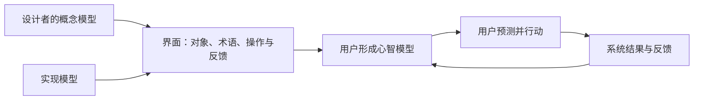

# 心智模型、概念模型与现实映射

心智模型是用户对系统如何工作的当前理解；概念模型是设计者希望产品向用户呈现的对象、关系、规则和操作；现实映射是界面结构与用户熟悉的任务关系、业务规则或空间关系之间的对应。三者一致时，用户更容易预测操作结果；不一致时，界面即使视觉清晰也会产生系统性错误。

## 概念边界

| 概念 | 谁持有 | 内容 | 怎样观察 |
| --- | --- | --- | --- |
| 心智模型 | 用户 | 对对象、因果、状态和操作结果的理解 | 预测、分类、操作顺序、错误与解释 |
| 概念模型 | 产品与设计 | 系统向外暴露的对象、关系、动作和约束 | 信息架构、界面语言、状态机和操作规则 |
| 实现模型 | 工程系统 | 数据结构、服务、队列、权限和内部状态 | 代码、接口、日志和数据模型 |
| 现实映射 | 界面与任务之间 | 控件、布局或术语与现实关系的对应 | 操作是否能被正确预测、位置与结果是否一致 |

实现模型不需要完整暴露给用户，但不能用误导性的概念模型掩盖关键事实。例如异步处理可以隐藏队列细节，却必须区分“文件已上传”和“文件已处理完成”。

心智模型不是固定知识。它会被既有经验、产品文案、操作反馈和错误结果持续更新。设计目标不是让所有用户持有完全一致的内部解释，而是让他们能正确预测当前任务所需的行为。

## 三个模型怎样连接

界面是概念模型的可见表达。用户不会直接读取设计文档或数据库，而是从导航、名称、状态、约束和反馈推断系统规则。因此，同一功能在不同页面使用不同名称、相同操作产生不同结果，会破坏可预测性。

## 概念模型的四个组成部分

### 对象

对象是用户能够识别和操作的实体，例如工作区、项目、文件、版本和成员。每个对象应有稳定身份、关键属性和可理解的生命周期。

检查问题：

- 用户用什么名称识别对象？
- 同名对象如何区分？
- 对象创建、归档、删除后发生什么？
- URL、搜索结果和通知是否指向同一个对象？

### 关系

关系说明对象怎样连接：项目属于工作区，文件属于项目，成员通过角色获得权限。关系会决定导航、继承、批量操作和删除影响。

不要把数据库外键直接变成界面结构。一个对象在实现中可能跨多个服务，但用户需要的是稳定、可预测的任务关系。

### 操作

操作应对应用户能理解的意图，如移动、复制、归档、发布。相似操作要明确结果差异：

- 移动会改变父级位置；复制会创建新对象；
- 归档通常保留对象但减少日常可见性；删除可能可恢复或永久移除；
- 保存草稿不等于发布；上传完成不等于处理完成。

### 状态与规则

状态说明对象当前能做什么，规则说明为什么。例如草稿可编辑、已发布只允许创建新版本、已归档默认只读。界面应通过可见状态、可用操作和解释文本表达规则，不能只在失败后暴露。

## 现实映射的类型

### 语义映射

使用与任务一致的对象名和动作名。“发送邀请”比“提交”更明确；“移出项目”和“删除账户”不应共用“删除”。熟悉词语不是绝对要求，准确表达结果更重要。

### 空间映射

控件位置或方向与结果位置或方向对应。例如左右排列的声道控制对应左右声道；排序箭头方向对应当前顺序。空间映射依赖书写方向、平台约定和具体任务，应在目标语言与平台验证。

### 因果映射

用户动作与系统结果在时间、位置和内容上关联。操作后紧邻控件的状态变化、列表项更新和明确确认能帮助建立因果；延迟结果若没有对象标识，会让用户无法判断哪个动作生效。

### 约束映射

系统根据对象状态限制不合法操作。例如已关闭订单不可修改地址。约束应尽可能在操作前可理解，并说明合法的下一步；仅禁用按钮而不说明原因，会隐藏规则。

## 完整案例：云端文件的“移动、复制与快捷方式”

### 问题

用户把快捷方式理解为文件副本，删除原文件后发现快捷方式失效。现象不是单纯文案问题，而是对象和关系的概念模型没有被正确表达。

### 建立概念模型

| 对象或操作 | 规则 | 用户可见表达 |
| --- | --- | --- |
| 原文件 | 唯一内容对象，具有权限和版本 | 显示文件位置、所有者与版本 |
| 副本 | 独立新对象，创建后内容可分别变化 | 操作名“创建副本”，结果显示新文件名和位置 |
| 快捷方式 | 指向原文件的引用，不拥有独立内容 | 图标、详情和创建确认都说明“指向原文件” |
| 移动 | 改变原文件父级，不创建内容副本 | 确认目标位置，完成后更新面包屑与 URL |
| 删除原文件 | 原文件进入回收站，引用可能不可用 | 删除前说明影响的快捷方式和恢复条件 |

### 映射到流程

1. 用户在文件菜单选择“创建快捷方式”。
2. 目标选择器标题和确认按钮都使用“快捷方式”，不使用模糊的“添加”。
3. 创建结果显示“已在项目 A 创建指向《预算》的快捷方式”。
4. 打开快捷方式时，详情仍能查看原文件位置与权限来源。
5. 删除原文件前，系统说明存在多少快捷方式会失效；高风险场景允许取消或进入影响清单。
6. 原文件恢复后，快捷方式根据稳定对象 ID 恢复，而不是依赖易变路径。

### 键盘与状态要求

- 三个操作的可访问名称与可见名称保持一致且可区分。
- 操作菜单遵循平台键盘模型；焦点移动不应自动执行操作。
- 创建、移动和删除的动态结果可被辅助技术获知。
- 权限不足、目标位置失效、名称冲突和并发移动都要保留对象上下文。

## 发现模型不一致的方法

### 预测任务

在执行前让使用者说明“点击后会发生什么、对象会在哪里、其他人会看到什么”。预测与实际结果的差异，比询问“是否喜欢”更能暴露模型问题。

### 对象与关系重建

让使用者按自己的理解排列对象、父子关系和状态，或用公开界面证据自行绘制。没有条件接触用户时，也可从帮助文档、公开问题、操作日志和重复错误建立初步假设，但要标记证据等级。

### 一致性审计

搜索同一动作和对象在导航、按钮、通知、错误、帮助与 API 文档中的名称。相同功能应一致识别；不同结果不应使用相同名称。

### 边界条件

用移动、复制、共享、撤销、离线、权限变化和并发修改测试概念模型。主路径常会掩盖对象身份与状态规则的不一致。

## 可执行设计步骤

1. 列出用户任务中的对象、属性、关系、操作和生命周期。
2. 分离用户需要理解的概念与仅供内部实现的细节。
3. 为每个操作写“操作前状态 → 动作 → 操作后状态”。
4. 记录用户现有理解的证据；未知内容标记为假设。
5. 用术语、布局、约束和反馈表达概念模型。
6. 设计预测任务，验证用户能否判断结果而不只会照步骤操作。
7. 对权限、失败、撤销、并发和跨设备结果进行边界验证。
8. 将确认的对象与规则同步到 IA、文案、组件和工程状态模型。

## 常见错误与边界

- 把个人猜测称为“用户心智模型”，却没有行为或证据支持。
- 机械复制现实流程，即使其中包含不必要的历史步骤。
- 直接暴露数据库、服务和队列名称，增加无关认知负担。
- 相同操作在不同位置使用不同可访问名称。
- 用熟悉图标代替准确名称，导致不同文化或平台下含义不明。
- 只验证主路径，未检查删除、移动、权限继承和异步结果。
- 认为一致性要求所有界面完全相同；不同任务可以不同，但相同功能必须可预测。

## 验证步骤

1. 为关键操作写出设计者预测的对象与状态变化。
2. 让测试者在操作前描述预期结果，再执行并比较差异。
3. 仅用键盘完成操作，确认焦点顺序保持意义且不会因聚焦自动改变上下文。
4. 用屏幕阅读器核对对象名、操作名、状态和结果。
5. 切换权限、离线、并发更新和对象被移动等条件，检查模型仍一致。
6. 搜索产品内同义、重名与冲突术语，修正后重新执行预测任务。

## 练习与完成标准

为一个笔记产品建立“笔记、文件夹、标签、链接、归档和删除”的概念模型。

完成时应满足：

- 列出对象、关系、操作、状态和生命周期；
- 区分移动、添加标签、归档、删除与永久删除；
- 每个操作都有前后状态和失败结果；
- 说明哪些实现细节不向用户暴露；
- 设计至少五个预测问题，覆盖权限、撤销和跨设备同步；
- 可见名称、可访问名称和结果反馈一致；
- 另一位读者能根据模型判断任一操作对对象的影响。

## 来源

- [W3C WAI：Understanding SC 2.4.3 Focus Order](https://www.w3.org/WAI/WCAG22/Understanding/focus-order.html)（访问日期：2026-07-17）
- [W3C WAI：Understanding SC 3.2.4 Consistent Identification](https://www.w3.org/WAI/WCAG22/Understanding/consistent-identification.html)（访问日期：2026-07-17）
- [W3C WAI：Understanding Guideline 3.2 Predictable](https://www.w3.org/WAI/WCAG22/Understanding/predictable.html)（访问日期：2026-07-17）
- [ISO：ISO 9241-210:2019 Human-centred design for interactive systems](https://www.iso.org/standard/77520.html)（访问日期：2026-07-17）
