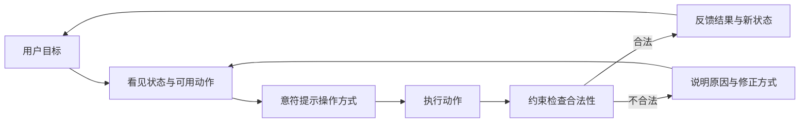

# 可见性、可供性、意符、反馈、一致性与约束

这组原则共同回答：用户能否发现可执行动作、判断怎样操作、理解系统结果，并避免进入无效状态。它们不是视觉风格规则，而是连接用户意图与系统状态的交互机制。

## 概念边界

| 概念 | 解决的问题 | 设计对象 | 失败表现 |
| --- | --- | --- | --- |
| 可见性 | 当前有哪些状态与动作可被感知？ | 操作入口、状态、进度、结果 | 功能存在但找不到，状态变化无从判断 |
| 可供性 | 对象实际允许什么行为？ | 控件与平台能力 | 看似可拖动但实际不能拖动 |
| 意符 | 什么线索表明可供性存在？ | 标签、形状、位置、光标、边界、图标 | 纯文字按钮与正文无法区分 |
| 反馈 | 系统是否收到动作，结果是什么？ | 控件、区域、状态消息、结果页 | 重复点击、误以为成功或失败 |
| 一致性 | 相同概念和功能是否可预测？ | 名称、结构、行为、键盘模式 | 同名不同义、同功能不同操作 |
| 约束 | 怎样限制不合法动作或状态？ | 数据规则、权限、控件和流程 | 用户完成大量输入后才发现不能提交 |

可供性与意符不能混用：按钮具有触发动作的可供性，边框、标签和按下状态是让用户感知这种能力的意符。视觉上像按钮但没有动作，是错误意符；无标签的图标按钮可能有真实能力，但意符不足。

## 协作机制

一致性贯穿整个循环：相同功能的名称、语义、结果和键盘操作保持可预测；当业务状态确实不同，差异应明确表达，而不是为了表面统一隐藏规则。

## 可见性

可见性包括视觉可见、键盘可达和辅助技术可感知。一个状态只在屏幕上改变颜色，不代表所有用户都能获知。

### 需要可见的信息

- 当前对象、位置与状态；
- 主要操作及其作用对象；
- 系统是否正在处理、是否保存、是否离线；
- 权限、限制和必要前置条件；
- 操作结果、错误与恢复方式。

可见不等于所有功能永久展开。低频操作可以放入可发现菜单，但入口、菜单名称和打开方式必须可靠；危险操作可以降低视觉权重，不能隐藏到用户无法完成合法任务。

## 可供性与意符

### 常见意符

- 可见文字标签和动作动词；
- 控件边界、填充、大小和位置；
- 链接的文本样式与访问状态；
- 拖动手柄、调整光标和可放置区域；
- 展开图标及程序化展开状态；
- 焦点指示和按下、选中状态。

悬停样式不能作为唯一意符，因为触屏没有稳定悬停，键盘用户依赖焦点。图标也不应成为陌生或关键动作的唯一名称；可见标签与可访问名称应一致或至少包含相同文本。

## 反馈

反馈应与动作风险、等待时间和结果持久性匹配。

| 情况 | 合适反馈 | 不足反馈 |
| --- | --- | --- |
| 开关切换 | 控件状态立即改变，持久化失败时恢复并说明 | 只出现“完成”Toast |
| 搜索刷新 | 显示加载与结果数，保持输入和焦点 | 整页闪烁但不说明结果 |
| 文件处理 | 区分上传进度与服务端处理状态 | 上传到 100% 就显示最终成功 |
| 删除数据 | 明确对象、结果和撤销或恢复条件 | 无对象名的“操作成功” |
| 表单错误 | 错误摘要、字段错误和修正建议 | 只把边框改红 |

动态反馈若不移动焦点，应使用适当语义让辅助技术获知。非紧急结果通常不应使用持续打断的 assertive live region。

## 一致性

### 内部一致性

产品内相同对象、动作、图标、状态和键盘操作保持一致。例如“归档”在所有位置都保留对象并从默认列表移除，不能在另一个页面实际永久删除。

### 平台一致性

优先使用平台已有语义和键盘约定：链接导航，按钮执行动作，Tab 移动焦点，Space/Enter 按对应原生控件行为操作。自定义组件若偏离约定，需要更高学习和实现成本。

### 任务一致性

一致不是机械复制。如果移动端空间、风险或对象状态改变，布局和步骤可以不同，但任务结果、术语与关键规则应保持一致。

## 约束

约束可以按实施层次分类：

- **物理或平台约束**：控件只接受可支持的输入方式。
- **语义约束**：日期结束值必须晚于开始值。
- **业务约束**：已发货订单不能修改配送地址。
- **权限约束**：查看者不能删除项目。
- **流程约束**：高风险提交前需要复核。

### 隐藏、禁用、只读与允许后解释

| 方式 | 何时使用 | 风险 |
| --- | --- | --- |
| 隐藏 | 操作与当前角色完全无关，暴露会增加噪声或安全风险 | 用户不知道功能存在及如何获得权限 |
| 禁用 | 操作暂时不可用，且用户需要看见顺序或条件 | 原因不可发现，键盘可能无法聚焦说明 |
| 只读 | 内容可查看复制，但不能修改 | 外观若与可编辑相同会误导 |
| 允许进入后解释 | 用户需要理解规则、申请权限或完成前置条件 | 过晚阻止会浪费输入 |

禁用不是完整解释。可在控件附近显示前置条件，或使用可聚焦说明元素。不要依赖禁用控件的 tooltip，因为禁用原生控件通常不能获得键盘焦点。

## 完整案例：发布文章

### 状态与操作

| 文章状态 | 主要操作 | 约束 | 反馈 |
| --- | --- | --- | --- |
| 空草稿 | 添加内容 | 标题和正文为空不能发布 | 就地说明必要内容 |
| 可发布草稿 | 发布 | 需要发布权限 | 按钮名称明确，提交前显示影响范围 |
| 发布中 | 无重复发布 | 请求未完成 | 忙碌状态、保留对象名、允许安全离开时说明 |
| 已发布 | 查看、创建新版本 | 当前版本不可直接覆盖 | 显示发布时间和公开链接 |
| 发布失败 | 重试或返回编辑 | 输入保持不变 | 说明是否有任何内容已公开 |

### 行为设计

1. 页面标题和状态标签显示当前文章与“草稿”。
2. “发布”是可见文字按钮；无权限时不只置灰，在操作区说明“需要编辑者权限”及申请方式。
3. 缺少标题时，操作前即可看见要求；提交后错误摘要与标题字段关联。
4. 进入发布中后按钮显示明确忙碌状态，防止重复请求。
5. 成功进入持久结果，显示公开 URL、版本和下一步；通过状态消息宣布动态更新。
6. 失败保留内容，区分可重试网络错误与需要修改内容的规则错误。

### 键盘与辅助技术

- 发布按钮使用原生按钮语义，焦点可见。
- 页面结构变化不改变自然焦点顺序；聚焦控件不会自动提交。
- 文章状态、字段错误和发布结果不只靠颜色表达。
- 对话框若用于最终确认，打开、Tab、Escape 和关闭后的焦点遵循对话框模式。

## 可执行设计步骤

1. 列出任务每一步用户必须看见的对象、状态和操作。
2. 为每个可执行对象写真实可供性和对应意符。
3. 记录动作发生后立即、处理中和结束时的反馈。
4. 检查相同功能在名称、位置、结果与键盘行为上的一致性。
5. 列出业务、权限、数据与流程约束，决定提前解释方式。
6. 为隐藏、禁用、只读和允许后解释分别写选择理由。
7. 补齐成功、失败、取消、离线和并发状态。
8. 用键盘、触屏、屏幕阅读器和不同视觉条件验证。

## 常见错误与边界

- 把“看得见”仅理解为视觉显示，忽略键盘与辅助技术。
- 用悬停作为唯一操作提示或说明渠道。
- 图标外观像按钮，实际点击区域、键盘语义或名称缺失。
- 所有异步结果都用同一种 Toast，不区分持久性与风险。
- 为保持一致而保留不适合当前任务的交互。
- 禁用操作却不说明原因和恢复条件。
- 只在前端约束输入，服务端没有权威校验。
- 错误只用红色表示，未用文本描述问题。

## 验证步骤

1. 隐去视觉样式，只看语义结构和文本，确认操作仍可识别。
2. 仅用键盘完成任务，检查焦点、激活方式和动态反馈。
3. 用屏幕阅读器核对名称、角色、值、展开状态、错误和结果。
4. 在触屏上检查没有悬停时是否仍能发现与操作。
5. 制造权限不足、规则不满足、请求慢、失败和重复提交。
6. 搜索相同功能在不同页面的名称和结果，修复不一致后复测。

## 练习与完成标准

审计一个“创建团队”表单，产出原则检查表和修改方案。

完成时应满足：

- 每个操作都有真实可供性与至少一个可靠意符；
- 必要状态和限制在用户行动前可见；
- 提交、等待、成功和失败都有与风险匹配的反馈；
- 相同功能的可见名称、可访问名称和行为一致；
- 权限、字段和业务约束说明隐藏、禁用或阻止的理由；
- 键盘、触屏和屏幕阅读器均可完成；
- 错误可定位、可理解、可修正且输入不丢失。

## 来源

- [W3C：Web Content Accessibility Guidelines (WCAG) 2.2](https://www.w3.org/TR/WCAG22/)（访问日期：2026-07-17）
- [W3C WAI：Understanding SC 3.2.4 Consistent Identification](https://www.w3.org/WAI/WCAG22/Understanding/consistent-identification.html)（访问日期：2026-07-17）
- [W3C WAI：Understanding SC 3.3.1 Error Identification](https://www.w3.org/WAI/WCAG22/Understanding/error-identification.html)（访问日期：2026-07-17）
- [W3C WAI：Understanding SC 4.1.3 Status Messages](https://www.w3.org/WAI/WCAG22/Understanding/status-messages.html)（访问日期：2026-07-17）
