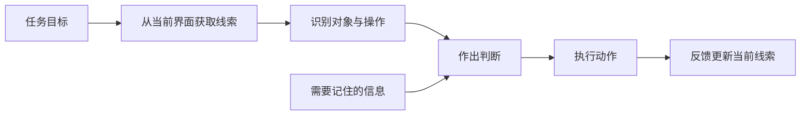

# 识别、回忆、认知负荷与信息分组

识别与回忆描述用户取得信息的两种方式；认知负荷描述任务占用注意、工作记忆和推理资源的程度；信息分组通过结构、名称、顺序和视觉关系帮助用户定位与处理内容。设计目标不是消除思考，而是减少与任务无关的记忆、搜索和转换。

## 概念边界

| 概念 | 定义 | 界面例子 | 不能推导出的结论 |
| --- | --- | --- | --- |
| 识别 | 从当前可见选项或线索中判断目标 | 从最近项目列表选择项目 | 所有选项都应永久展示 |
| 回忆 | 在缺少直接线索时从记忆中提取信息 | 输入不常用命令或项目 ID | 回忆一定不可用 |
| 认知负荷 | 完成任务时用于理解、记忆、判断和控制的资源需求 | 记住前页数据再跨字段计算 | 可用单一数值准确测量全部认知过程 |
| 信息分组 | 按任务相关关系组织元素 | 按“账户、通知、安全”分组设置 | 视觉接近就一定属于同一语义组 |

熟练用户可能通过回忆快速执行命令，初次用户则需要可见选项。好的系统可以同时提供导航、搜索、最近记录与快捷命令，而不是在“识别或回忆”之间二选一。

## 工作机制



界面线索越准确，用户越少需要在页面之间记忆临时信息。但增加大量同时可见的选项也会提高搜索和判断成本。设计要保留当前决策所需信息，把次要内容按任务关系分组或按需展开。

## 识别与回忆

### 适合识别的内容

- 低频使用的对象、命令和格式；
- 难以准确记忆的 ID、日期、路径和规则；
- 错误成本高、需要核对的目标；
- 状态依赖明显、可用项随权限变化的操作。

常用机制包括最近项目、自动完成、历史记录、可见标签、菜单、示例格式和当前状态。识别线索必须可区分：只显示多个同名“设计稿”而没有项目、所有者或时间，仍然无法正确识别。

### 回忆仍有价值的情况

- 专业用户反复执行稳定命令；
- 快捷键能显著提高重复任务效率；
- 用户本来就持有并需要输入的安全信息；
- 搜索表达比浏览大量选项更快。

回忆路径应是加速器，不应成为唯一入口。快捷键需要可发现、可关闭冲突并提供等价可见操作；命令面板应支持搜索、最近使用与错误容忍。

### 安全边界

不要为减少回忆而暴露敏感凭据。密码管理器、平台自动填充和安全认证流程可以减少重复输入，但产品不能在页面明文显示密码或密钥。

## 认知负荷的来源

“认知负荷”在交互分析中可拆成可观察的任务需求，不应只用作“界面看起来复杂”的评价。

### 记忆负担

用户必须记住前一步信息、隐藏规则、对象位置或未保存修改。修正方式包括保留摘要、显示当前选择、提供历史和让结果可重新查看。

### 搜索负担

用户在大量、相似或无序内容中寻找目标。应提高标识差异、提供任务相关排序与筛选，并建立清晰标题和分组。

### 决策负担

用户需要比较许多难以区分的方案或理解不明确后果。应展示比较维度、默认值、推荐依据和结果差异；不能替用户隐藏必要风险。

### 转换负担

用户在不同单位、术语、页面或数据表示之间转换。例如列表显示“剩余 2 天”，编辑页只显示 UTC 时间戳。应保持单位和对象一致，必要转换由系统完成并可核对。

### 控制负担

用户需要精确指针操作、记忆复杂快捷键或在不稳定布局中追踪焦点。应提供足够目标、稳定布局、标准键盘模型和可见焦点。

## 信息分组

### 语义优先

先按用户任务、对象关系和使用顺序分组，再用视觉表达。视觉分组方式包括：

- 标题与语义区域；
- 邻近与一致间距；
- 边界、背景或分隔；
- 对齐和重复结构；
- 顺序与层级。

视觉邻近会暗示关系，因此相关字段间距应小于组与组之间的间距；但语义不能只靠空白表达，代码结构和标题也应让辅助技术识别关系。

### 分组粒度

组过大会隐藏内部层次，组过小会产生过多标题和边界。判断粒度时检查：

- 组内元素是否服务同一子任务？
- 用户是否需要一起比较或一起提交？
- 组名能否准确预测内容？
- 错误和帮助是否能定位到具体组？

### 顺序

表单通常按用户取得信息和完成任务的顺序排列；设置可以按对象或影响范围；结果列表按主要比较任务排序。视觉顺序、DOM 顺序和键盘顺序应保持意义一致，不能仅用 CSS 把元素视觉重排。

## 完整案例：配置项目通知

### 输入证据

现有设置页有 18 个开关，按开发模块命名并单列排列。公开帮助记录显示用户常问：哪些通知会发邮件、关闭“动态通知”是否影响被点名提醒。行为日志显示用户频繁来回切换同一组开关，但日志不能单独解释原因。

当前字段示例：

```text
activity_enabled
mention_enabled
assignment_enabled
digest_enabled
email_enabled
push_enabled
```

### 分析过程

1. 用户目标是控制“什么事件通过什么渠道通知我”，不是理解内部字段名。
2. 需要同时比较事件与渠道，因此单列混排会产生转换和记忆负担。
3. “被点名”和“被分配任务”属于高相关事件，不应被笼统“动态通知”隐藏。
4. 邮件和推送是渠道，事件与渠道是两个维度；需明确不支持的组合。
5. 默认值与组织强制规则会限制选择，必须在控件附近解释。

### 输出结构

| 事件 | 站内 | 邮件 | 推送 |
| --- | --- | --- | --- |
| 被点名 | 开 | 开 | 开 |
| 被分配任务 | 开 | 开 | 开 |
| 项目状态变化 | 开 | 关 | 关 |
| 每日摘要 | 不适用 | 开 | 不适用 |

分组标题使用“需要立即处理”和“项目动态”，每个事件保留可见名称与简短说明。矩阵只在列数和屏幕宽度允许时使用；窄屏改为按事件分组的控件，DOM 顺序保持“事件 → 渠道”。

### 状态与交互

- 初始加载完成前不显示错误默认值；使用加载状态或禁用并说明正在读取。
- 组织强制开启的“安全提醒”显示只读状态和规则来源，不伪装成可切换。
- 保存采用显式按钮时，页面持续显示未保存状态；离开前处理未保存修改。
- 保存成功后显示持久的当前值，并用非阻断状态消息宣布。
- 保存失败保留修改，指出失败范围；部分成功时逐项显示权威结果。
- 每个开关有可访问名称，名称包含事件和渠道，避免读屏只听到多个“开启”。

### 可观察验证

给测试者三个任务：关闭项目状态变化邮件、保留被点名推送、确认安全提醒能否关闭。记录首次操作是否正确、查找路径、错误和最终保存状态。

通过条件：三项任务均无需记忆内部名称；测试者能在操作前预测影响渠道；刷新后值与确认结果一致。

### 失败分支

若矩阵在 200% 缩放时产生双向滚动并失去行列标题，则不能继续压缩字体。改用按事件分组的垂直结构，并在每组重复渠道标签。若组织策略在用户保存期间改变，系统返回冲突，展示强制值并保留仍可修改的选择。

## 可执行设计步骤

1. 写出任务中用户需要识别、回忆、比较和转换的信息。
2. 收集行为、帮助、错误和现有结构证据；未知原因标为假设。
3. 为低频、易错和高风险信息提供可靠识别线索。
4. 按对象关系或任务顺序建立语义分组，并为每组命名。
5. 用间距、标题、边界和对齐表达分组，保持 DOM 与视觉顺序一致。
6. 保留专业用户的搜索、快捷键或批量路径，但提供可见等价操作。
7. 加入真实长内容、空值、权限、加载、错误和窄屏状态。
8. 用查找、比较、配置和恢复任务验证，而不是只询问主观简洁度。

## 常见错误与边界

- 以“减少认知负荷”为理由隐藏完成任务所需的信息。
- 把所有选项都展示出来，误以为识别一定优于回忆。
- 只通过颜色或空白分组，没有标题和程序语义。
- 按数据库字段、团队结构或组件类型分组，而不是用户任务。
- 视觉顺序与 DOM、键盘顺序不同。
- 为熟练用户优化快捷键，却没有可发现的普通路径。
- 用单次操作时间解释全部认知负荷，忽略错误与学习效果。
- 自动填充敏感数据，却没有安全与授权边界。

## 验证步骤

1. 让测试者在执行前指出目标、当前状态和预期结果。
2. 记录是否需要返回前页、抄写数据或记忆隐藏规则。
3. 用真实数据测试同名对象、长文本、大量选项和缺失值。
4. 仅用键盘检查分组顺序、焦点与快捷路径。
5. 用屏幕阅读器确认标题、fieldset/legend、表格标题和控件名称。
6. 在窄屏和 200% 放大下检查分组仍能保持关系，避免双向滚动。
7. 刷新、失败和权限变化后，确认当前选择和结果可重新识别。

## 练习与完成标准

重构一个包含至少 15 项的账户设置页。

完成时应满足：

- 列出每项任务需要识别、回忆、比较和转换的内容；
- 分组依据来自任务或对象关系，并有可预测组名；
- 至少为三个低频操作提供识别线索；
- 同时支持初次用户的可见路径与熟练用户的加速路径；
- 覆盖加载、未保存、成功、失败、只读和权限状态；
- 视觉、DOM 和键盘顺序保持意义一致；
- 使用具体任务验证查找、预测、保存和恢复，并记录通过条件。

## 来源

- [W3C WAI：Page Structure Tutorial](https://www.w3.org/WAI/tutorials/page-structure/)（访问日期：2026-07-17）
- [W3C WAI：Understanding SC 2.4.3 Focus Order](https://www.w3.org/WAI/WCAG22/Understanding/focus-order.html)（访问日期：2026-07-17）
- [W3C WAI：Understanding SC 3.2.4 Consistent Identification](https://www.w3.org/WAI/WCAG22/Understanding/consistent-identification.html)（访问日期：2026-07-17）
- [W3C WAI：Forms Tutorial](https://www.w3.org/WAI/tutorials/forms/)（访问日期：2026-07-17）
