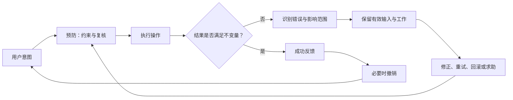

# 用户控制、撤销、容错、错误预防与恢复

用户控制是用户能主动开始、停止、检查和退出操作；撤销恢复最近操作前的有效状态；容错让系统在合理输入偏差或局部故障下仍可完成任务；错误预防减少错误发生；错误恢复帮助用户识别影响、保留有效工作并回到可继续状态。

## 概念边界

| 概念 | 发生时机 | 核心机制 | 例子 |
| --- | --- | --- | --- |
| 用户控制 | 操作前、进行中和完成后 | 明确触发、取消、暂停、确认与退出 | 用户主动提交，不在聚焦字段时自动跳转 |
| 撤销 | 操作已生效后 | 记录反向操作或恢复先前版本 | 恢复刚删除的列表项 |
| 容错 | 输入或环境偏离理想条件时 | 接受等价输入、保留局部成功、幂等与重试 | 电话号允许常见空格并规范化 |
| 错误预防 | 错误发生前 | 约束、校验、复核、默认值与风险提示 | 汇款前复核收款人和金额 |
| 错误恢复 | 错误发生后 | 描述、定位、保留、修正、重试或回滚 | 提交失败后保留字段并定位错误 |

撤销不是取消：取消停止尚未完成的操作，撤销反转已经完成的操作。重试也不是撤销：重试再次尝试同一意图，必须明确是否会产生重复副作用。

## 错误处理链



确定性业务不变量必须由服务端、数据库或受控系统保证。界面约束和提示可以减少错误，不能代替授权、金额校验、唯一性和事务一致性。

## 用户控制

### 操作前

- 明确操作对象、范围、结果与风险。
- 用户选择选项时不应意外提交、导航或打开新上下文。
- 默认值可以提高效率，但高风险默认必须可见且合理。
- 自动保存应说明保存范围、状态和冲突处理。

### 操作中

- 长任务说明进度、阶段和是否可以取消。
- 取消要定义是停止客户端等待，还是请求服务端终止任务。
- 若任务不能安全中止，应说明“可以离开，处理会继续”，而不是提供无效取消。
- 键盘焦点保持在可理解位置，动态内容不随意夺取焦点。

### 操作后

- 显示权威结果、对象标识和下一步。
- 支持撤销、恢复、版本历史或人工处理中的至少一种合理路径。
- 用户可以重新进入并检查结果，不依赖短暂提示。

## 撤销机制

### 反向操作

保存一次操作所需的反向命令。例如将任务状态从 A 改为 B，撤销操作尝试从 B 恢复 A。若对象随后被他人修改，简单反向命令可能覆盖新数据，必须执行版本检查。

### 状态快照

保存操作前状态并恢复。适合文档编辑，但快照大小、关联对象、权限和保留期需要明确。恢复一个对象不能破坏其他对象已经发生的合法变化。

### 软删除与回收站

删除先进入可恢复状态，保留期限后再永久清除。需要定义：保留期、权限、关联数据、名称占用、外部链接与永久删除流程。

### 补偿操作

跨服务或已发生外部副作用时，无法真正回到过去，只能执行补偿，例如退款而不是“撤销已结算支付”。补偿可能需要时间、费用和人工审核，界面应使用准确术语。

## 容错

容错不是静默猜测用户意图。可接受的处理应可预测、可检查，并避免改变关键含义。

### 输入规范化

可安全处理常见空格、大小写或格式差异。例如邮箱域名或代码输入的规范化必须遵循对应规则；不要在没有业务依据时修改用户原始内容。

### 幂等

同一业务意图重复发送不会产生额外副作用。支付、创建订单和批量导入等写操作应使用受控的幂等标识与服务端约束。禁用按钮只能减少重复点击，无法覆盖网络重试、多标签页或恶意请求。

### 局部成功

批量任务可在规则允许时保留成功项，并逐项报告失败。必须说明是否原子执行、哪些结果已生效、重试范围是什么。资金转账等事务可能要求全部成功或全部失败，不能为了容错擅自部分提交。

### 降级

非关键功能失败时保持主任务可用，例如头像加载失败仍显示姓名。降级不能绕过权限、安全校验或隐藏关键数据不完整。

## 错误预防

按照成本从低到高组合：

1. **清晰标签和规则**：让用户在输入前知道要求。
2. **合法控件与范围**：日期选择器、枚举和边界限制减少无效值。
3. **即时但不过早的校验**：完成输入后提示可修正问题。
4. **服务端权威校验**：校验权限、最新状态和业务不变量。
5. **复核与确认**：用于法律、金融、删除和不可逆结果。
6. **可逆设计**：在业务允许时提供撤销、草稿、版本或回收站。

确认对话框不是所有危险操作的默认方案。频繁、措辞相似的确认会被机械通过。更有效的做法包括明确对象、区分主要与危险操作、展示实际影响、允许撤销和让高风险信息在决策时可见。

WCAG 2.2 对法律承诺、金融交易、修改或删除用户可控数据等场景要求至少具备可逆、检查后可修正或最终提交前复核确认之一。它是 Web 可访问性最低要求的一部分，不等于全部产品风险控制。

## 错误恢复

一个可恢复错误应包含：

- **发生了什么**：使用文本描述，不只显示颜色或代码。
- **影响什么**：哪些对象已成功、失败或状态未知。
- **为什么**：在安全允许范围内给出具体原因。
- **保留什么**：用户输入、已完成步骤和上下文是否仍在。
- **怎样继续**：修正、重试、撤销、返回或联系支持。
- **怎样验证**：刷新或进入详情后从哪里查看权威结果。

错误代码可以作为支持信息，但不能替代面向用户的说明。安全错误不应泄露账户、资源或内部实现细节。

## 完整案例：批量邀请成员

### 具体输入

用户向项目 P-204 邀请以下地址：

```text
li@example.com
wang@example.com
bad-address
member@example.com
```

已知状态：`member@example.com` 已是成员；用户有邀请权限；服务端对每个有效邮箱独立处理，并以“项目 ID + 规范化邮箱”作为幂等范围。

### 处理过程

1. 客户端解析每行，去除行首尾空白，但保留用户可见原始值。
2. `bad-address` 未通过格式检查，在提交前标记并说明合法示例。
3. 用户修正为 `bad@example.com` 后提交；客户端生成一次意图 ID。
4. 服务端重新验证权限、项目状态、格式、现有成员和重复邀请。
5. `li@example.com` 与 `bad@example.com` 创建邀请；`wang@example.com` 因邮件服务暂时失败进入可重试失败；`member@example.com` 返回“已是成员”，不创建邀请。
6. 界面按结果分组，焦点移到结果标题，并允许只重试 `wang@example.com`。

### 输出

```text
已发送：2
需要重试：1（wang@example.com）
无需邀请：1（member@example.com 已是成员）
```

刷新成员页后，已发送项显示“待接受”，已有成员保持“成员”。结果不是一个笼统“部分成功”Toast，而是可重新查看的逐项状态。

### 失败分支

- 请求超时且结果未知：客户端用相同意图 ID 查询或重试，服务端不重复创建。
- 权限在提交前被撤销：全部拒绝，保留输入并说明申请权限路径。
- 项目已归档：不发送任何邀请，说明对象状态。
- 邮件投递稍后失败：邀请创建与投递状态分开表示，不能把“邀请已创建”写成“邮件已送达”。

### 验证

1. 重复发送相同意图 ID，邀请记录数不增加。
2. 只重试失败项，已成功项不再次发送。
3. 仅用键盘定位错误、提交、浏览逐项结果与重试。
4. 屏幕阅读器能获知错误数量、结果分组和状态变化。
5. 刷新后结果与服务端成员、邀请记录一致。

## 可执行设计步骤

1. 列出用户可开始、暂停、取消、退出和检查的节点。
2. 为每个写操作定义权威不变量、事务边界和重复请求行为。
3. 按错误成本选择约束、校验、复核与确认。
4. 明确取消、撤销、重试、恢复和补偿的语义差异。
5. 为错误写影响范围、输入保留、修正方式和权威验证位置。
6. 设计键盘焦点、错误摘要、字段关联与动态状态通知。
7. 注入慢请求、超时、断网、部分成功、权限变化和并发冲突。
8. 从用户任务和数据不变量两侧验收。

## 常见错误与边界

- 把关闭弹窗叫撤销，实际只是隐藏界面且数据已写入。
- 提供“取消”，但服务端任务仍继续且不说明。
- 依赖前端禁用按钮防止重复支付或创建。
- 自动修正高风险输入而不告知用户。
- 提交失败后清空合法输入或只显示顶部“有错误”。
- 使用确认对话框代替可逆设计和明确影响。
- 批量操作显示部分成功，却不列出已生效对象。
- 重试没有幂等保证，造成重复副作用。

## 验证步骤

1. 为每个动作写出开始前、进行中、成功、失败和未知结果状态。
2. 使用重复点击、网络重放和多标签页测试幂等。
3. 在异步处理中执行取消和离开，核对服务端实际结果。
4. 修改对象版本或权限，验证撤销不会覆盖新数据。
5. 仅用键盘完成错误定位、修正、重试和撤销。
6. 用屏幕阅读器确认错误以文本描述且状态变化可感知。
7. 刷新、重新登录和跨设备检查权威结果与恢复路径。

## 练习与完成标准

设计“永久删除团队”的预防、确认、执行与恢复策略。

完成时应满足：

- 说明哪些数据立即不可用、哪些延迟清除、哪些因法规保留；
- 明确权限、重新认证、对象名复核和并发检查；
- 区分取消、撤销、软删除、永久删除和补偿；
- 服务端保证授权、状态和重复请求不变量；
- 覆盖处理中、超时未知、部分外部清理失败和权限变化；
- 键盘与屏幕阅读器能理解确认和结果；
- 通过数据库记录、审计日志和界面结果共同验证。

## 来源

- [W3C：Web Content Accessibility Guidelines (WCAG) 2.2](https://www.w3.org/TR/WCAG22/)（访问日期：2026-07-17）
- [W3C WAI：Understanding Guideline 3.3 Input Assistance](https://www.w3.org/WAI/WCAG22/Understanding/input-assistance.html)（访问日期：2026-07-17）
- [W3C WAI：Understanding SC 3.3.1 Error Identification](https://www.w3.org/WAI/WCAG22/Understanding/error-identification.html)（访问日期：2026-07-17）
- [W3C WAI：Understanding SC 3.2.1 On Focus](https://www.w3.org/WAI/WCAG22/Understanding/on-focus.html)（访问日期：2026-07-17）
