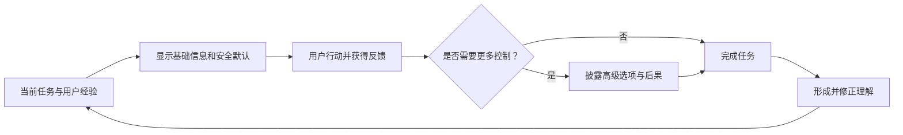

# 渐进披露、默认值、熟悉度与可学习性

渐进披露控制信息和功能何时出现；默认值提供初始选择；熟悉度利用用户已掌握的术语与平台约定；可学习性描述用户能否形成正确理解，并在后续任务中提高准确性与效率。四者共同降低首次使用成本，但都不能牺牲关键风险、用户控制和长期可发现性。

## 概念边界

| 概念 | 作用对象 | 主要问题 | 典型风险 |
| --- | --- | --- | --- |
| 渐进披露 | 信息、选项与步骤的呈现时机 | 当前决策需要看什么？ | 关键内容被隐藏，用户不知道还有下一层 |
| 默认值 | 初始状态或预选项 | 未修改时系统采用什么？ | 用户机械接受，造成隐私、费用或不可逆结果 |
| 熟悉度 | 术语、结构、控件与平台习惯 | 用户能否利用既有知识？ | 复制不适用的惯例，或熟悉但含义错误 |
| 可学习性 | 从首次接触到稳定使用的过程 | 用户能否理解、记住和迁移？ | 只优化首次引导，后续仍无法独立完成 |

渐进披露不是简单隐藏；默认值不是推荐的同义词；熟悉度不是拒绝创新；可学习性也不等于增加教程。界面本身的对象、反馈、一致性和恢复机制是学习的主要来源。

## 工作机制



可学习性依赖连续反馈：用户看到当前状态，执行操作，得到可解释结果，再把结果与预测比较。隐藏状态、同一操作结果不一致或错误不可恢复，会让用户学到错误规则。

## 渐进披露

### 按需求披露

先展示大多数任务需要的基础选项，通过“高级设置”“更多筛选”或上下文操作展示低频控制。触发入口必须有准确名称和展开状态；键盘、触屏与辅助技术都可操作。

### 分步披露

把有明确依赖关系的长任务分成步骤。每一步应说明当前位置、已完成内容、返回影响和最终提交时机。没有真实依赖的字段不应为了显得简单而拆成许多页面。

### 条件披露

根据用户选择显示相关字段，例如选择“公司账户”后显示统一社会信用代码。新增字段不是状态消息本身，但应在选择前或选择后使变化可理解；焦点顺序和错误关联不能因 DOM 插入失去意义。

### 摘要与深入

先展示摘要，再进入详情。摘要必须足以判断是否需要深入，不能隐藏费用、权限、风险或完成条件。

### 不应隐藏的内容

- 法律、金融、隐私和不可逆后果；
- 当前状态、保存状态和错误；
- 完成任务所需条件；
- 高概率需要的操作；
- 已生效默认值及其影响。

## 默认值

### 系统默认

产品在没有用户选择时采用的初始值。默认应基于明确目标与证据，并在不同角色、地区或风险下复核。默认变更会影响新对象还是现有对象，必须定义。

### 用户记忆值

复用用户上次选择可以提高重复任务效率，但应说明作用范围、提供重置，并避免在共享设备或不同对象上下文中错误复用。

### 组织策略值

管理员强制或建议的值。强制值应显示只读状态、来源和变更路径；建议值可以修改，但要区分“系统推荐”与“组织要求”。

### 计算或智能默认

根据上下文推断，如推荐语言、配送地址或 AI 建议。推断可能错误，必须显示具体值、依据所需的必要说明和修改方式。高风险决定不能仅因模型置信度高而自动提交。

### 默认值检查表

- 未修改直接提交会不会产生费用、公开、删除或授权？
- 默认来自谁，何时更新，作用于哪些对象？
- 用户能否看见、理解和修改？
- 无默认、数据过期或推断失败时是什么状态？
- 是否会因复用上次值泄露隐私或作用到错误对象？

## 熟悉度

### 采用平台约定

链接用于导航，按钮用于动作；标准控件遵循平台键盘模型；浏览器返回键和系统返回手势不应产生意外结果。自定义行为需要证明收益，并承担实现、学习和无障碍成本。

### 使用任务语言

熟悉术语必须与当前结果准确对应。“保存”“发布”“归档”“删除”不可仅因常见就混用。内部团队熟悉的缩写不一定为目标用户熟悉。

### 一致但不机械

相同功能在产品内使用一致名称、图标和行为。不同平台可以遵循各自约定，只要对象、结果和风险仍一致。熟悉度是可验证假设，不是个人经验的替代品。

## 可学习性

### 首次发现

用户能识别入口、对象与主要操作。空状态、示例、可见标签和任务式引导可以提供必要起点。

### 首次理解

执行前能预测结果，执行后能解释状态变化。反馈、撤销和具体错误比一次性大段教程更有助于校正理解。

### 重复效率

系统保留最近对象、合理默认、批量操作、搜索和快捷方式，减少重复步骤。加速路径应有可见普通路径作为基础。

### 迁移与恢复

用户能把已学规则应用到相似位置，并在久未使用或发生错误后恢复。稳定术语、位置和操作结果有助于迁移；版本变化时应只解释真正改变任务的部分。

可学习性可以通过首次成功率、重复任务时间、无帮助完成率、错误类型和延迟后恢复等观察评估，不能仅用“用户看完引导”判断。

## 完整案例：部署服务的基础与高级设置

### 具体输入与约束

用户要从 Git 仓库部署一个 Web 服务。基础信息包括仓库、分支、区域；高级项包括构建命令、环境变量、健康检查和自动扩缩容。公开问题记录显示初次用户常误把构建命令写为启动命令；已有项目数据表明大多数 Node 项目可自动检测默认构建设置，但该数据只支持初始假设。

高风险事实：环境变量可能包含密钥；区域影响数据位置；扩缩容上限可能影响费用。这些内容不能仅因低频而完全隐藏。

### 设计过程

1. 首屏显示仓库、分支、区域和检测到的运行时。
2. 自动检测结果标为“已检测”，具体值可见且可修改；检测失败时不填入虚假默认。
3. “构建与运行”“环境变量”“扩缩容”作为有名称的披露区，每区摘要显示当前生效值。
4. 环境变量区提示敏感值保存后不可再次明文查看，并提供安全替换流程。
5. 扩缩容摘要始终显示最小、最大实例与费用影响入口，不把高风险上限藏在折叠区内部。
6. 最终提交前复核仓库、区域、命令、密钥数量和实例范围。

### 具体输出

```text
仓库：justCDQ/example
分支：main
区域：Singapore
运行时：Node.js 22（已检测，可修改）
构建命令：npm run build
启动命令：npm start
环境变量：3 个，其中 2 个敏感值
实例范围：1–3
```

提交后进入部署详情，分别显示构建、发布和健康检查状态。不能在仓库克隆成功时显示“部署成功”。

### 键盘、响应式与状态

- 每个披露按钮暴露展开状态并控制有名称的区域。
- 收起含错误字段的区域时，摘要仍显示错误数量；提交后焦点可定位到第一个错误。
- 窄屏保持摘要先于详情，DOM 与视觉顺序一致。
- 自动检测中、检测失败、无权限、密钥保存失败和部署失败分别表达。
- 使用上次区域作为默认时，显示具体区域，不只写“使用默认”。

### 失败分支

若自动检测把启动命令误判为构建命令，验证阶段应失败并指出命令、阶段和日志位置；用户修正后只重跑受影响阶段。若区域因组织策略锁定，控件只读并显示策略来源，而不是让用户修改后提交失败。

### 验证

1. 初次用户能在不展开全部高级项时说明将部署什么。
2. 用户能找到并修改构建命令、区域和实例上限。
3. 收起高级区后仍能发现其中错误和已生效高风险值。
4. 仅用键盘完成展开、输入、复核、提交和错误恢复。
5. 第二次执行相似部署时，用户能利用一致结构和合理默认减少步骤，且不会把上次密钥复用到新项目。

## 可执行设计步骤

1. 列出当前决策必需、低频高级和高风险不可隐藏的信息。
2. 选择按需求、分步、条件或摘要深入的披露方式。
3. 为每个披露入口写名称、摘要、状态、键盘和错误规则。
4. 盘点系统、用户、组织和计算默认，记录来源与作用范围。
5. 对高风险默认执行可见、复核、修改和失效处理。
6. 对照平台约定与任务语言检查控件和术语。
7. 设计首次、重复、延迟后返回和错误恢复任务。
8. 根据观察调整披露与默认，不用一次成功替代长期学习验证。

## 常见错误与边界

- 把所有次要内容隐藏，导致用户不知道功能存在。
- 折叠区有错误，但收起后没有任何提示。
- 默认勾选营销、公开、付费或不可逆操作。
- 将自动推断结果显示为确定事实，且不给修改入口。
- 复用上次值却没有对象、账户或隐私边界。
- 为“熟悉”复制不准确术语或不适合平台的交互。
- 用强制新手教程掩盖界面对象、状态和反馈不清。
- 只测首次完成，不测重复效率、迁移和久后恢复。

## 验证步骤

1. 关闭所有披露区，确认当前状态、关键风险和完成条件仍可判断。
2. 展开、修改、收起并提交，检查值、错误与摘要保持一致。
3. 仅用键盘和屏幕阅读器核对展开状态、焦点顺序和动态错误。
4. 清除历史、使用旧历史和切换账户，检查默认来源与失效行为。
5. 在窄屏、200% 放大和长文案下检查摘要与内容关系。
6. 让测试者首次、立即重复和延迟后完成同一任务，记录帮助使用与错误。

## 练习与完成标准

为“导出数据”设计基础选项、高级选项和安全默认。

完成时应满足：

- 区分当前必需、低频高级和风险不可隐藏的信息；
- 选择并解释至少两种披露方式；
- 默认值标明来源、范围、失效和修改方式；
- 文件范围、个人数据、格式和通知对象在提交前可复核；
- 覆盖生成中、部分失败、过期、取消和无权限；
- 键盘与屏幕阅读器可操作所有披露控件；
- 用首次、重复与延迟后任务验证可学习性。

## 来源

- [W3C：Web Content Accessibility Guidelines (WCAG) 2.2](https://www.w3.org/TR/WCAG22/)（访问日期：2026-07-17）
- [W3C WAI-ARIA APG：Disclosure Pattern](https://www.w3.org/WAI/ARIA/apg/patterns/disclosure/)（访问日期：2026-07-17）
- [W3C WAI：Understanding Guideline 3.2 Predictable](https://www.w3.org/WAI/WCAG22/Understanding/predictable.html)（访问日期：2026-07-17）
- [W3C WAI：Understanding Guideline 3.3 Input Assistance](https://www.w3.org/WAI/WCAG22/Understanding/input-assistance.html)（访问日期：2026-07-17）
