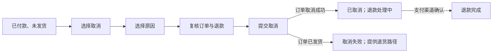

# 从产品行为重建流程

流程重建是依据可观察界面、状态、请求和规则，把一个任务还原为入口、前置条件、用户动作、系统处理、判断、分支和结束状态。它用于理解产品怎样工作，不是把截图按时间排列，也不是先画理想方案。

## 重建的对象

| 层次 | 关注内容 | 示例 |
| --- | --- | --- |
| 端到端用户流程 | 从现实触发到最终结果，可能跨产品和渠道 | 收到逾期通知 → 修改任务 → 团队获知 |
| 单一任务流程 | 在特定场景中完成一个有边界任务 | 修改截止日期 |
| 系统流程 | 前端、服务端、第三方和异步任务怎样协作 | PATCH 任务 → 写数据库 → 发通知 |
| 状态迁移 | 对象在条件满足时从什么状态变为什么 | `open → updating → open` 或冲突 |

四层不应混在同一条线。用户流程表达用户可理解的步骤，系统流程可以解释等待和失败，但内部服务名不应无必要地暴露为用户概念。

## 最小流程节点

每个可执行节点至少包含：

```text
前置状态
→ 触发或用户动作
→ 系统处理
→ 可见反馈
→ 结果状态
→ 下一步或结束
```

只写“点击保存 → 成功页”会遗漏校验、请求、等待、失败、数据写入和焦点变化，无法用于实现或测试。

## 重建过程


## 第一步：确定边界

写清：

- 用户目标和具体任务；
- 开始条件与完成标准；
- 哪些前置步骤属于流程，哪些作为已知条件；
- 是否包含外部渠道、后台处理和后续通知；
- 观察版本、角色、权限与设备。

边界太窄会把关键入口和后续结果排除，太宽会让流程无法操作。以用户能获得的结果为主线，再标出系统与组织边界。

## 第二步：枚举入口

至少检查：

- 全局或局部导航；
- 站内与外部搜索；
- 通知、邮件、短信与待办；
- 相关对象详情中的上下文入口；
- 浏览器历史、草稿和失败恢复；
- 未登录、无权限、对象过期或链接无效入口。

入口可能携带对象 ID、筛选、来源和恢复令牌。登录、权限申请或版本升级后是否返回原任务，是流程的一部分。

## 第三步：逐步观察

对每一步记录：

| 维度 | 检查问题 |
| --- | --- |
| 用户动作 | 点击、输入、选择、键盘命令或系统返回是什么？ |
| 可见响应 | 什么立即改变，什么延迟出现？ |
| 数据处理 | 是否发请求、写本地草稿、启动异步任务？ |
| 状态 | 页面、对象和控件分别进入什么状态？ |
| 焦点与导航 | URL、历史、滚动和焦点怎样变化？ |
| 证据 | 截图、录屏、DOM、请求或文档编号是什么？ |

不要从视觉猜测系统完成。上传进度 100% 可能只表示传输结束，服务端解析仍在进行；短暂成功消息也不能证明刷新后数据存在。

## 第四步：主动制造分支

### 用户分支

不同选择、返回、取消、修改和重复操作。

### 数据分支

空值、无效值、重复值、上限、超长内容、特殊字符和对象已变化。

### 权限分支

未登录、只读、角色改变、令牌过期和资源不存在。

### 环境分支

慢请求、断网、离线恢复、窗口缩放、跨标签页和设备切换。

### 系统分支

校验失败、超时、部分成功、异步失败、并发冲突和第三方不可用。

如果无法安全制造真实故障，使用测试环境、浏览器网络拦截或已脱敏日志，不对生产数据执行破坏性操作。

## 第五步：建立图与状态表

流程图用动词和条件命名，不用“页面 1”“弹窗 2”。判断节点写可判定条件；结束节点写具体结果。

```mermaid
flowchart TD
    A["从任务详情选择修改日期"] --> P{"仍有编辑权限且任务可修改？"}
    P -->|否| X["说明限制并停止"]
    P -->|是| E["输入新日期"]
    E --> L{"本地格式有效？"}
    L -->|否| F["字段错误并保留输入"]
    F --> E
    L -->|是| S["提交并显示处理中"]
    S --> R{"服务端结果"]
    R -->|成功| D["更新详情并确认"]
    R -->|版本冲突| C["展示最新值并允许比较"]
    R -->|暂时失败| T["保留输入并允许重试"]
```

状态表补足图中不便表达的信息：

| 状态 | 进入条件 | 可用操作 | 持久化 | 离开条件 |
| --- | --- | --- | --- | --- |
| `editing` | 对话框已加载权威日期 | 修改、取消、保存 | 可选草稿 | 取消或提交 |
| `saving` | 本地校验通过并发请求 | 安全取消策略、等待 | 意图 ID | 成功、失败、超时 |
| `conflict` | 服务端版本与编辑起点不同 | 比较、采用最新、重新提交 | 保留用户输入 | 用户选择后 |
| `saved` | 权威写入成功 | 查看、再次编辑 | 服务端 | 新操作开始 |

## 完整案例：重建电商取消订单流程

### 具体输入与上下文

```text
角色：订单购买者
订单：O-7812
初始状态：已付款、未发货
入口：订单详情
设备：移动浏览器，390×844 CSS 像素
目标：取消订单并确认退款去向
完成标准：订单状态为“已取消”；退款状态与渠道可见；刷新后一致
```

### 主路径观察

1. 详情的“更多操作”中出现“取消订单”。
2. 选择后进入原因页，当前订单号和金额保持可见。
3. 用户选择“买错了”，继续到复核页。
4. 复核页显示商品、退款金额、原支付渠道和预计处理状态。
5. 用户确认，按钮进入处理中；请求携带订单版本。
6. 服务端返回取消成功和退款任务 ID。
7. 结果页显示“订单已取消”“退款处理中”，而不是“退款成功”。
8. 返回详情并刷新，订单与退款状态一致。

### 重建输出



对象状态被拆为订单和退款两个维度：

```text
order.status: paid → cancelling → cancelled
refund.status: none → requested → processing → completed | failed
```

### 失败与恢复分支

- **订单已发货**：服务端拒绝取消，界面显示最新状态并提供退货入口。
- **请求超时**：结果未知，界面先查询订单而不是直接重试创建退款。
- **退款创建失败**：订单可能已取消；结果必须明确“订单已取消，退款需处理”，提供追踪编号。
- **用户返回**：复核前返回保留原因；提交后返回不能让请求被重复发送。
- **无权限**：共享订单查看者看不到取消入口或进入后得到不泄露敏感信息的说明。

### 验证

1. 通过订单详情、通知深链两个入口重放。
2. 在每个状态刷新，确认 URL 和权威状态可恢复。
3. 模拟服务端 409、超时和退款失败，检查所有结束节点。
4. 只用键盘完成流程，检查返回、对话框和结果焦点。
5. 用屏幕阅读器确认订单状态与退款状态分别可感知。

## 事实与推断标记

可在流程边上使用编号：

```text
[F] 直接观察：确认后出现 refund_id
[D] 文档规则：未发货订单允许取消
[H] 推断：超时后客户端可能轮询订单
[?] 缺口：退款失败是否自动重试
```

推断不能画成确定步骤。需要网络记录、帮助文档、代码或可重复故障来确认。

## 常见错误与修正

- 把截图按顺序连线：补动作、系统处理、状态和判断条件。
- 只重建成功路径：主动制造权限、冲突、超时和取消。
- 用界面文案当权威状态：通过请求、刷新或详情验证。
- 把多个对象状态合成一个“完成”：分别建模订单、支付、通知等对象。
- 忽略入口与退出：从通知、深链和失败恢复重放。
- 用猜测填补不可见后台：标为假设并写验证证据。
- 重建时立即改成理想流程：先保留现状图，再单独提出方案。

## 可执行步骤

1. 记录上下文、目标、开始与完成边界。
2. 枚举入口、前置条件和外部渠道。
3. 逐步记录动作、处理、反馈、状态和证据。
4. 使用测试数据制造选择、权限、环境和系统分支。
5. 分离用户、系统和对象状态流程。
6. 绘制主路径、判断、失败与结束节点。
7. 对每条边进行实际复现，标记事实、文档、推断和缺口。
8. 让另一位读者依据图复现并补充遗漏状态。

## 练习与完成标准

重建一个“重置密码”流程，包括邮件渠道和令牌失效。

完成时应满足：

- 明确开始边界、完成标准、角色、设备和数据；
- 至少覆盖登录页、账户设置和邮件三个入口或触点；
- 每个节点有动作、处理、反馈和结果状态；
- 分开账户、重置令牌和会话状态；
- 覆盖邮箱不存在的安全表达、令牌过期、重复使用、断网和成功；
- 推断均有标记和验证计划；
- 键盘、屏幕阅读器、刷新和直接深链均完成复测。

## 来源

- [GOV.UK Service Manual：Map and understand a user's whole problem](https://www.gov.uk/service-manual/design/map-a-users-whole-problem)（访问日期：2026-07-17）
- [GOV.UK Service Manual：Solve a whole problem for users](https://www.gov.uk/service-manual/service-standard/point-2-solve-a-whole-problem)（访问日期：2026-07-17）
- [GOV.UK Service Manual：Scoping your service](https://www.gov.uk/service-manual/design/scoping-your-service)（访问日期：2026-07-17）
- [W3C WAI：Understanding SC 4.1.3 Status Messages](https://www.w3.org/WAI/WCAG22/Understanding/status-messages.html)（访问日期：2026-07-17）
