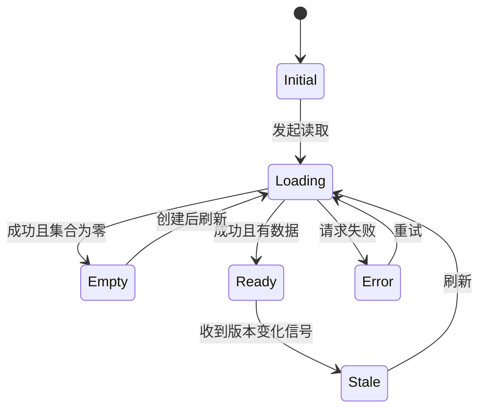

# 建立交互状态清单

状态清单系统记录系统、对象、页面区域和控件在不同条件下可能呈现的状态，以及每个状态的进入条件、可用操作、反馈、持久化与恢复。它用于发现静态截图和主路径中没有呈现的行为缺口。

## 状态与页面的区别

状态是某一时刻的条件集合，不一定对应独立页面。一个页面可能同时处于：系统在线、项目已归档、列表加载成功、某个文件处理中、保存按钮禁用。把整页只标为“成功”会掩盖局部失败与对象差异。

| 层次 | 状态对象 | 示例 |
| --- | --- | --- |
| 系统 | 整个服务或依赖 | 在线、维护、认证不可用 |
| 会话与权限 | 当前身份和授权 | 未登录、会话过期、只读、可编辑 |
| 业务对象 | 数据实体生命周期 | 草稿、审批中、已发布、已归档 |
| 页面或区域 | 数据获取和呈现 | 初始、加载、空、失败、过期 |
| 控件 | 单个交互元素 | 默认、焦点、按下、禁用、忙碌、无效 |

## 一个完整状态定义

状态名称不能代替行为。每项至少记录：

```text
状态名
进入条件
可见内容与反馈
允许和禁止的操作
数据是否持久化
离开条件与目标状态
刷新、返回和重新登录后的恢复
键盘与辅助技术表达
```



状态转换的标签应是可判定事件或条件，不写“用户感觉不对”。

## 基础页面状态

### 初始

组件已创建但尚未开始读取，或等待必要输入。初始状态不能闪现错误默认值。若页面立即读取数据，初始状态可以极短，但实现仍要避免未初始化数据被当作空结果。

### 加载

已发起操作，结果未确定。定义：加载对象、是否保留旧数据、能否取消、超时行为、辅助技术如何获知。首次加载、后台刷新和提交中不应统一为整页遮罩。

### 空

权威读取成功且集合确实为空。区分：

- 从未创建数据；
- 当前筛选无结果；
- 数据因权限不可见；
- 数据被归档或删除；
- 读取失败但界面错误地显示为空。

每种状态的解释和下一步不同。

### 就绪或成功

数据可用并能继续任务。需要记录数据版本、部分模块是否失败、操作权限和是否显示过期缓存。成功不是无条件终态，用户可继续编辑、刷新或进入其他对象状态。

### 失败

说明失败阶段、影响范围、是否有副作用、输入保留与可执行下一步。按可恢复性区分暂时失败、需修正输入、权限失败、永久规则失败和未知结果。

## 必须主动检查的状态

### 部分成功

批量或多依赖任务中只有一部分完成。逐项列出权威结果和重试范围；不要用一个错误覆盖成功项，也不要重新执行已成功副作用。

### 无权限

区分未认证、已认证但无权限、对象不存在与权限刚被撤销。安全要求可能不允许暴露对象是否存在，但仍要提供不泄密的下一步。

### 离线

说明是只读缓存、允许排队写入还是完全不可用；排队不等于同步成功。恢复网络后需显示同步、冲突和最终结果。

### 过期数据

界面显示的数据版本落后于权威状态。可以自动刷新、提示刷新或允许比较；高风险提交前必须重新校验权限和对象版本。

### 取消

取消是否终止客户端操作、服务端任务或仅停止等待必须明确。取消后清理临时数据，保留可恢复输入并给出确认。

### 重试

重试再次执行同一意图。写操作需要幂等语义；重试次数、退避、可见状态和永久失败条件应定义。

### 并发冲突

其他用户、标签页或设备修改了同一对象。系统可以合并不冲突字段、要求选择版本或拒绝覆盖。不能静默丢弃任一方有效数据。

## 控件状态清单

| 状态 | 进入条件 | 必须表达 |
| --- | --- | --- |
| 默认 | 可操作且未聚焦 | 名称、作用与可供性 |
| 悬停 | 指针位于目标上 | 不能成为唯一信息渠道 |
| 焦点 | 键盘或程序焦点进入 | 可见焦点；名称、角色和值 |
| 按下 | 激活过程中 | 即时反馈，不等于最终成功 |
| 选中 | 当前值被选择 | 程序化状态，不只颜色 |
| 禁用 | 当前不能操作 | 原因与恢复条件可获得 |
| 只读 | 可查看但不可修改 | 与禁用和普通文本区分 |
| 忙碌 | 正在处理 | 防重复策略、进度或等待信息 |
| 无效 | 值未通过规则 | 文本错误、关联字段和修正方式 |

焦点与悬停可以和选中、无效等状态组合。设计规范应定义组合优先级，例如无效字段获得焦点时，焦点指示不能被红色错误边框覆盖到不可见。

## 建立状态矩阵

先列关键维度，再选择有意义组合。不要机械做所有笛卡尔积，但要覆盖会改变行为的条件。

```text
身份：未登录 | 查看者 | 编辑者 | 管理员
对象：草稿 | 审批中 | 已发布 | 已归档
网络：在线 | 慢 | 离线 | 恢复中
数据：首次加载 | 有数据 | 空 | 过期 | 冲突
操作：未开始 | 提交中 | 成功 | 失败 | 取消
```

用不变量排除不可能组合，例如未登录用户不应拥有项目编辑权限；用风险优先级选择需要真实验证的组合。

## 完整案例：文件上传与服务端解析

### 具体输入

```text
文件：members.csv，2.4 MB，100 行
预期：导入 98 个新成员，2 行格式错误
角色：项目管理员
网络：上传期间短暂断开 3 秒
服务端：上传完成后异步解析
```

### 状态清单

| 状态 | 进入条件 | 可见结果 | 操作 | 下一状态 |
| --- | --- | --- | --- | --- |
| `selected` | 本地文件已选 | 文件名、大小、删除 | 上传、替换、取消 | `prechecking` |
| `prechecking` | 开始本地格式检查 | “正在检查文件” | 取消 | `invalid-local` / `uploading` |
| `uploading` | 预检通过并开始传输 | 传输进度 | 取消 | `paused-offline` / `processing` |
| `paused-offline` | 网络中断 | 已上传比例、离线说明 | 等待、取消 | `uploading` |
| `processing` | 服务端收到完整文件 | “已上传，正在解析” | 离开、查看任务 | `partial` / `complete` / `failed` |
| `partial` | 部分行导入失败 | 98 成功、2 失败及报告 | 下载错误、修正失败项 | `processing` |
| `complete` | 全部预期写入完成 | 实际数量、导入 ID | 查看成员 | 终态 |
| `failed` | 永久解析失败 | 原因、是否写入任何数据 | 替换文件或联系支持 | `selected` |

### 逐步处理

1. 选择文件后，本地只检查大小、扩展名与表头，不能宣称业务数据有效。
2. 上传到 45% 时网络中断，状态进入 `paused-offline`，进度不回到 0。
3. 网络恢复后根据协议续传或重新上传；若重新上传，复用同一导入意图 ID。
4. 传输完成进入 `processing`，允许用户离开页面并在导入任务列表恢复。
5. 服务端逐行校验，98 行提交，2 行记录错误；产品规则允许部分成功。
6. 结果显示成功和失败数量、错误行号与修正格式，重试只提交失败项。

### 可观察输出

```text
导入任务：IMP-3021
状态：部分完成
成功：98
失败：2（第 17、64 行）
已写入成员：98
下一步：下载错误报告 / 修正后重试失败项
```

### 失败分支

- 解析服务崩溃且结果未知：状态保持“处理中”或“需要确认”，不能显示空列表。
- 用户权限在处理期间被撤销：后台任务按提交时授权策略处理，但后续查看遵守当前权限；具体规则由产品定义。
- 同一文件重复提交：幂等键阻止重复创建成员或明确创建新导入版本。
- 用户取消处理：若服务端已写入 40 行，必须说明取消是停止剩余行还是回滚全部；不能只隐藏进度。

### 验证

1. 用固定测试文件核对 98/2 输出与数据库记录。
2. 在上传 0%、45%、100% 与处理期间分别断网、刷新和返回。
3. 使用重复意图 ID 重试，成员数不重复增加。
4. 仅用键盘选择、取消、查看错误和重试。
5. 屏幕阅读器能获知进度阶段变化、部分结果和错误数量。

## 可执行工作步骤

1. 按系统、会话、对象、区域和控件列状态对象。
2. 从主路径提取初始、加载、就绪、成功与失败。
3. 主动加入空、权限、离线、过期、取消、重试和并发。
4. 为每个状态写进入、可见、操作、持久化、离开与恢复。
5. 建立状态转换图和维度矩阵，排除不可能组合。
6. 将状态映射到真实数据字段、请求结果或条件。
7. 准备可重复触发每个状态的测试数据或故障开关。
8. 用刷新、返回、键盘、屏幕阅读器和窄屏验证。

## 常见错误与修正

- 将“空”和“加载失败”显示相同：用权威结果与错误分别建模。
- 用页面截图代替状态定义：补进入条件、操作和转换。
- 所有错误统一为“重试”：区分输入、权限、永久与未知结果。
- 上传到 100% 显示完成：单独建模服务端处理。
- 取消只关闭 UI：定义服务端副作用和清理。
- 禁用状态只给灰色外观：提供原因与可感知语义。
- 状态名无法映射数据：重写为可判定条件。
- 只测状态本身，不测刷新与跨设备恢复。

## 练习与完成标准

为“离线编辑笔记并重新同步”建立完整状态清单。

完成时应满足：

- 分开网络、笔记对象、编辑器、同步任务和控件状态；
- 每个状态有进入、操作、持久化、离开与恢复；
- 覆盖首次离线、已有缓存、排队、同步中、成功、失败和冲突；
- 明确“本地已保存”与“云端已同步”的差异；
- 可重复制造双端修改和网络恢复；
- 键盘与辅助技术能获知保存与同步状态；
- 刷新、重启和重新登录后权威结果一致。

## 来源

- [W3C WAI：Understanding SC 4.1.3 Status Messages](https://www.w3.org/WAI/WCAG22/Understanding/status-messages.html)（访问日期：2026-07-17）
- [W3C WAI：Understanding Guideline 3.3 Input Assistance](https://www.w3.org/WAI/WCAG22/Understanding/input-assistance.html)（访问日期：2026-07-17）
- [W3C WAI-ARIA APG：Introduction](https://www.w3.org/WAI/ARIA/apg/about/introduction/)（访问日期：2026-07-17）
- [WHATWG HTML Standard：Form control infrastructure](https://html.spec.whatwg.org/multipage/form-control-infrastructure.html)（访问日期：2026-07-17）
