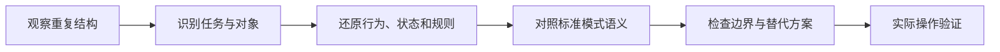

# 识别交互模式

交互模式是在特定任务与约束下反复出现的解决结构，包含适用问题、组成、行为、状态、无障碍语义和边界。产品拆解中的模式识别，不是给截图贴“卡片”“弹窗”标签，而是还原这个结构解决什么问题、怎样工作、何时失效。

## 模式、组件与视觉样式

| 概念 | 内容 | 示例 |
| --- | --- | --- |
| 交互模式 | 任务问题与可复用行为结构 | 自动完成、分步表单、撤销删除、主从详情 |
| 组件 | 可实现的界面单元及 API | Combobox、Dialog、Tabs、Button |
| 页面模式 | 多个组件组成的任务页面结构 | 确认页、筛选结果页、账户设置页 |
| 视觉样式 | 外观属性 | 圆角卡片、阴影、品牌颜色 |

同一模式可由不同组件组合实现；外观相似的组件也可能承担不同模式。例如带浮层的输入可能是自动完成、选择列表或命令面板，它们的数据、选择与键盘规则不同。

## 模式的完整描述

识别一个模式时至少写：

```text
模式名称
要解决的用户任务
适用前提与不适用条件
触发与入口
组成部分
主要行为和键盘模型
状态与数据规则
成功、失败、取消与恢复
响应式和无障碍要求
替代方案及取舍
证据与未确认项
```



模式库是经验性指导，不是规范性标准。WAI-ARIA APG 提供组件的语义与键盘模式，但明确属于信息性指导，不是 UI 设计系统；使用时仍要评估任务、HTML 原生能力和实际辅助技术支持。

## 从任务而不是外观开始

### 写出用户问题

例如搜索成员时，用户问题可能是：

- 已知完整邮箱，直接输入并提交；
- 只记得姓名一部分，需要候选建议；
- 必须从有限成员集合选择一个有效对象；
- 可以输入尚未加入系统的新邮箱。

四种问题会产生不同模式：普通文本输入、自动建议、只选 Combobox 或自由输入加建议。只看到“输入框下有列表”无法判断。

### 确定对象和值

记录显示标签、提交值、对象 ID、多选规则、自由输入、重复项和无匹配结果。视觉上相同的选项可能提交完全不同数据。

### 还原触发

输入几个字符、聚焦、点击展开按钮、键盘命令或网络结果返回，分别会怎样打开和更新候选层？聚焦本身不应造成不可预期的上下文改变。

## 常见模式类别

### 导航模式

全局导航、侧栏、Tabs、面包屑、分步导航和主从详情。识别时检查目的地层级、当前项、URL、历史、直接深链和窄屏转换。

### 输入与选择模式

表单、自动完成、日期选择、标签输入、内联编辑和文件上传。检查标签、允许值、校验时机、键盘、错误保留和服务端校验。

### 展示与反馈模式

列表、表格、卡片、空状态、骨架屏、进度、状态消息和错误摘要。检查数据关系、加载阶段、动态通知和局部失败。

### 容器模式

页面、对话框、抽屉、浮层和展开区。检查模态性、背景、焦点、关闭、URL 和响应式变化。

### 控制与恢复模式

确认、撤销、草稿、自动保存、重试、冲突解决和版本历史。检查真实副作用、幂等、保留、恢复和权威状态。

## 对照标准时要区分层次

- **规范要求**：例如 WCAG 对键盘、名称、状态和错误的要求。
- **平台语义**：HTML 原生元素与浏览器默认行为。
- **指导模式**：APG 对复杂组件键盘与 ARIA 的建议。
- **设计系统约定**：GOV.UK 等针对具体服务建立的组件与模式。
- **产品实现**：当前界面真实行为。

当前实现与模式示例不同，不自动代表错误。先判断差异是否破坏任务、平台预期、语义或可访问性。

## 完整案例：识别“成员选择”模式

### 具体输入与观察

项目设置中有字段“负责人”。用户输入 `li` 后出现五个候选：

```text
李晓 · li@example.com
李宁 · lining@example.com
Alice Li · alice@example.com
李晓 · li2@example.com
邀请 li@new.example
```

观察到：可输入自由文本；点击现有成员后显示姓名标签；输入完整新邮箱可发送邀请；按 Enter 时若高亮候选则选择，否则尝试邀请。候选从服务端异步获取。

### 任务与对象分析

- 字段允许“选择现有成员”和“邀请新成员”两种意图。
- 现有成员提交用户 ID，新邀请提交邮箱；二者必须在结果中区分。
- 同名成员需要邮箱或组织信息帮助识别。
- 自由文本只有通过邮箱规则和权限校验才能转为邀请。

因此它不是普通 `<select>`，也不是仅允许已有值的 select-only Combobox。它接近可编辑 Combobox 加一个显式“邀请”动作，但“邀请”会产生外部副作用，不应伪装成普通选项选择。

### 组成与状态

| 部分 | 作用 | 状态 |
| --- | --- | --- |
| 可见标签 | 标识字段“负责人” | 默认、错误 |
| 输入框 | 输入查询或邮箱 | 空、输入、焦点、无效 |
| 候选弹层 | 展示现有成员 | 加载、有结果、无结果、失败 |
| 选项 | 显示可区分对象 | 默认、高亮、选中、禁用 |
| 邀请动作 | 明确产生邀请副作用 | 可用、无权限、提交中、失败 |
| 当前值 | 展示已选用户或待接受邀请 | 已选、待邀请、冲突 |

### 键盘模型

1. 输入焦点保留在 Combobox；方向键在候选中改变活动项。
2. Enter 选择当前活动候选；Escape 关闭弹层但不清空输入。
3. Tab 离开组件，不应在没有明确选择时自动邀请。
4. 候选弹层有适当角色与关联，输入暴露展开和活动项状态。
5. “邀请新邮箱”作为会产生副作用的明确动作，先进入复核或使用具有动作语义的按钮，不能与已有成员选项完全相同。

### 输出规范

```text
查询 `li`：显示 4 个现有成员
完整有效新邮箱：显示“邀请 li@new.example”动作
无邀请权限：不提供邀请动作，并说明只能选择现有成员
服务失败：保留输入，显示“无法加载成员”，提供重试
选择结果：显示姓名 + 邮箱；提交保存用户 ID
邀请结果：显示邮箱 + “待接受”；提交保存邀请 ID
```

### 失败分支

- 结果返回顺序变化：活动项按稳定对象 ID 管理，不能选择到另一人。
- 用户在请求返回前继续输入：丢弃旧查询结果，避免显示过期候选。
- 重名：结果必须有可区分辅助属性。
- 邀请接口超时：使用意图 ID 查询结果，避免重复邀请。
- 字段变为只读：仍显示负责人身份，但不暴露可编辑 Combobox 行为。

### 验证

1. 使用空查询、`li`、完整邮箱、无结果和网络失败测试。
2. 只用键盘完成搜索、选择、关闭、离开和邀请。
3. 屏幕阅读器核对标签、展开、结果数量、活动项与已选值。
4. 模拟快速输入和乱序响应，确认候选与查询一致。
5. 刷新后核对现有成员 ID 与邀请状态。

## 模式对比表

| 候选模式 | 适用条件 | 不适用本案例的原因 |
| --- | --- | --- |
| 原生 select | 少量固定选项，不需要搜索 | 成员多且异步，新邮箱不是固定值 |
| 只选 Combobox | 必须选择集合中的现有对象 | 允许邀请新邮箱 |
| 自由文本加建议 | 任意文本都是合法最终值 | 最终值必须是成员 ID 或邀请记录 |
| Combobox + 独立邀请动作 | 选择与副作用分离 | 符合任务，但实现与文案成本更高 |

## 可执行识别步骤

1. 记录具体任务、输入、对象、权限和完成结果。
2. 观察触发、组成、数据值和主路径。
3. 用键盘和屏幕阅读器还原组件语义与状态。
4. 主动制造加载、空、错误、无权限、取消和过期结果。
5. 查找相似的官方标准、平台或设计系统模式。
6. 区分共同机制与产品特有规则。
7. 比较至少两个替代模式及任务取舍。
8. 输出可实现、可验证的模式说明，而不是视觉名称。

## 常见错误与修正

- 看到卡片就称为卡片模式：说明任务、对象和行为。
- 将组件库名称当通用定义：回到平台语义和实际结果。
- 只记录主路径和鼠标操作：补键盘、状态与恢复。
- 复制 APG 示例但忽略原生 HTML 和测试：区分指导与规范。
- 把相似外观的菜单、列表框与导航混用：检查值与动作语义。
- 发现模式后直接复用，不检查数据量、风险和小屏。
- 把产品特有规则包装成通用模式。

## 练习与完成标准

从一个公开产品中识别“批量选择与操作”模式。

完成时应满足：

- 定义任务、对象、选择范围和提交结果；
- 区分当前页选择、跨页选择和“全部结果”；
- 记录选择、部分选中、加载、空、无权限、执行中和部分成功；
- 说明鼠标、触控、键盘和屏幕阅读器行为；
- 比较工具栏、行内操作和菜单三种方案；
- 用固定数据验证选择数量与实际处理对象一致；
- 输出模式边界，不把视觉样式当结论。

## 来源

- [W3C WAI-ARIA APG：Patterns](https://www.w3.org/WAI/ARIA/apg/patterns/)（访问日期：2026-07-17）
- [W3C WAI-ARIA APG：Combobox Pattern](https://www.w3.org/WAI/ARIA/apg/patterns/combobox/)（访问日期：2026-07-17）
- [W3C WAI-ARIA APG：Introduction](https://www.w3.org/WAI/ARIA/apg/about/introduction/)（访问日期：2026-07-17）
- [GOV.UK Design System：Patterns](https://design-system.service.gov.uk/patterns/)（访问日期：2026-07-17）
