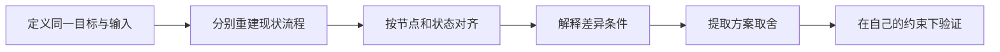

# 比较产品工作流

产品工作流比较是在同一目标、相近场景和明确约束下，对多个产品、版本或平台的入口、步骤、状态、反馈、错误恢复和结果进行对齐。比较的目标是理解方案机制与取舍，不是按截图多少、点击数或个人偏好排名。

## 可比性的前提

比较前固定：

- 同一用户目标与任务边界；
- 相近角色、权限和账户状态；
- 相同或等价输入数据；
- 设备、平台、语言、网络和时间；
- 明确完成标准与风险；
- 产品或版本的精确观察日期。

如果产品面向不同用户、规则或平台，可以比较，但必须把差异作为条件，而不是直接判定优劣。

## 比较层次

| 层次 | 检查内容 | 不应只看 |
| --- | --- | --- |
| 目标覆盖 | 是否完成同一个现实结果 | 功能名称是否相同 |
| 入口与范围 | 从哪里开始，是否跨渠道 | 首页有没有按钮 |
| 任务步骤 | 动作、判断和信息要求 | 点击次数 |
| 状态与反馈 | 加载、成功、失败、权限、恢复 | 最终成功截图 |
| 风险控制 | 复核、撤销、授权、幂等和审计 | 是否“更快” |
| 无障碍与平台 | 键盘、语义、缩放、触控和返回 | 视觉样式 |
| 工程与业务约束 | 延迟、异步、规则和数据一致性 | 界面层方案 |

## 标准比较流程



不要先建立“最佳步骤”再把其他方案强行对齐。每个产品先独立重建，保留其对象模型和规则，再寻找可比较节点。

## 建立比较基线

### 任务声明

```text
当【场景】发生时，
【角色】需要对【对象】完成【任务】，
以便获得【结果】。
```

### 固定输入

选择能触发关键分支的数据，例如：

```text
对象：10 条记录
有效项：8
重复项：1
无权限项：1
网络：400 ms RTT
设备：桌面浏览器，1280×720 CSS 像素
```

### 完成标准

同时包含对象状态、业务状态、用户可见确认和刷新后结果。若多个产品定义不同结果，例如“发送邀请”与“直接加入成员”，应分别记录，不能用同一个“成功”掩盖差异。

## 流程对齐方法

把页面名称转换为任务节点：

| 对齐节点 | 产品 A 表达 | 产品 B 表达 |
| --- | --- | --- |
| 定位对象 | 在列表选择项目 | 从命令面板搜索项目 |
| 输入 | 页面内表单 | 模态对话框 |
| 复核 | 提交前确认页 | 提交后可撤销 |
| 处理 | 同步等待 | 异步任务中心 |
| 结果 | 结果页 | 列表状态更新 |

页面形式不同不代表任务机制不同；相同页面形式也可能有不同副作用。

## 指标怎样使用

### 步骤与动作数

记录用户需要理解和作出决定的步骤，而不只是点击。键盘输入、滚动、等待和跨渠道也属于成本。减少一步若增加错误或隐藏风险，不一定改进任务。

### 完成时间

区分主动操作时间、系统等待时间和异步后台时间。记录设备、网络、样本与统计方式；单次计时不能代表稳定表现。

### 任务结果

记录成功、部分成功、错误完成、放弃和未知结果。成功率需要预先定义每种结果，而不是测试后调整标准。

### 恢复成本

计算发现错误、定位对象、修正、重试和确认权威结果的步骤。只比较理想路径会系统性偏向缺少状态处理的方案。

## 差异解释框架

每个差异写四部分：

```text
事实差异：界面与行为怎样不同
约束差异：用户、平台、业务、数据或技术条件
可能收益：在什么条件下改善什么任务
代价与风险：增加什么学习、实现、错误或维护成本
```

“产品 A 更简洁”应改写为：“A 在提交前只要求一个必填字段，B 还要求选择权限；A 的默认权限为私有，B 的业务规则不允许默认权限，因此不能只按字段数判断。”

## 完整案例：三个产品的批量邀请工作流

### 比较输入

```text
任务：向项目邀请 5 个成员
输入：3 个有效新邮箱、1 个已有成员、1 个格式错误邮箱
角色：项目管理员
设备：桌面 Web，键盘与鼠标
完成：新邀请可查看，已有成员不重复，错误可修正
```

假设观察到三个真实可复现方案，下面只以 A/B/C 代称，避免把时效性实现当永久特征。

### 独立流程

**产品 A：多值输入 + 一次提交**

1. 在项目成员页打开“邀请成员”。
2. 粘贴五个邮箱，输入按逗号拆分。
3. 客户端标记格式错误，已有成员尚未提示。
4. 修正格式后一次提交。
5. 服务端返回 3 个已邀请、1 个已有成员。
6. 结果页逐项显示状态。

**产品 B：逐个添加到暂存列表**

1. 打开成员设置页面。
2. 输入一个邮箱并选择角色，加入暂存列表。
3. 重复五次；已有成员在加入时提示。
4. 提交整个暂存列表。
5. 成功后返回成员页，待接受邀请带状态。

**产品 C：上传 CSV 异步处理**

1. 进入批量导入页面并下载模板。
2. 填写邮箱与角色，上传 CSV。
3. 本地检查表头，服务端异步校验。
4. 任务中心显示处理结果，可下载失败报告。
5. 修正失败项后重新上传。

### 对齐矩阵

| 维度 | A | B | C |
| --- | --- | --- | --- |
| 适合数量 | 少到中等 | 少量、需逐项角色 | 中到大量 |
| 输入反馈 | 格式即时、成员状态提交后 | 每项加入时 | 服务端处理后 |
| 部分成功 | 逐项结果 | 暂存后整体提交 | 导入报告 |
| 键盘效率 | 粘贴高效 | 重复操作较多 | 依赖文件编辑 |
| 恢复 | 保留输入并修正失败项 | 保留暂存列表 | 下载错误、重传 |
| 工程成本 | 多值解析与逐项结果 | 暂存状态管理 | 文件安全、异步任务与报告 |

### 结论与适用条件

- A 对 5–20 个已知邮箱效率高，但必须正确处理分隔、重复、异步校验和逐项结果。
- B 适合每个人需要独立设置角色或权限的场景，步骤更多但能更早发现对象级问题。
- C 适合大量、可从其他系统导出的数据；对 5 个地址会增加文件准备成本。

这个结论是基于具体输入和任务的方案取舍，不构成通用数量阈值。真实分界应由本产品数据、错误率和维护成本验证。

### 失败分支比较

| 失败 | A | B | C |
| --- | --- | --- | --- |
| 网络中断 | 保留输入，以同一意图重试 | 保留暂存列表 | 上传可重试，任务可恢复 |
| 权限撤销 | 全部拒绝并保留输入 | 提交时拒绝 | 任务开始前或处理中按规则终止 |
| 部分成功 | 页面逐项结果 | 需定义是否原子 | 报告逐行结果 |
| 重复提交 | 服务端幂等 | 暂存批次幂等 | 导入任务与行级幂等 |

### 验证输出

对每种方案记录：5 项输入最终对应 3 个新邀请、1 个已有成员、1 个已修正输入；刷新后不存在重复邀请；键盘可完成；错误结果可重新查看。没有满足这些结果的方案不能仅因步骤少而胜出。

## 版本与平台比较

比较同一产品的 Web、iOS、Android 或新旧版本时补充：

- 平台导航、返回、分享、文件和通知约定；
- 触控、键盘、鼠标和辅助技术差异；
- 功能发布时间、实验组和分阶段发布；
- 数据与账户是否完全同步；
- 旧版本是否仍受支持。

平台不同可以有不同容器和布局，但对象、权限、结果与关键术语应保持一致。

## 可复制比较模板

```markdown
## 基线
- 目标/任务：
- 角色/权限：
- 固定输入：
- 设备/网络：
- 完成标准：

## 独立流程
### 方案 A
1. 动作 → 系统响应 → 结果状态。

## 对齐矩阵
| 节点/状态 | A | B | 差异条件 |
| --- | --- | --- | --- |

## 取舍
- 事实差异：
- 适用约束：
- 收益：
- 代价与风险：
- 待验证：
```

## 常见错误与修正

- 使用不同角色和数据比较：先固定基线。
- 只算点击数：加入判断、输入、等待、错误和恢复。
- 把产品功能多少当工作流质量：按同一任务结果对齐。
- 直接复制领先产品：检查用户、业务、平台和工程约束。
- 把实验或版本差异当永久规则：记录时间与版本。
- 只比较成功路径：制造相同失败与权限条件。
- 用个人偏好给方案排名：写事实、条件、收益与代价。

## 可执行步骤

1. 定义同一目标、角色、输入、环境与完成标准。
2. 分别重建每个产品的入口、任务、状态和结果。
3. 把页面形式转换为可对齐的任务节点。
4. 记录步骤、判断、等待、成功、错误和恢复。
5. 解释每个差异背后的用户、业务、平台与技术约束。
6. 比较收益、成本和风险，不直接合成总分。
7. 用相同故障、键盘和响应式条件复测。
8. 在自己的产品约束下制作原型并验证，不直接照搬。

## 练习与完成标准

比较三个产品的“取消订阅”工作流。

完成时应满足：

- 使用同一订阅类型、账户权限和取消目标；
- 分别重建入口、优惠挽留、确认、结果和恢复；
- 区分立即失效、周期末失效、退款和数据保留；
- 比较步骤、判断、等待、错误和权威结果；
- 覆盖键盘、移动端返回、请求超时和重复提交；
- 每个差异都有适用条件、收益与风险；
- 最终方案通过自己的规则和任务测试，而不是按竞品投票。

## 来源

- [GOV.UK Service Manual：Solve a whole problem for users](https://www.gov.uk/service-manual/service-standard/point-2-solve-a-whole-problem)（访问日期：2026-07-17）
- [GOV.UK Service Manual：Map and understand a user's whole problem](https://www.gov.uk/service-manual/design/map-a-users-whole-problem)（访问日期：2026-07-17）
- [GOV.UK Service Manual：Scoping your service](https://www.gov.uk/service-manual/design/scoping-your-service)（访问日期：2026-07-17）
- [W3C WAI：Evaluating Web Accessibility Overview](https://www.w3.org/WAI/test-evaluate/)（访问日期：2026-07-17）
