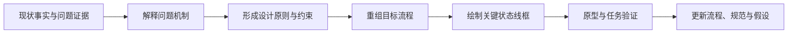
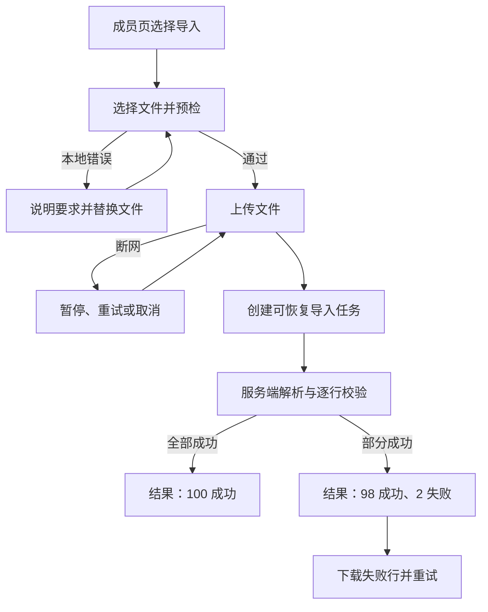

# 从拆解证据重设计流程与线框图

重设计流程是把已确认的问题机制转化为新的入口、步骤、状态和完成标准；线框图把流程节点转化为信息层级、控件、内容和反馈。正确顺序是先保留现状证据与约束，再提出可验证的新流程，最后用线框图表达关键状态，而不是从美化单张页面开始。

## 输入与输出

### 必要输入

- 用户目标、任务、场景与完成标准；
- 现状流程、状态清单和上下文记录；
- 可复现问题及证据；
- 业务规则、权限、安全、数据和技术约束；
- 已知平台、无障碍和响应式要求；
- 尚未确认的假设。

### 应交付输出

- 现状与目标流程图；
- 每项改变对应的证据和假设；
- 关键页面或容器线框图；
- 状态、文案、键盘、焦点和恢复规则；
- 可执行验证任务与验收标准；
- 未解决风险和工程依赖。

## 证据到方案的链路



每个方案元素都应能追踪到任务、证据或约束。没有证据但值得探索的设计可以保留，必须标记为假设并指定验证方法。

## 第一步：写问题机制

问题陈述应包含：

```text
在【上下文】中，
用户尝试【任务】时发生【可观察事实】，
导致【任务或风险影响】。
现有证据支持的机制是【解释】，
仍未知【待验证项】。
```

例如：“项目编辑者从通知进入批量导入后，上传到 100% 即看到‘完成’，但后台解析仍进行；用户离开后无法找到任务，导致重复上传。网络记录和重复导入 ID 支持上传与解析状态被合并；尚未知用户对‘完成’文案的理解比例。”

## 第二步：建立设计约束

将约束分为：

- **用户约束**：设备、时间、知识、输入材料、无障碍需求；
- **业务约束**：资格、审批、费用、权限和保留规则；
- **数据约束**：对象关系、版本、数量和一致性；
- **技术约束**：异步处理、第三方、离线和兼容；
- **安全约束**：授权、敏感数据、审计和不可逆操作；
- **项目约束**：范围、依赖和迭代顺序。

约束需要来源与可变性。历史实现不是自动不可改变的约束；法律与安全规则也应由权威材料确认，不能只靠口头传递。

## 第三步：重组流程

### 保留必要步骤

保留帮助用户理解、输入、复核、授权和恢复的步骤。步骤少不是目标，正确完成是目标。

### 合并重复步骤

相同信息不应在同一流程重复输入，除非安全或业务必要。可复用已有数据时提供自动填充或选择，并尊重隐私与最新状态。

### 提前约束与解释

已知权限和业务限制应在用户投入大量操作前出现。服务端提交时仍需重新校验，防止状态变化。

### 分离异步阶段

“请求已接收”“处理中”“最终完成”是不同状态。允许离开时提供可恢复任务入口、通知和结果详情。

### 设计异常与恢复

目标流程必须同时包含无权限、无效输入、断网、超时、部分成功、取消和并发冲突中的相关分支。

## 第四步：绘制线框图

线框图应表达：

- 页面目的、对象、状态和主标题；
- 当前任务所需的内容顺序；
- 主要、次要、危险操作；
- 表单标签、说明、错误和完成反馈；
- 加载、空、失败、权限和响应式变化；
- 导航、返回、取消和焦点去向。

线框图不需要最终颜色与品牌，但必须使用真实长度文案和代表性数据。占位文本会隐藏换行、错误和层级问题。

### 文本线框表达

```text
[页面标题：导入成员]
[项目：Roadmap] [权限：管理员]

步骤 1/2 选择文件
[文件要求与模板下载]
[选择 CSV]
[当前文件名、大小、删除]

[返回成员列表]                         [继续检查]
[错误摘要区域]
```

文本线框也要说明语义顺序、焦点和状态；ASCII 外观不能替代行为规范。

## 完整案例：重设计批量成员导入

### 具体证据输入

现状：

```text
角色：项目管理员
输入：members.csv，100 行，其中 2 行错误
现状流程：选择 → 上传进度 → “完成”Toast → 返回空成员页
事实 F-01：上传 100% 后服务端平均仍处理 18 秒
事实 F-02：处理期间成员页不显示导入任务
事实 F-03：用户重复上传会创建第二导入任务
事实 F-04：错误报告只在一次性 Toast 链接中出现
```

目标：管理员能知道文件是否已接收、处理到哪、哪些行成功、怎样只修正失败项；刷新和离开后仍可恢复。

### 目标流程



### 关键线框 1：选择与预检

```text
导入成员                              步骤 1/2
项目：Roadmap

CSV 必须包含 email、role；最大 10 MB。
[下载 CSV 模板]

[选择文件]
members.csv · 2.4 MB                  [移除]
本地检查通过：表头和文件大小有效
最终成员、权限和重复项将在服务端检查。

[取消]                                [上传并检查]
```

键盘顺序按标题、说明、模板、文件、移除、取消、提交。文件错误在控件附近显示，并通过错误摘要定位。

### 关键线框 2：上传与处理

```text
导入任务 IMP-3021
文件：members.csv

上传中 45%  [进度]
[取消上传]

上传完成后会自动开始检查；可以离开本页，
任务会保留在“成员 > 导入记录”。
```

进入服务端处理后，标题改为“正在检查 100 行”，移除“取消上传”；若后台支持终止，另用准确“停止处理”并说明已写入数据怎样处理。

### 关键线框 3：部分结果

```text
导入部分完成
任务：IMP-3021 · members.csv

成功 98       失败 2
[查看已添加成员]

失败行
17  bad-address      邮箱格式无效
64  li@example.com   已是项目成员

[下载失败行 CSV] [重新上传修正文件]
[返回成员列表]
```

### 失败分支

- 上传断网：保留文件与已传进度；无法续传时明确重新开始但复用意图 ID。
- 解析服务失败：任务状态为“检查失败”，说明没有写入还是已有局部结果。
- 权限在处理前撤销：终止写入并保留不泄密的任务记录。
- 重复上传：提示已有相同文件任务，允许查看而不是创建重复导入。
- 结果链接过期：导入任务详情仍可重新生成错误报告，或说明保留期。

### 输出与验收

目标输出为任务 `IMP-3021`：98 个成员已添加，2 行失败；刷新、离开、重新登录后能在导入记录恢复；重复同一意图不再创建成员。错误报告只含失败行与可修正原因。

验证：使用固定 CSV 对照数据库成员数和任务结果；在上传 45%、处理期和结果页分别刷新；仅用键盘与屏幕阅读器完成；在 320 CSS 像素与 200% 放大下不丢失信息。

## 方案取舍记录

| 决策 | 证据或约束 | 收益 | 代价/风险 | 验证 |
| --- | --- | --- | --- | --- |
| 创建持久导入任务 | F-01、F-02 | 可离开和恢复 | 需要任务数据模型 | 刷新/重新登录 |
| 分开上传与处理 | F-01 | 状态准确 | 状态更多 | 阶段理解任务 |
| 逐行结果 | F-04 | 可修正失败项 | 报告与隐私处理 | 固定错误 CSV |
| 幂等意图 | F-03 | 防重复 | 服务端约束 | 网络重放 |

## 可执行重设计步骤

1. 固定现状版本，保存上下文、流程、状态和事实证据。
2. 将问题写成机制、影响和待验证项。
3. 收集用户、业务、数据、技术和安全约束。
4. 为每项改变写目标与对应证据，不先画视觉稿。
5. 重建入口、主路径、分支、异步阶段和完成标准。
6. 绘制关键状态线框，使用真实文案与数据。
7. 补充 URL、历史、键盘、焦点、辅助技术和响应式规则。
8. 制作能触发成功与失败的原型，执行任务验证并更新假设。

## 常见错误与修正

- 从竞品截图直接画新页面：先建立自己的目标、证据和约束。
- 只优化主路径：在线框中加入错误、权限、处理中和恢复。
- 为减少点击删除复核与风险信息：以正确完成而非点击数评估。
- 用低保真为占位文案辩护：真实内容决定层级和状态。
- 线框只标布局，不写数据、键盘和行为。
- 把前端状态设计当服务端保证：权威不变量由受控系统执行。
- 改版后只做设计评审，不执行可重复任务测试。

## 练习与完成标准

基于一条具体证据，重设计“申请退款”流程和关键线框。

完成时应满足：

- 至少记录 5 条现状事实、证据和待验证项；
- 列出资格、金额、渠道、时间、权限与并发约束；
- 目标流程区分申请已接收、审核中、退款处理中和完成；
- 线框覆盖输入、复核、进行中、失败和持久结果；
- 包含无资格、部分退款、超时未知和重复提交；
- 写出键盘、焦点、状态消息和响应式规则；
- 固定输入可验证金额、对象状态和用户可见结果一致。

## 来源

- [GOV.UK Service Manual：Making prototypes](https://www.gov.uk/service-manual/design/making-prototypes)（访问日期：2026-07-17）
- [GOV.UK Service Manual：Map and understand a user's whole problem](https://www.gov.uk/service-manual/design/map-a-users-whole-problem)（访问日期：2026-07-17）
- [GOV.UK Service Manual：Solve a whole problem for users](https://www.gov.uk/service-manual/service-standard/point-2-solve-a-whole-problem)（访问日期：2026-07-17）
- [W3C WAI：Evaluating Web Accessibility Overview](https://www.w3.org/WAI/test-evaluate/)（访问日期：2026-07-17）
