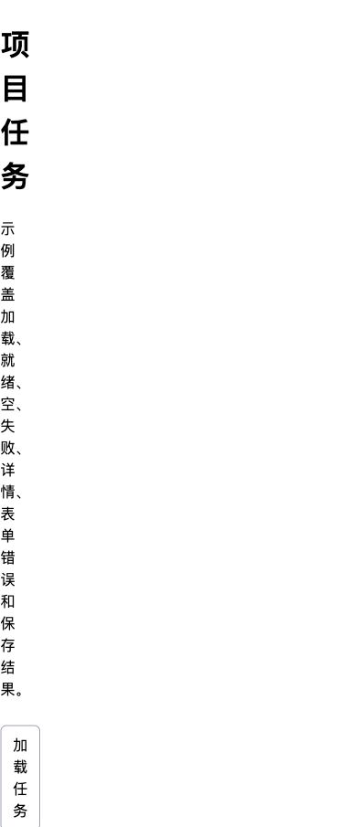

# 落地键盘、响应式与交互状态

交互落地检查把流程和线框中的行为转换为可运行实现，并验证键盘、焦点、语义、响应式布局、异步状态、错误与恢复。静态设计稿只能表达部分外观，不能证明 DOM 顺序、原生行为、辅助技术输出或数据状态正确。

## 检查边界

| 方面 | 设计必须说明 | 实现必须证明 |
| --- | --- | --- |
| 键盘 | 可达控件、操作键、退出与加速器 | 所有功能可操作、无键盘陷阱、顺序合理 |
| 焦点 | 打开、关闭、导航、错误与更新后的落点 | 焦点真实移动、可见且不被遮挡 |
| 语义 | 元素名称、角色、值和状态 | DOM/无障碍树正确暴露 |
| 响应式 | 内容重排、优先级与容器变化条件 | 窄屏、缩放、长内容下可用 |
| 状态 | 进入、反馈、操作、离开和恢复 | 数据条件能触发，刷新与失败一致 |
| 错误 | 描述、定位、输入保留与下一步 | 文本可见、程序关联、可修正 |

## 实现验证链


优先使用原生 HTML 元素，因为它们提供浏览器定义的语义与基本键盘行为。ARIA 可以补充名称、关系和状态，不能给没有行为的元素自动增加键盘交互。

## 键盘操作

### 自然 Tab 顺序

可交互元素应按 DOM 中有意义的顺序获得焦点。避免正数 `tabindex`，它会建立难以维护的另一套顺序。视觉重排不能让 DOM 顺序失去意义。

### 原生控件行为

- 链接通过 Enter 激活并导航。
- 按钮通过 Enter 或 Space 激活并执行动作。
- 表单控件使用浏览器与平台定义的键盘行为。
- 复杂组件如 Tabs、Combobox 和菜单遵循对应键盘模式，并在实现后实际测试。

不要给普通 `div` 添加点击事件就称为按钮。若确需自定义控件，必须补名称、角色、焦点、键盘激活、状态和禁用行为，成本明显更高。

### 键盘陷阱与退出

用户能够进入也应能离开。模态对话框可以在打开期间约束焦点，但必须有关闭机制；关闭后焦点返回触发元素或逻辑后续位置。编辑器等需要 Tab 输入的控件应提供可发现退出方式。

### 字符键快捷键

单字符快捷键可能与语音输入、屏幕阅读器和浏览器冲突。若实现，应允许关闭、重新映射，或仅在相关组件获得焦点时生效，并提供可见等价操作。

## 焦点管理

### 何时不移动焦点

列表局部刷新、保存成功和状态更新通常不需改变焦点。使用状态消息让辅助技术获知结果，避免打断当前操作。

### 何时需要移动

- 打开模态对话框时进入对话框；
- 进入新页面时落到主标题或主要内容起点，具体策略与路由实现一致；
- 表单提交失败时，可将焦点移到错误摘要，再由链接定位字段；
- 删除当前对象后，移到列表标题、相邻对象或合理后续操作。

### 焦点可见与不遮挡

焦点指示不能只靠浏览器默认在所有主题下“碰巧可见”。固定标题、Cookie 条和浮层不能完全遮挡获得焦点的元素。200% 放大和窄屏下也要检查。

### 程序焦点

`tabindex="-1"` 可以让非自然 Tab 目标通过程序获得焦点，例如主标题。它不会把元素加入普通 Tab 顺序。不要给大量静态内容添加 `tabindex="0"`，会增加无意义停靠点。

## 响应式实现

### 内容重排而非缩小

窄屏时多列可堆叠、工具栏可换行、主从布局可转换为连续页面。不要只把字号和控件缩小。主要对象、状态、错误和操作不能因宽度改变而消失。

### CSS 视口与缩放

WCAG 2.2 的 Reflow 要求在特定等效视口条件下，内容通常无需二维滚动即可阅读和操作，二维布局确有必要的内容有例外。验证应使用 CSS 像素和浏览器缩放，不只看设备物理分辨率。

### 内容驱动边界

使用 `minmax(0, 1fr)`、允许文本换行、避免固定高度、让工具栏 flex-wrap，并用内容失效点选择断点。真实长标题、翻译、错误与 200% 放大比三个设备截图更能暴露问题。

### 顺序和隐藏

CSS `order` 或 Grid 区域可以改变视觉顺序，但键盘和读屏仍按 DOM 顺序。若移动端结构语义改变，应重新设计 DOM 或组件，而不是只视觉交换。隐藏内容前确认不会移除任务必需信息。

## 状态实现

### 状态由数据条件驱动

```text
initial → loading → ready | empty | error
ready → saving → saved | validation-error | conflict | unknown
```

每个状态应有明确数据条件。`items.length === 0` 只能在读取成功后表示空；请求尚未返回时不能用同一条件显示空状态。

### 加载

- 初次加载与后台刷新分开；后台刷新通常保留旧数据。
- 使用 `aria-busy` 或适当状态文本表达区域正在更新。
- 骨架屏只表示等待，不应伪造已经存在的内容结构。
- 长任务说明阶段、能否离开和恢复位置。

### 错误

- 输入错误关联具体字段并用文本描述。
- 区域读取失败保留其他可用区域，提供重试。
- 提交失败保留合法输入并说明数据是否已写入。
- 超时未知结果先查询权威状态，不直接重复副作用。

### 状态消息

不移动焦点的成功、结果数、等待和错误提示应以程序可确定方式提供。`role="status"` 通常适合非紧急消息；`role="alert"` 只用于重要且时间敏感的内容。更新过频会造成辅助技术持续打断。

## 可运行示例

示例文件：[任务列表键盘、响应式与状态示例](../../examples/deconstruction/keyboard-responsive-states-demo.html)。它使用原生按钮、列表、表单和 `<dialog>`，并实现加载、失败、空、就绪、详情、字段错误和保存成功状态。

下图是实际浏览器中打开修改对话框并输入无效日期后的结果。输入具有 `aria-invalid="true"`，错误文本可见且与字段关联，焦点仍在日期字段：


下图是 390×844 视口中的实际窄屏结果。列表与详情按 DOM 顺序堆叠，实测页面宽度与视口宽度均为 390 CSS 像素，没有横向溢出：



实际检查还确认：初始加载在 600 ms 后显示 3 个任务；选择 T-101 后详情更新；取消对话框后焦点返回 `edit-button`；Console warning 与 error 均为 0。

### 示例操作

1. 打开文件，等待 600 ms，观察加载状态转换为三个任务。
2. 按 Tab 到任务按钮并按 Enter，详情区域显示选中对象。
3. 选择“修改截止日期”，原生模态对话框打开，焦点进入日期字段。
4. 输入 `2026-07-16` 并保存，字段显示关联错误且焦点保留。
5. 输入 `2026-07-24` 并保存，对话框关闭，详情更新，焦点返回触发按钮，状态消息宣布结果。
6. 选择“模拟加载失败”，焦点进入重试按钮；重试后恢复列表。
7. 选择“显示空状态”，确认它与失败状态有不同说明与操作。

### 可观察输出

成功保存后，详情显示：

```text
截止日期：2026-07-24
状态消息：任务 T-101 的截止日期已更新为 2026-07-24
```

输入无效日期时输出：

```text
截止日期不得早于 2026-07-17。
```

输入值不会被清空，`aria-invalid="true"` 暴露无效状态，错误文本通过 `aria-describedby` 与字段关联。

### 关键实现说明

```html
<input
  id="due-date"
  name="dueDate"
  type="date"
  required
  aria-describedby="date-help date-error">
```

标签使用 `<label for="due-date">` 提供名称；说明和错误由 ID 关联。错误出现时脚本增加 `aria-invalid="true"`，但程序化状态不能替代可见错误文本。

```html
<p id="live-status" role="status" aria-atomic="true"></p>
```

该区域用于非阻断动态结果。`aria-atomic="true"` 让更新后的完整消息作为一个整体呈现，避免只读出变化数字而失去上下文。

```css
.layout {
  display: grid;
  grid-template-columns: minmax(16rem, 2fr) minmax(18rem, 3fr);
}

@media (max-width: 44rem) {
  .layout {
    grid-template-columns: 1fr;
  }
}
```

宽屏是列表和详情两列，窄屏按 DOM 顺序堆叠。`minmax(0, 1fr)` 与文本换行避免长标题撑破网格。44rem 是该示例的内容失效点，不是通用设备断点。

## 示例失败分支

- 加载失败时隐藏列表并显示有文本说明的错误区域，重试按钮成为合理焦点。
- 空状态只在明确选择测试状态后出现，不把网络错误伪装为空。
- 无效日期不会关闭对话框或更新详情。
- 取消关闭对话框不修改数据，焦点返回“修改截止日期”。
- 保存示例只更新内存；刷新会恢复固定示例数据，正文明确这一边界，不能宣称已持久化。

生产实现还需补服务端校验、权限、幂等、并发冲突和持久化；这些不变量不能由这个前端示例保证。

## 浏览器验证清单

### DOM 与语义

- 页面只有一个主标题，区域标题层级连续。
- 跳过链接能把键盘用户送到主要内容。
- 控件使用 button、input、dialog 等原生元素。
- 任务按钮有可区分名称，当前项暴露状态。
- 表单标签、说明、错误和状态消息关系正确。

### 键盘

- 从地址栏开始只用 Tab、Shift+Tab、Enter、Space 和 Escape 完成任务。
- 焦点顺序与视觉顺序一致，指示始终可见。
- 对话框打开后背景不可操作，关闭后返回触发按钮。
- 没有无法退出的区域或仅鼠标可执行的动作。

### 响应式

- 桌面宽度下列表和详情并列。
- 视口小于 44rem 后按列表、详情顺序堆叠。
- 320 CSS 像素、200% 缩放和超长标题下无页面级二维滚动。
- 按钮换行后仍有足够命中区域，错误不被遮挡。

### 状态与 Console

- 逐一触发加载、就绪、失败、空、无效和成功。
- 检查控制台没有未捕获异常、无效选择器或资源错误。
- 快速切换状态时，旧计时器不会覆盖当前状态。
- 状态消息内容完整但不过度重复。

## 设计交付到工程验收

规范不要只写“支持键盘”“适配移动端”。使用可验收表达：

```text
当对话框打开：
- 焦点进入日期字段；
- Tab/Shift+Tab 不离开模态内容；
- Escape 和取消关闭且不保存；
- 关闭后焦点返回修改按钮；
- 无效日期保留输入，错误文本与字段关联。

当视口小于内容双列所需宽度：
- 列表和详情按 DOM 顺序堆叠；
- 不隐藏对象状态与主要操作；
- 页面无二维滚动。
```

## 常见错误与修正

- 给 `div` 加点击事件冒充按钮：使用原生 button 或补全全部行为。
- 用正 `tabindex` 修补顺序：修正 DOM 结构。
- 所有动态消息使用 `role="alert"`：按紧急性选择状态语义。
- 加载、空和失败共用一个布尔值：建立可判定状态模型。
- 响应式只缩小字体：重排结构并保留任务信息。
- CSS 视觉重排与键盘顺序冲突：保持 DOM 意义顺序。
- 错误只改变边框颜色：增加文本、关联与修正建议。
- 静态稿评审后宣称通过无障碍：在真实浏览器和辅助技术验证。

## 可执行落地步骤

1. 把流程节点转换为状态、数据条件和语义结构。
2. 优先选择原生 HTML 控件，记录必须自定义的原因。
3. 写 DOM 顺序、键盘操作、打开关闭和焦点落点。
4. 根据真实内容决定 Grid/Flex 重排与断点。
5. 实现初始、加载、空、就绪、错误、成功和相关边界状态。
6. 为状态变化、字段错误和结果添加可见与程序化反馈。
7. 在真实浏览器检查 DOM、无障碍树、键盘、Console 和网络。
8. 在窄屏、缩放、长内容、慢请求和失败条件下复测。

## 练习与完成标准

扩展示例，加入“删除任务并撤销”。

完成时应满足：

- 删除按钮有对象明确的可见名称和可访问名称；
- 键盘可执行删除，焦点落到相邻任务或列表标题；
- 状态消息说明删除对象并提供可操作撤销；
- 撤销恢复同一对象与原顺序，重复激活不会创建副本；
- 空列表与删除失败有不同状态；
- 320 CSS 像素和 200% 放大下可操作；
- DOM、键盘、屏幕阅读器、Console 和固定数据结果均通过检查。

## 来源

- [W3C：Web Content Accessibility Guidelines (WCAG) 2.2](https://www.w3.org/TR/WCAG22/)（访问日期：2026-07-17）
- [W3C WAI：Understanding SC 2.1.1 Keyboard](https://www.w3.org/WAI/WCAG22/Understanding/keyboard.html)（访问日期：2026-07-17）
- [W3C WAI：Understanding SC 1.4.10 Reflow](https://www.w3.org/WAI/WCAG22/Understanding/reflow.html)（访问日期：2026-07-17）
- [W3C WAI：Understanding SC 2.4.3 Focus Order](https://www.w3.org/WAI/WCAG22/Understanding/focus-order.html)（访问日期：2026-07-17）
- [WHATWG HTML Standard：Interactive elements](https://html.spec.whatwg.org/multipage/interactive-elements.html)（访问日期：2026-07-17）
