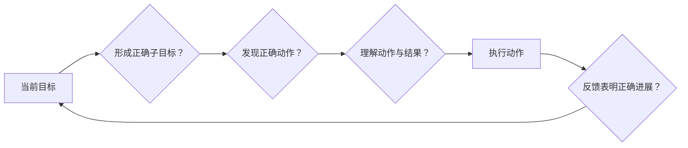

# 认知走查

认知走查是一种以任务为中心的可用性检查方法。检查者从目标用户的已有知识出发，逐步判断用户是否会形成正确子目标、发现并理解正确动作，以及操作后能否从反馈知道自己正在接近目标。它特别适合检查初次或低频使用的可学习性。

## 方法边界

认知走查可以发现：

- 入口或正确动作不可发现；
- 标签、图标与用户目标难以关联；
- 步骤依赖隐藏知识；
- 操作反馈不足，用户不知道是否前进；
- 错误后无法形成下一步。

它不能单独证明：

- 问题在真实用户中的发生率；
- 熟练用户长期效率；
- 视觉、性能、可访问性和业务规则全部合格；
- 检查者对目标用户知识的假设正确。

没有条件开展用户访谈时，可以用已有研究、公开支持问题、帮助文档、任务日志和产品证据建立初始知识假设，并明确标记未知项。

## 四个核心问题

对流程中的每一个动作，依次判断：

1. **用户会尝试达成正确的子目标吗？**
2. **用户会注意到正确的操作入口吗？**
3. **用户会把这个入口与想要的结果联系起来吗？**
4. **执行后，用户会从反馈知道自己取得了进展吗？**



任一问题回答“否”或“未知”，都记录证据、可能失败过程和需要补充的验证，不直接把设计判为整体不可用。

## 准备材料

### 目标用户知识假设

记录：

- 用户熟悉的对象、术语和平台惯例；
- 是否使用过相似功能；
- 当前能看到和持有什么信息；
- 可能不知道的权限、规则和状态；
- 输入设备、辅助技术与环境约束。

“普通用户知道齿轮代表设置”是不充分假设。应写“首次项目编辑者曾使用浏览器表单，但没有接触过本产品的‘自动化规则’术语”。

### 任务

任务包含现实目标、触发、入口、前置条件、固定输入和可观察完成标准。不要把界面步骤写进任务提示，否则会泄露走查答案。

错误任务：“点击更多，再选择导出”。正确任务：“把当前项目的全部任务导出为 CSV，以便离线核对负责人。”

### 正确动作序列

由当前产品真实行为确定，包括分支、状态、等待和恢复。若存在多个正确路径，分别走查或说明选择依据。

## 每一步怎样记录

```markdown
### 步骤 N：动作名称
- 当前界面与状态：
- 用户当前目标：
- 正确动作：
- Q1 子目标：是/否/未知；证据
- Q2 发现：是/否/未知；证据
- Q3 关联：是/否/未知；证据
- Q4 反馈：是/否/未知；证据
- 失败过程：用户可能做什么，结果是什么
- 问题严重性：任务影响、恢复和风险
- 修复候选：
- 待验证：
```

回答不能只写“是”。必须说明界面线索和用户知识怎样支持结论。

## 走查中的证据

### 支持发现

入口在用户关注区域、具有可见文字、与任务对象相邻、键盘可达、没有被折叠或遮挡。

### 支持关联

动作名称使用用户任务语言，结果对象明确，图标有标签，当前状态解释了为什么此时可用。

### 支持进展反馈

操作后状态、对象、进度和下一步明确；动态变化可被辅助技术获知；等待与最终完成分开。

### 反证

公开帮助反复解释同一入口、任务观察中用户进入错误页面、相同图标在产品内含义不同、操作后产生重复请求等。

## 完整案例：首次设置双重验证

### 具体任务与知识假设

```text
角色：首次设置账户安全的用户
目标：启用验证器应用，以便登录时使用一次性验证码
入口：账户设置 > 安全
输入：已安装验证器应用，当前会话有效
完成：账户状态显示已启用；恢复代码已安全保存；重新登录可验证
```

假设用户理解“账户”“安全”和“验证码”，但不知道 TOTP、二维码密钥、恢复代码的具体作用。这些是假设，需要公开帮助、支持记录或任务观察补证。

### 正确流程

1. 在安全页选择“双重验证”。
2. 选择“验证器应用”。
3. 扫描二维码或手动输入密钥。
4. 输入六位验证码并验证。
5. 保存恢复代码并确认。
6. 查看“已启用”结果。

### 步骤 1 走查

- 当前状态：安全页同时有密码、会话、双重验证和登录通知。
- Q1：用户会形成“找到双重验证设置”的子目标，因为目标直接对应安全设置。
- Q2：入口位于“登录安全”组，有可见文本，不依赖图标，支持发现。
- Q3：入口文案“双重验证”与目标一致；若产品其他位置只用“2FA”，关联会降低。
- Q4：进入后标题为“设置双重验证”，面包屑保留账户安全，明确进展。

### 步骤 3 走查

- 当前状态：页面显示二维码、手动密钥和“下一步”。
- Q1：用户需要把账户加入验证器，但可能不知道必须打开外部应用。
- Q2：二维码明显，但“手动密钥”是折叠链接；相机不可用用户可能找不到替代路径。
- Q3：说明写“扫描此二维码”，能关联扫码；但未说明二维码包含敏感密钥，不应截图分享。
- Q4：扫描发生在外部应用，本页面没有自动反馈；用户需要知道“应用出现六位代码后返回本页”。

问题 CW-03：外部渠道转换的进展反馈不足。修复候选是用步骤文本明确“在验证器中添加账户 → 出现六位代码 → 回到此页输入”，并始终提供可键盘访问的手动密钥方式。

### 步骤 5 走查

- 当前状态：验证码通过后显示 10 个恢复代码和“完成”。
- Q1：用户可能认为验证码通过已经完成，不会形成保存恢复代码子目标。
- Q2：下载与复制按钮可见，但主要按钮“完成”视觉更强。
- Q3：文案“以后无法登录时使用”支持关联，但未说明每个代码一次性和应离线保存。
- Q4：复制后出现“已复制 10 个恢复代码”，但复制不证明用户安全保存。

问题 CW-05：主操作顺序与安全恢复目标冲突。候选方案是在进入最终完成前要求用户确认已保存，并提供复制、下载和打印等可访问方式；不能把复选框当作安全保存的证明。

### 输出摘要

| 步骤 | 主要失败问题 | 影响 | 证据强度 |
| --- | --- | --- | --- |
| 找入口 | 术语若只用 2FA 会降低关联 | 可能找不到 | 待对照产品文案 |
| 扫二维码 | 外部应用与返回步骤不清 | 中断流程 | 当前界面事实 |
| 输入验证码 | 错误未说明时钟偏差或重试 | 无法恢复 | 需制造错误 |
| 保存恢复代码 | “完成”早于恢复准备 | 未来锁定账户 | 当前层级事实 |

### 失败分支

- 验证码错误：保留输入上下文，说明代码过期或错误，并允许新代码重试。
- 二维码无法扫描：手动密钥始终可发现且可复制，不能只悬停显示。
- 会话过期：重新认证后返回设置步骤，不暴露密钥给未授权会话。
- 恢复代码下载失败：代码仍可复制或重新生成；重新生成使旧代码失效并明确结果。

### 验证

1. 使用没有产品经验但具备假设知识的走查角色重新回答四问。
2. 仅用键盘完成，检查二维码替代、复制、错误和对话框焦点。
3. 用屏幕阅读器核对步骤、密钥说明、验证码错误和最终状态。
4. 制造错误码、会话过期和下载失败。
5. 与可用性任务观察或支持问题对照，检验知识假设与预测。

## 记录严重性

使用任务影响、发生条件、恢复成本和风险描述，不只给 1–5 分。例如：“首次设置者在外部应用返回点可能中断；没有替代认证时会阻止启用；可返回上一步恢复；涉及账户安全，需在发布前验证。”

## 常见错误与修正

- 把检查者本人当目标用户：先写知识与环境假设。
- 任务提示包含按钮名和步骤：只写目标与完成标准。
- 每一步只回答“是”：补界面线索和反证。
- 只走主路径：加入错误、权限、取消和恢复。
- 发现问题后直接猜原因：标记推断并补证据。
- 用认知走查替代键盘、WCAG、性能和工程测试。
- 把方法输出当真实发生率：需行为数据或任务观察。

## 可执行步骤

1. 固定产品版本、角色、任务、输入和完成标准。
2. 写目标用户已有知识及证据，未知项标假设。
3. 还原一条或多条正确动作序列。
4. 对每一步回答四个核心问题并记录证据。
5. 写用户可能的失败过程、影响和恢复。
6. 加入无效输入、无权限、等待、中断和返回。
7. 合并相同机制问题，形成修复候选与验证计划。
8. 用任务观察、日志或支持证据检验预测，不夸大发生率。

## 练习与完成标准

对“首次从项目导出 CSV”执行认知走查。

完成时应满足：

- 任务不泄露入口和按钮名称；
- 用户知识假设有来源或明确为未知；
- 至少走查 6 个动作，每步完整回答四问；
- 覆盖入口、范围选择、生成中、下载、错误和过期；
- 记录键盘与屏幕阅读器相关线索；
- 每个问题有失败过程、影响、修复和待验证项；
- 结论只说明潜在可学习性问题，不声称真实发生率。

## 来源

- [Wharton、Rieman、Lewis、Polson：The Cognitive Walkthrough Method](https://www.ics.uci.edu/~redmiles/ics104-WQ06/Chapter_4/CognitiveWalkthroughRev2006.pdf)（访问日期：2026-07-17）
- [W3C WAI：Understanding Guideline 3.2 Predictable](https://www.w3.org/WAI/WCAG22/Understanding/predictable.html)（访问日期：2026-07-17）
- [W3C WAI：Understanding Guideline 3.3 Input Assistance](https://www.w3.org/WAI/WCAG22/Understanding/input-assistance.html)（访问日期：2026-07-17）
- [GOV.UK Service Manual：Making prototypes](https://www.gov.uk/service-manual/design/making-prototypes)（访问日期：2026-07-17）
