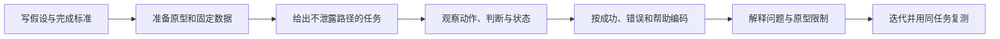

# 用原型任务观察验证成功

原型任务观察让参与者或检查者使用原型完成一个不泄露路径的现实任务，记录动作、判断、错误、反馈和结果。它验证原型范围内的流程、内容与状态假设；不能证明生产性能、后端正确、安全或完整可访问性。

## 验证对象

### 任务成功

参与者在没有非计划帮助的情况下达到预先定义的结果。结果应包含对象和业务状态，不能只以“点到最后一屏”为准。

### 错误成功

界面显示或参与者认为成功，但实际对象、金额、权限或状态错误。高风险任务必须单独记录，不应归入成功。

### 部分成功

任务的一部分完成，例如批量邀请 3 个成功、2 个失败。是否符合任务目标应在观察前定义。

### 放弃与结果未知

参与者明确停止，或原型无法判断最终状态。不要事后把无法完成解释为“只是不熟悉”。

## 原型能力边界

| 原型类型 | 可以验证 | 不能充分验证 |
| --- | --- | --- |
| 纸面/静态 | 分类、内容顺序、入口概念 | 输入、键盘、焦点、等待和动态状态 |
| 设计工具连线 | 主流程、文案、简单分支 | 原生行为、真实内容、网络和语义 |
| 浏览器代码原型 | 输入、响应式、键盘和部分状态 | 未连接的后端、安全和生产性能 |
| 服务集成原型 | 端到端数据与失败 | 仍需生产容量、兼容和运营验证 |

开始前把未实现能力明确告知观察者和记录者，避免把原型限制误记为产品问题，或把顺滑假数据误记为工程可行。

## 任务观察流程



## 设计任务

任务说明包含场景、目标、必要材料和完成状态，不包含按钮、菜单或页面名。

错误示例：“点击右上角邀请，输入邮箱后按发送。”

合格示例：“你需要让李晓参与 Roadmap 项目，并允许她编辑任务。她的邮箱是 li@example.com。请完成邀请并确认结果。”

### 任务数据

使用真实长度、错误和对象状态：

- 有效、重复和无效输入；
- 不同权限和对象版本；
- 长名称、空值和大量数据；
- 慢请求、失败和部分成功。

原型状态必须可重复触发。随机错误会让不同观察无法比较。

## 成功标准

在观察前定义：

```text
成功：li@example.com 获得一个“编辑者”邀请；界面显示待接受；刷新或结果页可确认。
错误成功：邀请了错误邮箱或错误角色，但参与者认为完成。
部分成功：邀请创建，但角色或结果不可确认。
失败：未创建邀请或无法继续。
帮助：主持人提供任何超出任务材料的信息。
```

原型若无法刷新，应使用内部状态面板或固定结果检查，不要假装已验证持久化。

## 观察什么

### 行为

入口选择、返回、重复点击、滚动、搜索、错误修正、取消和绕过。

### 判断

参与者在关键决策处的预测和理由。可以要求在不打断任务的情况下说明当前理解，但持续“出声思考”可能改变行为，要在报告中说明方法。

### 系统状态

原型展示的加载、结果、错误、焦点和数据变化。记录原型未实现与故障，不把它们混入产品结论。

### 帮助

记录帮助发生在哪一步、具体提示和任务是否继续。主持人应避免指导性语气和赞同答案。

### 可观察指标

- 成功类别；
- 首次正确动作；
- 严重错误与恢复；
- 非计划帮助；
- 完成时间，仅在任务起止和原型速度可比时；
- 关键步骤犹豫或返回，需与行为证据一起解释。

小样本不应产生精确总体百分比。结果用于发现机制和比较固定任务，不宣称代表总体。

## 不依赖访谈的个人验证

个人学习可以：

- 让同伴只执行任务，不进行用户访谈；
- 使用认知走查模拟首次使用知识；
- 自己延迟一段时间后按脚本执行，并记录熟悉度偏差；
- 用公开问题构造失败数据和任务；
- 运行键盘、屏幕阅读器与故障检查。

检查者已知道方案，证据强度低于独立参与者，报告必须说明。

## 完整案例：验证批量邀请原型

### 假设与具体输入

假设：把多邮箱输入与逐项结果放在同一流程，可让项目管理员修正失败项而不重复成功邀请。

```text
任务：邀请 5 人为编辑者
输入：
li@example.com（有效）
wang@example.com（有效）
bad-address（格式错误）
member@example.com（已是成员）
timeout@example.com（服务超时）
完成：2 个新邀请、1 个已有成员不重复、格式错误被修正、超时项可重试
```

原型为可运行浏览器页面，具有固定 800 ms 等待和预设服务结果；未连接真实邮件与权限系统。

### 任务说明

“Roadmap 项目需要邀请给定的 5 个地址，并让他们能够编辑任务。请处理所有地址，并确认哪些已经生效、哪些还需要操作。”

### 逐步观察记录

| 步骤 | 行为 | 原型状态 | 观察编码 |
| --- | --- | --- | --- |
| 1 | 粘贴 5 行 | 拆为 5 个标签 | 首次动作正确 |
| 2 | 选择编辑者并提交 | 格式错误即时出现 | 错误发现 |
| 3 | 修正为 bad@example.com | 错误消失 | 自主恢复 |
| 4 | 再次提交 | 等待 800 ms | 状态可见 |
| 5 | 查看逐项结果 | 3 成功、1 已有、1 超时 | 理解部分结果 |
| 6 | 选择“重试失败项” | 仅重试 timeout | 无重复副作用 |
| 7 | 返回成员页 | 待接受与已有成员可见 | 完成确认 |

其中 3 个成功包含 li、wang 和修正后的 bad。成功标准最初写“2 个新邀请”不再符合修正后输入，观察前发现定义错误，应修正为 3 个，而不能在结果出来后选择有利解释。

### 输出

```text
已邀请：3
已是成员：1
暂时失败后重试成功：1
重复邀请：0
非计划帮助：0
```

### 失败分支

第二次观察中，参与者选择“重新提交全部”而不是“只重试失败项”。原型必须让服务端模拟层返回相同邀请 ID，避免重复；同时记录两个操作名称可能难区分。若原型没有幂等模拟，不能据此宣称方案安全。

第三次观察只用键盘，标签删除按钮名称均为“删除”，无法确定对象。这是可访问性与内容问题，需要修正为“删除 li@example.com”，并用屏幕阅读器复测。

### 验证结论

- 逐项结果支持修正与重试假设，但需要保持成功项不可重复。
- “重试失败项”和“重新提交全部”应避免同时作为相似主要操作。
- 原型不能证明邮件送达、服务端授权和生产延迟；这些进入工程验证。

## 观察记录模板

```markdown
- 假设：
- 原型范围与限制：
- 任务/输入/完成标准：
- 参与者或检查角色：
- 环境：

| 时间/步骤 | 动作 | 预测/判断 | 原型响应 | 编码 |
| --- | --- | --- | --- | --- |

- 结果：成功/错误成功/部分/失败/未知
- 帮助：
- 严重错误与恢复：
- 原型故障：
- 证据支持/反证：
- 下一版改动与复测：
```

## 常见错误与修正

- 任务提示泄露路径：只给目标、数据和完成状态。
- 完成标准在观察后修改：观察前冻结，发现定义错误要透明记录。
- 把“到达最后一屏”算成功：检查对象和业务结果。
- 主持人立即帮助或赞同：记录帮助并使用中性提示。
- 把原型未实现当产品问题，或把假数据顺滑当生产证明。
- 只观察成功路径：准备错误、权限、等待和恢复。
- 用少量观察计算总体百分比。
- 修正画面后换任务，无法比较前后。

## 可执行步骤

1. 写待验证假设、原型能力与不可推断范围。
2. 设计不泄露路径的任务、固定输入和完成类别。
3. 实现主路径、关键状态与可重复失败。
4. 准备中性说明和非计划帮助记录规则。
5. 观察动作、判断、原型响应、错误和恢复。
6. 验证实际对象结果，不只看最终画面。
7. 分离设计问题、原型故障和工程未知。
8. 修改后使用相同任务、输入与口径复测。

## 练习与完成标准

验证“取消订阅”原型。

完成时应满足：

- 任务不包含设置、按钮或页面名称；
- 明确立即取消、周期末取消、退款和数据保留规则；
- 原型覆盖等待、失败、结果未知和撤销/恢复；
- 成功标准含订阅权威状态和重新进入后的结果；
- 记录帮助、错误成功和原型限制；
- 仅用键盘完成一次，并检查焦点与状态消息；
- 迭代前后使用相同任务和数据复测。

## 来源

- [GOV.UK Service Manual：Making prototypes](https://www.gov.uk/service-manual/design/making-prototypes)（访问日期：2026-07-17）
- [GOV.UK Service Manual：Usability benchmarking a website or whole service](https://www.gov.uk/service-manual/measuring-success/usability-benchmarking-a-website-or-whole-service)（访问日期：2026-07-17）
- [GOV.UK Service Manual：Measuring the success of your service](https://www.gov.uk/service-manual/measuring-success/measuring-the-success-of-your-service)（访问日期：2026-07-17）
- [W3C WAI：Evaluating Web Accessibility Overview](https://www.w3.org/WAI/test-evaluate/)（访问日期：2026-07-17）
