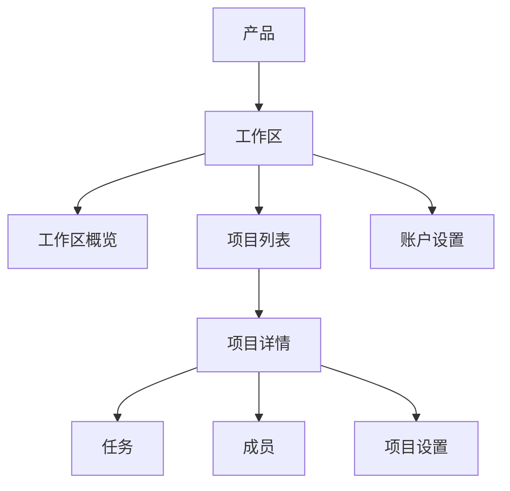
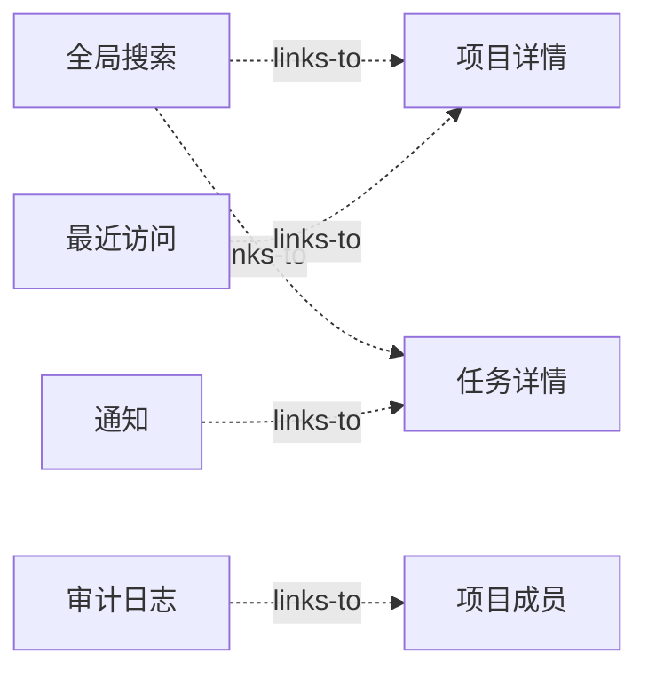
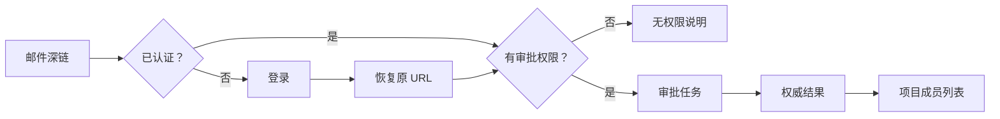

# 绘制复杂产品的现有站点地图

现有站点地图记录产品当前实际可到达的页面、主要层级、跨层入口、URL、角色差异和返回关系。它描述现状，不表达理想方案；候选结构必须另画，避免在采集阶段把问题悄悄“修好”。

## 能力边界与前置知识

本文处理几十到数百个功能的 Web 产品，不只处理公开内容网站。

完成后应能：

- 从真实产品建立可追踪的节点清单；
- 区分页面、对象详情、弹窗、抽屉、同页状态和外部系统；
- 同时表达主要层级与搜索、通知、最近访问等交叉入口；
- 记录不同角色、数据状态和平台看到的结构差异；
- 从地图定位孤岛、循环、重复入口和无返回路径；
- 把地图转换为可维护数据，而不是只保留一张图片。

前置知识：

- 用户目标、任务、入口、路径和完成标准；
- 页面、弹窗、抽屉、浮层、导航、列表和详情；
- URL、路由、重定向、权限与深链的基本概念。

站点地图不替代任务流程。地图回答“有哪些位置以及怎样到达”；流程回答“为完成某个目标要按什么顺序行动”。

## 地图中的节点与关系

### 节点

节点是用户能够识别并返回的内容或任务位置。以下情况通常应建立节点：

- 有独立 URL 的页面；
- 有稳定对象身份的详情；
- 影响后续导航的工作区或账户；
- 可以从通知、搜索或书签直接进入的位置；
- 具有独立标题、权限或生命周期的全屏任务；
- 必须在审计中追踪的外部系统边界。

以下内容通常不是独立节点：

- 纯视觉分组；
- 悬停提示；
- 不改变信息范围的排序；
- 单个按钮；
- 只改变表现、不改变任务上下文的主题切换。

弹窗、抽屉和 Tabs 是否建节点取决于它们是否承载稳定任务。不能仅按容器外观判断。

### 关系

一棵树只能表达主要包含关系，复杂产品还需要其他关系：

| 关系 | 含义 | 示例 |
| --- | --- | --- |
| `contains` | 稳定父子层级 | 项目包含项目设置 |
| `links-to` | 跨层链接，不改变目标归属 | 告警链接到服务详情 |
| `opens` | 打开临时任务容器 | 成员页打开邀请抽屉 |
| `filters` | 改变同一集合的可见范围 | 订单页切换“待退款” |
| `acts-on` | 对当前对象执行动作 | 归档当前项目 |
| `redirects-to` | 旧地址映射到新位置 | `/billing` 跳转到账单概览 |
| `returns-to` | 任务关闭后的确定返回点 | 创建成员后回到成员列表 |

每个节点只有一个主要父级并不意味着只有一个入口。通知、搜索、收藏、最近访问和外部链接都可以指向同一节点。

## 数据模型

### 节点字段

| 字段 | 必填 | 作用 |
| --- | --- | --- |
| `id` | 是 | 跨版本稳定识别节点，不能使用显示名称代替 |
| `label` | 是 | 当前界面显示名称 |
| `type` | 是 | 页面、对象详情、任务容器、状态或外部边界 |
| `route` | 按需 | 可刷新和分享的规范化 URL |
| `primaryParent` | 根节点外必填 | 主要层级父节点 |
| `objectType` | 按需 | 节点承载的业务对象 |
| `visibleTo` | 是 | 哪些角色能发现入口 |
| `accessibleTo` | 是 | 哪些角色可直接访问 |
| `dataConditions` | 按需 | 入口出现所需的数据状态 |
| `crossEntries` | 按需 | 搜索、通知、最近访问等入口 |
| `returnTarget` | 按需 | 临时任务结束后的返回位置 |
| `evidence` | 是 | URL、截图、帮助文档或走查记录 |

`visibleTo` 与 `accessibleTo` 分开。某功能可能允许通过深链查看无权限说明，但不出现在导航中；也可能入口可见但操作受字段级权限限制。

### 一个可维护记录

```json
{
  "id": "projects.members",
  "label": "成员",
  "type": "page",
  "route": "/workspaces/:workspaceId/projects/:projectId/members",
  "primaryParent": "projects.detail",
  "objectType": "project-membership",
  "visibleTo": ["owner", "project-admin"],
  "accessibleTo": ["owner", "project-admin", "auditor"],
  "dataConditions": [],
  "crossEntries": ["search", "audit-log"],
  "returnTarget": "projects.detail",
  "evidence": [
    "desktop-owner-2026-07-18",
    "deep-link-auditor-2026-07-18"
  ]
}
```

路线参数保留参数名，不把真实账户、项目或人员 ID 写入仓库。

## 采集范围

### 角色

至少覆盖：

- 最高权限角色；
- 日常使用的普通角色；
- 只读或审计角色；
- 未登录、会话过期或外部协作者；
- 产品存在时的自定义角色。

只用管理员账户会遗漏无权限状态、空导航组、申请权限路径和字段级限制。

### 入口

不要只从首页逐层点击。应分别采集：

- 登录后的默认页；
- 浏览器书签；
- 邮件或站内通知深链；
- 站内搜索结果；
- 最近访问和收藏；
- 空状态主操作；
- 错误后的恢复链接；
- 外部系统回跳；
- 帮助文档中的任务链接；
- 旧 URL 与重定向。

### 数据条件

同一角色在以下数据条件下可能看到不同结构：

- 新账户没有任何对象；
- 有一个对象和有大量对象；
- 对象已归档、删除或过期；
- 功能开关开启或关闭；
- 试用、付费、欠费或套餐受限；
- 跨地区或合规范围不同；
- 后台数据仍在迁移。

地图应记录“入口在什么条件下出现”，不要把条件入口误判为随机缺失。

## 逐步绘制方法

### 第一步：建立范围边界

写清产品、账户、工作区、平台和版本。复杂 SaaS 常同时存在：

- 产品级导航；
- 工作区级导航；
- 项目级导航；
- 当前对象内导航；
- 账户与个人设置；
- 管理控制台；
- 外部支付、身份或支持系统。

若不先划边界，同名“设置”会被错误合并。

### 第二步：建立入口矩阵

| 入口 | Owner | Member | Auditor | 未登录 |
| --- | --- | --- | --- | --- |
| 登录默认页 | 工作区概览 | 我的任务 | 审计概览 | 登录 |
| 项目深链 | 项目详情 | 有权限时进入 | 只读详情 | 认证后返回 |
| 账单深链 | 账单概览 | 无权限说明 | 审计记录 | 认证后再授权 |
| 通知深链 | 目标对象 | 目标对象 | 受限摘要 | 登录后恢复 |

矩阵用于确定需要走查的组合，不用于提前猜测结果。

### 第三步：逐页记录事实

每到一个位置，记录：

1. 页面可见标题；
2. 完整规范化 URL；
3. 产品、工作区和对象上下文；
4. 顶部、侧边、Tabs、面包屑中的当前项；
5. 可继续到达的目的地；
6. 可打开的临时任务；
7. 返回或关闭后的落点；
8. 角色、套餐和数据前提；
9. 加载、空、错误和无权限差异；
10. 证据编号。

截图只用于还原可见状态。层级、URL、权限和重定向必须写成结构化字段。

### 第四步：先画主要层级

下面是项目管理产品的主要层级：



这张图只表达主要归属，不把通知、搜索和最近访问强塞进树中。

### 第五步：叠加交叉入口



交叉入口指向相同稳定节点。它们不应为目标创建新的页面身份。

### 第六步：标记临时容器

邀请成员抽屉可以记录为：

```text
projects.members
  opens -> projects.members.invite
  success returns-to -> projects.members
  cancel returns-to -> projects.members
  permission-revoked returns-to -> projects.members.no-permission
```

若抽屉刷新即消失、不能深链且只承载短任务，可以作为 `opens` 关系而不是主要层级节点。

### 第七步：核对实现投影

对每个节点同时检查：

- URL 是否唯一且刷新可恢复；
- 页面标题是否表达当前位置；
- 导航当前项是否正确；
- 面包屑是否反映主要层级；
- 搜索结果是否指向规范化 URL；
- 帮助文档是否使用相同名称；
- 旧链接是否有确定重定向；
- 无权限时是否进入相关说明而不是首页。

## 案例一：68 个功能的项目管理 SaaS

### 固定输入

- 3 个角色：Owner、Project Admin、Member；
- 4 个入口：登录默认页、搜索、通知、书签；
- 68 个功能，14 个对象详情，9 个设置页；
- 桌面和 360 CSS px 窄屏；
- 新账户、正常账户、归档项目三组数据。

### 采集过程

1. 先把工作区、项目和账户设置分成三个范围。
2. Owner 账户从登录默认页开始广度走查。
3. 每个详情页继续检查页面内 Tabs、操作和返回。
4. 用 Member 重放已记录 URL，补充不可见但可直接访问的节点。
5. 用通知进入任务详情，记录关闭后的返回不是通知列表而是项目任务页。
6. 在归档项目检查导航是否变为只读，哪些操作消失。
7. 在窄屏检查侧边导航收起后是否仍能识别当前项目。
8. 把搜索结果和帮助文档链接映射回稳定节点 ID。

### 发现

| 事实 | 影响 |
| --- | --- |
| “成员”在工作区和项目下各出现一次 | 名称相同但对象范围不同，需要保留完整上下文 |
| 通知中的“查看设置”进入旧 URL 后跳到首页 | 深链丢失目标，无法恢复任务 |
| Member 看不到“自动化”，但直接 URL 显示空列表 | 无权限被误表示为空 |
| 归档项目仍显示“创建任务”入口 | 可见能力与业务状态不一致 |
| 窄屏关闭抽屉后回到页面顶部 | 返回位置和焦点丢失 |

### 输出

- 96 个结构节点；
- 138 条主要或交叉关系；
- 12 条旧 URL 映射；
- 7 个无权限状态；
- 5 个条件入口；
- 9 个需要进一步验证的问题。

节点数大于功能数，因为对象详情、任务容器和权限状态也需要稳定身份。

### 失败分支

第一次采集只使用 Owner，地图中没有任何无权限节点。修正方式不是在图上凭经验补充，而是用 Member 和 Auditor 重放已记录 URL，保存真实响应、标题和返回路径。

## 案例二：通知深链与窄屏结构

### 固定任务

用户在手机邮件中打开“审批项目成员”链接，完成审批后返回项目成员列表。

完成标准：

- 认证后恢复原目标；
- 页面显示项目与工作区上下文；
- 无权限时说明申请路径；
- 审批后返回成员列表并定位对应成员；
- 浏览器后退不重复提交。

### 走查



地图要记录登录是认证边界，不是原任务的父节点；审批任务属于项目成员范围；邮件只是交叉入口。

### 边界注入

- 会话在审批前过期；
- 项目在打开链接前归档；
- 被审批成员已经被其他管理员处理；
- 当前用户权限被撤销；
- 窄屏导航处于打开状态；
- 返回列表有 2,000 名成员。

### 验证结果

会话过期后系统曾把用户送到工作区首页，原任务丢失。修复后的实现保存安全的目标路径，重新认证后重新执行授权，并在冲突时显示当前成员状态，不重放旧审批请求。

## 常见误区与修正

### 把导航菜单抄成站点地图

导航只呈现经过筛选的重要入口。搜索、通知、深链、空状态和错误恢复可能不在菜单中。应从多入口采集。

### 把组织架构当产品结构

研发、销售、财务部门不是自然的信息分类。应记录当前产品实际结构，再用任务和业务对象评估是否合理。

### 把访问历史当父级

面包屑和主要父级应稳定。用户从搜索进入任务详情，不会使“搜索”成为任务的父级。

### 把弹窗全部当页面

是否建节点取决于稳定任务身份、权限、深链、恢复和审计需求，不取决于矩形容器大小。

### 忽略状态差异

加载失败、空数据、无权限和功能未开通都可能显示“没有内容”。地图必须记录实际原因。

### 在现状图里直接重组

现状、问题和候选结构应使用独立文件或图层。否则无法解释改动前后差异。

## 无障碍检查

- 每页有准确且能区分对象范围的标题。
- 多个 `nav` 地标具有按目的命名的唯一名称，例如“产品”“项目”。
- 当前页面通过 `aria-current="page"` 等程序化状态表达。
- 地标名称按用途命名，不使用“左侧”“蓝色区域”等位置或颜色。
- 深链进入后，主标题和上下文在合理阅读顺序中出现。
- 跳过链接能直接进入主内容。
- 窄屏展开导航后可用 Escape 或明确按钮关闭，焦点返回触发点。
- 页面放大和重排后，固定导航不遮住获得焦点的目标。

## 验证与自动检查

### 结构检查

对结构化地图执行：

- ID 唯一；
- 根节点外都有主要父级；
- `contains` 不形成循环；
- 所有关系目标存在；
- 规范化 URL 不重复；
- 旧 URL 有唯一目标；
- 角色和数据条件使用受控枚举；
- 临时任务有成功、取消和失败返回。

### 行为检查

1. 从每种入口打开固定目标。
2. 核对 URL、标题、当前导航和主要父级。
3. 刷新并确认上下文恢复。
4. 切换角色并重放相同 URL。
5. 在空、失败、无权限和归档数据下重复。
6. 用浏览器后退、前进和新标签页检查历史。
7. 用键盘和屏幕阅读器检查地标与当前项。
8. 在 360 CSS px 和 200% 缩放下检查导航。

### 变化检测

每次导航改版应比较：

- 新增和删除节点；
- 父级变化；
- URL 变化；
- 名称变化；
- 角色可见性变化；
- 交叉入口变化；
- 返回目标变化；
- 旧链接兼容变化。

变化列表进入发布审查，避免只根据视觉截图判断结构是否改变。

## 综合练习

选择一个包含至少 30 个功能的真实产品，交付：

- 范围与版本说明；
- 至少 3 个角色、4 类入口和 3 种数据条件的覆盖矩阵；
- 结构化节点表；
- 主要层级图；
- 交叉入口图；
- 5 个临时任务的返回关系；
- 10 个固定深链走查结果；
- 无障碍检查记录；
- 结构检查和变化检测结果；
- 事实、问题与候选方案三个独立产物。

验收标准：

- 任一节点能追溯到真实证据；
- 任一交叉入口都指向稳定目标；
- 同名节点能通过对象范围区分；
- 无权限、空和失败没有被合并；
- 刷新、深链和浏览器历史保持任务上下文；
- 地图可以由结构化数据重新生成；
- 其他人能用相同账户和步骤复现主要结构。

## 来源

- [W3C WAI — Landmark Regions](https://www.w3.org/WAI/ARIA/apg/practices/landmark-regions/)（访问日期：2026-07-18）
- [W3C — Web Content Accessibility Guidelines (WCAG) 2.2](https://www.w3.org/TR/WCAG22/)（访问日期：2026-07-18）
- [GOV.UK Design System — Navigate a service](https://design-system.service.gov.uk/patterns/navigate-a-service/)（访问日期：2026-07-18）
- [W3C WAI — WAI Site Map](https://www.w3.org/WAI/sitemap/)（访问日期：2026-07-18）
