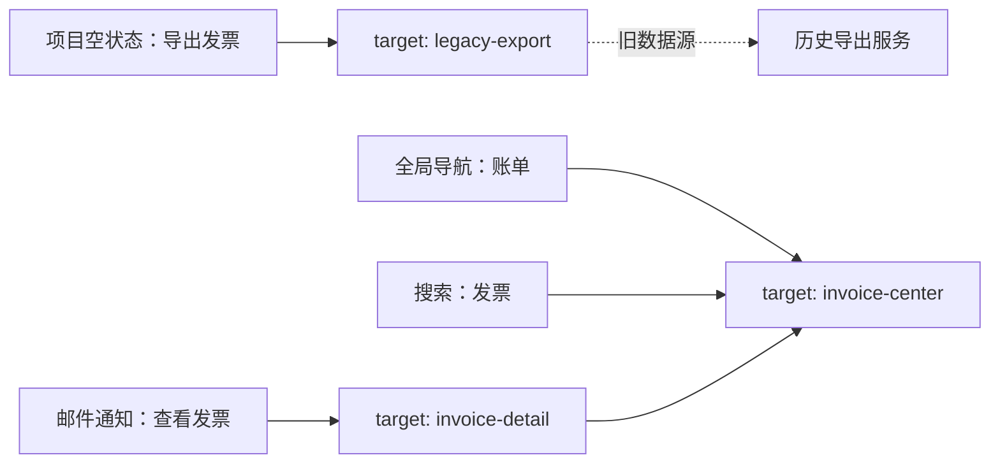

# 审计重复、混乱与层级过深的入口

入口审计是把用户可能进入功能或内容的路径还原为可检查的数据，再判断重复入口、命名冲突、断路和层级成本是否妨碍任务完成。审计对象不只是菜单，还包括搜索结果、通知深链、空状态操作、对象内链接、书签 URL 和帮助文档链接。

## 能力边界与前置知识

本文解决三个问题：

- 同一目标出现多个入口时，哪些是有意提供的替代路径，哪些是失控复制。
- 用户看到标签后无法预测目标时，怎样定位命名、归属或权限问题。
- 路径较长时，怎样判断它是在表达必要上下文，还是在增加无效选择。

审计不会直接给出唯一的新导航。它先建立现状证据和问题边界，再把需要重组、改名、补充交叉入口或保留现状的节点交给后续设计。

前置知识：

- 能区分页面、对象、操作、筛选条件和流程步骤。
- 能记录角色、起点、目标、URL、页面标题与实际可见入口。
- 已完成[绘制复杂产品的现有站点地图](01-current-sitemap.md)。

## 先定义“入口问题”

### 重复入口不等于重复功能

多个入口可以指向同一规范目标。搜索、全局导航和对象空状态分别服务于已知目标查找、稳定浏览和首次创建，它们的存在理由不同。只要目标身份、权限结果和返回模型一致，这种重复通常是替代访问方式。

需要处理的重复具有至少一种特征：

- 两个入口名称相同，却进入不同对象或不同权限范围。
- 两个名称不同，却执行相同操作，导致用户无法形成稳定词汇。
- 入口各自创建一套页面，数据、URL、帮助文档和埋点逐渐分叉。
- 同一目标在相邻层级反复出现，没有更快到达或恢复任务的价值。
- 一个入口完成迁移后，旧入口仍可写入旧数据或绕过新约束。

### 混乱由“承诺与结果不一致”产生

入口标签向用户承诺目的地。标签“账单”若打开发票明细，而另一个“费用”打开付款方式，问题不只是措辞，而是对象边界没有稳定表达。

入口承诺至少包含：

| 承诺 | 可观察结果 | 常见破坏 |
| --- | --- | --- |
| 目标对象 | 页面标题、主内容和 URL 对象一致 | 菜单写“成员”，目标却是邀请流程 |
| 操作范围 | 操作影响当前项目、组织或个人 | 相同“设置”在不同页面改变不同范围 |
| 权限预期 | 可见入口应给出可解释结果 | 点击后才发现永久无权限 |
| 返回上下文 | 完成或关闭后回到有意义位置 | 通知深链关闭后跳到无关首页 |
| 状态连续性 | 刷新、分享和后退保持必要上下文 | URL 不含对象标识，只能从菜单重走 |

### 层级过深没有固定数字

“三次点击以内”不能作为普遍规则。路径是否过深取决于每一步是否缩小有效范围、标签能否预测下一层、目标频率、错误代价和是否存在直接入口。

以下现象比单纯点击数更能证明层级成本：

- 连续两层只含一个子项，分类没有提供选择价值。
- 相邻层采用不同分类维度，例如先按角色、再按部门、再按对象。
- 用户到达中间页后必须重新判断刚刚已经确定的上下文。
- 深层目标没有稳定 URL、搜索入口或位置提示。
- 返回上级会丢失筛选、滚动位置或已选对象。
- 低频但高风险的功能被埋藏，用户只能依赖外部文档。

## 建立可审计的入口台账

不要从截图直接画“问题树”。先让每个入口成为一行事实。

| 字段 | 含义 | 记录规则 |
| --- | --- | --- |
| `entry_id` | 入口自身的稳定标识 | 不随显示名称改变 |
| `entry_label` | 用户实际看到的文字 | 图标入口同时记录可访问名称 |
| `entry_type` | 全局导航、局部导航、搜索、深链、上下文操作等 | 类型由触发机制决定 |
| `start_context` | 角色、对象、页面和数据范围 | 不写笼统的“首页” |
| `target_id` | 规范目标的稳定标识 | 同一目标的多个入口共享该值 |
| `target_url` | 实际落地 URL | 同时记录重定向后的最终 URL |
| `target_title` | 页面标题与主标题 | 二者不一致时分别记录 |
| `permission_result` | 可见、禁用、403、404 或降级结果 | 以测试角色实际结果为准 |
| `return_result` | 后退、关闭、保存后的落点 | 记录上下文是否保留 |
| `evidence` | 截图、录像、测试账号和时间 | 保证他人可复现 |

目标身份必须独立于 URL。URL 可能因路由迁移改变，名称也可能因词汇统一而改变；稳定的 `target_id` 才能判断两个入口究竟是不是同一目标。

## 从入口图识别结构性问题

把入口视为边，把页面或操作目标视为节点：

图中 `G` 与 `S` 是同一目标的替代入口；`E` 虽然名称接近，却进入另一套历史实现，应继续检查数据与权限是否分叉。图的作用是暴露身份和关系，不是用线条多少判断好坏。

### 六类检查

1. **多入边**：一个目标有多个入口。检查每个入口是否服务不同起点，以及标签、权限和返回是否一致。
2. **多出边**：一个入口因角色或状态去往多个目标。检查分支是否在点击前可预测。
3. **孤岛**：目标没有站内入口，只能靠旧书签或外部文档到达。
4. **断路**：入口存在，但落到 404、无恢复的 403、已删除对象或空白页面。
5. **循环**：中间页互相链接却不能推进任务，例如“设置”与“管理”来回跳转。
6. **串行单子节点**：多层容器每层只有一个有效选择，可考虑合并，但需保留必要的范围确认。

## 审计步骤

### 1. 固定范围而不是全站漫游

以“角色 × 起点 × 目标任务”形成抽样矩阵。例如财务功能至少覆盖组织所有者、财务管理员和项目管理员；起点覆盖登录首页、项目详情、通知、搜索和旧书签。

### 2. 走查真实实现

对每条路径记录：

- 首次看到的入口和同屏竞争项。
- 每次选择前用户可以依据的标签、分组和位置线索。
- 点击后 URL、标题、主标题、当前导航项和焦点位置。
- 无权限、无数据、对象删除、慢加载时的结果。
- 完成任务、取消、关闭与浏览器后退后的落点。

不要把产品需求文档中的理想流程当成现状。

### 3. 统一目标身份和词汇

先合并“同一对象、同一动作、同一数据范围”的目标，再检查入口标签。若同一词指向多个目标，给词增加范围；若多个词指向同一目标，选择首选名称并把其他词保留为搜索同义词，而不是继续展示多套导航词汇。

### 4. 标注问题而不是立即删入口

每个问题记录五项：

| 项目 | 示例 |
| --- | --- |
| 事实 | 项目页“导出发票”进入旧服务，账单页“导出”进入新服务 |
| 影响任务 | 财务管理员无法确认两份文件的口径 |
| 影响范围 | 有历史项目且使用项目入口的账户 |
| 待验证解释 | 项目入口可能为兼容旧税率而保留 |
| 候选处理 | 统一目标、明确历史范围或限制旧入口为只读 |

事实和解释分开，才能避免把设计者猜测写成用户问题。

### 5. 按任务风险排序

可用一个透明的排序分数帮助排期：

\[
Priority = Reach \times FailureRate \times Consequence \times Confidence
\]

- `Reach` 是受影响任务量或受影响角色覆盖，不等于页面访问量。
- `FailureRate` 是在固定任务中出现问题的比例。
- `Consequence` 表达失败造成的时间、资金、合规或数据代价。
- `Confidence` 表达证据可靠度，防止单个截图获得最高优先级。

分数只用于同一批问题的相对排序。四项量纲、取值范围和观察窗口必须固定。

## 处理方式与决策边界

| 处理方式 | 适用条件 | 必须保留的契约 | 不适用情况 |
| --- | --- | --- | --- |
| 合并入口 | 多个入口没有不同起点价值 | 旧 URL、搜索词和权限映射 | 入口分别服务发现与高频效率 |
| 合并目标 | 两套页面表达同一对象与动作 | 数据迁移、审计记录、回滚 | 两者业务规则或法律范围不同 |
| 改名 | 目标正确但标签承诺错误 | 页面标题、搜索同义词、文档同步 | 实际对象边界本身混乱 |
| 提升层级 | 目标高频或高风险且当前路径绕行 | 当前项与旧深链 | 只因某一团队希望曝光 |
| 降低层级 | 顶层拥挤且目标属于稳定对象 | 搜索与上下文入口 | 会使关键恢复路径不可见 |
| 增加交叉入口 | 目标可从多个真实任务自然到达 | 所有入口指向规范目标 | 为修补错误分类无限加链接 |
| 保持现状 | 路径虽长但每步有效缩小范围 | 用验证证据记录原因 | 只是因为迁移成本未知 |

## 案例一：财务后台的三套“发票导出”

### 输入

现状有三个入口：

1. 全局“账单 → 发票 → 导出”，导出组织级已开票记录。
2. 项目“更多 → 导出发票”，导出项目级预估费用。
3. 搜索“导出发票”，直接打开旧版组织导出弹窗。

三个入口名称接近，但对象、时间口径和税务状态不同。投诉记录显示，部分项目管理员把预估费用文件提交给财务。

### 处理

先定义三个目标：

| 目标 ID | 对象 | 数据范围 | 结果 |
| --- | --- | --- | --- |
| `issued-invoices` | 已开具发票 | 当前组织 | 法定发票清单 |
| `project-cost-estimate` | 项目费用 | 当前项目 | 内部预估明细 |
| `legacy-invoice-export` | 历史已开票记录 | 当前组织 | 旧格式清单 |

这不是三个重复入口，而是两个标签冲突加一个重复实现。处理方案：

- 项目入口改为“导出项目费用”，目标页说明金额为预估值。
- 搜索词“导出发票”指向规范的 `issued-invoices`。
- 旧格式仅在“历史导出格式”中提供，并标出适用日期，不再作为搜索首选结果。
- 所有组织级导出先在服务端检查财务权限；隐藏菜单不替代授权。

### 输出与验证

用三个角色分别从导航、项目页和搜索执行任务。验证条件：

- 入口标签能在点击前区分“发票”与“项目费用”。
- 同一组织、同一日期范围从规范入口得到一致记录数。
- 旧书签重定向后仍能解释格式差异。
- 取消导出返回原筛选状态；成功后下载记录可在审计日志中找到。

### 失败分支

若直接把项目入口重定向到组织发票页，项目管理员可能无权限并失去原有费用导出能力。此时应保留项目费用目标，只修正名称与结果说明，不能用“统一入口”消灭不同业务任务。

## 案例二：通知深链在移动端形成无返回孤岛

### 输入

协作产品的审批通知链接直接打开 `/requests/8472`。桌面端详情旁有侧边导航，移动端详情是全屏层；对象已删除时返回通用 404。测试发现用户从系统通知进入后关闭详情，会被送到产品首页而不是审批列表。

### 处理

将入口上下文拆为两部分：

- 规范资源 URL 标识审批对象，刷新和分享仍可工作。
- `return_to` 只接受服务端允许的站内目标，用来恢复通知入口上下文，不能接受任意外部 URL。

对象存在且有权限时，页面显示“审批请求”标题、所属项目和审批列表位置。对象删除时，错误页保留“返回审批列表”；无权限时不泄露请求内容，并提供返回当前可访问范围的操作。

移动端关闭按钮的返回优先级：

1. 安全且有效的显式来源上下文。
2. 当前对象的规范父级。
3. 角色可访问的审批列表。

浏览器历史不能单独承担返回逻辑，因为通知可能在新标签页或外部应用中打开。

### 输出与验证

测试矩阵覆盖有效对象、已删除对象、权限撤销、旧通知和新标签打开。每个条件检查：

- 页面标题与可访问名称能说明目标对象。
- 关闭、完成和错误恢复都到达有意义页面。
- 360 CSS px 宽度与 200% 文本缩放下返回操作可见。
- 键盘焦点进入页面后落在主标题或合理的首个操作，离开全屏层后回到来源入口。
- 403 与 404 响应不会通过文案或元数据泄露受限对象。

### 失败分支

如果 `return_to` 可直接使用查询字符串中的任意地址，攻击者可以构造开放重定向。修复返回体验时必须使用站内路由白名单或服务端生成的上下文标识。

## 发布前后的验证

### 路径级验收

为每个修复建立固定任务：

- 指定角色与起点。
- 指定目标对象和完成结果。
- 记录允许使用搜索与否。
- 记录最长合理路径，但不把点击数作为唯一成功条件。
- 检查错误、取消和返回路径。

观察首次选择正确率、任务成功率、错误入口率、返回重走率和主动操作时间。按角色、平台和入口分群，避免总体平均隐藏移动端或低权限角色的回归。

### 技术级验收

- 旧 URL 返回明确的永久或临时重定向策略，不产生重定向环。
- 站内搜索索引、帮助文档、快捷入口和页面标题使用同一首选名称。
- 重复功能只保留一个权威写入路径；旧实现若保留，应限制能力并记录截止条件。
- 导航的当前项、面包屑和页面标题从规范目标生成，而不是按来源入口各自拼接。
- 导航重复出现时相对顺序保持可预测；同一功能在不同页面使用一致标识。

### 失败注入

主动模拟：

- 撤销角色权限后使用旧书签。
- 删除对象后从未读通知进入。
- 搜索索引仍含旧名称或旧 URL。
- 浏览器无历史记录时关闭深链详情。
- 新旧路由同时收到写请求。
- 长标签、多语言和 200% 文本缩放。

每次注入同时观察页面反馈、网络响应、权威数据与审计日志。

## 综合练习：审计一个设置区域

选择包含至少 20 个入口、3 种角色和 2 种非菜单入口的真实或开源产品区域，交付：

1. 入口台账与稳定目标字典。
2. 入口—目标关系图，标出多入边、孤岛、断路、循环和串行单子节点。
3. 至少 8 个问题条目，每项区分事实、影响、解释和验证。
4. 两个互不相同的修复方案，说明合并、改名、迁移和保留边界。
5. 一个旧 URL 与权限回归测试矩阵。
6. 发布前后同口径的路径验证结果。

验收标准：

- 替代访问方式不会仅因“重复”被删除。
- 每个问题能从固定角色和起点复现。
- 目标身份不依赖显示名称或 URL。
- 修复覆盖成功、无权限、对象删除、取消和返回。
- 任何写入路径都经过服务端授权与业务校验。

## 来源

- [W3C WAI：Understanding SC 2.4.5 Multiple Ways](https://www.w3.org/WAI/WCAG22/Understanding/multiple-ways)（访问日期：2026-07-18）
- [W3C WAI：Understanding SC 3.2.3 Consistent Navigation](https://www.w3.org/WAI/WCAG22/Understanding/consistent-navigation.html)（访问日期：2026-07-18）
- [W3C WAI：Understanding SC 3.2.4 Consistent Identification](https://www.w3.org/WAI/WCAG22/Understanding/consistent-identification)（访问日期：2026-07-18）
- [W3C WAI：Understanding SC 2.4.8 Location](https://www.w3.org/WAI/WCAG22/Understanding/location.html)（访问日期：2026-07-18）
