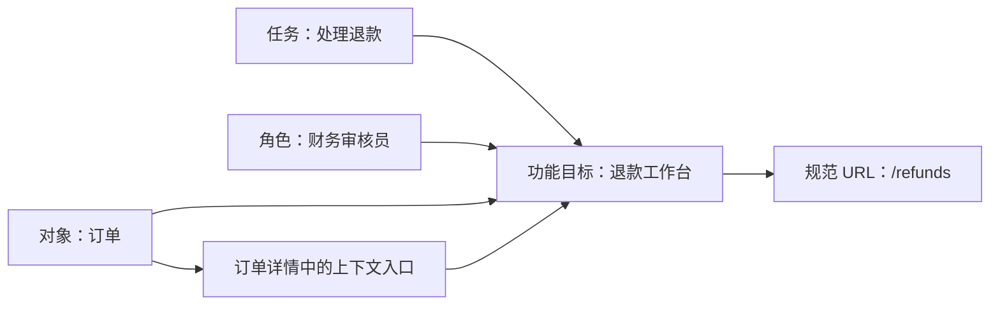

# 按任务、角色或业务对象重新分类

重新分类是为内容或功能选择稳定的分组依据，使用户可以根据当前掌握的线索逐步缩小范围。任务、角色和业务对象是三种常见分类维度；它们不是互斥模板，也不能按团队组织图直接套用。

## 能力边界与前置知识

本文聚焦“一个功能应该归在哪一组”的决策，包含：

- 判断任务、角色、对象各自适合承载什么信息。
- 选择主要分类维度与交叉入口。
- 处理多角色、跨对象任务、同义词和权限差异。
- 把分类方案落实到稳定标识、URL、搜索索引和导航。

前置知识：

- 能列出用户目标、业务对象、角色能力和现有入口。
- 已完成[入口问题审计](02-entry-problem-audit.md)，能够区分现状事实与候选结构。
- 理解“可见入口”与“服务端授权”是不同责任。

重新分类不负责设计页面内字段顺序，也不负责定义业务权限。分类可以反映权限结果，但不能成为权限系统。

## 三种分类维度的准确含义

### 按任务分类

任务是用户希望完成的可观察结果，例如“邀请成员”“处理退款”“发布版本”。任务分组通常使用动词或结果语言，适合用户先知道要做什么、但不知道系统对象名称的情况。

任务分类的约束：

- 同一任务应有明确完成状态，而不是宽泛的“管理”。
- 任务名称不能依赖内部流程阶段，例如用户不知道“进入清算队列”时，不应以此作为入口。
- 高频任务可形成快捷入口，但不必复制一套独立目标页面。
- 跨对象任务需要明确作用范围，否则“导出”或“配置”无法预测结果。

### 按角色分类

角色是由责任和能力边界定义的使用者类别，例如组织所有者、财务管理员、审核员。按角色分类适合不同角色的目标集合长期稳定且重叠很少的系统。

角色分类的风险：

- 一个人可能同时拥有多个角色，必须决定合并、切换还是按上下文显示。
- 组织自定义权限后，产品预设角色名称可能不再代表实际能力。
- “人力资源部”“平台团队”是组织单元，不一定是产品角色。
- 把入口隐藏给无权限角色并不能替代服务端鉴权。
- 新用户未必知道组织怎样称呼自己的职责。

### 按业务对象分类

业务对象是系统中具有稳定身份和生命周期的实体，例如项目、订单、发票、数据集。按对象分类适合用户围绕一个对象持续查看状态、执行操作和协作的系统。

对象分类的约束：

- 对象必须有清晰身份，而不是把“设置”“工具”当作万能对象。
- 对象内操作应作用于当前实例或明确的集合范围。
- 同一对象的创建、查看、编辑、归档可共享位置，但跨对象流程需要交叉入口。
- 对象名称稳定，不代表用户一定知道它；搜索同义词和任务入口仍可能必要。

## 分类是多维关系，不是强制单棵树

一个功能可以同时与任务、角色和对象有关：

主要分类决定稳定归属；交叉入口解决不同起点下的发现与效率。图中“退款工作台”可以归入财务任务区，同时从订单详情进入，但两个入口应指向同一目标身份和一致业务规则。

不要把每种关系都做成父子层级。包含关系表达“属于”，相关关系表达“也可从这里到达”，操作关系表达“对当前对象执行”。混为一棵树会制造多父级、循环和不一致面包屑。

## 建立分类卡片

每个待分类项至少记录：

| 字段 | 问题 | 示例 |
| --- | --- | --- |
| 稳定 ID | 改名后怎样识别同一项 | `refund-review` |
| 用户目标 | 完成后什么事实改变 | 退款被批准或拒绝 |
| 主要对象 | 操作围绕什么实体 | 退款申请 |
| 作用范围 | 单个、项目、组织还是全局 | 当前组织 |
| 允许角色 | 谁具有什么能力 | 财务审核员可决定 |
| 触发频率 | 角色在给定周期内多常执行 | 工作日多次 |
| 前置状态 | 什么条件下任务才存在 | 申请待审核 |
| 首选名称 | 导航与标题使用的稳定词 | 退款审核 |
| 替代词 | 搜索可识别但导航不重复展示的词 | 退钱、退费 |
| 规范目标 | 页面、弹层或命令的权威位置 | `/refunds/pending` |

首选名称和替代词可以借鉴受控词表的思想：一个概念在同一语言中只有一个首选标签，其他常用表达作为替代标签；概念之间再建立更广、更窄或相关关系。它是一种建模方法，不要求普通产品必须采用 RDF 或 SKOS。

## 选择主要分类维度

### 第一步：写出用户在入口前已知的线索

分类必须使用用户在做选择时已经知道的信息。逐项检查：

- 用户知道目标结果，却不知道系统对象：任务维度更有辨识度。
- 用户先进入某个对象，再决定操作：对象维度更稳定。
- 用户责任集合独立且角色切换明确：角色维度可以减少无关选择。
- 用户只知道关键词：搜索和同义词索引比继续增加层级有效。

### 第二步：检查维度稳定性

| 变化 | 任务分类影响 | 角色分类影响 | 对象分类影响 |
| --- | --- | --- | --- |
| 组织改名或重组 | 通常较小 | 可能大面积迁移 | 通常较小 |
| 新增对象状态 | 任务可能新增 | 角色能力可能变化 | 对象位置通常稳定 |
| 用户同时承担多职责 | 可按目标继续查找 | 容易出现重复或切换成本 | 影响取决于对象权限 |
| 对象生命周期变化 | 跨阶段任务需调整 | 角色名称未必变化 | 需维护状态与操作 |
| 本地化与行业词汇 | 动词和结果需要本地化 | 角色叫法差异大 | 对象通常也有行业同义词 |

选择预计最稳定、最能预测目标的维度作为主结构。稳定不是永不变化，而是变化时可明确迁移。

### 第三步：计算分类冲突

对每个候选分组检查：

- **互斥性**：同一项是否在同一维度被迫放入两个组。
- **完备性**：是否出现大量“其他”或无法归类项。
- **一致性**：同级是否都按同一判断规则。
- **可解释性**：新成员能否用一句规则解释为何在此组。
- **可扩展性**：新增 20% 功能后是否仍能按同一规则归入。

互斥并非绝对要求。知识图谱允许多重更广关系，产品导航也可提供交叉入口；但主要归属应稳定，否则 URL、当前项和返回位置无法预测。

### 第四步：建立任务—角色—对象矩阵

| 功能 | 任务 | 允许角色 | 主要对象 | 候选主归属 | 交叉入口 |
| --- | --- | --- | --- | --- | --- |
| 审批退款 | 处理退款 | 财务审核员 | 退款申请 | 财务任务 | 订单详情 |
| 设置税率 | 配置计税规则 | 组织所有者 | 税务配置 | 组织设置对象 | 发票异常提示 |
| 查看项目成本 | 监控成本 | 项目管理员、财务 | 项目 | 项目对象 | 财务报表 |
| 邀请成员 | 建立访问关系 | 组织管理员 | 成员 | 成员对象 | 空状态任务 |

矩阵用于暴露多维关系，不意味着界面必须展示矩阵。

## 方案 A、B、C 的边界

### A：任务为主

适合流程型服务、首次使用较多、目标语言稳定的产品。顶层可以是“申请”“审核”“付款”，页面内再显示相关对象。

成本是同一对象的状态可能散落在不同任务区。需要对象详情、全局搜索或活动记录把生命周期重新连接起来。

### B：对象为主

适合项目管理、内容管理、资产管理和数据平台。用户先选项目、文档或数据集，再查看状态与操作。

成本是跨对象操作和首次创建不易归属。需要工作台、命令入口或明确的跨对象任务区。

### C：角色工作台为入口，对象为主结构

适合角色责任差异明显，但多人拥有复合角色的企业系统。工作台只聚合“当前需要处理”的任务，规范页面仍按对象组织。

成本是工作台查询、排序、权限与对象页面必须共享权威状态；不能让工作台成为第二套业务实现。

### 不建议：组织部门为主

产品结构若直接映射公司部门，用户任务会随组织调整而迁移。同一个“客户资料”可能跨销售、支持和风控，按部门复制会造成数据和名称分叉。只有部门本身就是稳定的授权或业务对象时，才可作为分类依据。

## 分类重构的落地流程

1. 冻结当前入口和规范目标清单，保留旧 URL。
2. 为所有项填写分类卡片，补齐作用范围、前置状态和实际权限。
3. 分别生成任务、角色、对象三种候选结构，不混合规则来掩盖难归类项。
4. 用固定查找任务比较首次选择、路径解释和错误恢复。
5. 选择主维度，为跨维度需求设计搜索、上下文链接或工作台。
6. 定义首选标签、替代词、页面标题和 URL 映射。
7. 与权限模型对照，确认分类不会暴露受限对象，也不会让可见入口暗示错误能力。
8. 分阶段迁移路由、搜索索引、帮助内容、分析事件和旧书签。

## 案例一：分析平台从团队菜单改为对象结构

### 现状与约束

数据分析平台顶层是“数据团队”“分析团队”“运维团队”。三个区域都出现“数据源”“报表”和“告警”，同一用户常兼任分析与运维职责。新增“语义模型”后，团队无法决定归属。

对象生命周期为：

团队名称没有表达这个依赖关系。

### 重新分类

将主结构改为数据源、语义模型、报表、告警四类对象。每个对象详情承载当前实例的状态、权限与操作。首页保留两个任务聚合：

- “继续分析”列出最近报表与草稿。
- “处理告警”列出当前用户可处理的告警事件。

这两个聚合项不复制报表和告警页面，点击后进入对象的规范 URL。角色只影响可见对象和允许操作，不再成为顶层标签。

分类卡片还记录：

- “Dataset”“数据集”“数据源”并非天然同义。产品把外部连接定义为数据源，把可查询产物定义为数据集，二者分别建模。
- “监控”作为搜索替代词映射到告警，但导航统一使用“告警”。
- 没有语义模型权限的用户，从报表依赖关系进入时看到可解释的受限状态，而不是空白分组。

### 验证

固定任务包括“为某报表更换数据源”“处理失败刷新告警”“查找仅自己可见的草稿”。候选结构需满足：

- 用户从对象详情能解释上游与下游关系。
- 复合角色不需要切换“团队视图”才能完成连续任务。
- 搜索同义词进入同一个规范目标。
- 权限变化后工作台与对象页状态一致。
- 旧团队 URL 重定向到明确对象，无法映射时给出选择页而不是首页。

### 失败分支

若把“告警规则”和“告警事件”合并成一个对象，只因为名称相近，会混淆配置与运行结果。规则可编辑并持续产生事件；事件是某次触发记录。应保持两个对象，通过关系连接，而不是为了减少顶层数量破坏生命周期。

## 案例二：售后系统用任务工作台连接多个业务对象

### 现状与约束

售后人员需要处理退货、退款、换货和补发。原结构按订单、支付、仓储三个对象分区，一次退货任务需要跨三个区域查找。直接改成“售后专员”角色区又会排除兼任售后的门店经理。

证据显示用户入口前已知的是客户诉求和待办状态，而不是内部对象归属。因此采用“任务工作台 + 对象规范页”：

| 工作台任务 | 涉及对象 | 完成结果 |
| --- | --- | --- |
| 审核退货 | 退货申请、订单 | 申请通过或拒绝 |
| 确认收货 | 退货包裹、仓库记录 | 包裹状态已确认 |
| 执行退款 | 退款单、支付交易 | 退款进入支付处理 |
| 安排补发 | 补发单、库存 | 新履约单创建 |

### 交互与数据契约

工作台按当前主体权限查询待办，但决定操作由对应对象服务执行。每条任务显示对象类型、客户、金额、截止时间和当前状态。打开任务后 URL 指向规范对象；工作台筛选条件保存在 URL 中，返回时可恢复。

同一人员拥有门店经理和售后权限时，系统合并允许任务，不要求先猜角色。角色切换只在数据范围确实互斥且需要明确代表身份时出现。

### 验证

使用普通售后、门店经理、财务审核员三种能力组合，执行完整退货链：

1. 从待办定位退货申请。
2. 查看订单与包裹证据。
3. 批准退货。
4. 返回工作台看到任务离开“待审核”。
5. 财务角色进入退款单继续处理。

验证工作台状态与对象服务权威状态一致；并发审批返回明确冲突，不把过期任务继续显示为可操作。

### 失败分支

如果任务工作台缓存仍显示“待审核”，而对象已被另一人拒绝，用户不应在旧卡片上继续提交。打开和提交时都要读取对象版本；冲突后刷新任务状态并保留用户已查看的证据上下文。

## 命名、搜索与多语言

分类标签必须描述对象或目标，避免“中心”“平台”“管理”“其他”等低信息词。相邻项不能依赖图标或位置才能区分。

多语言环境中，首选标签按语言分别维护；不要把一种语言的词序直接用作所有语言的分类顺序。搜索索引可以包含：

- 首选标签。
- 常用替代词和旧名称。
- 可接受的拼写错误。
- 对象编号或行业代码。

替代词用于检索，不意味着导航同时展示所有名称。搜索结果仍显示首选名称、对象类型和所属范围。

## 无障碍、权限与工程边界

- 导航分组应以真实标题、列表和命名的 `nav` 区域表达，不用纯视觉缩进代替关系。
- 同一功能在不同页面出现时使用一致名称；链接文本要能在上下文中说明目的地。
- 角色定制不能随页面任意重排重复导航。用户主动选择的个性化顺序应可恢复。
- 无权限对象在服务端过滤；若业务需要展示但禁用，必须解释获取权限的方法。
- 分类配置需要稳定 ID 和版本，不能以显示文字作为数据库键或分析事件名。
- 路由迁移保留明确映射，避免旧 URL 统一跳首页。

## 验证与失败注入

在纸面树、可点击原型和真实实现三个阶段分别验证。重点观察：

- 首次选择是否进入正确分类。
- 用户能否解释分组规则，而不只是碰巧找到。
- 多角色用户是否需要无意义切换。
- 从深链进入能否判断当前位置。
- 搜索词是否命中规范目标。
- 新增模拟功能是否能按同一规则归入。

失败注入包括：

- 给一个用户同时授予两个原本互斥的角色。
- 撤销对象权限但保留工作台缓存。
- 新增无法放入现有组的跨对象任务。
- 将首选名称改为另一语言或 30 字长标签。
- 使旧 URL 与新对象发生一对多映射。
- 让同一对象在两个区域各自出现不同当前项。

## 综合练习：重组一个企业产品

选择至少 30 个功能、5 个业务对象和 3 种能力组合，交付：

1. 完整分类卡片。
2. 任务、角色、对象三套候选结构。
3. 选择主维度的逐项判断，明确交叉入口。
4. 首选标签、替代词与旧名称映射。
5. 两个端到端任务在新结构中的路径。
6. 权限、深链、搜索和返回测试矩阵。

验收标准：

- 同级分类使用同一维度。
- 每个功能有一个稳定规范目标。
- 多角色用户不会因角色标签丢失能力或重复看到目标。
- 交叉入口不会产生第二套数据与业务实现。
- 新增模拟功能时，无需建立新的“其他”组。
- 旧 URL、搜索词和帮助链接均有迁移结果。

## 来源

- [W3C：SKOS Simple Knowledge Organization System Reference](https://www.w3.org/TR/skos-reference/)（访问日期：2026-07-18）
- [W3C：SKOS Simple Knowledge Organization System Primer](https://www.w3.org/TR/skos-primer/)（访问日期：2026-07-18）
- [W3C WAI：Understanding SC 3.2.4 Consistent Identification](https://www.w3.org/WAI/WCAG22/Understanding/consistent-identification)（访问日期：2026-07-18）
- [W3C WAI：Understanding SC 2.4.4 Link Purpose (In Context)](https://www.w3.org/WAI/WCAG22/Understanding/link-purpose-in-context.html)（访问日期：2026-07-18）
