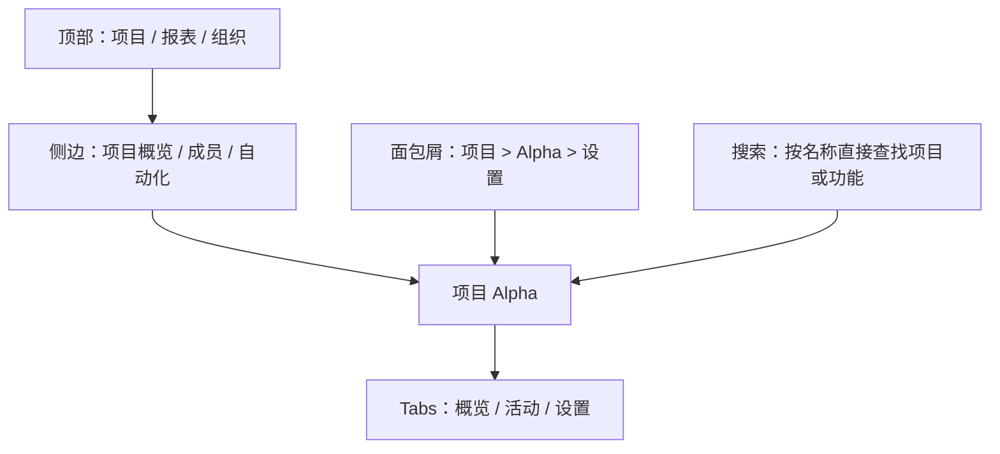

# 设计顶部、侧边、Tabs、面包屑与搜索的边界

顶部导航、侧边导航、Tabs、面包屑和搜索不是五种可以任意互换的外观。它们分别表达产品范围、区域层级、同一上下文中的平级视图、当前位置和直接检索。边界清晰时，多个导航机制可以互补；边界混乱时，同一页面会出现不同的“当前项”和返回答案。

## 能力边界与前置知识

本文讨论导航机制的职责分配、状态契约、响应式变化和实现验证。开始前应已完成：

- [按任务、角色或业务对象重新分类](03-reclassify-task-role-object.md)。
- 为页面、对象和操作分配稳定标识。
- 定义规范 URL、角色权限和主要父级。

本文不决定产品应该有哪些业务对象，也不把组件库默认样式当成信息架构。组件选择必须由关系和任务决定。

## 先区分五种关系

| 机制 | 主要回答 | 关系类型 | 典型范围 |
| --- | --- | --- | --- |
| 顶部导航 | 产品有哪些稳定顶级区域 | 全局范围 | 跨整个产品 |
| 侧边导航 | 当前区域有哪些层级与同级目标 | 区域包含关系 | 一个顶级区域内 |
| Tabs | 当前对象或任务有哪些平级视图 | 同一上下文的视图切换 | 页面或对象内部 |
| 面包屑 | 当前页面位于哪条主要层级路径 | 祖先链与位置 | 当前页向上 |
| 搜索 | 已有名称或特征时怎样直接定位 | 查询到结果集合 | 跨多个区域或当前集合 |

一个页面可同时出现多种机制，但每种机制必须回答不同问题：

如果顶部和侧边同时列出同一组平级目标，或者 Tabs 改变了业务对象而面包屑不变，说明关系建模尚未完成。

## 顶部导航：表达稳定的全局范围

### 适用条件

顶部导航适合少量、长期稳定、跨任务都需要识别的顶级区域。它还可以承载产品身份、全局搜索和账户入口，但不应塞入当前对象的所有操作。

每个顶级项应满足：

- 覆盖一组有共同归属规则的目标。
- 与其他顶级项可区分，不依赖团队内部术语。
- 页面切换后仍保持相对顺序。
- URL 和页面标题能表明进入了哪个范围。
- 当前项可由路由确定，不依赖点击来源。

### 不适用条件

- 项目数量或工作区数量动态增长时，不要把每个实例放进顶部。
- 一次性操作不应与目的地并列，例如“新建项目”通常是操作按钮。
- 用户级“偏好”与组织级“设置”不能因都叫设置而合并。
- 顶部空间不足不是把所有项放进“更多”的充分理由；先检查顶层分类。

### 响应式边界

窄屏可把顶部链接收进可展开区域，但信息关系不应改变。需要明确：

- 打开按钮具有可访问名称和展开状态。
- 展开后焦点能进入链接，关闭后返回触发按钮。
- 路由切换后菜单是否自动关闭。
- 页面滚动或视口变化时，焦点元素不会被固定头部完全遮挡。
- 同一断点下，重复导航的相对顺序保持一致。

## 侧边导航：表达区域内层级

### 适用条件

侧边导航适合一个区域中一至数层的稳定目标，尤其是桌面端复杂工具。USWDS 的组件指导把一至三层作为其侧边导航的适用范围；这不是所有产品的层级上限，而是该组件的设计边界。

侧边导航需要表达：

- 区域名称。
- 当前页与祖先项。
- 可展开父项和普通链接的区别。
- 长列表的滚动范围。
- 权限过滤后的完整结构。

### 折叠不是默认答案

折叠层级能节省空间，但会隐藏可发现性。采用折叠前检查：

- 父项本身是否可访问页面，还是只控制展开。
- 点击父项与点击展开图标是否具有不同结果。
- 深链进入时祖先是否自动展开。
- 用户手动折叠状态是否覆盖“必须显示当前项”的要求。
- 键盘操作是否符合所用控件语义。

普通网站导航通常使用链接列表和按钮控制展开，不必实现桌面应用式 `tree`。一旦声明为 ARIA tree，就必须实现方向键、展开、层级、焦点管理等完整行为，不能只添加角色名称。

### 当前项

当前项来自规范路由与目标 ID。样式高亮之外，应提供程序化当前状态，例如页面链接使用 `aria-current="page"`。父级可使用展开和祖先样式，但不要把多个链接都标为当前页。

## Tabs：同一上下文的平级视图

Tabs 适合在不改变主要对象的情况下切换平级内容，例如项目详情的“概览、活动、设置”。选择 Tab 后，用户仍在同一个项目范围内。

### 判断是否真的是 Tabs

同时满足以下条件才优先考虑 Tabs：

- 各面板共享同一主要标题或对象身份。
- 用户可能在同一任务中来回比较面板。
- 面板数量有限且标签可在一行或可控布局中理解。
- 切换不会进入独立的跨区域目的地。
- 每个面板的加载、错误与 URL 状态可以明确处理。

若每一项都是独立目的地、有自己的子层级或需要分享完整页面，局部导航链接可能更适合。视觉上横排的链接不必声明为 Tab。

### Tabs 的交互契约

真正的 ARIA Tabs 是复合控件：

| 项目 | 要求 |
| --- | --- |
| 角色 | `tablist` 包含 `tab`，每个 Tab 关联一个 `tabpanel` |
| 选择 | 只有一个 Tab 为选中，面板状态与其一致 |
| 焦点 | 采用 roving tabindex，方向键在 Tab 间移动 |
| 激活 | 自动激活只适用于面板可即时显示的场景 |
| 延迟 | 远程加载明显时宜手动激活，避免方向键触发连续请求 |
| URL | 需要深链、刷新与后退时，把选择写入路由或查询参数 |
| 错误 | 单个面板失败不应清空对象标题和其他 Tab |

仅仅将链接放成横排，不需要使用上述复合控件键盘模型；链接继续按普通 Tab 键顺序访问。

### 数量和溢出

不要让 Tabs 无限横向滚动而不提示内容。标签过多通常意味着：

- 混入了对象操作。
- 平级关系实际包含子组。
- 某些视图属于少数角色。
- 当前对象承担了过多职责。

应先重构关系，再考虑“更多”菜单。若确实需要溢出，当前 Tab 必须始终可见，键盘和屏幕阅读器仍能访问所有项。

## 面包屑：表达主要祖先链

面包屑帮助用户理解并移动于多层网站结构。它不用于表示线性流程进度；“第 2 步，共 5 步”应使用步骤指示或流程状态。

### 生成规则

- 来源是页面的主要归属，不是用户刚才实际点击的历史。
- 每个祖先项链接到可访问的稳定页面。
- 当前页可省略，或以非链接当前项显示；团队需保持一致。
- 标签与目标页面标题词汇一致。
- 深链打开与刷新后仍得到同一条路径。
- 多父级对象必须选择规范祖先链，其他关系用上下文链接表达。

GOV.UK 的面包屑指导将其放在主内容之前，并建议从首页开始、以当前页的父级结束。具体产品可有不同内容规则，但必须保持位置、命名和层级语义稳定。

### 不适用情况

- 站点结构扁平，祖先链不能提供额外方向。
- 页面是线性事务中的一步。
- 移动端只剩一个“返回”动作，且无法说明返回目标。
- 面包屑被用作浏览历史；从搜索进入时不应突然把“搜索结果”写成内容父级。

## 搜索：直接定位，不负责修补全部分类

搜索适合目标数量大、用户掌握名称或特征、且结果可稳定排序的场景。它可以作为满足多种到达方式的一部分，但不能掩盖核心导航不可理解。

### 搜索范围

先决定查询的是：

- 全产品功能。
- 当前组织中的业务对象。
- 当前对象内的内容。
- 帮助文档。
- 命令或操作。

范围必须在输入框标签、占位提示和结果中可理解。全局搜索若同时返回项目、成员和设置，结果应显示类型与所属范围，避免同名目标不可区分。

### 搜索状态

| 状态 | 含义 | 用户可做什么 |
| --- | --- | --- |
| 初始 | 尚未输入有效查询 | 查看最近项或输入条件 |
| 加载 | 请求进行中 | 继续编辑并取消旧请求 |
| 有结果 | 已按权限返回匹配项 | 打开目标、继续筛选 |
| 零结果 | 请求成功但无可见匹配 | 改词、清筛选、浏览分类 |
| 错误 | 请求未完成或索引不可用 | 重试或转用导航 |
| 受限 | 存在权限边界 | 只解释可见范围，不泄露对象 |

零结果与错误不能共用一句“没有内容”。搜索建议也要服务端按权限过滤；客户端隐藏受限结果无法阻止信息泄露。

## 组合导航时的责任表

为每个页面填写：

| 问题 | 权威机制 | 其他机制责任 |
| --- | --- | --- |
| 我在产品哪个顶级区域 | 顶部导航 | 页面标题复核 |
| 我在区域中的哪个目标 | 侧边导航 | 面包屑显示祖先 |
| 我正在看对象的哪个视图 | Tabs 或局部导航 | URL 保存状态 |
| 怎样回到稳定上级 | 面包屑或明确返回链接 | 浏览器后退仅恢复历史 |
| 我知道名称，怎样直接到达 | 搜索 | 导航提供浏览路径 |

一个问题只能有一个权威答案。例如当前对象视图由 URL 的 `activity` 段决定，Tabs、标题和分析事件都从该状态派生，不能各自维护。

## 案例一：云资源控制台的三层导航

### 约束与输入

控制台包含组织、项目和资源实例三个范围。用户可从全局搜索直接进入某台数据库，也可先选项目。组织所有者能管理账单，项目管理员只能管理项目资源。

候选组件职责：

- 顶部：资源、监控、账单。
- 项目侧边：概览、计算、数据库、网络、访问控制。
- 数据库详情 Tabs：概览、指标、日志、备份、设置。
- 面包屑：资源 > 项目 Alpha > 数据库 > db-07。
- 全局搜索：按名称、资源 ID 或 IP 查询允许访问的资源。

### 决策过程

“账单”保持顶级，因为它是组织级对象集合，不属于某个项目。数据库“备份”是当前实例的平级视图，使用可深链 Tabs；“创建备份”是动作，放在备份面板内，不作为 Tab。

“访问控制”在项目侧边表示项目成员与策略；数据库详情中的“连接权限”属于实例设置。两者必须使用带范围的名称，避免两个“权限”入口承诺相同结果。

直接进入 `/projects/alpha/databases/db-07/logs` 时：

- 顶部“资源”为当前区域。
- 侧边“数据库”为当前项或当前祖先。
- Tabs“日志”为选中。
- 面包屑来自资源层级。
- 页面标题包含 `db-07` 与“日志”。

### 状态与异常

数据库被删除时，深链显示资源已删除状态，并提供返回项目数据库列表。用户失去项目权限时，不通过面包屑或搜索结果泄露名称。日志面板请求失败只影响日志，不清空数据库身份和导航。

在窄屏上，项目侧边变为“项目导航”展开控件；数据库 Tabs 若无法容纳，不把当前项隐藏进不可见菜单，而是改为可访问的局部导航选择器，并保持 URL 不变。

### 验证

- 用搜索、项目浏览和旧书签进入同一日志 URL，五种机制给出一致位置。
- 只用键盘打开窄屏导航、切换日志视图并返回。
- 撤销权限后复测搜索建议、面包屑和旧深链。
- 使日志 API 超时，确认其他视图仍可操作。
- 200% 文本缩放下焦点不被固定顶部完全遮挡。

### 失败分支

如果“日志”切换只保存在组件内存，刷新后回到概览，分享链接也无法复现。需要将可分享视图写入 URL；若视图包含敏感筛选，URL 只保存非敏感状态，敏感条件由受控会话恢复。

## 案例二：长篇开发文档的侧边、页内导航与搜索

### 约束与输入

文档站有 12 个产品区域、每区 20 至 80 篇页面；单篇 API 指南可能有十多个章节。读者既会按教程浏览，也会搜索具体错误码。

结构分工：

- 顶部只显示文档、API、更新日志和支持。
- 左侧导航显示当前文档区域的页面层级。
- 页内导航从当前页的二、三级标题生成。
- 面包屑显示文档区域与页面祖先。
- 搜索同时返回页面和章节，结果标明所属产品与版本。

页内导航不是 Tabs。激活链接滚动到同一页面的锚点，页面内容不会被替换。长页使用稳定 heading ID，修改标题时保留旧锚点映射。

### 阅读顺序与焦点

视觉上页内导航可位于内容右侧，但 DOM 和键盘顺序要经过实际测试。锚点激活后，键盘用户需要能从目标标题继续阅读；固定头部不能遮挡标题。页内链接文字与目标标题一致，避免“更多”“点击这里”。

搜索进入某章节时，页面加载后定位锚点并保留页面标题。若版本不再支持，结果标出历史版本，不能静默跳到同名新版本章节。

### 验证

选择“配置 OAuth 回调”“查找错误码 E4017”“从旧版书签进入速率限制”三个任务：

1. 不用搜索，从顶层逐级找到页面。
2. 使用搜索直接到达具体章节。
3. 从章节返回所属 API 页面和产品区域。
4. 用键盘跳过重复导航并访问页内链接。
5. 在 320 CSS px 与 200% 缩放下复测。

记录目标到达、错误版本选择、首次进入错误分支和返回重走。搜索快不代表侧边结构可以失败，两者服务不同查找方式。

### 失败分支

若页内导航扫描所有视觉加粗文字并生成链接，会制造错误层级。它应依赖真实标题结构与稳定 ID；缺少层级标题的内容先修正文档结构，而不是用脚本猜测。

## 实现与无障碍检查

### 语义

- 每个 `nav` 区域使用能区分用途的可访问名称。
- 导航链接使用真实链接；打开弹层或展开分组使用按钮。
- 同一页面的当前链接使用合适的 `aria-current` 值。
- 只有实现完整键盘模型时才使用 `tablist`、`tree` 或 `menu` 等复合控件角色。
- 页面有描述主题的标题，导航标签与目标名称一致。

### 焦点

- DOM 顺序优先匹配有意义的阅读与操作顺序。
- 展开菜单后不把焦点送到不可见元素。
- 路由切换后，单页应用将焦点移动到新页面的主标题或合适容器，并更新文档标题。
- 弹出式移动导航关闭后把焦点还给触发按钮。
- 固定头部、粘性侧边和浮层不能完全遮挡获得焦点的组件。

### 一致性

WCAG 2.2 要求一组页面中重复出现的导航机制保持相对顺序，除非变化由用户发起。插入当前区域的子导航不等于必须让所有页面内容完全相同，但不能让顶级项在不同页面无缘由换序。

## 生产观测与失败注入

观测信号按机制区分：

| 机制 | 信号 | 不能单独说明什么 |
| --- | --- | --- |
| 顶部 | 首次选择、区域切换、短时返回 | 点击少不一定无价值 |
| 侧边 | 展开、错误分支、目标到达 | 深层点击多不一定失败 |
| Tabs | 切换、加载失败、来回比较 | 高频切换可能表示比较需求 |
| 面包屑 | 向上导航、深链恢复 | 使用少不代表位置线索无用 |
| 搜索 | 零结果、改写、结果点击、二次搜索 | 搜索多可能是熟练效率而非导航失败 |

失败注入：

1. 深链进入三级页面且浏览器没有站内历史。
2. 当前 Tab 的接口超时。
3. 某角色只剩侧边分组中的一个可见项。
4. 顶部和侧边标签增长到 30 个汉字。
5. 搜索索引仍包含已撤权对象。
6. 面包屑父级被归档或重命名。
7. 在路由切换过程中快速按后退。

检查界面、URL、焦点、网络取消、权限过滤和分析事件是否共享同一状态。

## 综合练习：为复杂控制台定义导航契约

选择一个至少包含 4 个顶级区域、一个三级区域、对象详情和全局搜索的产品，交付：

1. 五种导航机制的责任表。
2. 三个代表页面的层级、URL、当前项和返回契约。
3. 桌面、窄屏和 200% 缩放布局说明。
4. 深链、无权限、删除对象、加载错误和浏览器后退测试。
5. 键盘顺序与复合控件语义检查。
6. 发布后的分机制观测计划。

验收标准：

- 同一关系不会由两个组件给出冲突答案。
- Tabs 不承载跨对象的全局目的地。
- 面包屑不伪装流程进度或浏览历史。
- 搜索结果包含类型、范围并先按权限过滤。
- 深链刷新后，标题、当前项、焦点和 URL 一致。
- 所有导航在键盘、窄屏和错误状态下可恢复。

## 来源

- [W3C WAI：ARIA Authoring Practices Guide — Tabs Pattern](https://www.w3.org/WAI/ARIA/apg/patterns/tabs/)（访问日期：2026-07-18）
- [W3C WAI：Understanding SC 3.2.3 Consistent Navigation](https://www.w3.org/WAI/WCAG22/Understanding/consistent-navigation.html)（访问日期：2026-07-18）
- [GOV.UK Design System：Breadcrumbs](https://design-system.service.gov.uk/components/breadcrumbs/)（访问日期：2026-07-18）
- [U.S. Web Design System：Side Navigation](https://designsystem.digital.gov/components/side-navigation/)（访问日期：2026-07-18）
- [U.S. Web Design System：In-page Navigation](https://designsystem.digital.gov/components/in-page-navigation/)（访问日期：2026-07-18）
