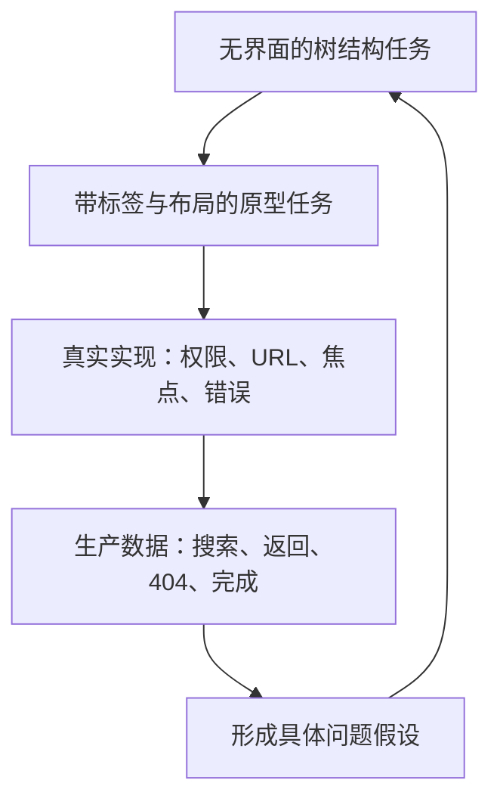

# 验证目标功能是否容易找到

可发现性验证检查用户能否从给定起点识别正确入口并到达目标。它不等于“页面有没有曝光”，也不等于“搜索能不能返回结果”。验证必须先定义目标、起点、允许路径和成功条件，再组合结构测试、原型任务、生产行为和技术检查。

## 能力边界与前置知识

本文适用于导航重组前后的验证、目标功能上线前的查找测试，以及生产环境中持续发现退化。

前置知识：

- 已建立页面和功能的稳定目标 ID。
- 已完成[导航机制责任边界](04-navigation-boundaries.md)。
- 能区分入口点击、到达目标和完成业务任务。
- 能按角色、平台、入口和新旧用户分群。

本文不通过偏好问题判断结构优劣。“更喜欢 A”不能证明能在 A 中找到目标。可发现性也不是完整可用性：用户找到退款设置后仍可能无法理解或完成退款。

## 定义可发现性

一个有效查找任务包含：

\[
FindabilityTask = Start + Goal + AvailableCues + AllowedMechanisms + Success
\]

- `Start`：角色、页面、对象上下文、设备与已有权限。
- `Goal`：用户语言描述的结果，不泄露导航标签。
- `AvailableCues`：起点实际可见的名称、分组、搜索范围和位置。
- `AllowedMechanisms`：是否允许搜索、外部文档、浏览器后退或旧书签。
- `Success`：到达规范目标，并能依据标题、内容或状态确认目标正确。

缺少任一项，成功率就可能无法解释。例如“找到报表权限”没有指定组织级还是项目级权限，也没有指定测试角色，结果会把不同目标混在一起。

## 四层证据模型

四层回答不同问题：

| 层级 | 能回答 | 不能单独回答 |
| --- | --- | --- |
| 树结构任务 | 分类与标签能否把人带到目标 | 视觉层级、响应速度和控件行为 |
| 原型任务 | 布局与交互线索是否支持查找 | 真实权限、路由和数据延迟 |
| 真实实现 | 完整状态和工程契约是否成立 | 大规模自然使用中的分布 |
| 生产数据 | 哪些路径和失败大量发生 | 用户为何做出某次选择 |

不要用某一层替代其他层。树测试通过不代表键盘用户能操作折叠菜单；点击日志显示“到达”也不代表到达的是用户想要的目标。

## 设计可判定的查找任务

### 使用目标语言，避免答案泄露

若目标导航标签是“访问控制”，任务不要写“请找到访问控制”。可以写：“你需要让同事只能查看项目，不能修改内容。你会从哪里开始？”

任务描述应包含现实前提，但不包含：

- 目标菜单原词。
- 应点击的区域名称。
- 测试者在真实场景不会知道的内部对象。
- 带倾向的“你觉得是否容易”。

### 固定起点与结束点

每个任务记录：

| 字段 | 示例 |
| --- | --- |
| 任务 ID | `find-project-readonly-role` |
| 角色 | 项目管理员 |
| 起点 | 项目 Alpha 概览 |
| 数据条件 | 已有 8 名成员 |
| 目标 ID | `project-role-policy` |
| 规范 URL | `/projects/alpha/access/roles` |
| 允许机制 | 导航；第二轮允许搜索 |
| 成功条件 | 到达只读角色策略页并指出作用范围 |
| 失败条件 | 到组织角色、成员详情或帮助文档 |

“指出作用范围”能防止参与者碰巧落到同名页面却没有识别错误。

### 覆盖代表性任务

至少包含：

- 高频任务。
- 低频高后果任务。
- 深层目标。
- 多处存在相近名称的目标。
- 只能由特定角色看到的目标。
- 从通知、搜索或旧深链开始的目标。
- 错误、删除或无权限后的恢复任务。

不要只测试团队刚刚改动、且最容易成功的入口。

## 树结构测试

树结构测试移除视觉样式和页面内容，只保留分类标签与层级，让测试者选择认为能到达目标的分支。它适合隔离分类和命名问题。

### 结果类型

| 结果 | 定义 | 诊断价值 |
| --- | --- | --- |
| 直接成功 | 未离开正确路径即到达目标 | 标签与归属支持首次判断 |
| 间接成功 | 走错后返回，最终到达目标 | 结构可恢复但存在竞争分支 |
| 失败 | 结束于错误节点或放弃 | 目标不可辨识或归属不符合预期 |
| 跳过 | 任务条件无效或技术故障 | 不应计入成功率分母 |

直接成功率：

\[
DirectSuccess = \frac{DirectSuccessCount}{ValidAttempts}
\]

总成功率：

\[
TotalSuccess = \frac{DirectSuccessCount + IndirectSuccessCount}{ValidAttempts}
\]

两者不能合并成一个数字后丢失路径信息。直接成功低、总成功高通常表示可恢复但首次分类线索弱。

### 首次选择分布

记录每个任务第一次进入哪个顶级分支。若正确分支得到 55%，另一个分支得到 40%，总体成功率即使较高，也说明两个标签竞争。需要检查：

- 两个分组是否使用不同分类维度。
- 任务是否天然跨对象。
- 错误分支是否需要交叉入口。
- 目标名称是否在多个地方承诺相同结果。

### 路径而非只有均值

保存匿名化选择序列，例如：

`项目 → 成员 → 返回 → 设置 → 访问控制`

分析共同错误转移：

- 哪个节点首次分流。
- 返回后选择了什么。
- 是否在同两组之间循环。
- 是否到达目标前经过无信息的单子节点。

一条长路径可能每步都合理；一条短路径也可能碰巧成功。必须结合选择理由和目标确认判断。

## 原型与真实实现任务

树结构通过后，在原型或实现中加入：

- 视觉层级与响应式布局。
- 展开、折叠、Tabs 和搜索交互。
- 加载、空、错误、无权限与删除状态。
- 页面标题、当前项、面包屑和 URL。
- 键盘焦点与屏幕阅读器信息。

### 观察点

1. 用户首次注视或键盘到达哪些入口。
2. 首次选择是否正确。
3. 错误后能否判断发生了什么。
4. 返回是否保留起点上下文。
5. 到达后能否确认对象、范围和权限正确。
6. 目标操作是否可继续，不因入口不同产生不同状态。

时间指标从任务呈现并确认理解后开始，到达且确认目标时结束。区分主动操作时间与系统等待，避免把慢接口误判为信息架构问题。

## 指标定义与解释

### 核心指标

| 指标 | 分子 | 分母 | 用途 | 常见误读 |
| --- | --- | --- | --- | --- |
| 任务成功率 | 到达并确认正确目标的任务 | 有效任务尝试 | 判断能否找到 | 把碰巧到达计为成功 |
| 首次选择正确率 | 首选进入正确主分支 | 有效任务尝试 | 定位分类竞争 | 忽略起点不同 |
| 间接成功率 | 绕路后成功 | 有效任务尝试 | 判断恢复成本 | 与直接成功混合 |
| 错误分支率 | 首次进入指定错误分支 | 有效任务尝试 | 比较标签竞争 | 只看最常见错误 |
| 主动查找时间 | 排除系统等待的操作时间 | 成功或全部尝试，需明确 | 观察效率 | 只报告均值 |
| 放弃率 | 明确停止且未到达 | 有效任务尝试 | 发现无恢复路径 | 把技术故障算放弃 |

报告比例时同时给出计数，例如 `14/20`，不要只写 70%。样本较小时，百分比波动很大；比较两个方案时应报告区间与任务级分布，不因几个百分点差异宣告胜负。

### 完成与到达分开

生产环境中可定义：

\[
TargetArrivalRate = \frac{SessionsReachedCanonicalTarget}{EligibleFindabilityStarts}
\]

\[
TaskCompletionRate = \frac{CompletedTransactions}{StartedTransactions}
\]

到达目标但未完成，问题可能在表单、权限或业务规则；从未到达，才更直接指向入口、分类、搜索或深链。分母必须明确什么算“开始”，不能用所有登录会话稀释目标任务。

### 分群

至少检查：

- 新用户与已有使用历史的用户。
- 桌面、窄屏与辅助技术路径。
- 角色与数据权限。
- 从导航、搜索、通知、文档和书签进入。
- 中文、英文或其他实际语言。
- 新旧导航版本。

总体改善可能掩盖某一角色的严重退化。

## 生产行为数据

### 导航事件

记录稳定标识，不用显示文字当事件名：

| 字段 | 含义 |
| --- | --- |
| `navigation_version` | 结构版本 |
| `entry_id` | 被激活的入口 |
| `target_id` | 预期规范目标 |
| `start_context` | 区域、对象和入口类型 |
| `role_capability_set` | 经脱敏后的能力分组 |
| `result` | 到达、403、404、取消、错误 |
| `active_time_ms` | 可选的主动操作时间 |
| `platform_class` | 桌面、窄屏等粗粒度分类 |

事件不记录敏感对象名称、搜索原文或完整 URL 查询参数。权限信息使用最小必要的能力分组。

### 搜索信号

- 零结果率必须以有效查询为分母，排除空输入和取消请求。
- 查询改写是一次查询后短时间内改变关键词，不等于必然失败。
- 结果点击需要结合目标到达和短时返回。
- 同义词命中用于检查用户词汇与首选标签差异。
- 受限对象在生成建议和结果前过滤，不能先返回再由前端隐藏。

搜索量上升既可能表示导航难找，也可能表示熟练用户采用更快方式。只有与任务、首次入口、返回和完成共同分析才可形成解释。

### 返回与错误

值得排查的组合信号：

- 进入目标后数秒内返回，并选择相邻入口。
- 在两个分支间来回切换。
- 从深链进入 404 后离开站点。
- 到 403 后反复搜索同名目标。
- 新导航发布后旧 URL 重定向环增加。
- 目标到达率不变，但任务完成率下降。

这些是问题线索，不自动证明原因。

## 比较候选结构

### 同一任务、同一条件

比较 A/B 结构时固定：

- 任务措辞与目标。
- 起点和角色。
- 数据内容。
- 是否允许搜索。
- 成功判定。
- 设备和语言。

若 A 使用静态树、B 使用完整高保真原型，时间和成功不可直接归因于结构。

### 顺序与学习效应

同一个人连续测试两套相近结构会记住目标。可采用不同样本分别测试，或平衡顺序并使用等价任务。报告设计方式，不把学习后的第二轮结果当成纯方案优势。

### 决策表

| 结果 | 解释 | 下一步 |
| --- | --- | --- |
| A 直接成功更高，完成相同 | A 的首次分类更清晰 | 在真实界面验证 |
| A 成功高但耗时长 | 可能分组清晰但路径冗长 | 检查单子节点与加载 |
| 两者均失败于同一词 | 目标名称或任务模型有问题 | 重新定义词汇与对象 |
| 新手 B 好，熟练用户 A 好 | 浏览与效率需求不同 | 组合导航与搜索 |
| 总体 B 好，低权限角色退化 | 权限过滤破坏结构 | 修正角色结构后再比较 |

## 案例一：验证“报表权限”能否找到

### 输入

企业报表产品同时有组织权限、项目成员和单份报表分享。旧导航把三者都命名为“权限”。候选方案把它们分别归入：

- 组织设置 → 角色与权限。
- 项目 → 成员访问。
- 报表详情 → 分享与访问。

建立三个任务：

1. 限制某同事在整个组织只能查看。
2. 将外包成员从项目 Alpha 移除。
3. 只把季度报表分享给一名审计员。

### 树结构结果

任务 3 的目标是报表详情中的“分享与访问”。若大量首次选择进入“组织设置”，记录错误分支和返回序列。进一步检查任务描述是否明确“只影响这一份报表”，以及“分享与访问”是否能预测对象范围。

候选修正不是在三个地方都加“报表权限”，而是：

- 在组织权限页明确其作用范围。
- 从报表空分享状态提供上下文入口。
- 搜索“报表权限”返回带对象类型与范围的结果。

### 实现验证

使用组织所有者、项目管理员和报表编辑者：

- 从首页导航完成三个任务。
- 从报表通知深链进入后查找分享入口。
- 撤销组织管理权限后复测搜索与侧边分组。
- 在窄屏和键盘路径中确认当前项、展开状态和焦点。

到达错误范围但看到同名“权限”不算成功。到达正确页面后，测试者必须指出变更影响的是组织、项目还是单份报表。

### 失败分支

若生产数据只记录“点击权限”，无法区分三个目标，发布后不能验证修正。事件必须使用稳定 `entry_id` 与 `target_id`，同时记录作用范围；显示名称可改，分析口径不随文案漂移。

## 案例二：验证电商类目与站内搜索的互补

### 输入

配件商城新增“USB-C 扩展坞”。候选分类有：

- 电脑配件 → 扩展坞。
- 连接设备 → 转换与扩展。

用户可能使用“扩展坞”“拓展坞”“转接器”“dock”等词。目标不是选最受欢迎标签，而是验证在浏览和检索两条路径下能否到达正确商品集合。

### 测试设计

浏览任务：“笔记本只有一个 USB-C 接口，你需要同时连接显示器、网线和键盘。你会在哪个分类寻找？”

搜索任务使用相同需求，但允许输入关键词。成功条件是到达能筛选接口与视频输出的扩展坞集合，不是打开任意转接线商品。

记录：

- 浏览首次分支与最终类目。
- 搜索原词的受控分类，不保留可识别个人的信息。
- 零结果、同义词改写和结果类型。
- 到达集合后是否能确认接口需求。
- 错误进入普通 USB 转接头后的恢复。

### 方案与输出

若浏览路径在两个分支明显分裂，而搜索多种同义词都能稳定到达，可采用：

- 规范归属为“电脑配件 → 扩展坞”。
- “连接设备”提供交叉入口，但不复制商品集合。
- 搜索索引维护替代词与拼写形式。
- 结果显示“扩展坞”首选名称和所属类目。

分类页 URL 和商品集合保持一个规范目标，交叉入口不产生第二套 SEO 页面、库存筛选或分析口径。

### 验证

发布后比较同一商品范围的目标到达率、零结果率、错误类目短时返回和加购前的规格筛选。按移动端与桌面分群，因为窄屏类目折叠可能改变浏览表现。

### 失败分支

如果“dock”搜索成功率高，不能据此把所有导航改成英文。搜索服务已知词查找，导航服务浏览；应保留目标受众能理解的首选标签，并让搜索承接替代词。

## 无障碍与隐私边界

### 无障碍验证不是组件通过即可

在真实页面检查：

- 导航区域有可区分名称。
- 只用键盘能到达所有入口并离开复合控件。
- 当前项、展开与选中状态可程序化确定。
- 链接目的能从文本或程序化上下文判断。
- 深链加载后页面标题和焦点说明新位置。
- 200% 文本缩放及窄屏下，焦点不被固定区域完全遮挡。

招募或自测条件要覆盖实际会使用辅助技术的人；自动检查只能发现部分语义与状态错误。

### 数据最小化

搜索词可能包含姓名、订单号、健康或财务信息。生产观测应：

- 默认不保存原始查询，优先保存受控词类、长度和结果类型。
- 设置访问范围、保留周期和删除机制。
- 对低样本分群抑制展示，避免识别个人。
- 不在分析工具中发送完整 URL、对象标题或权限详情。
- 将性能分析与安全审计目的分开。

## 调试顺序

发现“找不到”时按外向内排查：

1. 任务目标是否唯一，作用范围是否明确。
2. 入口标签是否承诺正确目的地。
3. 分类是否使用用户在起点已知的维度。
4. 权限过滤是否留下空分组或移除唯一父级。
5. 当前项、标题、面包屑与 URL 是否一致。
6. 搜索索引是否新鲜、同义词是否映射、结果是否先鉴权。
7. 深链、后退和返回是否保持上下文。
8. 埋点是否把不同入口和目标错误合并。

不要先凭总体点击率改位置。

## 失败注入

1. 删除目标对象后从未读通知进入。
2. 撤销权限后使用缓存搜索建议。
3. 让新旧导航同时存在，检查事件版本。
4. 让搜索索引延迟 30 分钟。
5. 从没有浏览器历史的新标签打开深链。
6. 把目标标签替换为长文本和第二语言。
7. 使移动端导航在任务中途切换断点。
8. 使目标接口失败但导航正常加载。

每种故障分别判断“找不到目标”“找到但不可用”“无权限”“对象不存在”和“系统错误”，不能汇总为一个失败状态。

## 综合练习：建立可发现性基线

选择一个至少含 40 个目标、3 个角色、全局搜索和移动导航的产品区域，完成：

1. 12 个不泄露答案的查找任务。
2. 每项任务的起点、目标 ID、允许机制和成功判定。
3. 树结构的直接成功、间接成功、错误分支与路径序列。
4. 真实实现中的键盘、窄屏、权限和错误测试。
5. 生产事件字典与隐私边界。
6. 一个候选改版的同口径比较。
7. 发布后回归阈值与回滚条件。

验收标准：

- 成功必须包含到达并确认正确范围。
- 比例同时报告分子、分母和无效任务。
- 树、原型、实现和生产数据的结论边界明确。
- 结果按关键角色、平台和入口分群。
- 搜索词与 URL 中的敏感信息没有进入分析系统。
- 至少一个失败假设通过结构或实现修正后重新验证。

## 来源

- [W3C WAI：Understanding SC 2.4.5 Multiple Ways](https://www.w3.org/WAI/WCAG22/Understanding/multiple-ways)（访问日期：2026-07-18）
- [W3C WAI：Understanding SC 2.4.4 Link Purpose (In Context)](https://www.w3.org/WAI/WCAG22/Understanding/link-purpose-in-context.html)（访问日期：2026-07-18）
- [GOV.UK Service Manual：Measuring the Success of Your Service](https://www.gov.uk/service-manual/measuring-success/measuring-the-success-of-your-service)（访问日期：2026-07-18）
- [GOV.UK Service Manual：Measuring Completion Rate](https://www.gov.uk/service-manual/measuring-success/measuring-completion-rate)（访问日期：2026-07-18）
- [U.S. Web Design System：Side Navigation Accessibility Tests](https://designsystem.digital.gov/components/side-navigation/accessibility-tests/)（访问日期：2026-07-18）
