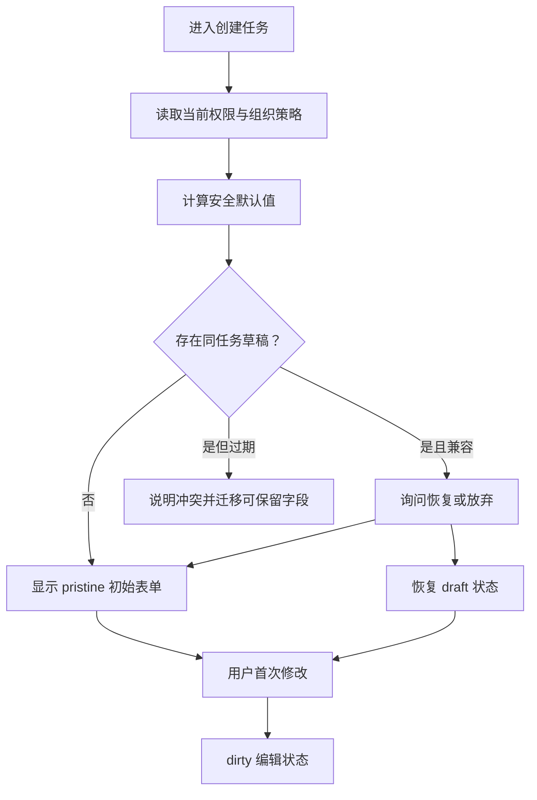

# 初始状态

初始状态是用户进入一项尚未开始的任务时，界面根据任务上下文、默认值和已有草稿形成的可操作起点。它不是空状态，也不是“接口还没请求”的同义词。

## 能力边界

本文讨论表单、配置向导和创建流程的初始状态。读者需要掌握 HTML 表单、受控组件、路由状态、服务端草稿和条件写入。

初始状态必须回答四个问题：

1. 用户正在创建或修改哪个对象；
2. 哪些值是系统默认，哪些值来自用户；
3. 是否存在可恢复草稿；
4. 第一个有效动作是什么。

以下情况不属于初始状态：

- 查询已完成但结果集合为零，属于空状态；
- 请求已发出且等待响应，属于加载状态；
- 用户已经修改字段，属于编辑中的脏状态；
- 上次提交完成但页面未刷新，属于成功或数据过期状态；
- 服务端拒绝访问任务，属于无权限状态。

## 初始值不是当前值

表单控件至少存在三个不同概念：

| 概念 | 来源 | 变化方式 | 用途 |
| --- | --- | --- | --- |
| 初始值 | 模板、服务端对象或业务默认 | 重开任务或显式重置 | 判断基线 |
| 当前值 | 用户输入和程序更新 | 每次编辑 | 当前提交候选 |
| 已提交值 | 服务端确认的对象版本 | 成功写入 | 权威结果 |

HTML 输入控件存在 dirty value flag。用户或脚本修改当前值后，后来改变 `value` 内容属性不会再自动覆盖当前值；表单重置会把控件恢复到默认值并清除 dirty 标记。产品层不能只比较 DOM 属性判断“用户是否修改”。

应用通常还需要自己的字段级脏值集合：

```json
{
  "formKey": "project:create",
  "baseline": {
    "name": "",
    "region": "cn-east-1",
    "visibility": "private"
  },
  "current": {
    "name": "支付网关",
    "region": "cn-east-1",
    "visibility": "private"
  },
  "dirtyFields": [
    "name"
  ],
  "draftRevision": null
}
```

`baseline` 是这次编辑会话的比较基线；`current` 是当前候选；`dirtyFields` 只记录用户实际改过的字段。程序根据地区自动填入一个尚未触碰字段时，可以更新基线和当前值；若该字段已脏，则不能静默覆盖。

## 初始状态的来源优先级

创建流程可能同时获得 URL 参数、用户偏好、组织策略和浏览器缓存。必须规定覆盖顺序。

一个可执行的项目创建顺序是：

1. 读取组织强制策略，例如只能创建私有项目；
2. 读取入口上下文，例如从某团队页进入时预选团队；
3. 读取用户可配置偏好，例如上次使用的地区；
4. 应用产品安全默认值；
5. 检查是否存在同一任务键的服务端草稿；
6. 让用户决定恢复草稿还是重新开始。

强制策略不能被用户偏好覆盖。草稿若基于已失效的团队或权限，必须先迁移或拒绝恢复。



## 状态模型

初始状态不需要逻辑意图 ID。它只描述尚未提交的编辑会话：

```json
{
  "task": "create-project",
  "subjectId": "user-72",
  "context": {
    "organizationId": "org-9",
    "teamId": "team-payments"
  },
  "baselineVersion": 18,
  "mode": "pristine",
  "dirtyFields": [],
  "draft": {
    "exists": true,
    "revision": 4,
    "updatedAt": "2026-07-18T02:20:00Z",
    "compatible": true
  },
  "capabilities": {
    "canCreate": true,
    "allowedRegions": [
      "cn-east-1",
      "cn-north-1"
    ]
  }
}
```

字段含义：

- `task` 决定表单结构与草稿命名空间；
- `subjectId` 只用于当前已认证主体，不能信任本地缓存；
- `context` 确定默认团队和后续授权范围；
- `baselineVersion` 表示默认值和策略计算时的版本；
- `mode` 取 `pristine`、`draft-offered`、`draft-restored` 或 `dirty`；
- `dirtyFields` 是字段路径集合；
- `draft.revision` 用于草稿条件更新；
- `compatible` 必须由当前表单版本和权限共同计算；
- `capabilities` 来自服务端，提交时仍需重新校验。

## 从 pristine 离开的精确条件

以下事件使状态离开 `pristine`：

- 用户改变一个可编辑字段；
- 用户添加附件；
- 用户改变步骤选择并影响将提交的数据；
- 用户恢复已有草稿；
- 程序根据用户动作写入派生值。

以下事件不应使状态变脏：

- 字段获得或失去焦点；
- 展开帮助文本；
- 打开未改变数据的预览；
- 客户端格式化同一语义值；
- 无关的远端提示刷新。

脏值判断使用规范化业务值。例如金额输入从 `1` 格式化为 `1.00`，若业务值仍是同一货币最小单位，不应制造未保存变更。

## 重置、放弃与重新开始

“重置”不是把所有控件清空，而是恢复到这次任务的基线。创建任务的基线可能含地区、团队和安全默认值。

重置前需要判断：

- 是否有不可逆的本地附件处理；
- 服务端草稿是否也要删除；
- 当前默认策略是否已经变化；
- 重置后焦点回到哪里。

若用户选择“重新开始”，系统应：

1. 删除或归档对应草稿；
2. 重新读取当前权限与策略；
3. 生成新的基线；
4. 把当前值设为新基线；
5. 清空脏字段和字段错误；
6. 将焦点放到第一个需要用户决策的控件。

浏览器原生 `form.reset()` 只处理控件默认值，不会自动删除应用草稿、清理上传队列或重新计算服务端策略。

## 草稿恢复

草稿至少需要：

| 字段 | 作用 |
| --- | --- |
| `draftId` | 稳定定位草稿 |
| `task` | 防止恢复到错误表单 |
| `schemaVersion` | 判断字段结构是否兼容 |
| `revision` | 防止跨标签覆盖 |
| `updatedAt` | 展示用户可理解的更新时间 |
| `values` | 可恢复的业务字段 |
| `attachments` | 仅保存安全引用，不内嵌敏感文件 |

恢复不能自动发生在用户已开始输入之后。若草稿查询迟到，而当前表单已有脏字段，界面应提供对比选择，不得用草稿覆盖当前值。

跨标签更新草稿时使用 `revision` 条件：

```text
保存草稿 revision=4
服务端仅在当前 revision=4 时接受
成功后返回 revision=5
若当前已是 revision=5，则返回冲突并保留两个候选
```

## 界面结构与焦点

初始页面的阅读顺序为：

1. 任务标题；
2. 对象或组织上下文；
3. 必要说明；
4. 按业务顺序排列的字段；
5. 主动作与退出动作。

不要在页面打开时自动聚焦第一个字段，除非该页面唯一目的就是立即输入，且不会导致移动端键盘突然弹出或跳过标题说明。

恢复草稿提示若使用非模态区块，不应抢走当前焦点；若必须在继续前选择恢复或放弃，可以使用具名对话框，并在关闭后把焦点放到恢复后的第一个脏字段或新表单首字段。

默认值必须出现在真实控件值中。用灰色 placeholder 表达默认值会导致提交值、可见值和辅助技术取得的值不一致。

## 并发与迟到数据

初始状态最常见的竞态不是重复提交，而是不同来源争夺字段：

- 用户已经输入，默认值请求才返回；
- 草稿查询迟于本地编辑；
- 组织策略更新使已选地区失效；
- 另一个标签保存了更新的草稿修订；
- 会话更新后主体或租户发生变化。

合并规则以字段是否脏为核心：

| 远端变化 | 字段未脏 | 字段已脏 |
| --- | --- | --- |
| 推荐默认值更新 | 可更新基线和当前值 | 保留当前值，显示建议 |
| 强制策略收紧 | 更新并解释 | 标记冲突，阻止非法提交 |
| 标签草稿更新 | 可提示恢复 | 显示版本对比 |
| 权限撤销 | 移除非法选项 | 保留输入副本但禁止提交 |

提交时服务端仍以当前权限和策略校验，客户端初始能力快照不能作为授权证据。

## 案例一：创建生产项目

### 输入

- 用户从“支付团队”页面进入；
- 组织只允许生产项目为私有；
- 用户偏好地区为 `cn-east-1`；
- 没有历史草稿；
- 团队策略版本为 18。

### 推导

1. `teamId` 从可信路由参数取得并经服务端授权；
2. `visibility` 被强制为 `private`，控件显示原因；
3. `region` 使用用户偏好，但仍可在允许集合中修改；
4. 项目名保持空值并获得明确标签；
5. 页面进入 `pristine`，主按钮因必填名称为空不可提交；
6. 用户输入“支付网关”后，仅 `name` 进入 `dirtyFields`；
7. 地区推荐请求迟到，不覆盖用户未改变但由策略确定的地区。

### 输出

界面显示支付团队、私有策略和华东地区；第一个需要用户决策的是项目名。提交负载不包含界面帮助文本，只包含规范化名称、团队 ID、地区与可见性。

### 案例验收

- 初始值来自正确团队和策略版本；
- 私有策略不是 placeholder 或只读颜色；
- 输入名称前后 `dirtyFields` 从空集合变为仅含 `name`；
- 浏览器后退再返回时，没有草稿就重新计算当前策略；
- 另一个会话撤销创建权限后，提交被服务端拒绝且输入仍可复制；
- 仅用键盘可以读完策略说明、填写名称并返回。

### 失败分支

前端把入口团队写死在隐藏字段中且提交时不复核。攻击者修改团队 ID 后可尝试跨团队创建。修正是服务端按当前主体验证团队，并从授权后的上下文生成最终归属。

## 案例二：恢复一份过期活动草稿

### 输入

- 用户创建营销活动时保存了 revision 7 草稿；
- 草稿 schemaVersion 为 3，当前表单为 4；
- 旧字段 `audienceAll=true` 已拆为地区和用户类型；
- 另一个标签已把活动标题改为“暑期续费”；
- 当前标签尚未输入。

### 迁移过程

1. 读取草稿元数据，不立即写入控件；
2. 运行版本 3 到版本 4 的纯迁移函数；
3. 无法无损转换的受众字段标记为“需要确认”；
4. 对话框显示草稿更新时间与两个选择；
5. 用户恢复后，标题和预算进入当前值；
6. 迁移后需要确认的字段不自动成为有效选择；
7. 第一次保存使用 `If-Match: draft-revision-7`；
8. 服务端发现 revision 已为 8，返回当前草稿用于对比。

### 输出

页面保留本标签迁移出的预算和另一标签的新标题，用户明确选择最终标题；受众必须重新确认。成功保存后得到 revision 9。

### 案例验收

- schema 迁移不丢弃无法识别字段，而是记录迁移问题；
- 草稿提示在用户输入前出现，迟到时不会自动覆盖；
- revision 冲突能够展示字段差异；
- 选择放弃草稿后服务端草稿被明确删除或保留，不产生模糊状态；
- 会话过期重新认证后再次检查草稿权限；
- 恢复后焦点落到第一个需要确认的受众字段。

### 失败分支

客户端把 revision 7 直接覆盖 revision 8，另一标签的新标题丢失。修正为条件更新并展示差异，不能用“最后一次请求获胜”处理用户草稿。

## 初始状态的观测

只记录能改进任务的数据：

- 首次进入到首次有效输入的时间；
- 使用默认值、修改默认值和重置的比例；
- 草稿发现、恢复、放弃和迁移失败数量；
- 因权限或策略变化导致的初始值失效；
- 跨标签草稿冲突与解决方向；
- 用户在未修改前离开任务的比例。

分析事件记录字段类别，不记录项目名、活动标题、受众内容或附件名。

调试时同时观察 `baseline`、`current`、`dirtyFields`、草稿 revision 和策略版本。只看控件截图无法证明默认值来源、草稿合并和条件保存正确。

## 综合练习：带草稿的创建向导

实现一个三步创建向导：基本信息、成员范围、确认。

必须支持：

- 组织策略和用户偏好的明确覆盖顺序；
- 字段级脏值；
- 本地临时值与服务端草稿的责任边界；
- 草稿 schema 迁移；
- 跨标签 revision 冲突；
- 重置为当前基线；
- 会话过期后的重新授权；
- 窄屏与 200% 缩放；
- 键盘完成整个流程。

验收数据至少包含两个组织、两个策略版本、一个旧 schema 草稿和一次跨标签保存。最终提交必须由服务端重新授权；关闭页面再恢复时，字段值与草稿 revision 可解释。

## 来源

- [WHATWG — HTML Standard：input 元素的 dirty value flag 与重置算法](https://html.spec.whatwg.org/multipage/input.html)（访问日期：2026-07-18）
- [WHATWG — HTML Standard：form 的 reset 与提交](https://html.spec.whatwg.org/multipage/forms.html)（访问日期：2026-07-18）
- [W3C WAI — WCAG 2.2 焦点顺序说明](https://www.w3.org/WAI/WCAG22/Understanding/focus-order.html)（访问日期：2026-07-18）
- [W3C WAI — WCAG 2.2 聚焦时不改变上下文](https://www.w3.org/WAI/WCAG22/Understanding/on-focus)（访问日期：2026-07-18）
